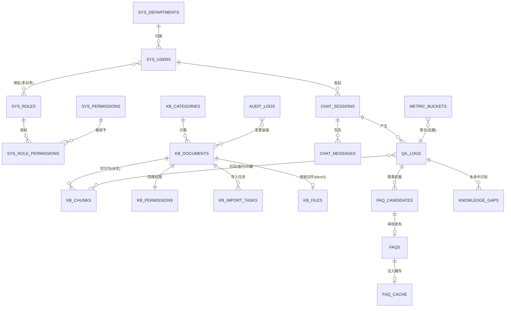

# 知识库管理平台 · 数据实体设计

> **文档编号**：01_数据实体
> **所属项目**：knowledge_manager（对应 PRD 2.9 知识库管理平台）
> **依据**：`Spec_coding_步骤/PRD.md` + **`shopkeeper_brain` 存量实现（已实地核对）**
> **状态**：Step 1 产物 · 待评审

---

## 0. 与 2.3 的关键差异（先读这一节）

2.3（电商风控）是**绿地项目**，数据实体可以随便设计。
**2.9 有存量代码** `shopkeeper_brain`：它的 Milvus 集合、Mongo 集合、MinIO 桶、切片结构都已存在。

因此本步的核心工作不是"从零设计"，而是先把每个实体定性为三态之一：

| 态 | 含义 | 处理方式 |
|---|---|---|
| **沿用（As-Is）** | 结构可原样复用，不改字段 | 直接复用，只在文档中登记 |
| **改造（Modify）** | 结构基本可用，但需增删字段或换集合 | 新建集合/新版本，保留旧的不动 |
| **新建（New）** | PRD 要求但存量完全没有 | 全字段新设计 |

> **原则**：**不修改 `shopkeeper_brain` 的任何文件**（那是只读参考）。knowledge_manager 是独立工程，只**复用其结构与配置**（依赖清单、Milvus/Mongo/MinIO 地址、切片策略）。

---

## 1. 存量实现盘点（实地核对结果，非推测）

| # | 存量对象 | 位置 | 关键结构 | 定性 |
|---|---|---|---|---|
| 1 | Milvus 集合 `kb_chunks_v1` | Milvus `192.168.6.170:19530` | `chunk_id`(PK,auto) / `dense_vector`(FLOAT_VECTOR) / `sparse_vector`(SPARSE) / `content` / `title` / `parent_title` / `file_title` / `item_name`，**`enable_dynamic_field=True`** | **改造** |
| 2 | Milvus 集合 `ITEM_NAME_COLLECTION` | 同上 | 商品名向量集合（电商专用） | **废弃** |
| 3 | Milvus 索引 | 同上 | dense: `AUTOINDEX`/`COSINE`；sparse: `SPARSE_INVERTED_INDEX`/`IP` | **沿用** |
| 4 | Mongo 集合 `chat_message` | Mongo `kb001` | `session_id` / `role` / `text` / `rewritten_query` / `item_names` / `ts` | **改造** |
| 5 | MinIO 桶 `knowledge-base-files` | MinIO `192.168.6.170:9000` | 原文件 + MD 图片 | **沿用** |
| 6 | 切片结构 | `document_split.py` | `{title, parent_title, file_title, content, part?}`，`content = f"{title}\n\n{body}"` | **改造** |
| 7 | 导入任务状态 | `task_util.py` | **纯内存** `dict`（重启即丢） | **改造**（必须持久化） |
| 8 | BGE-M3 双向量 | `bge_embedding.py` | dense + sparse 同时产出 | **沿用** |
| 9 | 查询流水线 | `query_process/` | LangGraph：商品名确认 → 多路检索(向量/HyDE/WebSearch) → RRF → rerank → 答题 | **改造**（拆掉商品名前置、加鉴权） |
| 10 | SSE 流式 | `sse_util.py` | 内存队列 + `task_id` 订阅 | **沿用** |

**存量缺失（2.9 必须全新建）**：组织架构、用户与角色、RBAC、四维数据权限、鉴权过滤、知识单元台账、分类、FAQ 挖掘/审核/缓存、知识缺口、运营看板、审计日志、**全部前端页面**。

> 这也解释了为什么"2.9 能套 shopkeeper_brain"这句话只对一半：**套来的是检索内核，管理面一行都没有。**

---

## 2. 文档约定

| 项 | 约定 |
|---|---|
| 主存储 | **MongoDB**（业务与元数据）+ **Milvus**（向量）+ **MinIO**（文件） |
| Mongo 库名 | 沿用 `.env` 的 `kb001`；集合名统一加 `kb_` / `sys_` / `chat_` / `qa_` / `faq_` 前缀 |
| Milvus 集合 | 新集合 **`kb_chunks_v2`**（不覆盖 v1，便于对照） |
| 命名 | 集合名小写下划线；字段名小写下划线；枚举值小写英文 |
| 主键 | 除切片外统一用业务编号字符串作 `_id` |
| 时间 | 统一 `ts`（毫秒时间戳）存储 |
| 权限判定 | **OR 逻辑**（PRD 2.9.4 明确定义）：满足 global / department / role / user **任一**即可读 |
| 审计 | 权限变更、文档增删改、FAQ 发布必须留痕 |

**三条贯穿全局的原则**

1. **权限只在文档级存储**：切片**不冗余权限字段**，鉴权在应用层按 `doc_id` 实时判定 → 权限变更**即时生效**，无需回写向量库。
2. **切片可重建**：`content` 与向量都是派生数据，`kb_documents` + MinIO 原文件才是真源；切片可随时按新策略重建。
3. **问答必留日志**：每轮问答都落 `qa_logs`（含 Token、耗时、召回/放行/拦截列表）——它同时是**运营看板的数据源**与**知识缺口/FAQ 挖掘的原料**，一份数据两用。

---

## 3. 领域模型总览



---

## 4. 实体清单（共 22 个）

| # | 实体 | 存储 | 集合/集合名 | 态 | 归属模块 |
|---|---|---|---|---|---|
| E01 | 切片 | Milvus | `kb_chunks_v2` | **改造** | 导入解析 / 检索 |
| E02 | 会话消息 | Mongo | `chat_messages` | **改造** | AI 问答 |
| E03 | 文件对象 | MinIO | `knowledge-base-files` | **沿用** | 导入解析 |
| E04 | 知识单元（文档主档） | Mongo | `kb_documents` | **新建** | 知识维护 |
| E05 | 知识分类 | Mongo | `kb_categories` | **新建** | 知识维护 |
| E06 | 导入任务 | Mongo | `kb_import_tasks` | **改造** | 导入解析 |
| E07 | 知识单元数据权限 | Mongo | `kb_permissions` | **新建** | 权限鉴权 |
| E08 | 部门 | Mongo | `sys_departments` | **新建** | 组织架构 |
| E09 | 用户 | Mongo | `sys_users` | **新建** | 组织架构 |
| E10 | 角色 | Mongo | `sys_roles` | **新建** | 组织架构 |
| E11 | 用户角色绑定 | Mongo | `sys_user_roles` | **新建** | 组织架构 |
| E12 | 功能权限 | Mongo | `sys_permissions` | **新建** | RBAC |
| E13 | 角色功能权限 | Mongo | `sys_role_permissions` | **新建** | RBAC |
| E14 | 会话 | Mongo | `chat_sessions` | **新建** | AI 问答 |
| E15 | 问答日志 | Mongo | `qa_logs` | **新建** | 看板 / 沉淀 |
| E16 | FAQ 候选 | Mongo | `faq_candidates` | **新建** | 知识沉淀 |
| E17 | 已发布 FAQ | Mongo | `faqs` | **新建** | 知识沉淀 |
| E18 | FAQ 缓存 | 内存(+可选 Mongo) | `faq_cache` | **新建** | 知识沉淀 |
| E19 | 知识缺口 | Mongo | `knowledge_gaps` | **新建** | 知识沉淀 |
| E20 | 运营指标桶 | Mongo | `metric_buckets` | **新建** | 运营看板 |
| E21 | 审计日志 | Mongo | `audit_logs` | **新建** | 审计 |
| **E22** | **系统配置** | Mongo | `system_config` | **新建** | 00 公共基础 |

---

## 5. 核心实体字段设计

### E01 · 切片 `kb_chunks_v2`（Milvus）——**改造**

**与存量 `kb_chunks_v1` 的差异**

| 字段 | v1（存量） | v2（本设计） | 变更原因 |
|---|---|---|---|
| `chunk_id` | INT64 PK auto | **同左** | 沿用 |
| `dense_vector` | FLOAT_VECTOR(dim) | **同左** | 沿用（BGE-M3 dense） |
| `sparse_vector` | SPARSE_FLOAT_VECTOR | **同左** | 沿用（BGE-M3 sparse） |
| `content` | VARCHAR(65535) | **同左** | 沿用 |
| `title` / `parent_title` / `file_title` | VARCHAR(65535) | **同左** | 沿用 |
| `item_name` | VARCHAR(65535) | **删除** | 电商商品名，通用企业知识库无此概念 |
| `doc_id` | — | **VARCHAR(64)** 新增 | 关联 E04；**鉴权与溯源的关键** |
| `chunk_index` | — | **INT64** 新增 | 切片在文档内的顺序，便于上下文拼接与定位 |
| `enabled` | — | **BOOL** 新增 | 支持切片级启停（文档停用时批量置 false） |
| `part` | 动态字段 | **INT64** 显式化 | 章节二次切分的段号，显式化便于排序 |

**索引**（沿用存量策略 + 新增标量索引）

| 字段 | 索引 | 度量 |
|---|---|---|
| `dense_vector` | `AUTOINDEX` | `COSINE` |
| `sparse_vector` | `SPARSE_INVERTED_INDEX` | `IP` |
| `doc_id` | 标量索引（INVERTED） | — |
| `enabled` | 标量索引（INVERTED） | — |

**检索表达式（expr）**

Milvus 侧只做**粗过滤**：`enabled == true`（可选再加 `doc_id in [...]`）。
**权限不放这里**——见 §6.2 的裁定。

> ⚠️ **现状冲突 C-01**：存量 `kb_chunks_v1` 的 `item_name` 是**必需字段**（schema 显式声明），而 2.9 要删掉它。
> 处理：**新建 `kb_chunks_v2`**，不覆盖 v1。若沿用 v1 必须写入空 `item_name`，属于技术债。

---

### E02 · 会话消息 `chat_messages`（Mongo）——**改造**

**存量字段**（`mongo_history_util.py` 实测）：`session_id` / `role` / `text` / `rewritten_query` / `item_names` / `ts`

**v2 字段**

| 字段 | 类型 | 必填 | 变更 | 说明 |
|---|---|:--:|---|---|
| `_id` | ObjectId | ✔ | 沿用 | Mongo 默认 |
| `session_id` | string | ✔ | 沿用 | 会话编号 |
| `role` | enum | ✔ | 沿用 | `user` / `assistant` |
| `text` | string | ✔ | 沿用 | 消息正文 |
| `rewritten_query` | string | | 沿用 | 改写后的查询（多轮指代消解用） |
| `item_names` | array | | **删除** | 电商商品名，2.9 无用 |
| `ts` | long | ✔ | 沿用 | 时间戳 |
| `user_id` | string | ✔ | **新增** | **鉴权必需**：必须知道是谁在问 |
| `chunk_refs` | array | | **新增** | 本轮引用的切片 `[{chunk_id, doc_id, title}]`，用于**引用溯源卡片** |
| `denied_count` | int | | **新增** | 本轮因权限被拦截的切片数（用于"部分参考资料因权限受限"提示） |
| `token_usage` | object | | **新增** | `{prompt, completion, total}` |
| `elapsed_ms` | int | | **新增** | 本轮耗时 |

> ⚠️ **现状冲突 C-02**：存量 `chat_message` **没有 `user_id`**——因为它原来是单用户演示。2.9 要求"强制校验登录态"，**无 `user_id` 的历史数据无法做鉴权回溯**。
> 处理：新集合名沿用 `chat_messages`（复数，与旧 `chat_message` 区分），旧数据不迁移。

---

### E03 · 文件对象（MinIO）——**沿用**

| 项 | 内容 |
|---|---|
| 桶名 | `knowledge-base-files`（沿用） |
| 对象路径 | 建议 `{doc_id}/{原文件名}`（存量为 `{文件名}/...`，2.9 改为按 `doc_id` 分层，便于按知识单元整体删除） |
| 存什么 | ① 上传的原文件 ② Markdown 转换产物 ③ 从 MD 抽出的图片 |

> **降级容忍**：存量 `md_img.py` 与 `file_import_service.py` 在 MinIO 不可用时**会降级为本地路径**（代码里明确写了"不影响后续流程"）。2.9 沿用该降级策略：MinIO 不可用不阻断导入，但要在导入任务中标记 `storage_degraded=true`。

---

### E04 · 知识单元 `kb_documents`（Mongo）——**新建（核心）**

**用途**：这是 2.9 的**台账主表**，对应 PRD 2.9.3「知识单元台账列表（编号、标题、格式、所属分类、权限标签、更新时间、启用状态）」。

| 字段 | 类型 | 必填 | 说明 |
|---|---|:--:|---|
| `_id` | string | ✔ | 知识单元编号 `DOC{yyyyMMdd}{6位序列}` |
| `title` | string | ✔ | 文档标题（默认取文件名，可改） |
| `file_name` | string | ✔ | 原始文件名（含扩展名） |
| `file_ext` | enum | ✔ | `pdf` / `md` / `docx` / `txt`（2.9 要求四种） |
| `file_size` | long | ✔ | 字节数 |
| `file_hash` | string | ✔ | **SHA256**，用于去重（同文件重复上传直接复用，避免重复切片） |
| `category_id` | string | | 所属分类，关联 E05 |
| `tags` | array | | 用户自定义标签（与**权限标签**不同，后者在 E07） |
| `storage` | object | ✔ | `{bucket, object_key, md_object_key}`（MinIO 定位） |
| `chunk_count` | int | ✔ | 切片数（导入完成后回填） |
| `char_count` | int | | 正文字符数 |
| `status` | enum | ✔ | `enabled` / `disabled`（PRD 要求的"启用状态"） |
| `import_status` | enum | ✔ | `pending` / `parsing` / `embedding` / `done` / `failed` |
| `permission_summary` | object | ✔ | **权限摘要快照**（`{is_global, dept_cnt, role_cnt, user_cnt}`），仅用于**列表页展示权限标签**，不用于鉴权（鉴权以 E07 为准） |
| `created_by` / `updated_by` | string | ✔ | 操作人 |
| `created_at` / `updated_at` | long | ✔ | 时间戳 |
| `deleted_at` | long \| null | | **软删除**标记 |
| `doc_no` | string | | **Step 4 追加**：展示用短编号（原型显示 3 位，落库 6 位，由服务端统一换算） |
| `deleted_by` | string | | **Step 4 追加**：删除人（回收站视图与审计需要，免 join 审计表） |
| `permission_summary.label` | string | | **Step 4 追加**：权限标签的**可筛选标量**（原型「全部权限」筛选需要） |

**索引**：唯一 `file_hash`；组合 `category_id + status`；`created_at desc`；文本索引 `title`（供列表搜索）。

> **`permission_summary` 的设计意图**：台账列表要展示"权限标签"，若每行都去 E07 查会产生 N+1；因此冗余一份摘要。**必须明确它不是鉴权依据**，否则会出现"摘要说公开、实际权限表已改"的不一致。

---

### E05 · 知识分类 `kb_categories`（Mongo）——**新建**

| 字段 | 类型 | 说明 |
|---|---|---|
| `_id` | string | 分类编号 |
| `name` | string | 分类名（同级唯一） |
| `parent_id` | string \| null | 父分类，`null` 为根 |
| `path` | array | 物化路径 `["root","制度","财务"]`，便于子树查询 |
| `sort` | int | 排序（**Step 4 明确为「同级排序」**，同级排序才能稳定渲染分类树） |
| `doc_count` | int | 该分类下文档数（冗余，列表展示用） |
| `path_ids` | array | **Step 4 追加**：物化路径 ID，子树筛选用（与 E08 部门结构保持一致） |
| `level` | int | **Step 4 追加**：层级，根为 0（层级上限校验用） |
| `created_by` / `updated_by` | string | **Step 4 追加**：操作人（审计需要） |
| `created_at` / `updated_at` | long | **Step 4 追加**：时间戳 |

> ⚠️ **PRD 悬空点 G-01**：PRD 提到"批量文档/文件夹拖拽导入"，但**未说明文件夹层级是否自动映射为分类**。本设计预留 `path` 字段支持该能力，**需确认是否启用**。

---

### E06 · 导入任务 `kb_import_tasks`（Mongo）——**改造（必须持久化）**

**存量的致命点**：`task_util.py` 是**纯内存 dict**，服务重启即丢；且前端靠轮询 `task_id` 查进度。

**v2 字段**

| 字段 | 类型 | 说明 |
|---|---|---|
| `_id` | string | 任务号 `IMP{yyyyMMdd}{6位序列}` |
| `doc_id` | string | 关联知识单元 |
| `status` | enum | `pending` / `running` / `succeeded` / `failed` / `timeout` / `cancelled` |
| `stage` | enum | 当前阶段：`upload` / `pdf_to_md` / `md_img` / `split` / `embedding` / `milvus` |
| `progress` | int | 0~100 |
| `done_stages` | array | 已完成阶段（对齐存量 `task_util` 的 `done_list` 语义） |
| `durations` | object | 各阶段耗时（存量 `task_util` 已有此结构，直接复用） |
| `error` | object \| null | `{stage, code, message}` |
| `retry_count` | int | 重试次数 |
| `storage_degraded` | bool | MinIO 是否降级（见 E03） |
| `created_by` / `created_at` / `finished_at` | — | — |

**Step 4 追加字段**（由 `04_模块Spec/04_文档导入与向量化.md` 提出，按 ER-17 回填本表）

| 字段 | 类型 | 必填 | 说明 |
|---|---|:--:|---|
| `file_name` | string | | 原型 `02` 导入队列第一列「文件」直接渲染，免 join E04 |
| `file_hash` | string | | 冗余一份，用于「同哈希是否有在途任务」的单集合查询 |
| `batch_id` | string \| null | | 批量 / 文件夹导入分组（原型 `02` 一次拖入多文件的进度归组） |
| `degraded` | array | | 降级记录 `[{stage, kind, detail}]`，`kind ∈ {minio_local, mineru_pdfplumber, rerank_skip, gpu_cpu}` |
| `retry_of` | string \| null | | 重试来源 `task_id`（**重试 = 新建任务**，保留失败现场供排障） |
| `cancel_requested` | bool | | **协作式取消**标记：`asyncio.to_thread` 无法安全强杀线程，工作线程在阶段边界读取后中止 |

> 追加索引：`file_hash`（在途任务查重）、`batch_id`（按批次查一次导入的全部任务）。

> ⚠️ **现状冲突 C-03**：前端原本轮询 `/status/{task_id}` 依赖内存状态。改造为持久化后，**接口语义可保持不变**（仍按 `task_id` 查），但数据源从内存换成 Mongo——对前端透明。

---

### E07 · 知识单元数据权限 `kb_permissions`（Mongo）——**新建（2.9 的核心）**

**对应 PRD 2.9.4「四维混合数据权限规则」**

| 字段 | 类型 | 必填 | 说明 |
|---|---|:--:|---|
| `_id` | string | ✔ | 权限记录编号（一个文档一条） |
| `doc_id` | string | ✔ | 关联 E04，**唯一** |
| `is_global` | bool | ✔ | 是否全局公开；**默认 `false`**（PRD："默认状态下知识单元无任何公开访问权限"） |
| `departments` | array | | 部门 ID 列表 |
| `roles` | array | | 角色 ID 列表 |
| `users` | array | | 用户 ID 列表 |
| `version` | int | ✔ | 权限版本，每次变更 +1（便于缓存失效与审计） |
| `updated_by` / `updated_at` | — | ✔ | — |

**判定规则（PRD 明确为 OR 逻辑）**

```
allow = is_global
     or (user.dept_id ∈ departments)
     or (user.roles ∩ roles ≠ ∅)
     or (user.id ∈ users)
```

| 要求 | 说明 |
|---|---|
| 默认拒绝 | 无记录时**一律不可读**（不能因为没有权限记录就放行） |
| 即时生效 | 权限存文档级、鉴权在应用层 → 变更**立即生效**，无需回写 Milvus |
| 唯一性 | `doc_id` 唯一索引 |
| 留痕 | 每次变更写 E21 审计 |

> ⚠️ **PRD 悬空点 G-02**：PRD 未说明「**部门是否含子部门**」（即给某部门授权，其子部门能否读）。
> 本设计**默认不含子部门**（精确匹配），并在 §10 登记待确认。这是一个语义分歧点，必须问清。

---

### E08~E13 · 组织架构与 RBAC（Mongo）——**全新建**

**E08 `sys_departments`**：`_id` / `name` / `parent_id` / `path[]` / `sort` / `status` / `created_at`
**E09 `sys_users`**：`_id` / `username` / `password_hash`(bcrypt) / `real_name` / `dept_id` / `status`(`active`/`disabled`) / `last_login_at` / `created_at`
**E10 `sys_roles`**：`_id` / `code` / `name` / `is_system`(内置角色不可删) / `description`
**E11 `sys_user_roles`**：`_id` / `user_id` / `role_id`（**多对多**，唯一索引 `user_id+role_id`）
**E12 `sys_permissions`**：`_id` / `code`(如 `kb:doc:create`) / `name` / `type`(`menu`/`button`/`api`) / `parent_id`
**E13 `sys_role_permissions`**：`_id` / `role_id` / `permission_id`（唯一索引 `role_id+permission_id`）

**内置角色（对齐 PRD 2.9.2 三类用户）**

| 角色 code | 名称 | 核心功能权限 |
|---|---|---|
| `asker` | 普通用户 / 提问者 | AI 问答、历史会话 |
| `kb_admin` | 知识管理员 | 文档增删改、切片调整、配置四维权限、FAQ 审核发布、知识缺口处理 |
| `sys_admin` | 系统管理员 | 组织架构、角色、用户、功能权限分配、看板、模型参数 |

> **注意区分两类权限**（2.9 的特点）：
> - **功能权限**（RBAC，E12/E13）：能不能**用某个功能/按钮**
> - **数据权限**（四维，E07）：能不能**读某篇知识**
> 二者独立判定，都必须校验。

---

### E14 · 会话 `chat_sessions`（Mongo）——**新建**

| 字段 | 类型 | 说明 |
|---|---|---|
| `_id` | string | 会话编号 `SESS{...}` |
| `user_id` | string | 发起人（**鉴权与 UV 统计的关键**） |
| `title` | string | 会话标题（取首轮提问前 20 字） |
| `message_count` | int | 消息数 |
| `last_active_at` | long | 最后活跃时间（会话列表排序） |
| `created_at` | long | 创建时间 |

> **与存量的关系**：存量只有 `chat_message.session_id` 这个裸字段，**没有会话实体**。2.9 的「历史会话侧边栏」需要会话标题与活跃时间，必须有独立会话表。
> 兼容做法：`chat_sessions._id` 即存量语义中的 `session_id`，消息表仍以它关联。

---

### E15 · 问答日志 `qa_logs`（Mongo）——**新建（一表两用）**

**用途**：① 运营看板的数据源 ② FAQ 挖掘与知识缺口识别的原料。对应 PRD 2.9.8「单次问答审计记录」。

| 字段 | 类型 | 必填 | 说明 |
|---|---|:--:|---|
| `_id` | string | ✔ | 日志编号 |
| `session_id` / `user_id` | string | ✔ | 会话与用户 |
| `dept_id` | string | ✔ | **提问时所属部门**（快照；用户调岗后统计仍准确） |
| `role_ids` | array | ✔ | 提问时角色集合（快照） |
| `question` | string | ✔ | 原始提问 |
| `rewritten_query` | string | | 改写后查询 |
| `asked_at` | long | ✔ | 提问时间 |
| `recalled_chunks` | array | ✔ | 召回切片 `[{chunk_id, doc_id, score}]`（**全部召回**，含被拦截的） |
| `allowed_chunks` | array | ✔ | 鉴权**通过**的切片 ID |
| `denied_chunks` | array | ✔ | 鉴权**拦截**的切片 ID（含 doc_id，用于提示与排查） |
| `faq_hit` | bool | ✔ | 是否命中 FAQ 缓存直出（看板"缓存命中率"） |
| `answer_source` | enum | ✔ | `faq_cache` / `rag` / `no_knowledge` |
| `token_usage` | object | | `{prompt, completion, total}`（看板 Token 消耗） |
| `elapsed_ms` | int | ✔ | 端到端耗时（看板响应延时分布） |
| `retrieval_ms` / `rerank_ms` / `llm_ms` | int | | 分段耗时（便于定位瓶颈） |
| `auth_ms` | int | | **Step 4 追加**：鉴权过滤耗时（2.9 新增的观测点，用于证明应用层过滤的开销可忽略） |
| `degraded` | bool | | **Step 4 追加**：本轮是否发生降级（鉴权 fail-closed / rerank 跳过 / Milvus 不可用等） |
| `max_score` | float | | 最高相似度（**知识缺口判定**要它） |
| `feedback` | object \| null | | `{rating: up/down, comment, at}`（PRD 未要求，预留） |

**索引**：`asked_at desc`；`user_id + asked_at desc`；`session_id`；`faq_hit`；`max_score`。
**保留策略**：建议 **180 天 TTL**（看板与挖掘都不需要更久）。

> **设计要点**：`recalled/allowed/denied` **三个列表都要存**。
> 只存 `allowed` 就无法回答"用户问了什么但被权限挡住了"——而这正是 PRD 要求提示"部分参考资料因权限受限"的依据。

---

### E16/E17 · FAQ 沉淀（Mongo）——**新建**

**E16 `faq_candidates`（候选，待审核）**

| 字段 | 类型 | 说明 |
|---|---|---|
| `_id` | string | 候选编号 |
| `cluster_key` | string | 聚类簇标识（聚类算法产出） |
| `questions` | array | **簇内原始提问**（保留原话，供人工参考措辞） |
| `representative_question` | string | 代表问法（簇心） |
| `frequency` | int | 聚合频次（PRD："达到设定阈值自动生成推荐 FAQ"） |
| `related_docs` | array | 关联知识单元（从这些问答的 `allowed_chunks` 反推） |
| `draft_answer` | string | 大模型生成的参考答案草案 |
| `confidence` | float | 置信度得分 |
| `status` | enum | `pending` / `approved` / `rejected` |
| `reviewed_by` / `reviewed_at` / `review_note` | — | 审核留痕 |
| `first_seen_at` / `last_seen_at` | long | 首次/最近出现时间 |
| `window_start` / `window_end` | long | 本次挖掘的时间窗 |

**E17 `faqs`（已发布）**

| 字段 | 类型 | 说明 |
|---|---|---|
| `_id` | string | FAQ 编号 |
| `question` | string | 标准问法（人工可润色，**与候选解耦**） |
| `answer` | string | 标准答案（人工可编辑） |
| `aliases` | array | 同义问法（提升命中率） |
| `category_id` | string | 分类 |
| `related_doc_ids` | array | 关联知识单元（溯源用） |
| `enabled` | bool | 缓存生效开关（PRD："问答缓存生效控制"） |
| `hit_count` | int | 累计命中次数（看板"FAQ 命中率"） |
| `published_by` / `published_at` | — | 发布留痕 |
| `embedding` | array | 问法的向量（用于缓存匹配；见 §6.3） |

**唯一性**：`question` 唯一（防止重复发布）。

---

### E18 · FAQ 缓存（内存 + 可选持久化）——**新建**

| 项 | 设计 |
|---|---|
| 主形态 | **进程内内存**（PRD 2.9.4 明确写"同步写入内存缓存"），结构：`list[{faq_id, question, aliases, embedding, answer, enabled}]` |
| 匹配方式 | 用户问题向量化 → 与缓存内 `embedding` 算余弦 → ≥阈值即**直出**（毫秒级） |
| 持久化副本 | 集合 `faq_cache`（仅存 embedding 与元数据，**重启后从 `faqs` 重建**） |
| 失效时机 | FAQ 发布/编辑/停用、服务启动时全量重建 |
| 选型理由 | 用**向量相似**而非字符串前缀匹配，才能覆盖"生鲜破损怎么退款"与"水果烂了如何申请赔付"这类不同措辞 |

> ⚠️ **PRD 悬空点 G-03**：PRD 说"内存缓存"但**未定义命中阈值**。本设计暂定**余弦 ≥ 0.92**（保守，宁可不命中也不给错答案），需确认。

---

### E19 · 知识缺口 `knowledge_gaps`（Mongo）——**新建**

对应 PRD 2.9.8「知识缺口诊断清单：未命中提问文本、提问部门、近期出现频次、最高相似度得分与建议创建分类」。

| 字段 | 类型 | 说明 |
|---|---|---|
| `_id` | string | 缺口编号 |
| `question` | string | 未命中的提问 |
| `normalized_key` | string | 归一化键（去标点/去停用词），用于**同类问题合并计数** |
| `dept_id` | string \| null | 提问部门（"哪个部门最缺知识"）；**Step 4 放宽**：07 投递且簇内无部门信息时为 `null` |
| `frequency` | int | 出现频次。**Step 4 澄清**：按挖掘窗口**重算覆盖**（非跨窗口无限累加），见 `08_知识缺口.md` §2.4 |
| `max_score` | float | 历史最高相似度（越接近阈值说明越该补） |
| `suggested_category_id` | string | 建议创建分类（由关联召回推断） |
| `sample_log_ids` | array | 代表性日志 ID（最多 5 条） |
| `first_seen_at` / `last_seen_at` | long | — |
| `status` | enum | `open` / `converted`（已转建文档）/ `ignored` |
| `converted_doc_id` | string \| null | 转为哪篇文档 |
| `normalized_text` | string | **Step 4 追加**：归一化键的可读产物（排障 + 跨部门聚合视图） |
| `converted_at` / `converted_by` | long / string | **Step 4 追加**：转建时间与操作人（`converted_at` 是「转建后复现」判定的基准） |
| `ignored_at` / `ignored_by` | long / string | **Step 4 追加**：忽略留痕（与 `converted_*` 对称） |
| `ignore_reason` | string | **Step 4 追加**：忽略原因（≤ 200 字） |
| `created_at` | long | **Step 4 追加**：缺口首次生成时间（`$setOnInsert`，聚合不覆盖） |
| `last_aggregated_at` | long | **Step 4 追加**：最近一次被聚合任务更新的时间 |

**唯一性**：`normalized_key` 唯一（否则同一问题会重复计数）。

---

### E20 · 运营指标桶 `metric_buckets`（Mongo）——**新建**

**用途**：看板的 PV/UV、Token 消耗趋势、响应延时分布。**不在查询时对 `qa_logs` 全表聚合**（与 2.3 的 AD-03 同理）。

| 字段 | 类型 | 说明 |
|---|---|---|
| `_id` | string | `{bucket_type}:{bucket_key}:{ts}` |
| `bucket_type` | enum | `global` / `faq` / `latency` / `doc` |
| `bucket_key` | string | 维度值（FAQ ID / 延时区间 / 文档 ID） |
| `bucket_ts` | long | 桶起始（分钟对齐） |
| `granularity` | enum | `1m` / `1h` / `1d` |
| `metrics` | object | 见下 |

**`metrics` 结构**

```json
{
  "pv": 128, "uv": 23, "faq_hit_cnt": 34, "rag_cnt": 88,
  "no_knowledge_cnt": 6, "token_prompt": 128000, "token_completion": 42000,
  "avg_elapsed_ms": 1830, "denied_chunk_cnt": 12
}
```

> **UV 精确性说明**：桶内累加会把同一用户在多分钟内重复计数。真正的 UV 需按天用**去重集合**（如 `bucket_type=global` 的 `uv_set` 存 user_id 集合，或按天单独统计）。本设计采用**日粒度存去重集合 + 分钟粒度只存 PV**（见 §6.4）。

---

### E22 · 系统配置 `system_config`（Mongo）——**新建（Step 4 追加）**

**用途**：承载 PRD 2.9.2「系统管理员：监控全平台用量看板与**模型服务参数**」与
原型 `07_组织架构与系统配置页.pen` 的「模型服务参数」区块。
**为什么落库而不是只放 `.env`**：模型参数需要**界面可改 + 改完即热生效 + 每次修改留审计**
（原型 `07` 的 `stNote4` 明确要求「保存模型参数需写审计（`config.update`，含 before/after）」），
`.env` 三者都做不到。

| 字段 | 类型 | 必填 | 说明 |
|---|---|:--:|---|
| `_id` | string | ✔ | 配置键（点分命名，如 `llm.model`） |
| `group` | enum | ✔ | 分组（枚举组 `config_group`）：`llm` / `retrieval` / `faq` / `gap` / `import` |
| `label` | string | ✔ | 中文名（界面渲染，如「对话大模型」） |
| `value` | any | ✔ | 当前值 |
| `value_type` | enum | ✔ | 值类型（枚举组 `config_value_type`）：`string` / `int` / `float` / `bool` / `json` |
| `default_value` | any | ✔ | 默认值（「恢复默认」用） |
| `editable` | bool | ✔ | 是否允许界面修改（密钥类置 `false`，只从 `.env` 读） |
| `description` | string | | 说明（界面 tooltip） |
| `version` | int | ✔ | 版本，每次修改 +1（热更新判定与审计追溯） |
| `updated_by` / `updated_at` | — | | 操作人与时间 |

**预置配置项（9 个，与原型 `07` 的「模型服务参数」区块逐一对应）**

| 配置键 | `group` | 中文名（原型原文） | 默认值 | 关联悬空点 |
|---|---|---|---|---|
| `llm.model` | `llm` | 对话大模型 | `qwen-flash` | — |
| `llm.temperature` | `llm` | 温度 temperature | `0.2` | — |
| `llm.max_tokens` | `llm` | 最大输出长度 | `2048` | — |
| `embedding.model` | `retrieval` | Embedding 模型 | `BGE-M3（本地 · CUDA）` | — |
| `rerank.model` | `retrieval` | Rerank 模型 | `bge-reranker-large` | — |
| `retrieval.recall_multiplier` | `retrieval` | 召回放大倍数 | `5` | **G-04** |
| `faq.cache_sim_threshold` | `faq` | FAQ 缓存命中阈值 | `0.92` | **G-03** |
| `gap.score_threshold` | `gap` | 缺口判定阈值 | `0.75` | **G-06** |
| `import.concurrency` | `import` | 导入并发上限 | `2` | — |

**索引**：`group + label`（界面按分组渲染）。

> ⚠️ **`editable=false` 的项**（密钥、模型路径等）**只从 `.env` 读**，不进本集合；
> 本集合只存**允许管理员在界面调**的运行参数。
> 三个阈值类配置（`recall_multiplier` / `cache_sim_threshold` / `score_threshold`）
> 正是 G-03 / G-04 / G-06 三个悬空点的落地位置 —— **老师改口径时只改这里，不用改代码**。

---

### E21 · 审计日志 `audit_logs`（Mongo）——**新建**

| 字段 | 类型 | 说明 |
|---|---|---|
| `_id` / `ts` | — | — |
| `actor` / `actor_role` | string | 操作人与角色 |
| `action` | string | `doc.create` / `doc.update` / `doc.delete` / `doc.permission_change` / `faq.publish` / `faq.reject` / `user.create` / `role.grant` / `gap.convert` / `auth.denied` |
| `target_type` / `target_id` | string | 操作对象 |
| `before` / `after` | object | 变更快照（权限变更与角色授权**必须**带） |
| `ip` / `ua` | string | 来源 |

**Step 4 追加字段**（由 `04_模块Spec/10_审计日志.md` §2.2 提出，按 ER-17 回填本表）

| 字段 | 类型 | 必填 | 说明 |
|---|---|:--:|---|
| `actor_name` | string | | 操作人姓名**快照**（`sys_users.real_name` 可被改名，审计需保留"当时是谁"） |
| `target_name` | string | | 目标名称快照（文档标题 / 用户名等），**由调用方传入**，审计模块不反查业务集合 |
| `changed_fields` | array\<string\> | ✔ | 顶层字段名差集（如 `["status","dept_id"]`），列表页只展示它，避免拉取大对象 |
| `redacted_keys` | array\<string\> | | 被脱敏的键名清单，用于事后证明"脱敏确实生效" |
| `snapshot_state` | enum | ✔ | 快照处置状态（枚举组 `snapshot_state`）：`full` / `diff` / `redacted` / `truncated` / `dropped` |
| `reason` | string | | 变更原因；**G-11**：权限 / 角色 / 配置类动作必填（≥ 5 字） |
| `outcome` | enum | ✔ | 操作结果（枚举组 `outcome`）：`success` / `failure` / `denied`，默认 `success` |
| `trace_id` | string | | 00 中间件注入的链路 ID，**审计 ↔ 应用日志串联的唯一钥匙** |
| `extra` | object | | 动作特有字段（如 `faq.mine` 的窗口与计数、`gap.convert` 的 `created_doc_id`） |

> **`action` 的权威字典在模块 10**（`04_模块Spec/10_审计日志.md` §2.2.1 + §2.2.2，共 38 个动作 + 别名规则）。
> 本表上方列举的动作名只是示例，**以模块 10 为准**。

> **与 2.3 的差异**：2.3 要求"不可篡改"因此用了**哈希链**；**2.9 的 PRD 未要求防篡改**，故本设计**不做哈希链**（append-only 即可），以降低复杂度。
> ⚠️ 若老师要求同等强度，需补哈希链字段（`prev_hash` / `hash`）。见 §10。

---

## 6. 存储实现要点（4 个关键设计裁定）

### 6.1 裁定一：切片的 `doc_id` 用显式字段，不用动态字段

存量 `kb_chunks_v1` 开了 `enable_dynamic_field=True`，理论上可以塞动态字段当 `doc_id`。
**但本设计选择新建 `kb_chunks_v2` 并把 `doc_id` / `enabled` / `chunk_index` 声明为显式字段**，理由：

| 理由 | 说明 |
|---|---|
| 可建索引 | 动态字段在 Milvus 中的过滤性能**不保证**；显式字段可建 INVERTED 标量索引 |
| 可校验 | 显式字段有类型约束，写入时就能挡住脏数据 |
| 表达清晰 | `describe_collection` 能直接看出结构，评审友好 |
| 成本为零 | 项目是新建的、Milvus 里没有需要保留的数据，重建集合没有代价 |

### 6.2 裁定二：**权限过滤放在应用层，不放 Milvus**（最重要的裁定）

两种做法对比：

| 方案 | 做法 | 优点 | 致命缺点 |
|---|---|---|---|
| A. Milvus 侧过滤 | chunk 冗余部门/角色/用户数组，检索时 `expr` 过滤 | 一次查出即合规 | ① 权限变更需**批量回写所有切片**，可能几十万条；② 回写期间**权限不一致**；③ Milvus 的数组过滤表达能力有限（OR 四维较绕） |
| **B. 应用层过滤** ⭐ | Milvus 只按 `enabled` 召回，**应用层按 `doc_id` 查 E07 判定** | ① 权限变更**即时生效**；② 权限逻辑只有一份实现；③ 可精确产出 `denied_chunks` 供提示 | 召回 Top-K 可能被大量过滤 → **需要放大召回** |

**本设计采用 B，并用"放大召回"解决其唯一缺点**：

```
step1  Milvus 召回 top_k = 5 × need_k（如 need 10 → 召回 50），只过滤 enabled == true
step2  按 doc_id 批量取权限（一次 IN 查询，Mongo 批量），逐切片判定
step3  取通过的前 need_k 条喂给 rerank / 大模型
step4  若 denied_chunks 非空 → 标记 needs_permission_notice，最后拼接提示语
```

> **为什么必须批量取权限**：50 个切片若逐个查 Mongo 就是 50 次查询（N+1）。必须 `doc_id in [...]` 一次查完。
> **放大倍数**：`recall_multiplier = 5` 为默认值（PRD 未定义 → 登记为 G-04）。

### 6.3 裁定三：FAQ 缓存用**向量相似**而非字符串匹配

PRD 只说"FAQ 高速缓存匹配加速"、"命中时毫秒级直接返回"。若用字符串精确/前缀匹配，则"生鲜食品破损如何退款"与"水果烂了怎么申请赔付"无法命中同一 FAQ。

**采用**：FAQ 入库时把 `question + aliases` 向量化（复用 BGE-M3，无需额外模型），缓存内做**内存暴力余弦**（FAQ 量级通常几百~几千，暴力比建索引更简单且足够快）。

### 6.4 裁定四：UV 与 PV 分开统计

| 指标 | 粒度 | 做法 |
|---|---|---|
| PV（访问量） | 分钟桶 | `$inc` 累加，可求和 |
| UV（独立人数） | **日桶 + 去重集合** | 每日一个文档，`$addToSet: {uv_set: user_id}`，查询时取集合大小 |

> **踩坑提醒**：把 UV 也做成分钟桶累加是**错的**——同一用户 10 分钟内问 3 次会被记成 3 个 UV。这是运营看板最常见的口径错误。

---

## 7. 数据流与生命周期

```mermaid
flowchart TB
    subgraph IMPORT["导入链路（改造自 shopkeeper_brain）"]
        A1[上传文件] --> A2[建 kb_documents<br/>status=disabled]
        A2 --> A3[建 kb_import_tasks<br/>stage=upload]
        A3 --> A4[PDF→MD / 图片处理<br/>沿用存量节点]
        A4 --> A5[文档切分<br/>沿用 document_split]
        A5 --> A6[BGE-M3 双向量<br/>沿用 bge_embedding]
        A6 --> A7[写 kb_chunks_v2<br/>带 doc_id]
        A7 --> A8[回填 chunk_count<br/>status=enabled]
    end

    subgraph AUTH["权限配置"]
        B1[分配四维权限] --> B2[写 kb_permissions<br/>version+1]
        B2 --> B3[写 audit_logs]
        B2 --> B4[刷新 permission_summary]
    end

    subgraph ASK["问答链路（改造自 shopkeeper_brain 查询图）"]
        C1[用户提问<br/>携带 user_id] --> C2{FAQ 缓存命中?}
        C2 -->|命中| C3[直出标准答案]
        C2 -->|未命中| C4[Milvus 召回<br/>放大 5 倍]
        C4 --> C5[**鉴权过滤**<br/>按 doc_id 判四维权限]
        C5 --> C6[RRF + rerank<br/>沿用存量]
        C6 --> C7[拼 Prompt + 流式生成<br/>含引用溯源]
        C5 --> C8[denied 非空?<br/>→ 追加权限受限提示]
        C3 --> C9[写 qa_logs + 指标桶]
        C7 --> C9
        C8 --> C9
    end

    subgraph SINK["沉淀闭环"]
        D1[定时挖掘 qa_logs] --> D2[聚类 → faq_candidates]
        D2 --> D3[人工审核] --> D4[发布 faqs] --> D5[重建 FAQ 缓存]
        D1 --> D6[未命中 → knowledge_gaps]
        D6 --> D7[转建文档 → 回到导入链路]
    end
```



**数据保留策略（建议）**

| 集合 | 保留 | 方式 |
|---|---|---|
| `chat_messages` / `chat_sessions` | 永久 | — |
| `qa_logs` | **180 天** | TTL 索引 |
| `metric_buckets`（1m 粒度） | 30 天 | TTL |
| `metric_buckets`（1d 粒度） | 永久 | — |
| `audit_logs` | 永久 | — |
| `kb_documents` / `kb_permissions` | 永久 | 软删除 |
| `kb_chunks_v2` | 与文档同生命周期 | 文档软删除时置 `enabled=false`；物理删除需显式清理 |
| `kb_import_tasks` | 90 天 | TTL |

---

## 8. 枚举字典（集中定义，前后端共用）

| 枚举组 | 取值 | 适用字段 |
|---|---|---|
| `file_ext` | `pdf` `md` `docx` `txt` | E04.file_ext |
| `doc_status` | `enabled` `disabled` | E04.status |
| `import_status` | `pending` `parsing` `embedding` `done` `failed` | E04.import_status |
| `task_status` | `pending` `running` `succeeded` `failed` `timeout` `cancelled` | E06.status |
| `task_stage` | `upload` `pdf_to_md` `md_img` `split` `embedding` `milvus` | E06.stage |
| `message_role` | `user` `assistant` | E02.role |
| `answer_source` | `faq_cache` `rag` `no_knowledge` | E15.answer_source |
| `faq_status` | `pending` `approved` `rejected` | E16.status |
| `gap_status` | `open` `converted` `ignored` | E19.status |
| `user_status` | `active` `disabled` | E09.status |
| `permission_type` | `menu` `button` `api` | E12.type |
| `bucket_type` | `global` `faq` `latency` `doc` | E20.bucket_type |
| `granularity` | `1m` `1h` `1d` | E20.granularity |
| `builtin_role` | `asker` `kb_admin` `sys_admin` | E10.code |
| `config_group` | `llm` `retrieval` `faq` `gap` `import` | E22.group（**Step 4 追加**） |
| `config_value_type` | `string` `int` `float` `bool` `json` | E22.value_type（**Step 4 追加**） |
| `snapshot_state` | `full` `diff` `redacted` `truncated` `dropped` | E21.snapshot_state（**Step 4 追加**，见 §11） |
| `outcome` | `success` `failure` `denied` | E21.outcome（**Step 4 追加**，见 §11） |

> ⚠️ **与 2.3 同样的坑**：多个实体都有 `status` 字段但取值域不同（文档/任务/用户/FAQ/缺口）。**必须按实体各自定义枚举类，禁止共用一个通用 `StatusEnum`**。

---

## 9. 自检与冲突检查

### 9.1 与 PRD 2.9 的逐项对齐

| PRD 要求 | 覆盖实体 | 状态 |
|---|---|---|
| 2.9.1 多格式文档（PDF/MD/Word/TXT） | E04.file_ext + E01 | ✔ |
| 2.9.1 文本分块与向量化 | E01（dense+sparse） | ✔ 沿用 |
| 2.9.1 知识单元生命周期管理 | E04.status + `deleted_at` | ✔ |
| 2.9.1 用户/角色/部门 | E08 E09 E10 | ✔ |
| 2.9.1 菜单/操作功能权限 | E12 E13 | ✔ |
| 2.9.1 四维混合数据权限 | **E07** | ✔ |
| 2.9.1 鉴权检索与未授权拦截 | E15 的 `allowed/denied_chunks` | ✔ |
| 2.9.1 知识引用溯源卡片 | E02.chunk_refs + E01.title | ✔ |
| 2.9.1 多轮上下文 | E14 + E02 | ✔ |
| 2.9.1 PV/UV/知识单元数/高频问题/热门知识/Token/延时 | E20 + E15 | ✔ |
| 2.9.1 高频问题聚类挖掘 | E16 | ✔ |
| 2.9.1 FAQ 缓存匹配 | E18 | ✔ |
| 2.9.1 未命中知识缺口识别 | E19 | ✔ |
| 2.9.8 单次问答审计记录（全字段） | **E15** 逐字段覆盖 | ✔ |
| 2.9.8 FAQ 推荐候选卡片 | E16 | ✔ |
| 2.9.8 知识缺口诊断清单 | E19 | ✔ |
| 2.9.8 运营效能指标摘要 | E20 | ✔ |
| 2.9.2 系统管理员「模型服务参数」/ 2.9.3「底层模型接口配置」 | **E22** | ✔ **Step 4 补充** |

### 9.2 存量冲突汇总（**必须处理，否则改造时会踩**）

| 编号 | 冲突 | 处理 |
|---|---|---|
| **C-01** | `kb_chunks_v1` 的 `item_name` 是必需字段，2.9 要删 | **新建 `kb_chunks_v2`**，不覆盖 v1 |
| **C-02** | `chat_message` 无 `user_id`，无法做鉴权回溯 | 新集合 `chat_messages`，旧数据不迁移 |
| **C-03** | 导入任务状态是**纯内存**，重启即丢 | 新建 `kb_import_tasks` 持久化；对外接口语义不变 |
| **C-04** | 查询流水线的**入口节点是"商品名确认"**（电商专用） | **必须拆除**该前置，改为"意图识别 + （可选）指代消解" |
| **C-05** | 存量 `task_util` 的节点中文名映射含 `item_name_recognition` 等 | 改为 2.9 的阶段名映射 |
| **C-06** | 存量只支持 `.pdf` / `.md`，2.9 要 Word/TXT | 扩展 `entry` 节点分支；依赖里已补 `python-docx` / `mammoth` |

### 9.3 本步遗留问题（Step 2 概要设计需承接）

1. **权限过滤的召回放大倍数**（G-04）需与检索质量一起调
2. **FAQ 缓存重建时机**：发布即重建 vs 定时重建？影响缓存一致性设计
3. **指标桶的写入方式**：同步写（影响问答延迟）vs 异步写（可能丢）
4. **Milvus 集合迁移策略**：是否需要把 v1 数据迁到 v2（当前判断：不需要，无存量业务数据）
5. **文档软删除后，切片何时物理清理**：立即 / 定时 / 手动

---

## 10. PRD 悬空点汇总（**需你/老师确认**）

| 编号 | 悬空点 | 本设计默认取值 | 影响面 |
|---|---|---|---|
| **G-01** | 文件夹导入是否自动映射为分类 | 预留 `path` 能力，**默认不自动映射** | 导入流程、分类模块 |
| **G-02** | 部门授权是否**含子部门** | **不含**（精确匹配） | 鉴权引擎、权限配置页 —— **语义分歧点，必须问清** |
| **G-03** | FAQ 缓存命中阈值 | 余弦 **≥ 0.92** | 缓存命中率与答错风险 |
| **G-04** | 权限过滤的召回放大倍数 | **5 倍** | 检索质量与延迟 |
| **G-05** | FAQ 挖掘的**频次阈值**与**相似度阈值** | 频次 ≥ 20、聚类相似度 ≥ 0.85 | 候选 FAQ 数量与质量 |
| **G-06** | 知识缺口的**相似度阈值** | 最高相似度 **< 0.75** 判为缺口 | 缺口清单准确度 |
| **G-07** | Token 统计是否含 **embedding 的 token** | **不含**（只统计大模型 prompt+completion） | 看板 Token 口径 |
| **G-08** | 「响应延时」的分位口径 | 展示 **P50 / P95**，来源 `qa_logs.elapsed_ms` | 看板呈现 |
| **G-09** | 文档停用后，其切片是否保留 | **保留**（`enabled=false`），仅不可召回 | 存储与恢复 |
| **G-10** | 审计是否需要**防篡改（哈希链）** | **不做**（append-only 即可） | 审计模块复杂度 |
| **G-11** | 四维权限变更是否需**强制填写变更原因** | **需要**（写入 `audit_logs.before/after` + 备注） | 权限配置页交互 |
| **G-12** | 历史问答数据是否跨用户可见 | **不可**（会话仅本人可见） | 会话列表与检索范围 |

---

## 11. Step 4 回填记录（2026-09-24）

按总纲 **ER-17**（模块 Spec 不得擅改本文件的字段表，须登记后由 Step 1 统一更新）执行的回填汇总。
**本表所列字段全部由各模块 Spec 提出并已在其中逐条说明理由**，本文件只做统一登记。

| 实体 | 集合 | 回填字段 | 提出模块 | 理由摘要 |
|---|---|---|---|---|
| E04 | `kb_documents` | `doc_no` | 03 | 展示编号与落库编号位数不同，需服务端统一换算 |
| E04 | `kb_documents` | `deleted_by` | 03 | 回收站视图与审计需要"谁删的"，免 join 审计表 |
| E04 | `kb_documents` | `permission_summary.label` | 03 | 原型「全部权限」筛选需要可筛选的标量字段 |
| E05 | `kb_categories` | `path_ids` / `level` | 03 | 子树筛选、层级上限校验（与 E08 部门结构一致） |
| E05 | `kb_categories` | `created_by` / `updated_by` / `created_at` / `updated_at` | 03 | 审计与时间展示 |
| E05 | `kb_categories` | （语义明确）`sort` = **同级排序** | 03 | Step 1 原只写"排序"未说范围 |
| E06 | `kb_import_tasks` | `file_name` / `file_hash` / `batch_id` / `degraded` / `retry_of` / `cancel_requested` | 04 | 免 join、在途查重、批次归组、降级记录、重试链、协作式取消 |
| E15 | `qa_logs` | `auth_ms` | 06 | 鉴权过滤耗时（2.9 新增观测点） |
| E15 | `qa_logs` | `degraded` | 06 | 本轮是否发生降级 |
| E19 | `knowledge_gaps` | `normalized_text` | 08 | 归一化键的可读产物（排障 + 跨部门聚合） |
| E19 | `knowledge_gaps` | `converted_at` / `converted_by` | 08 | 转建留痕；`converted_at` 是「转建后复现」判定基准 |
| E19 | `knowledge_gaps` | `ignored_at` / `ignored_by` / `ignore_reason` | 08 | 忽略留痕与原因 |
| E19 | `knowledge_gaps` | `created_at` / `last_aggregated_at` | 08 | 首次生成时间、数据新鲜度 |
| E19 | `knowledge_gaps` | （放宽）`dept_id` 允许 `null` | 08 | 07 投递且簇内无部门信息时无值可填 |
| E21 | `audit_logs` | `actor_name` / `target_name` / `changed_fields` / `redacted_keys` | 10 | 人名与目标名快照（防改名后失真）、字段差集（免拉大对象）、脱敏证明 |
| E21 | `audit_logs` | `snapshot_state` / `reason` / `outcome` / `trace_id` / `extra` | 10 | 快照处置状态、变更原因（G-11）、操作结果、链路 ID、动作特有字段 |
| **E22** | `system_config` | **整表新增（10 字段 + 9 个预置项）** | **本步（OQ-02-01 裁定）** | PRD 2.9.2/2.9.3 要求模型服务参数可配；三处阈值（G-03/G-04/G-06）在此落地 |

**回填原则（三条，供后续修订遵守）**

1. **只增不改**：不修改任何既有字段的名称、类型与语义；仅"语义明确"（如 E05 的 `sort`）与"放宽约束"（如 E19 的 `dept_id` 可空）两类例外，且都在表中显式标注。
2. **理由必须落在模块 Spec**：本文件不重复论证，只登记出处；争议时以模块 Spec 的 §2 为准。
3. **回填后需重跑校验**：`_check_kb_specs.py` 会比对「模块 Spec 声明的追加字段」与「本文件的登记」，两边不一致即报错。
