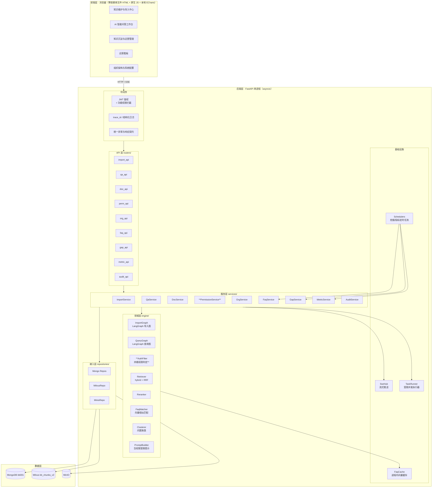
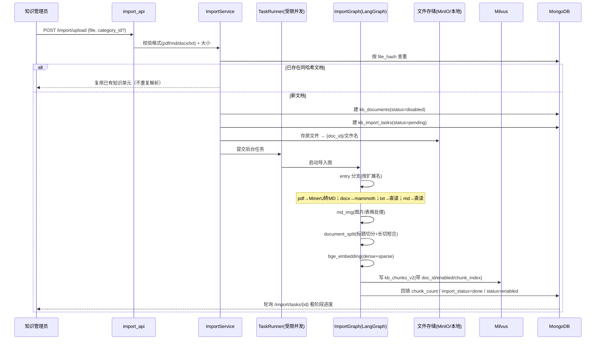
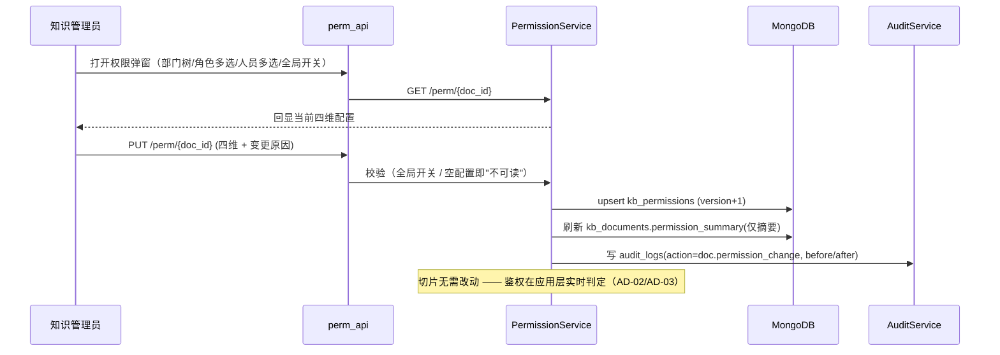
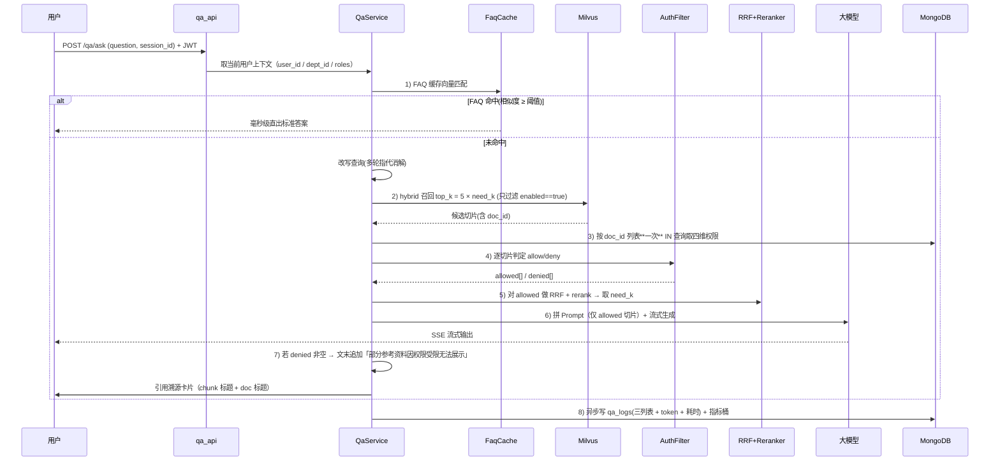
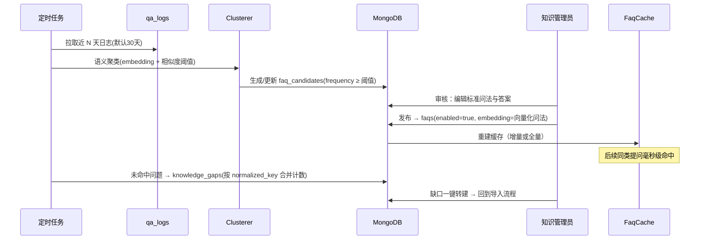

# 知识库管理平台 · 概要设计

> **文档编号**：02_概要设计
> **所属项目**：knowledge_manager（对应 PRD 2.9 知识库管理平台）
> **上游依据**：`PRD.md` + `01_数据实体/数据实体设计.md` + **`shopkeeper_brain` 存量实现**
> **状态**：Step 2 产物 · 待评审
> **覆盖范围**：技术选型 · 系统架构 · 业务流程 · 数据结构

---

## 1. 技术选型

### 1.1 选型总表（标注「沿用 / 补齐」）

| 层 | 选型 | 版本锚点 | 来源 | 说明 |
|---|---|---|---|---|
| 语言 | Python | **3.12.8** | — | 环境已就绪 |
| Web 框架 | **FastAPI** + uvicorn | fastapi 0.141.1 / uvicorn 0.53.0 | **沿用** | 存量即 FastAPI |
| 编排 | **LangGraph** | 1.2.12 | **沿用** | 存量导入/查询双图 |
| 向量库 | **Milvus** | pymilvus 3.0.1 | **沿用** | `192.168.6.170:19530` |
| 文档库 | **MongoDB** | pymongo 4.17.0（`AsyncMongoClient`） | **沿用** | 库 `kb001`；异步客户端免装 motor |
| 对象存储 | **MinIO** | minio 7.2.20 | **沿用** | 桶 `knowledge-base-files`（不可用时降级本地） |
| 解析 | **MinerU** + **Qwen3-VL** | mineru 4.0.6 / qwen-vl-utils | **沿用** | PDF→MD、图片/表格处理 |
| Embedding | **BGE-M3（dense + sparse）** | sentence-transformers 6.1.0 / torch 2.7.1+cu118 | **沿用** | 本地模型已就位，**CUDA 可用** |
| Rerank | **bge-reranker-large** | — | **沿用** | 本地模型已就位 |
| 融合 | **RRF + WeightedRanker** | — | **沿用** | 存量 `rrf.py` / `milvus_util.py` |
| 流式 | **SSE** | — | **沿用** | 存量 `sse_util.py`；2.9 需**带上 user_id 鉴权** |
| 大模型 | **OpenAI 兼容接口**（DashScope/Qwen 等） | openai 2.54.0 | **沿用** | 密钥已在 `.env` |
| **鉴权** | **JWT（PyJWT）+ bcrypt（passlib）** | 2.14.0 / 1.7.4 | **补齐** | 存量完全没有 |
| **Word/TXT 解析** | **python-docx + mammoth** | 1.2.0 / 1.12.2 | **补齐** | 存量只支持 pdf/md |
| **PDF 兜底解析** | **pdfplumber** | 0.11.10 | **补齐** | MinerU 失败时的降级通道 |
| 前端 | **零依赖单文件 HTML + 原生 JS** | — | **补齐** | 对齐 2.3 与老师约定 |
| 图表 | **本地 vendor ECharts** | 6.1.0 | **补齐** | 与 2.3 同一套约定（D-01） |
| 构建工具链 | **无** | — | — | 不引入 Node/打包器 |

### 1.2 关键选型说明

**① 为什么"只沿用、不重选"**

存量 `shopkeeper_brain` 的检索内核（MinerU 解析 → 切片 → BGE-M3 双向量 → Milvus hybrid → RRF → rerank → SSE）**已经跑通并有实测数据**，且依赖环境（含 CUDA、11.56GB 本地模型）已在新项目 `knowledge_manager` 中安装并 **17/17 导入验证通过**。
**重选任何一环都意味着推翻已验证的路径**，在两天工期里是不可接受的风险。

**② 为什么 Mongo 用 `AsyncMongoClient` 而不是 motor**

pymongo **4.18.1 自带 `AsyncMongoClient`**（实测可用）。motor 已是官方推荐迁移对象，**少引一个依赖**。

**③ 为什么前端与 2.3 保持同一套约定**

零依赖单文件 HTML + 本地 vendor ECharts + hash 路由。好处是**两个项目的前端壳、组件、格式化函数可共享经验与代码片段**，且评审标准一致。

---

## 2. 系统架构

### 2.1 关键架构决策 **AD-01：把两个 FastAPI 应用合并为一个**

存量是**两个独立应用**：`import_router`（端口 8000）+ `query_router`（端口 8001）。

| 问题 | 说明 |
|---|---|
| 鉴权重复 | 2.9 要求"强制校验登录态"。两个应用意味着**两套鉴权中间件**，且要保证行为一致 |
| 连接重复 | 两个进程各持一份 Milvus/Mongo 连接池 |
| 缓存不一致 | FAQ 缓存若在查询应用，导入应用触发的"FAQ 发布"无法直接失效它 |
| 演示复杂 | 答辩要开两个端口 |

**决策**：**合并为单应用单端口**（`uvicorn app.main:app --port 8102`），路由按前缀分区（`/api/v1/import/*`、`/api/v1/qa/*`、`/api/v1/admin/*`）。
**代价**：导入是 CPU/GPU 重任务，与在线问答同进程会争抢资源 → 用 **`asyncio.to_thread` / 受限并发**隔离（见 AD-09）。

### 2.2 系统架构分层



### 2.3 模块划分（11 个，供 Step 4 展开）

| # | 模块 | 类型 | 职责 | 主要实体 |
|---|---|---|---|---|
| 00 | 公共基础与项目骨架 | 基建 | 目录结构、配置、Mongo/Milvus/MinIO 连接、错误码、枚举、前端壳与路由、ECharts vendor、**系统配置服务** | **E22** |
| 01 | 登录与功能权限（RBAC） | 页面+服务 | JWT 登录、菜单/按钮/接口三级功能权限 | E09 E10 E11 E12 E13 |
| 02 | 组织架构管理 | 页面+服务 | 部门树、用户、角色的增删改 | E08 E09 E10 |
| 03 | 知识单元与分类管理 | 页面+服务 | 台账列表、分类树、启停用、软删除、按 `file_hash` 去重 | E04 E05 |
| 04 | 文档导入与向量化 | 页面+服务 | 上传（PDF/MD/Word/TXT）→ 解析 → 切片 → 双向量 → 入 Milvus；任务进度持久化 | E01 E03 E06 |
| 05 | **四维数据权限与鉴权引擎** | 页面+服务 | 权限配置（四维）、**鉴权判定**、受限提示生成 | E07 |
| 06 | AI 鉴权问答 | 页面+服务 | FAQ 缓存匹配 → Milvus 召回 → **鉴权过滤** → RRF/rerank → 流式生成 → 引用溯源 | E14 E02 E01 |
| 07 | FAQ 沉淀 | 页面+服务 | 聚类挖掘、候选审核、发布、**缓存注入与失效** | E16 E17 E18 |
| 08 | 知识缺口 | 页面+服务 | 未命中识别与聚合、一键转建文档 | E19 |
| 09 | 运营看板 | 页面+服务 | PV/UV/Token/延时/命中率/榜单；指标桶聚合 | E20 E15 |
| 10 | 审计日志 | 页面+服务 | 权限变更、文档增删改、FAQ 发布的留痕 | E21 |

### 2.4 关键架构决策汇总

| 编号 | 决策 | 理由 | 代价 |
|---|---|---|---|
| **AD-01** | 合并为单应用单端口 | 鉴权/连接/缓存统一，演示简单 | 导入与问答同进程，需并发隔离 |
| **AD-02** | **权限过滤在应用层**，不放 Milvus | 权限变更**即时生效**；逻辑单一；能精确产出 `denied_chunks` | 召回可能被大量过滤 → 需放大召回 |
| **AD-03** | 权限**只存文档级**，切片不冗余权限字段 | 改权限无需回写几十万切片，避免回写期间不一致 | 每次问答需按 `doc_id` 批量查权限（用 `in` 一次查完） |
| **AD-04** | **放大召回**：`top_k = recall_multiplier × need_k`（默认 5×） | 补偿 AD-02 的过滤损耗 | 多算一些向量/rerank 开销 |
| **AD-05** | 切片**可重建**：`kb_documents` + MinIO 原文件才是真源 | 切片策略调整后可整篇重建 | 需保证原文件不丢 |
| **AD-06** | FAQ 缓存用**向量相似**（复用 BGE-M3） | 覆盖不同措辞的同一问题；PRD 要求"毫秒级" | 缓存内需常驻 embedding，内存占用 |
| **AD-07** | 指标桶**写入时增量聚合** | 看板不做全表聚合 | 聚合代码与业务写入耦合 |
| **AD-08** | 问答日志**三列表必存**（recalled / allowed / denied） | 只存 allowed 就无法提示"部分资料因权限受限" | 存储略增 |
| **AD-09** | 导入任务用**受限并发执行器**（`asyncio.to_thread` + 信号量） | 导入是重任务，不能阻塞事件循环 | 需限并发数（默认 2） |
| **AD-10** | 导入任务状态**持久化到 Mongo** | 存量纯内存在重启后丢失进度 | 多一次写库 |
| **AD-11** | LangGraph 保留，但**拆掉"商品名确认"前置** | 那是电商专用逻辑，通用知识库会误拦 | 需改写查询图入口 |
| **AD-12** | UV 用**日粒度去重集合**，PV 用分钟桶 | 分钟桶累加会把同一用户重复计为多个 UV | 两套统计结构 |

---

## 3. 业务流程

### 3.1 文档导入与向量化流程（改造自存量导入图）



**阶段与进度**（阶段名直接复用为 `kb_import_tasks.stage`）
`upload → pdf_to_md → md_img → split → embedding → milvus`

### 3.2 四维权限配置流程



### 3.3 AI 鉴权问答流程（**本项目的核心**）



**关键点**：第 3 步**必须一次 `in` 查完**，否则 50 个切片就是 50 次查询（N+1）。

### 3.4 FAQ 沉淀闭环



---

## 4. 数据结构（承接 Step 1）

### 4.1 实体 → 存储 → 集合 全量对照（22 个实体逐一列出，不用区间写法）

| 实体 | 名称 | 存储 | 集合 / 结构 |
|---|---|---|---|
| E01 | 切片 | **Milvus** | `kb_chunks_v2` |
| E02 | 会话消息 | Mongo | `chat_messages` |
| E03 | 文件对象 | **MinIO** | 桶 `knowledge-base-files` |
| E04 | 知识单元 | Mongo | `kb_documents` |
| E05 | 知识分类 | Mongo | `kb_categories` |
| E06 | 导入任务 | Mongo | `kb_import_tasks` |
| E07 | 四维数据权限 | Mongo | `kb_permissions` |
| E08 | 部门 | Mongo | `sys_departments` |
| E09 | 用户 | Mongo | `sys_users` |
| E10 | 角色 | Mongo | `sys_roles` |
| E11 | 用户角色绑定 | Mongo | `sys_user_roles` |
| E12 | 功能权限 | Mongo | `sys_permissions` |
| E13 | 角色功能权限 | Mongo | `sys_role_permissions` |
| E14 | 会话 | Mongo | `chat_sessions` |
| E15 | 问答日志 | Mongo | `qa_logs` |
| E16 | FAQ 候选 | Mongo | `faq_candidates` |
| E17 | 已发布 FAQ | Mongo | `faqs` |
| E18 | FAQ 缓存 | **进程内**（可选 Mongo 副本） | `FaqCache` / `faq_cache` |
| E19 | 知识缺口 | Mongo | `knowledge_gaps` |
| E20 | 运营指标桶 | Mongo | `metric_buckets` |
| E21 | 审计日志 | Mongo | `audit_logs` |
| E22 | 系统配置 | Mongo | `system_config` |

**存储分布统计**：Mongo **20** 个集合；Milvus **1** 个集合；MinIO **1** 个桶；进程内 **3** 个结构（`FaqCache` / `SseHub` / `TaskRunner`）。
合计 **22 个实体**，与 Step 1 完全一致（E22 为 Step 4 依 PRD 2.9.2/2.9.3 补充）。

### 4.2 Milvus 集合 `kb_chunks_v2`

| 字段 | 类型 | 索引 | 说明 |
|---|---|---|---|
| `chunk_id` | INT64 PK auto | — | 主键 |
| `dense_vector` | FLOAT_VECTOR(dim) | `AUTOINDEX` / `COSINE` | BGE-M3 dense |
| `sparse_vector` | SPARSE_FLOAT_VECTOR | `SPARSE_INVERTED_INDEX` / `IP` | BGE-M3 sparse |
| `content` / `title` / `parent_title` / `file_title` | VARCHAR(65535) | — | 沿用存量 |
| **`doc_id`** | VARCHAR(64) | **INVERTED** | 关联知识单元；鉴权与溯源的关键 |
| **`chunk_index`** | INT64 | — | 文档内顺序 |
| **`enabled`** | BOOL | **INVERTED** | 支持停用；检索 expr 用它预过滤 |
| **`part`** | INT64 | — | 章节二次切分段号（存量是动态字段，此处显式化） |

**检索 expr**：仅 `enabled == true`。**权限不放这里**（AD-02）。

### 4.3 关键索引设计

| 集合 | 索引 | 用途 |
|---|---|---|
| `kb_documents` | 唯一 `file_hash`；`category_id+status`；`created_at desc`；`title` 文本 | 去重、列表筛选、搜索 |
| `kb_permissions` | **唯一 `doc_id`** | 鉴权主查询（**最高频**） |
| `qa_logs` | `asked_at desc`（+TTL 180d）；`user_id+asked_at desc`；`session_id`；`max_score` | 看板、挖掘、缺口 |
| `faqs` | 唯一 `question`；`enabled` | 缓存重建、列表 |
| `faq_candidates` | `status+frequency desc`；唯一 `cluster_key+window_start` | 审核列表；防重复生成 |
| `knowledge_gaps` | **唯一 `normalized_key`**；`status+frequency desc` | 合并计数、缺口清单 |
| `metric_buckets` | 唯一 `_id`；`bucket_type+bucket_ts desc` | 看板 |
| `audit_logs` | `ts desc`；`actor+ts desc`；`target_type+target_id` | 审计 |
| `kb_import_tasks` | `doc_id`；`status+created_at desc`（+TTL 90d） | 进度查询 |
| `chat_sessions` | `user_id+last_active_at desc` | 会话侧边栏 |

### 4.4 进程内结构

```python
# 1) FAQ 缓存（AD-06）
class FaqCache:
    _items: list[FaqItem]        # {faq_id, question, aliases, embedding, answer}
    _lock: asyncio.Lock
    # 匹配：问题向量化 → 与 _items.embedding 暴力余弦 → 取 top1，≥ 阈值即直出
    # 规模假设：数百~数千条 → 暴力比建 ANN 索引更简单且够快
    # 失效：FAQ 发布/编辑/停用 或 服务启动时重建

# 2) SSE 订阅中心（沿用存量 sse_util 思路，但改为按 user 鉴权）
class SseHub:
    _queues: dict[str, asyncio.Queue]   # task_id -> queue
    # 2.9 新增：订阅前校验 task 归属当前 user，防止越权窃听他人问答流

# 3) 导入任务执行器（AD-09）
class TaskRunner:
    _sem: asyncio.Semaphore(2)          # 最多 2 个导入并发
    # 用 asyncio.to_thread 跑同步的 LangGraph 导入流程，避免阻塞事件循环
```

> ⚠️ **存量安全隐患**：原 `sse_util` 的 `task_id` 是随机的，但**没有校验订阅者身份**——任何人拿到 `task_id` 就能窃听。2.9 必须补上归属校验。

### 4.5 指标桶聚合

```python
# 分钟桶：只累加 PV 与 token，不做 UV
await metric.update_one(
    {"_id": f"global:all:{ts_1m}"},
    {"$inc": {"metrics.pv": 1, "metrics.faq_hit_cnt": int(faq_hit),
              "metrics.token_prompt": tok_p, "metrics.token_completion": tok_c},
     "$setOnInsert": {"bucket_type": "global", "granularity": "1m", "bucket_ts": ts_1m}},
    upsert=True)

# 日桶：用去重集合精确统计 UV（AD-12）
await metric.update_one(
    {"_id": f"global:uv:{day_ts}"},
    {"$addToSet": {"uv_set": user_id},
     "$setOnInsert": {"bucket_type": "global", "granularity": "1d", "bucket_ts": day_ts}},
    upsert=True)
# 查 UV：len(doc["uv_set"])，而非把分钟桶相加
```

---

## 5. 接口总览

> 字段级定义放 **Step 4 模块 Spec**；此处固化**路由分区与职责边界**。
>
> ⚠️ **Step 4 修正（2026-09-24）**：本表的权限码原为粗粒度的 `doc:write`，
> Step 4 依原型 `08` 的权限矩阵把它细分为 **`doc:edit` / `doc:toggle` / `doc:delete` /
> `doc:category` / `doc:upload`** 五个码（详见 `04_模块Spec/01_登录与功能权限（RBAC）.md` §2.3 B 表）。
> 全系统共 **34 个功能权限码**，`sys_permissions` 为唯一来源；本表已同步，两处口径一致。

| 分组 | 方法 | 路径 | 职责 | 功能权限 |
|---|---|---|---|---|
| 鉴权 | POST | `/api/v1/auth/login` | 登录换 JWT | — |
| | GET | `/api/v1/auth/me` | 当前用户 + 角色 + **功能权限码列表** | — |
| 组织 | CRUD | `/api/v1/org/departments` | 部门树维护 | `org:manage` |
| | CRUD | `/api/v1/org/users` | 用户维护 | `user:manage` |
| | CRUD | `/api/v1/org/roles` | 角色与功能权限分配 | `role:manage` |
| 知识单元 | GET | `/api/v1/docs` | 台账列表（分类/状态/关键词筛选 + 分页） | `doc:read` |
| | GET/PUT/DELETE | `/api/v1/docs/{doc_id}` | 详情 / 编辑标题分类 / 软删除 | `doc:read` / `doc:edit` / `doc:delete` |
| | POST | `/api/v1/docs/{doc_id}/toggle` | 启用/停用 | `doc:toggle` |
| 分类 | CRUD | `/api/v1/categories` | 分类树维护 | `doc:category` |
| 导入 | POST | `/api/v1/import/upload` | 单文件上传 | `doc:upload` |
| | POST | `/api/v1/import/batch` | **批量/文件夹上传**（PRD 要求） | `doc:upload` |
| | GET | `/api/v1/import/tasks/{task_id}` | 任务进度（阶段 + 百分比 + 各阶段耗时） | `doc:read` |
| **权限** | GET/PUT | `/api/v1/perm/{doc_id}` | **四维权限读/写** | `perm:manage` |
| | POST | `/api/v1/perm/check` | **鉴权判定接口**（PRD 验收明确要求"调用鉴权接口"） | 登录即可 |
| 问答 | POST | `/api/v1/qa/ask` | 提问（**同步返回 task_id**） | `qa:use` |
| | GET | `/api/v1/qa/stream/{task_id}` | **SSE 流式答案**（须校验归属） | `qa:use` |
| | GET | `/api/v1/qa/sessions` | 历史会话侧边栏 | `qa:use`（仅本人） |
| | GET | `/api/v1/qa/sessions/{id}/messages` | 会话消息与引用溯源 | `qa:use`（仅本人） |
| FAQ | GET | `/api/v1/faq/candidates` | 候选列表 | `faq:review` |
| | POST | `/api/v1/faq/candidates/{id}/approve` | 审核发布（可编辑） | `faq:review` |
| | POST | `/api/v1/faq/candidates/{id}/reject` | 驳回 | `faq:review` |
| | CRUD | `/api/v1/faqs` | 已发布 FAQ 管理（含启用开关） | `faq:review` |
| | POST | `/api/v1/faq/mine` | **手动触发挖掘**（演示用） | `faq:review` |
| 缺口 | GET | `/api/v1/gaps` | 缺口清单（频次/部门/最高相似度） | `gap:read` |
| | POST | `/api/v1/gaps/{id}/convert` | 一键转建知识补充任务 | `gap:convert` |
| 看板 | GET | `/api/v1/metrics/overview` | 核心指标摘要 | `metric:read` |
| | GET | `/api/v1/metrics/trend` | Token/问答量趋势 | `metric:read` |
| | GET | `/api/v1/metrics/latency` | 响应延时分布（P50/P95） | `metric:read` |
| | GET | `/api/v1/metrics/ranking` | 高频问题榜 / 热门知识榜 | `metric:read` |
| 审计 | GET | `/api/v1/audit/logs` | 审计流水（四维筛选） | `audit:read` |
| 系统 | GET | `/health` | 存活 + 三存储连通性 + 模型可用性 | — |
| 系统 | GET/PUT | `/api/v1/system/config` | **模型服务参数读 / 写**（原型 `07` 的配置区块） | `model:config` / `system:config` |

---

## 6. 非功能设计

| 维度 | 设计 | 目标值 |
|---|---|---|
| **鉴权强制** | 除 `/health` 与 `/auth/login` 外，所有接口经中间件校验 JWT | 100% 覆盖 |
| **数据权限强制** | 问答链路与 `perm/check` **必须**过 `AuthFilter`；无权限切片**绝不进 Prompt** | 零越权泄漏 |
| 检索延迟 | Milvus 召回 + 鉴权过滤 + rerank | P95 < 3s（不含大模型生成） |
| 端到端延迟 | 含流式生成 | P95 < 12s |
| FAQ 缓存命中 | 向量相似匹配 | < 50ms |
| 导入并发 | `TaskRunner` 信号量限 2 | 不阻塞问答 |
| 幂等 | 上传按 `file_hash` 去重；`qa/ask` 支持 `request_id` 幂等 | 必须 |
| 降级 | MinIO 不可用 → 本地路径；MinerU 失败 → pdfplumber；rerank 不可用 → 跳过重排 | 逐项降级并标记 |
| 可观测 | trace_id 贯穿；问答分段耗时（检索/鉴权/重排/生成）落 `qa_logs` | — |
| 安全 | 密码 bcrypt；手机号等敏感信息不回显；SSE 订阅校验归属 | — |
| 可复现 | 聚类与挖掘支持固定随机种子；演示数据可一键重建 | 必须 |

---

## 7. 与 Step 1 的一致性核对

| Step 1 遗留问题 | 本步结论 |
|---|---|
| 权限过滤的召回放大倍数 | **AD-04**：默认 5×，可配 |
| FAQ 缓存重建时机 | **发布即增量重建** + 启动时全量重建（§3.4） |
| 指标桶写入方式 | **异步写**（问答返回后触发，不阻塞流式输出） |
| Milvus 集合迁移 | **不迁移**（无存量业务数据），直接新建 `kb_chunks_v2` |
| 文档软删除后切片何时清理 | **停用文档时批量置 `enabled=false`**；物理删除走手动清理脚本（不自动） |

**实体覆盖核对**：Step 1 的 **E01~E22 全部**出现在 §2.3 模块表或 §4 数据结构中，无遗漏。

---

## 8. 本步遗留决策点

| 编号 | 决策点 | 状态 |
|---|---|---|
| **D-01** | 图表用本地 vendor ECharts | **已定**（沿用 2.3 的 D-01 结论） |
| **D-02** | 页面组织：单页 + hash 路由 | **已定**（沿用 2.3 的 D-02 结论） |
| **D-03** | Milvus 是否需保留 `item_name` 以兼容存量检索代码 | **待定** —— 若不保留，`item_name_confirm` 节点必须删除而非改空值 |
| **D-04** | 大模型回答的**引用格式**（`[1]` 角标 vs 文末卡片） | 待定，Step 3 原型确定 |
| **D-05** | 前端是否需要"权限缺失占位卡片"的独立视觉样式 | 待定，Step 3 原型确定 |
| **D-06** | 是否保留存量的 web_search_mcp（联网检索）节点 | **建议关闭**（企业知识库通常只允许内部知识） |
