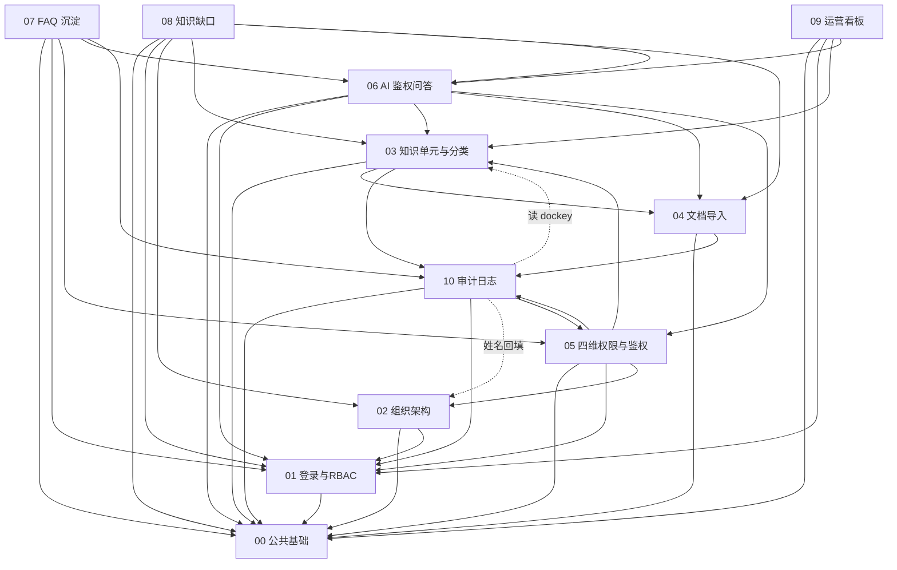
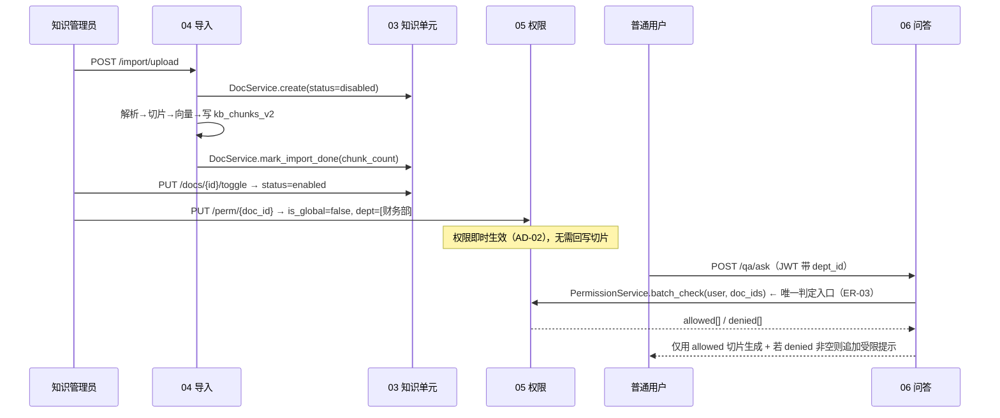

# 知识库管理平台 · 模块划分与边界

> **文档编号**：04_模块Spec / 00
> **所属项目**：knowledge_manager（对应 PRD 2.9 知识库管理平台）
> **上游依据**：`01_数据实体/数据实体设计.md` + `02_概要设计/概要设计.md`（§2.3 模块划分 / AD-01~AD-12）
> **状态**：Step 4 总纲 · 待评审
> **作用**：固化**模块边界、实体归属、错误码前缀、跨模块强制规则**；后续 01~10 各模块 Spec 必须遵守本文件。

---

## 1. 模块清单（11 个）

| # | 模块 | 类型 | 一句话职责 | 主要实体 | 主要页面 |
|---|---|---|---|---|---|
| **00** | 公共基础与项目骨架 | 基建 | 目录结构、配置、三存储连接、统一响应与异常、枚举、前端壳与路由、ECharts vendor、**系统配置服务（E22）** | **E22** | 全部页面的外壳 + 系统配置区块 |
| **01** | 登录与功能权限（RBAC） | 页面+服务 | JWT 登录、令牌校验、菜单/按钮/接口三级功能权限 | E09 E10 E11 E12 E13 | 01 登录页、08 权限矩阵 |
| **02** | 组织架构管理 | 页面+服务 | 部门树、用户、角色的增删改查 | E08 E09 E10 E11 | 07 组织架构与系统配置页 |
| **03** | 知识单元与分类管理 | 页面+服务 | 台账列表、分类树、标题编辑、启停用、软删除、按 `file_hash` 去重 | E04 E05 | 02 知识维护与导入中心 |
| **04** | 文档导入与向量化 | 页面+服务 | 上传（PDF/MD/Word/TXT）→ 解析 → 切片 → 双向量 → 入 Milvus；任务进度持久化 | E01 E03 E06 | 02 知识维护与导入中心 |
| **05** | 四维数据权限与鉴权引擎 | 页面+服务 | 四维权限配置、**鉴权判定**、受限提示生成 | E07 | 04 四维数据权限配置弹窗 |
| **06** | AI 鉴权问答 | 页面+服务 | FAQ 缓存匹配 → 召回 → **鉴权过滤** → RRF/rerank → 流式生成 → 引用溯源 | E14 E02 E15(+E01) | 03 AI 智能问答工作台 |
| **07** | FAQ 沉淀 | 页面+服务 | 聚类挖掘、候选审核、发布、**缓存注入与失效** | E16 E17 E18 | 05 知识沉淀与运营管理页 |
| **08** | 知识缺口 | 页面+服务 | 未命中识别与聚合、一键转建文档 | E19 | 05 知识沉淀与运营管理页 |
| **09** | 运营看板 | 页面+服务 | PV/UV/Token/延时/命中率/榜单；指标桶聚合与查询 | E20 E15 | 06 运营看板与数据大盘 |
| **10** | 审计日志 | 页面+服务 | 权限变更、文档增删改、FAQ 发布、角色授权的留痕与查询 | E21 | 07 组织架构与系统配置页 |

> **与 `02_概要设计.md` §2.3 完全一致**，本表只补了「主要页面」一列便于追溯 Step 3 原型。

---

## 2. 跨模块强制规则（ER）

> 这些规则是为避免 **2.3 项目中实际发生过的三类缺陷**而设：
> ① 多模块共用错误码前缀导致状态码语义混淆；
> ② 同一实体被两个模块写入导致口径不一致；
> ③ 权限判定逻辑被各模块各写一份导致行为分叉。
> **后续每个模块 Spec 的自检都会检查这些规则的遵守情况。**

| 编号 | 规则 | 说明 | 违反后果 |
|---|---|---|---|
| **ER-01** | **一个模块一个错误码前缀，禁止共用** | 见 §3。任何模块不得使用别模块的前缀 | 前端无法按码定位模块，排障困难 |
| **ER-02** | **一个实体只有一个「归属模块」（单一写入者）** | 见 §5。非归属模块只可**读**，写必须调用归属模块的 Service，禁止直连集合写入 | 同一数据两处写入 → 口径分叉（2.3 的 `device_user_cnt` 就是这样出问题的） |
| **ER-03** | **数据权限判定只有一份实现，在 05 模块** | 其他模块**禁止**自行实现 `allow = is_global or ...`；一律调用 `PermissionService.check()` | 鉴权行为分叉 → **越权泄漏**，本项目最严重的缺陷类型 |
| **ER-04** | **鉴权 fail-closed** | 权限表查询失败 / 超时 / 返回异常，一律判为**拒绝**，绝不能"查不到就放行" | 越权泄漏 |
| **ER-05** | **审计写入只能经 `AuditService`** | 禁止业务模块直接 insert `audit_logs`；必须调用 `AuditService.record()` | 审计字段缺失、动作名不统一 |
| **ER-06** | **`qa_logs` 只由 06 模块写入** | 09 看板只读；07 FAQ 挖掘、08 缺口识别只读 | 一份数据两用，双写必冲突 |
| **ER-07** | **指标桶只由 09 模块写入** | 其他模块通过 `MetricService.inc()` 投递，禁止直接 upsert `metric_buckets` | 聚合口径漂移 |
| **ER-08** | **所有对外接口必须过 01 模块的 JWT 中间件** | 仅 `/health`、`/api/v1/auth/login` 白名单 | PRD 要求「强制校验登录态」 |
| **ER-09** | **功能权限码必须在 `sys_permissions` 里有定义** | 路由声明 `@require_perm("doc:write")` 时，该码必须已入库 | 权限矩阵页与真实拦截不一致 |
| **ER-10** | **枚举按实体各自定义** | 禁止共用一个通用 `StatusEnum`（2.9 有 5 种不同取值域的 `status`） | 取值域串味 |
| **ER-11** | **不在 Milvus 侧做权限过滤** | 检索 `expr` 只允许 `enabled == true`（+ 可选 `doc_id in [...]`） | 违反 AD-02：权限变更不再即时生效 |
| **ER-12** | **切片不冗余权限字段** | `kb_chunks_v2` 不得新增任何权限相关字段 | 违反 AD-03 |
| **ER-13** | **批量取权限必须一次 `IN` 查完** | 禁止按切片逐个查 `kb_permissions` | N+1，50 个切片 50 次查询 |
| **ER-14** | **SSE 订阅必须校验归属** | `GET /qa/stream/{task_id}` 必须先确认该 task 属于当前 user | 存量 `sse_util` 的真实安全缺陷 |
| **ER-15** | **软删除不物理删切片** | 文档软删除 → 切片 `enabled=false`；物理清理走显式脚本 | 违反 AD-05：切片可重建 |
| **ER-16** | **模块内自有决策必须用 `DEC-{模块号}-x` 编号** | 全局决策编号 `D-01`~`D-06` 是 Step 2 的命名空间，**模块内新增的决策不得占用 `D-xx`** | 编号撞名后无法判断一条 `D-0x` 是全局决策还是某模块的局部决策 |
| **ER-17** | **不得改动 Step 1 的字段表** | 模块 Spec 若需给集合加字段，必须在 §8 登记开放问题（`OQ-{模块号}-xx`）并标注「需回填 Step 1」，**由 Step 1 统一更新后再落地** | 各模块各自加字段 → 实体设计失效，前端与后端对不上 |

---

## 3. 错误码前缀分配（**逐一列出，禁止区间写法**）

> 格式：`{PREFIX}-{4位数字}`，例如 `AUTH-1001`。
> **每个前缀只属于一个模块**，`00` 模块负责在 `app/core/errors.py` 里集中注册。
> 数字段约定：`1xxx` 参数/校验类 · `2xxx` 鉴权/权限类 · `3xxx` 资源/状态类 · `4xxx` 依赖/外部服务类 · `5xxx` 内部错误类。

| 模块 | 前缀 | 段位 | 示例 | 说明 |
|---|---|---|---|---|
| 00 公共基础 | **`SYS`** | 1xxx~5xxx | `SYS-1001` 参数校验失败 | 通用错误、未捕获异常、配置缺失 |
| 01 登录与功能权限 | **`AUTH`** | 1xxx~2xxx | `AUTH-2001` 令牌无效 | 登录、令牌、功能权限不足 |
| 02 组织架构 | **`ORG`** | 1xxx~3xxx | `ORG-3001` 部门存在子部门 | 部门/用户/角色 CRUD |
| 03 知识单元与分类 | **`DOC`** | 1xxx~5xxx | `DOC-3002` 文档已软删除 | 台账、分类、启停用 |
| 04 文档导入 | **`IMP`** | 1xxx~4xxx | `IMP-4001` MinerU 解析失败 | 上传、解析、切片、向量化 |
| 05 四维数据权限 | **`PERM`** | 1xxx~5xxx | `PERM-3001` 权限记录不存在 | 权限配置与鉴权判定 |
| 06 AI 鉴权问答 | **`QA`** | 1xxx~4xxx | `QA-4002` 大模型调用失败 | 问答链路、SSE |
| 07 FAQ 沉淀 | **`FAQ`** | 1xxx~5xxx | `FAQ-3003` 候选已审核 | 挖掘、审核、发布、缓存 |
| 08 知识缺口 | **`GAP`** | 1xxx~5xxx | `GAP-3001` 缺口已转建 | 缺口聚合与转建 |
| 09 运营看板 | **`MET`** | 1xxx~5xxx | `MET-1001` 时间范围非法 | 指标聚合与查询 |
| 10 审计日志 | **`AUD`** | 1xxx~5xxx | `AUD-3001` 审计记录不存在 | 审计查询 |

**保留前缀（不得使用）**：`ERR` / `BIZ` / `COMMON`（过于宽泛，会导致语义混淆）。

> ⚠️ **2.3 的教训**：当时 `05/06` 共用 `RUL`、`07/08` 共用 `CAS`、`02/11` 共用 `MET` 但含义完全不同，
> 导致同一码在不同模块指向不同错误。**本表已做到前缀两两互异**（已由 `_check_kb_specs.py` 自动校验）。

### 3.1 模块 00（公共基础）的错误码**具体清单**

> 上面只分配了前缀。`00` 是所有模块的兜底出口（参数校验、路由未命中、
> 依赖不可用、未捕获异常），**必须把码列全**，否则代码里会出现"没有 Spec 依据的码"。
> 本表由 Step 5 切片实现时补齐（`_slice_consistency.py` 会持续核对代码 ↔ 本表）。

| 错误码 | HTTP | 消息 | 触发条件 | 产生位置 |
|---|---|---|---|---|
| `SYS-1001` | 400 | 参数校验失败 | Pydantic `RequestValidationError`（缺字段 / 类型错 / 长度越界 / 多传字段） | `core/errors.py` 的校验处理器 |
| `SYS-3001` | 404 | 接口不存在 | 路由未命中 | 同上（HTTPException 处理器） |
| `SYS-3002` | 405 | 请求方法不允许 | 路径存在但方法不对（如 `GET /auth/login`） | 同上 |
| `SYS-4001` | 503 | 数据库不可用 | Mongo 未连接或连接已释放（`Mongo.require_db()` 抛出） | `infra/mongo.py` |
| `SYS-5001` | 500 | 服务器内部错误 | 未捕获异常（**细节只进日志，不回客户端**） | 同上（兜底处理器） |
| `SYS-{4xx}` | 同左 | 动态兜底 | 其他 `HTTPException` 状态码按 `SYS-{状态码}` 现算 | 同上 |

**约定**：`SYS-*` 只用于**框架层与基础设施层**的失败；任何**业务规则**失败都必须用
所属业务模块自己的前缀（如 `/auth/login` 的密码错用 `AUTH-2001`，不能图省事用 `SYS-1001`）。

> ⚠️ **2.3 的教训**：当时 `05/06` 共用 `RUL`、`07/08` 共用 `CAS`、`02/11` 共用 `MET` 但含义完全不同，
> 导致同一码在不同模块指向不同错误。**本表已做到前缀两两互异**（已由 `_check_kb_specs.py` 自动校验）。

---

## 4. 模块依赖关系

> **箭头方向约定**：`A --> B` 读作「**A 依赖 B**」（A 调用 B 的服务 / 读 B 的数据）。
> 实线 = 硬依赖（缺了跑不起来）；虚线 = 软依赖（缺了降级，不影响主链路）。
>
> ⚠️ **修正记录（Step 5 开发期）**：本图初稿的箭头方向不一致（例如写成 `M01 --> M05`，
> 实际是 05 依赖 01）。现已按各模块 Spec §1.5 的依赖表逐条重画。



### 4.1 四组循环依赖及其破解方式

Spec 里真实存在 4 组双向依赖。**不允许把它们做成运行期循环导入**，
统一按「谁提供接口、谁延迟引用」来处理：

| # | 循环 | 为什么会有 | 破解方式 |
|---|---|---|---|
| 1 | **01 ↔ 02** | 01 读 E08~E11 的**表**；02 调 01 的 `PermissionCache.invalidate_user()` | 01 已建；02 落地时把 E08~E11 的**索引管理**从 01 迁到 02（现在 01 代管是权宜） |
| 2 | **02 ↔ 10** | 02 的写操作必须走 `AuditService`；10 查询时要把 `actor` 解析成姓名 | 10 先建；10 对 02 的姓名回填用**函数级延迟导入**，且 02 缺席时降级为显示 `actor` 原值（`actor_name` 本就是调用方快照） |
| 3 | **03 ↔ 04** | 03 停用文档要调 04 的 `ImportService.set_chunks_enabled()`；04 建台账要调 03 的 `DocService` | 见 §4.2 —— 作为**连续批次**开发，后落地的一方补上前向调用点 |
| 4 | **06 ↔ 07** | 06 要读 07 的 `FaqCache.match()`；07 的挖掘原料是 06 写的 `qa_logs` | 06 先建，缓存未就绪时**降级为未命中**（06 Spec §7 已写明这条降级）；07 落地后缓存自动开始命中 |

### 4.2 03 / 04 的成批开发约定（项目方已确认）

两者互为前置，无法靠"一次只做一个"自然解开，因此约定：

1. **先 03**：实现台账（E04/E05）的增删改查、分类树、软删除与恢复。
   其中「停用/软删除文档 → 同步切片 `enabled`」这一步需要 04 的服务，
   **03 交付时先不写这一处调用**（此时系统里还没有任何切片，该调用是空操作）。
2. **再 04**：实现上传→解析→切片→向量化全链路，**同时**把 `ImportService` 提供给 03。
3. **回填**：04 落地后，在 03 里补上那处调用（约 3 行），并**重跑 03 的全部测试**。
4. 两模块仍**分别交付、分别验收**，只是开发顺序上紧邻，不合并成一个大模块。

> **为什么不干脆让 03 直接写 Milvus**：那会违反 ER-02（一个集合只有一个归属模块写入）。
> E01 切片的唯一写入者必须始终是 04 —— 这一点不能为开发便利让步。

## 5. 实体归属矩阵（**单一写入者**，落实 ER-02）

| 实体 | 集合 | **归属模块（唯一写入者）** | 允许读取的模块 |
|---|---|---|---|
| E01 切片 | `kb_chunks_v2` | **04 文档导入** | 06 问答 |
| E02 会话消息 | `chat_messages` | **06 AI 鉴权问答** | — |
| E03 文件对象 | MinIO 桶 | **04 文档导入** | 03（只读元信息） |
| E04 知识单元 | `kb_documents` | **03 知识单元与分类** | 04 06 08 09 10 |
| E05 知识分类 | `kb_categories` | **03 知识单元与分类** | 04 07 08 |
| E06 导入任务 | `kb_import_tasks` | **04 文档导入** | 03 |
| E07 四维数据权限 | `kb_permissions` | **05 四维权限与鉴权** | 06（经 `PermissionService`，不直连） |
| E08 部门 | `sys_departments` | **02 组织架构** | 01 05 06 08 09 10 |
| E09 用户 | `sys_users` | **02 组织架构** | 01 05 06 09 10 |
| E10 角色 | `sys_roles` | **02 组织架构** | 01 05 06 |
| E11 用户角色绑定 | `sys_user_roles` | **02 组织架构** | 01 05 06 |
| E12 功能权限 | `sys_permissions` | **01 登录与RBAC** | 02 |
| E13 角色功能权限 | `sys_role_permissions` | **01 登录与RBAC** | 02 |
| E14 会话 | `chat_sessions` | **06 AI 鉴权问答** | 09 |
| E15 问答日志 | `qa_logs` | **06 AI 鉴权问答** | 07 08 09 |
| E16 FAQ 候选 | `faq_candidates` | **07 FAQ 沉淀** | — |
| E17 已发布 FAQ | `faqs` | **07 FAQ 沉淀** | 06（经缓存，不直连） |
| E18 FAQ 缓存 | 进程内 | **07 FAQ 沉淀** | 06（经 `FaqCache.match()`） |
| E19 知识缺口 | `knowledge_gaps` | **08 知识缺口** | 09 |
| E20 运营指标桶 | `metric_buckets` | **09 运营看板** | — |
| E21 审计日志 | `audit_logs` | **10 审计日志** | — |
| E22 系统配置 | `system_config` | **00 公共基础** | 01 02 05 06 07 08 09 |

**核对**：22 个实体 **全部有且只有一个**归属模块，无重复、无遗漏。
（E22 系统配置归 **00 公共基础**；它的配置项被各模块**读取**，但写入只能经 00 的配置服务。）

> ⚠️ **注意两处易混点**：
> 1. `E04 kb_documents` 归 **03**，但 **04 导入**完成后要回填 `chunk_count`/`import_status`/`status` —— **必须经 `DocService.mark_import_done()`，不得直连写库**。
> 2. `E07 kb_permissions` 归 **05**，但 **02/03** 的界面要展示权限摘要 —— 读的是 `kb_documents.permission_summary`（E04 的字段），**不是** E07。

---

## 6. 统一接口约定

### 6.1 路由分区

| 前缀 | 归属模块 | 示例 |
|---|---|---|
| `/api/v1/auth/*` | 01 | `/auth/login`、`/auth/me` |
| `/api/v1/org/*` | 02 | `/org/departments`、`/org/users`、`/org/roles` |
| `/api/v1/docs/*`、`/api/v1/categories/*` | 03 | `/docs`、`/docs/{id}/toggle` |
| `/api/v1/import/*` | 04 | `/import/upload`、`/import/tasks/{id}` |
| `/api/v1/perm/*` | 05 | `/perm/{doc_id}`、`/perm/check` |
| `/api/v1/qa/*` | 06 | `/qa/ask`、`/qa/stream/{task_id}` |
| `/api/v1/faq/*`、`/api/v1/faqs/*` | 07 | `/faq/candidates`、`/faq/mine` |
| `/api/v1/gaps/*` | 08 | `/gaps`、`/gaps/{id}/convert` |
| `/api/v1/metrics/*` | 09 | `/metrics/overview` |
| `/api/v1/audit/*` | 10 | `/audit/logs` |
| `/api/v1/system/*` | 00 | `/system/config`（模型服务参数读 / 写） |
| `/health` | 00 | 白名单，无需鉴权 |

### 6.2 统一响应契约（**00 模块实现，全模块遵守**）

```jsonc
// 成功
{ "code": 0, "message": "ok", "data": { /* ... */ }, "trace_id": "..." }

// 失败
{ "code": "DOC-3002", "message": "文档已软删除", "data": null, "trace_id": "..." }
```

| 约定 | 说明 |
|---|---|
| 业务成功用 `code: 0` | 与 HTTP 200 并存 |
| HTTP 状态码语义 | `200` 成功 · `400` 参数错 · `401` 未登录 · `403` 功能权限不足 · `404` 资源不存在 · `409` 状态冲突 · `429` 限流 · `500` 内部错 |
| **数据权限不足走 `200`+业务语义** | 鉴权拦截**不是** `403`——用户有权用问答功能，只是部分资料不可读（见 06 模块 §5） |
| `trace_id` | 由中间件注入，贯穿日志与响应 |

### 6.3 分页约定

请求 `?page=1&page_size=20`（`page_size` 上限 200），响应：

```jsonc
{ "items": [ ... ], "total": 137, "page": 1, "page_size": 20 }
```

---

## 7. 跨模块关键流程（串联视角）

### 7.1 上传 → 建台账 → 配权限 → 可问答（端到端）



### 7.2 权限变更的即时生效链路（本项目核心卖点）

| 步骤 | 动作 | 为什么能"即时" |
|---|---|---|
| 1 | `PUT /perm/{doc_id}` 写 E07（`version+1`） | 权限**只存文档级**（AD-03） |
| 2 | 刷新 E04 的 `permission_summary`（仅展示用） | 台账列表不产生 N+1 |
| 3 | 写 E21 审计 | ER-05 |
| 4 | **不动 Milvus** | 切片不冗余权限字段（ER-12） |
| 5 | 下一次问答按 `doc_id` 实时判定 | 应用层过滤（AD-02） |

---

## 8. 公共基础（模块 00）交付清单

| 交付物 | 路径 | 说明 |
|---|---|---|
| 配置 | `app/core/config.py` | 从 `.env` 读取；含 Milvus/Mongo/MinIO/LLM/模型路径 |
| 错误注册 | `app/core/errors.py` | §3 的全部前缀常量 + `BizError` 异常类 |
| 枚举 | `app/core/enums.py` | §1 数据实体文档 §8 的 **14 组枚举**，按实体各自定义类（ER-10） |
| 统一响应 | `app/core/response.py` | §6.2 契约 |
| 中间件 | `app/core/middleware.py` | trace_id、异常兜底、JWT 校验（调 01 模块） |
| 三存储连接 | `app/infra/mongo.py` / `milvus.py` / `minio.py` | `AsyncMongoClient`（pymongo 4.18.1，免 motor） |
| 受限并发 | `app/infra/task_runner.py` | `asyncio.to_thread` + `Semaphore(2)`（AD-09） |
| SSE 中心 | `app/infra/sse_hub.py` | 按 `task_id` 订阅 + **归属校验**（ER-14） |
| 前端壳 | `web/index.html` + `web/js/{router,api,ui}.js` | 零依赖单文件 + hash 路由 |
| 图表 | `web/vendor/echarts.min.js` | 本地 vendor，不引 CDN |
| **系统配置服务** | `app/services/config_service.py` + `system_config` 集合 | **E22 的唯一写入者**；9 个预置配置项（模型 / 检索 / FAQ / 缺口 / 导入并发）；改后内存热更新 + 写 `config.update` 审计 |

---

## 9. 模块 Spec 的统一章节模板

01~10 每个模块文件**必须**包含以下 8 章（顺序固定，便于自动校验）：

| 章 | 标题 | 必须包含 |
|---|---|---|
| 1 | 模块职责与边界 | 「做什么」「不做什么」两张清单；归属实体；依赖模块 |
| 2 | 数据契约 | 集合/字段/索引；字段级类型与必填；引用 Step 1 的实体编号 |
| 3 | 接口清单 | 方法 + 路径 + 权限码 + 入参表 + 出参表 + 错误码 |
| 4 | 关键流程 | 至少 1 个 mermaid 图 + 步骤说明 |
| 5 | 错误码表 | **本模块前缀**（§3）下的全部码，逐条含 HTTP 状态与触发条件 |
| 6 | 验收标准 | 可执行、可判定的条目（AC-xx），与 PRD 要求对应 |
| 7 | 依赖与前置 | 依赖的模块/组件/数据；缺失时的降级行为 |
| 8 | 开放问题 | 引用 G-xx / D-xx / C-xx；本模块新增的问题用 `OQ-{模块号}-xx` 编号；**模块内自有决策用 `DEC-{模块号}-x` 编号**（ER-16）；若需给 Step 1 的集合加字段，必须在此登记并标注「需回填 Step 1」（ER-17） |

---

## 10. 自检要求

| 检查项 | 工具 |
|---|---|
| 8 章齐全、顺序正确 | `_check_kb_specs.py` |
| 错误码前缀**两两互异**且与 §3 一致（ER-01） | `_check_kb_specs.py` |
| 每个实体**只有一个**归属模块（ER-02） | `_check_kb_specs.py` |
| 接口路径前缀与 §6.1 一致 | `_check_kb_specs.py` |
| 引用的 G-xx / D-xx / C-xx 均在 Step 1/2 有定义 | `_check_kb_specs.py` |
| 跨模块实体引用一致（本文件 ↔ 各模块文件 ↔ Step 1） | `_check_kb_specs.py` |

---

## 11. 决策记录（2026-09-24 裁定）

Step 4 撰写过程中浮现、并由**项目方依 PRD 拍板**的三项决策。它们改变了若干模块的边界，
故在此集中登记；各模块文件内已同步为「已裁定」。

### 裁定 A · 角色模型：**3 个系统内置角色 + 放开「业务角色」**

**触发**：原型 `04` 的四维权限弹窗列了 4 个角色（含「部门主管」），而原型 `07` 的角色表只有 3 个。

**依 PRD 的裁决**：

| PRD 出处 | 原文 | 结论 |
|---|---|---|
| 2.9.2 | 用 `- ` 列表**逐条穷举** `普通用户 / 提问者`、`知识管理员`、`系统管理员` | 这是**封闭集合** → **不新增内置角色**，「部门主管」是原型臆造，删除 |
| 2.9.9 | 「《高管薪酬与股权激励细则》（权限仅设为**人力资源部与管理层角色**）」 | 需要一个「管理层」角色 → 由**业务角色**承载 |

**落地**（详见 `01_..._.md` §2.3 的裁定 A、`02_组织架构管理.md` §3.3）：

| 类别 | `is_system` | 可删 | 用途 | 功能权限 |
|---|:--:|:--:|---|---|
| **系统内置角色**（`asker` / `kb_admin` / `sys_admin`） | `true` | ❌ | 绑定**功能权限** | 4 / 16 / 22（**对账只针对这三个**） |
| **业务角色**（如 `management` 管理层） | `false` | ✅ 无用户绑定时 | 仅作**四维数据权限分组标签** | **默认 0 个**，可另行授予 |

> **为什么这样分（主流做法）**：功能权限是平台治理（收敛、内置、可审计），
> 数据权限分组是业务语义（发散、随组织变化）。混在一张表里会逼管理员
> 「为了给一个业务标签配数据权限，先想清楚它的功能权限」。
>
> **对判定逻辑无影响**：05 模块仍是一句 `user.role_ids ∩ perm.roles ≠ ∅`，
> 只是 `perm.roles` 现在可以指向业务角色。

### 裁定 B · 「全部受限」时可以告知用户「存在相关文档」

**触发**：`06_AI鉴权问答.md` OQ-06-02。

**裁定**：**可以**。原型 `deniedT` 的写法为准——只说「检测到相关制度文档，但您当前所属部门/角色无权查阅该内容」，
**不透露标题与内容**。该表述与 **PRD 2.9.9 示例场景的原文一致**。

> 边界仍然严格：**绝不**把被拒文档的标题、正文、片段带入答案；不调用大模型对该内容作任何推断。

### 裁定 C · 模型服务参数归 **00 公共基础**，新增实体 **E22 `system_config`**

**触发**：`02_组织架构管理.md` OQ-02-01（原型 `07` 的「模型服务参数」区块此前无写入者）。

**依 PRD 的裁决**：

| PRD 出处 | 原文 |
|---|---|
| 2.9.2 | 系统管理员：「监控全平台用量看板与**模型服务参数**」 |
| 2.9.3 | 组织架构与系统配置页：「……与**底层模型接口配置**」 |

**落地**：新增 **E22 系统配置 `system_config`**（10 字段 + 9 个预置项），
**唯一写入者 = 00 公共基础**；接口 `GET/PUT /api/v1/system/config`，功能权限 `model:config` / `system:config`。

> **为什么落库而不是只放 `.env`**：需要**界面可改 + 改完热生效 + 每次修改留审计**
> （原型 `07` 的 `stNote4` 明确要求写 `config.update`），`.env` 三者都做不到。
>
> **三处悬空阈值在此落地**：`retrieval.recall_multiplier`（**G-04**，默认 5）、
> `faq.cache_sim_threshold`（**G-03**，默认 0.92）、`gap.score_threshold`（**G-06**，默认 0.75）。
> **老师改口径时只改配置，不用改代码。**

### 三项裁定的连锁影响（已全部同步）

| 受影响对象 | 改动 |
|---|---|
| `02_概要设计.md` | §2.3 模块表 00 的主要实体 → E22；§4.1 加 E22 行；存储统计 Mongo 19→20、实体 21→22；§5 加 `/system/config` 接口行；§7 覆盖核对 E01~E22 |
| `01_数据实体/数据实体设计.md` | §4 清单 21→22 并加 E22 行；§5 新增 E22 字段设计（含 9 个预置项）；§8 加 `config_group` / `config_value_type` 两个枚举组；§9.1 补 PRD 对齐行；§11 加 E22 回填记录 |
| 本文件 | §1 模块表 00 → E22；§5 归属矩阵加 E22；§5 核对 21→22；§6.1 加 `/api/v1/system/*` 路由分区；§8 交付清单加配置服务 |
| `01_登录与功能权限（RBAC）.md` | §2.3 补裁定 A 的角色模型说明 |
| `02_组织架构管理.md` | §1.2 归口改为已裁定；§3.3 新建角色**放开**并补 4 条服务端规则；`ORG-2006` 语义改为「编码冲突」；OQ-02-01 / OQ-02-03 标记已裁定 |
| `05_四维数据权限与鉴权引擎.md` | OQ-05-01 标记已裁定（不新增内置角色；权限对象为全部角色） |
| `06_AI鉴权问答.md` | §4.4 与 OQ-06-02 标记已裁定 |
| **原型** `03_原型图/` | `04` 弹窗角色 → 「管理层（业务角色）」+ 说明改为动态拉取；`07` 角色表新增 `management` 业务角色行；`07` / `08` 的关键需求标注同步为「3 内置 + 业务角色」 |
| **校验脚本** | `_check_kb_step1.py` 认「枚举组 x」标注；`_check_kb_specs.py` 实体范围 E01→E22；`_check_kb_step3.py` 更新 08 的角色关键词 |
