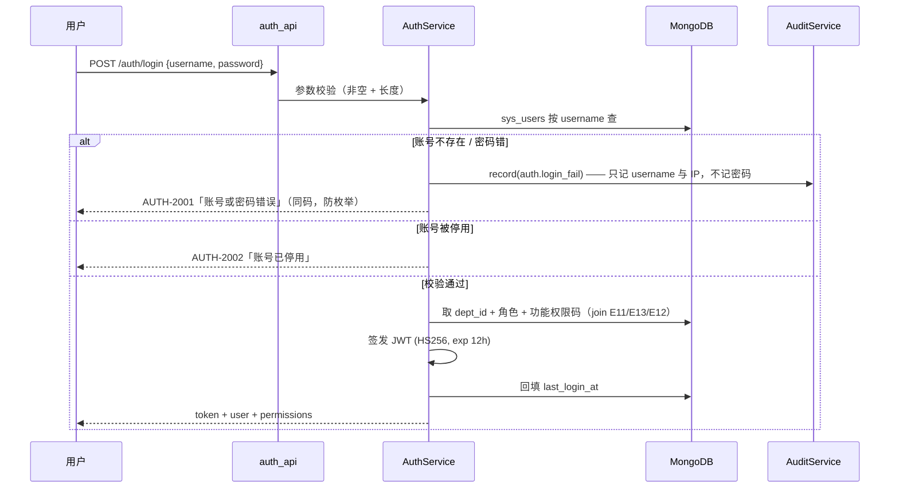
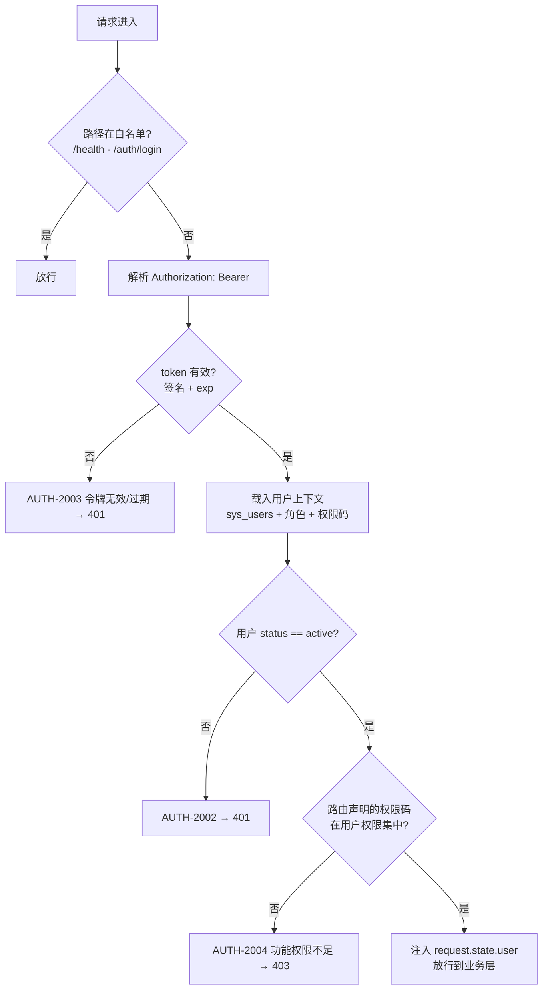

# 01 · 登录与功能权限（RBAC）

> **文档编号**：04_模块Spec / 01
> **所属项目**：knowledge_manager（PRD 2.9）
> **上游依据**：`00_模块划分与边界.md` · `01_数据实体/数据实体设计.md`（E09~E13）· `02_概要设计/概要设计.md`（AD-01）
> **对应原型**：`03_原型图/01_登录页.pen`、`03_原型图/08_角色-功能权限矩阵.pen`
> **状态**：Step 4 产物 · 待评审
> **错误码前缀**：`AUTH`（见总纲 §3）

---

## 1. 模块职责与边界

### 1.1 做什么

| # | 职责 | 对应 PRD |
|---|---|---|
| 1 | **登录**：账号 + 密码（bcrypt 校验）→ 签发 JWT | 2.9.1 |
| 2 | **登录态强制**：除白名单外所有接口经 JWT 中间件校验（ER-08） | 2.9.1「强制校验登录态」 |
| 3 | **当前用户上下文**：`/auth/me` 返回用户 + 部门 + 角色 + **功能权限码列表** | 2.9.1 |
| 4 | **功能权限三级控制**：菜单 / 按钮 / 接口 | 2.9.1「菜单与操作功能权限」 |
| 5 | **功能权限定义维护**（E12）与**角色-功能权限分配**（E13） | 2.9.1、2.9.2 |
| 6 | **角色-功能权限矩阵页**（只读渲染 + 系统管理员可编辑） | 2.9.2 |

### 1.2 不做什么（明确排除，避免与别的模块抢职责）

| 不做 | 归属 |
|---|---|
| 用户 / 角色 / 部门的**增删改查** | **02 组织架构**（E08/E09/E10/E11 的写入者是 02） |
| **数据权限**（能不能读某篇知识）判定 | **05 四维数据权限与鉴权引擎**（ER-03：本项目**最关键的边界**） |
| 用户密码的**自助修改** | 本步不做（见 §8 OQ-01-01） |
| 登录验证码 / 单点登录 / 刷新令牌 | 本步不做（见 §8 OQ-01-02） |
| 菜单的**视觉与布局** | 00 公共基础的前端壳 |

> ⚠️ **两类权限必须分清**（PRD 2.9 的特点，原型 `08` 的关键标注第 1 条）：
> - **功能权限**（本模块，RBAC）：能不能**用某个功能/按钮**
> - **数据权限**（05 模块，四维）：能不能**读某篇具体知识**
>
> **二者独立判定且必须同时通过**。有 `doc:read` 功能权限 ≠ 能读某篇文档。
> 例如普通用户有 `qa:use`，但问财务制度时若该文档未授权给他所在部门，答案里就不会出现该文档内容。

### 1.3 归属实体

| 实体 | 集合 | 本模块权限 |
|---|---|---|
| E12 功能权限 | `sys_permissions` | **唯一写入者**（ER-02） |
| E13 角色功能权限 | `sys_role_permissions` | **唯一写入者** |
| E09 用户 | `sys_users` | **只读**（写属 02） |
| E10 角色 | `sys_roles` | **只读**（写属 02） |
| E11 用户角色绑定 | `sys_user_roles` | **只读**（写属 02） |

### 1.4 依赖模块

| 方向 | 模块 | 用途 |
|---|---|---|
| 依赖 | 00 公共基础 | 配置、错误注册、统一响应、中间件骨架、Mongo 连接 |
| 依赖 | 02 组织架构 | 读取用户凭据（`password_hash`）、部门、角色 |
| 被依赖 | 全部业务模块 | 经中间件做 JWT 校验与功能权限拦截 |
| 被依赖 | 10 审计日志 | 登录失败、功能权限拒绝需留痕（`auth.denied`） |
| 通知 | 02 组织架构 | 角色/用户角色变更时**主动失效权限缓存**（§4.3） |

---

## 2. 数据契约

### 2.1 E12 · 功能权限 `sys_permissions`

| 字段 | 类型 | 必填 | 说明 |
|---|---|:--:|---|
| `_id` | string | ✔ | 权限编号 `PERM{4位序列}` |
| `code` | string | ✔ | 权限码（如 `doc:toggle`），**全局唯一**，接口注解用它 |
| `name` | string | ✔ | 中文名（矩阵页行标题） |
| `type` | enum | ✔ | `menu` / `button` / `api`（枚举组 `permission_type`，见 ER-10） |
| `parent_id` | string \| null | | 父权限（菜单树用） |
| `menu_path` | string | | 前端路由（`type=menu` 时必填，如 `#/docs`） |
| `sort` | int | ✔ | 排序 |
| `created_at` | long | ✔ | — |

**索引**：唯一 `code`；组合 `type + sort`。

### 2.2 E13 · 角色功能权限 `sys_role_permissions`

| 字段 | 类型 | 必填 | 说明 |
|---|---|:--:|---|
| `_id` | string | ✔ | 编号 |
| `role_id` | string | ✔ | 关联 E10 |
| `permission_id` | string | ✔ | 关联 E12 |
| `granted_by` | string | ✔ | 授权人 |
| `granted_at` | long | ✔ | 授权时间 |

**索引**：唯一 `role_id + permission_id`（防重复授权）；`role_id`。

> ⚠️ **为什么存 `permission_id` 而不是直接存 `code`**：`code` 是可读的业务键但可能被改名；
> 存 `_id` 保证引用稳定，返回给前端时再 join 出 `code`。两者都建索引以兼顾查询性能。

### 2.3 功能权限码字典（**34 个码，精确产出 4 / 16 / 22**）

> **数量对账**：原型 `07_组织架构与系统配置页.pen` 的角色表列出
> `asker=4` / `kb_admin=16` / `sys_admin=22` 个功能权限。
> 本节字典按「公共层 4 + 知识管理员层 12 + 系统管理员层 18 = **34 个码**」设计，
> 使三个角色的权限数**正好是 4 / 16 / 22**，与原型的展示数字严格一致。
> 角色权限数 = 公共层(4) + 本层码数；`sys_admin` **不含**知识管理员层的码（与原型矩阵的「—」一致）。

#### A. 公共层（4 个，三个角色都有）

| code | 名称 | type | 对应原型矩阵行 |
|---|---|---|---|
| `qa:use` | AI 智能问答（提问与流式回答） | api | 行 0 |
| `qa:history` | 历史会话查看（仅本人） | api | 行 1 |
| `perm:check` | 鉴权判定接口 `/perm/check` | api | 行 8 ★ |
| `qa:feedback` | 答案反馈（点赞 / 点踩） | button | （PRD 预留，见 E15 `feedback`） |

#### B. 知识管理员层（12 个，`kb_admin` 独有）

| code | 名称 | type | 对应原型矩阵行 |
|---|---|---|---|
| `doc:read` | 知识单元台账查看 | menu | 行 2 |
| `doc:upload` | 知识单元上传 / 批量文件夹导入 | button | 行 3 |
| `doc:edit` | 知识单元编辑（标题 / 分类 / 标签） | button | 行 4 |
| `doc:toggle` | 知识单元启用 / 停用 | button | 行 4 |
| `doc:delete` | 知识单元软删除 | button | 行 4 |
| `doc:category` | 分类树维护 | button | 行 5 |
| `doc:chunk` | 切片查看与调整 | api | 行 6 |
| `perm:manage` | 四维数据权限配置 | button | 行 7 ★ |
| `faq:review` | FAQ 挖掘候选审核与发布 | menu | 行 9 |
| `faq:manage` | 已发布 FAQ 管理 / 缓存开关 | button | 行 10 |
| `gap:read` | 知识缺口查看 | menu | 行 11 |
| `gap:convert` | 知识缺口一键转建 | button | 行 11 |

#### C. 系统管理员层（18 个，`sys_admin` 独有）

| code | 名称 | type | 对应原型矩阵行 |
|---|---|---|---|
| `metric:read` | 运营看板与数据大盘 | menu | 行 12 |
| `metric:export` | 看板数据导出 | button | （扩展） |
| `org:manage` | 组织架构管理（部门树） | menu | 行 13 |
| `dept:create` | 新建部门 | button | 行 13 |
| `dept:edit` | 编辑部门 | button | 行 13 |
| `dept:delete` | 删除部门 | button | 行 13 |
| `user:manage` | 用户管理 | menu | 行 13 |
| `user:create` | 新增用户 | button | 行 13 |
| `user:edit` | 编辑用户 | button | 行 13 |
| `user:disable` | 停用 / 启用用户 | button | 行 13 |
| `user:reset_pwd` | 重置密码 | button | 行 13 |
| `role:manage` | 角色管理 | menu | 行 13 |
| `role:grant` | 功能权限分配 | button | 行 14 |
| `model:config` | 模型服务参数配置 | button | 行 15 |
| `system:config` | 系统配置（含阈值参数） | button | 行 15 |
| `system:seed` | 演示数据初始化 / 重建 | button | （扩展，仅演示用） |
| `audit:read` | 审计日志查看 | menu | 行 16 |
| `audit:export` | 审计日志导出 | button | （扩展） |

#### D. 数量对账表（**必须与原型 `07` 的角色表一致**）

| 角色 code | 名称 | 组成 | 权限数 | 原型 `07` 展示 | 原型 `07` 用户数 |
|---|---|---|---|---:|:--:|---:|
| `asker` | 普通用户 / 提问者 | A | **4** | 4 ✔ | 118 |
| `kb_admin` | 知识管理员 | A + B | **16** | 16 ✔ | 6 |
| `sys_admin` | 系统管理员 | A + C | **22** | 22 ✔ | 2 |
| — | 去重合计 | A ∪ B ∪ C | **34** | — | 126 |

> **内置角色**（E10，`is_system=true`，**不可删除**）：
> `asker` 普通用户 / 提问者 · `kb_admin` 知识管理员 · `sys_admin` 系统管理员
> **三类「系统内置角色」不可删除**（PRD 2.9.2 用 `- ` 列表逐条列举，属**封闭集合**）。
>
> ---
>
> ### 裁定 A（2026-09-24，依 PRD）：3 个内置角色 + 放开「业务角色」
>
> 原型 `04` 权限弹窗曾列出第 4 个角色「部门主管」——**PRD 2.9.2 没有它，故不新增内置角色**
> （上表 4/16/22 的对账因此保持不变）。
>
> 但 **PRD 2.9.9 的示例场景**明确要求把《高管薪酬与股权激励细则》授权给「**管理层角色**」——
> 这需要**业务角色**。因此系统区分两类角色：
>
> | 类别 | `is_system` | 能否删除 | 用途 | 功能权限 |
> |---|:--:|:--:|---|---|
> | **系统内置角色**（3 个） | `true` | 不可删 | 绑定**功能权限**（能不能用某功能） | 按 §2.3 D 表（4 / 16 / 22） |
> | **业务角色**（可自定义） | `false` | 无用户绑定时可删 | 仅作**数据权限分组标签**（能不能读某知识） | **默认 0 个**，可由 `sys_admin` 另行授予 |
>
> **为什么这样分（主流做法）**：功能权限是**平台治理**——收敛、内置、可审计；
> 数据权限分组是**业务语义**——发散、随组织变化（「管理层」「外部顾问」「项目组」）。
> 把两者塞进同一张角色表，会逼着管理员「为了给一个业务标签配数据权限，先想清楚它的功能权限」。
> 业务角色的创建与管理见 `02_组织架构管理.md` §3.3。
>
> **对 05 模块的影响**：四维权限的「角色」维度可指向**任意角色**（内置或业务），
> 判定逻辑不变（仍是一句 `user.role_ids ∩ perm.roles ≠ ∅`）。
>
> ⚠️ **`sys_admin` 不含 `doc:*` 与 `faq:*`**——这是原型矩阵里明确画了「—」的边界。
> 系统管理员管平台，知识管理员管知识，**职责不重叠**；若要求超管拥有一切权限，须改矩阵（见 §8 OQ-01-04）。

---

## 3. 接口清单

### 3.1 `POST /api/v1/auth/login` — 登录

| 项 | 内容 |
|---|---|
| 功能权限 | **无**（白名单） |
| 入参 | `{ "username": string, "password": string }` |
| 出参 | `{ "access_token": string, "token_type": "Bearer", "expires_in": 43200, "user": { "user_id", "username", "real_name", "dept_id", "dept_name", "roles": [{"role_id","code","name"}], "permissions": ["qa:use", ...] } }` |

**校验顺序（每一步失败即返回，不泄漏账号是否存在）**：

| 序 | 校验 | 失败码 |
|---|---|---|
| 1 | 参数非空、长度合法 | `AUTH-1001` |
| 2 | 账号存在 | `AUTH-2001`（**与密码错同码**，防账号枚举） |
| 3 | `status == active` | `AUTH-2002` |
| 4 | bcrypt 校验密码 | `AUTH-2001` |
| 5 | 签发 JWT，回填 `last_login_at` | `AUTH-5001` |

### 3.2 `GET /api/v1/auth/me` — 当前用户与权限

| 项 | 内容 |
|---|---|
| 功能权限 | **登录即可**（无需功能权限码，否则前端无法渲染任何菜单） |
| 出参 | 同 login 的 `user` 对象 + `menus`（前端可直接渲染的菜单树） |

> `menus` 的组装口径（**切片实现后固化，与代码一致**）：
> 1. **判定**：用户拥有、且 `sys_permissions.menu_path` **非空**的权限项即为菜单入口。
>    这样 `type` 保持「权限粒度标签」的原义，而「能不能渲染成菜单」由 `menu_path` 一个字段决定。
> 2. **去重**：**按 `path` 去重**，同一路由只出现一次（保留 `sort` 最小者）。
>    因为**一条菜单就是一个前端路由**——`faq:review` 与 `gap:read` 都挂在 `#/sediment`，
>    不去重会让侧边栏把「知识沉淀」渲染两遍（这是切片实现时**实测到的缺陷**）。
> 3. 菜单标签取该入口权限的 `name`；按 `sort` 升序返回。
>
> **前端不做权限判断**（原型 `08` 关键标注第 3 条：「仅隐藏菜单不算权限控制」——真正的拦截在后端接口）。

### 3.3 `GET /api/v1/auth/permissions` — 功能权限定义清单

| 项 | 内容 |
|---|---|
| 功能权限 | `role:manage` |
| 出参 | `{ "items": [ { "permission_id", "code", "name", "type", "parent_id", "menu_path", "sort" } ] }` |
| 用途 | 矩阵页（原型 `08`）的行标题与分组渲染 |

### 3.4 `GET /api/v1/org/roles/{role_id}/permissions` — 角色已有权限

| 项 | 内容 |
|---|---|
| 功能权限 | `role:manage` |
| 出参 | `{ "role_id", "permission_ids": [...], "codes": [...] }` |
| **归属说明** | 路径在 `/org/*` 分区下，但 **E13 的唯一写入者是本模块**（总纲 §5）。<br>02 模块的角色 CRUD **不得**触碰 `sys_role_permissions` |

### 3.5 `PUT /api/v1/org/roles/{role_id}/permissions` — 分配功能权限

| 项 | 内容 |
|---|---|
| 功能权限 | `role:grant` |
| 入参 | `{ "permission_ids": [...], "reason": string }` |
| 出参 | `{ "role_id", "added": [...], "removed": [...], "version": int }` |

**服务端规则**：

| 规则 | 说明 |
|---|---|
| R-01 | 内置角色的 `code` 不可改；`is_system=true` 的角色**不可删除**（删除接口在 02，本模块只保证权限不被清空到非法态） |
| R-02 | `reason` **必填**（≥ 5 字）；无变更时返回 `AUTH-3001` 且不写审计 |
| R-03 | 变更以**差集**方式落库（`$addToSet` / `$pull`），不做全量删除重建——避免瞬时权限真空 |
| R-04 | 写 E21 审计（`action=role.grant`，带 `before`/`after`）——经 `AuditService`（ER-05） |
| R-05 | 变更成功后**失效该角色的权限缓存**（§4.3） |
| R-06 | **不允许把 `sys_admin` 的 `role:grant` 移除**（防把自己锁死）；违反返回 `AUTH-3002` |

### 3.6 接口一览

| 方法 | 路径 | 功能权限 | 说明 |
|---|---|---|---|
| POST | `/api/v1/auth/login` | — | 登录换 JWT |
| GET | `/api/v1/auth/me` | 登录即可 | 当前用户 + 菜单 + 权限码 |
| GET | `/api/v1/auth/permissions` | `role:manage` | 权限定义清单 |
| GET | `/api/v1/org/roles/{role_id}/permissions` | `role:manage` | 角色已有权限 |
| PUT | `/api/v1/org/roles/{role_id}/permissions` | `role:grant` | 分配功能权限 |

---

## 4. 关键流程

### 4.1 登录



**JWT 载荷（明确决策：只放身份，不放权限）**

```json
{ "sub": "U000012", "jti": "…", "iat": 1790000000, "exp": 1790043200, "iss": "knowledge_manager" }
```

| 为什么**不把角色/权限写进 JWT** | 说明 |
|---|---|
| 权限变更要即时生效 | 若写进 token，管理员改了角色后，用户必须**重新登录**才生效，与项目「权限即时生效」的主张矛盾 |
| 权限项会增删 | 新增权限码后老 token 里没有，会出现"新功能所有人都没权限"的假故障 |
| 代价 | 每请求需解析权限 → 用 **60 秒 TTL 的进程内缓存**（§4.3）抵消 |

### 4.2 请求鉴权链（每请求都走）



**三级功能权限的落地方式**

| 级别 | 实现位置 | 说明 |
|---|---|---|
| **菜单级** | `/auth/me` 的 `menus` | 前端按返回渲染，**不做本地判断** |
| **按钮级** | `/auth/me` 的 `permissions` | 前端 `has('doc:toggle')` 决定按钮显隐 |
| **接口级** | 中间件 + 路由注解 | **唯一真实拦截点**（前端隐藏只是体验） |

```python
# 路由声明示例（00 模块提供装饰器，本模块提供校验）
@router.put("/docs/{doc_id}/toggle")
@require_perm("doc:toggle")          # ← 中间件据此比对用户权限集
async def toggle_doc(...): ...
```

### 4.3 权限缓存与失效（配合 §4.1 的决策）

```python
class PermissionCache:
    """进程内 TTL 缓存：user_id -> (roles, permission_codes, expire_at)"""
    _ttl = 60          # 秒
    # 失效触发点（由 02 模块在写操作后调用 invalidate_*）：
    #   - 用户角色变更      → invalidate_user(user_id)
    #   - 角色权限变更      → invalidate_role(role_id)  ← 本模块 §3.5 R-05 调用
    #   - 用户停用/调岗      → invalidate_user(user_id)
    #   - 部门调整（影响数据权限，不影响功能权限，但一并失效更简单）
```

> **为什么不直接每次查库**：一次问答请求会触发多次权限判定（功能权限 1 次 + 数据权限 N 次），
> 每次查库会把延迟堆起来。60 秒 TTL + 主动失效，兼顾正确性与性能。
> **副作用与兜底**：最坏情况下权限变更最多 **60 秒**后才对"未触发失效的路径"生效；但主要变更路径（§3.5、02 模块）都会**主动失效**，因此实际是即时的。

---

## 5. 错误码表（前缀 `AUTH`）

| 错误码 | HTTP | 消息 | 触发条件 |
|---|---|---|---|
| `AUTH-1001` | 400 | 账号或密码格式不合法 | 入参缺失 / 超长 / 含非法字符 |
| `AUTH-1002` | 400 | 授权参数不合法 | `permission_ids` 非数组 / 含不存在的权限 ID |
| `AUTH-1003` | 400 | 变更原因必填且不少于 5 字 | §3.5 R-02 |
| `AUTH-2001` | 401 | 账号或密码错误 | 账号不存在**或**密码错误（**故意同码**，防账号枚举） |
| `AUTH-2002` | 401 | 账号已停用 | `sys_users.status == disabled`（登录与每请求都校验） |
| `AUTH-2003` | 401 | 登录态无效或已过期 | JWT 缺失 / 签名错 / `exp` 过期 / `jti` 已登出 |
| `AUTH-2004` | 403 | 功能权限不足 | 用户权限集不含路由声明的权限码 |
| `AUTH-2005` | 403 | 不允许移除系统管理员的权限分配权 | §3.5 R-06（防自锁） |
| `AUTH-3001` | 409 | 权限未发生变化 | 提交的 `permission_ids` 与现状一致 |
| `AUTH-3002` | 409 | 该操作会使系统管理员失去授权能力 | 同 R-06，按冲突语义返回 |
| `AUTH-3003` | 404 | 角色不存在 | `role_id` 无对应 E10（E10 属 02，此处只读校验） |
| `AUTH-3004` | 404 | 权限项不存在 | `permission_id` 无对应 E12 |
| `AUTH-4001` | 500 | 权限数据读取失败 | 查 E12/E13 时 Mongo 异常 |
| `AUTH-5001` | 500 | 令牌签发失败 | JWT 密钥缺失或签名异常 |

> **码段约定**（总纲 §3）：`1xxx` 参数 · `2xxx` 鉴权 · `3xxx` 资源/状态 · `4xxx` 依赖 · `5xxx` 内部。

---

## 6. 验收标准

| 编号 | 验收项 | 判定方式 |
|---|---|---|
| **AC-01-01** | 正确账号密码登录返回 JWT；错误密码返回 `AUTH-2001` | 接口测试 |
| **AC-01-02** | 账号不存在与密码错误**返回同一个错误码** | 对比两次响应 |
| **AC-01-03** | 停用账号无法登录（`AUTH-2002`），且**已签发的旧 token 也立即失效** | 先登录→停用→再请求，应 401 |
| **AC-01-04** | 除 `/health`、`/auth/login` 外，无 token 请求一律 401（`AUTH-2003`） | 遍历路由表逐一验证（**PRD「强制校验登录态」**） |
| **AC-01-05** | 普通用户调 `doc:toggle` 接口返回 403（`AUTH-2004`） | 用 `asker` 角色请求停用文档 |
| **AC-01-06** | 前端菜单按 `/auth/me` 的 `menus` 渲染，**不出现无权限菜单** | 三角色分别登录对比 |
| **AC-01-07** | 矩阵页（原型 `08`）渲染出 34 个权限码 × 3 内置角色，且三角色权限数为 4 / 16 / 22，勾选状态与 E13 一致 | 页面比对 |
| **AC-01-08** | 修改角色权限后，该角色用户**无需重新登录**即可生效（≤ 60 秒，主动失效路径下立即） | 改权限→立即请求→观察 |
| **AC-01-09** | 移除 `sys_admin` 的 `role:grant` 被拒绝（`AUTH-2005`） | 构造请求 |
| **AC-01-10** | 权限变更写入 `audit_logs`（`action=role.grant`，含 `before`/`after`） | 查 `audit_logs` |
| **AC-01-11** | 密码以 bcrypt 存储，任何接口**都不回显** `password_hash` | 检查 `/auth/me` 与用户列表响应 |
| **AC-01-12** | 登录失败写审计，且**不记录密码明文** | 查 `audit_logs` |

---

## 7. 依赖与前置

| 依赖 | 内容 | 缺失/异常时的降级 |
|---|---|---|
| 00 公共基础 | 配置、错误注册、统一响应、Mongo 连接、`@require_perm` 装饰器 | 无法启动（硬依赖） |
| 02 组织架构 | 用户凭据与 `status`、部门、角色、用户角色绑定 | 无法登录（硬依赖） |
| `PyJWT` 2.14.0 | JWT 签发与校验 | 无法登录（硬依赖，已在 venv 验证） |
| `passlib[bcrypt]` 1.7.4 | 密码哈希 | 无法登录（硬依赖，已在 venv 验证） |
| 10 审计日志 | 登录失败与授权变更留痕 | **降级**：审计写失败只记 ERROR 日志，**不阻断**登录与授权 |

**前置**：内置 3 个角色 + 34 个权限码 + 至少 1 个 `sys_admin` 账号必须由**初始化脚本**写入
（`scripts/seed.py`，供 02 模块与演示数据重建使用）。

---

## 8. 开放问题

| 编号 | 问题 | 现状 | 影响 |
|---|---|---|---|
| **OQ-01-01** | 是否提供用户**自助改密**？ | 本步**不做** | 演示需换密时只能由管理员改（02 模块） |
| **OQ-01-02** | 是否需要**刷新令牌 / 单点登录**？ | 本步**不做**，只发 access token（12h） | 长会话演示可能中途过期 |
| **OQ-01-03** | 权限码是否需支持**自定义新增**（`sys_admin` 在界面加码）？ | 本步**只读**（`/auth/permissions` 仅供渲染），新增走初始化脚本 | 灵活性 vs 复杂度 |
| **OQ-01-04** | 矩阵中「知识管理员能否看运营看板」的边界（原型 `08` 标注第 6 条） | 当前 **`kb_admin` 无 `metric:read`** | 属 **G-11**，需老师确认 |
| **OQ-01-05** | 登录是否需要**失败次数锁定**？ | 本步**不做** | 演示环境无此诉求 |

**承接的上游悬空点**：G-11（四维权限变更需强制填写原因 → 本模块 §3.5 R-02 已按「需要」实现）。
