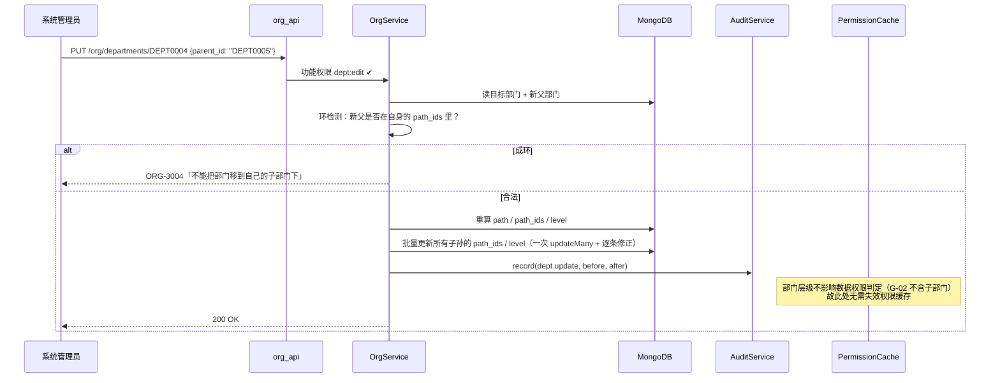
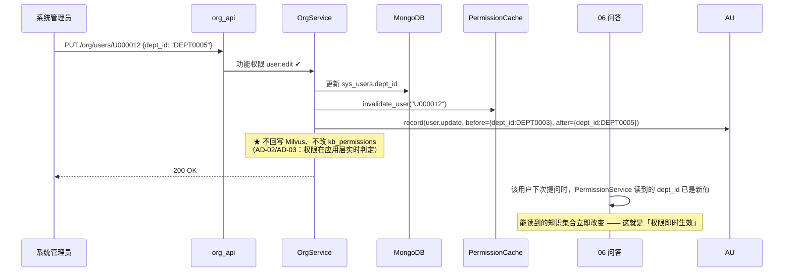

# 02 · 组织架构管理

> **文档编号**：04_模块Spec / 02
> **所属项目**：knowledge_manager（PRD 2.9）
> **上游依据**：`00_模块划分与边界.md` · `01_数据实体/数据实体设计.md`（E08~E11）· `02_概要设计/概要设计.md`
> **对应原型**：`03_原型图/07_组织架构与系统配置页.pen`（部门树 / 用户账号 / 角色与功能权限 / 模型服务参数）
> **状态**：Step 4 产物 · 待评审
> **错误码前缀**：`ORG`（见总纲 §3）

---

## 1. 模块职责与边界

### 1.1 做什么

| # | 职责 | 对应 PRD |
|---|---|---|
| 1 | **部门树维护**：新建 / 编辑 / 删除 / 排序，物化路径 `path[]` | 2.9.1「用户、角色、部门」 |
| 2 | **用户账号管理**：新增 / 编辑 / 停用启用 / 重置密码 | 2.9.1 |
| 3 | **用户-角色绑定**（多对多，E11） | 2.9.1、2.9.2 |
| 4 | **角色管理**：内置三角色的查看与编辑；`is_system` 保护 | 2.9.2 |
| 5 | **组织结构变更对数据权限的连带影响**（调岗后权限即时变化） | 2.9.4（配合 05） |
| 6 | 组织架构相关**审计留痕**（经 `AuditService`） | 2.9.8 |

### 1.2 不做什么

| 不做 | 归属 |
|---|---|
| **功能权限的定义与分配**（E12 / E13） | **01 登录与功能权限**（角色页上的「配置功能权限」按钮跳 01 的接口） |
| **数据权限**（某篇知识给哪些部门/角色/人看） | **05 四维数据权限与鉴权引擎** |
| 部门树在**鉴权时是否含子部门**的判定 | **05**（本模块只维护树结构；语义见 §1.4 G-02） |
| 登录、令牌签发 | 01 |
| 模型服务参数配置（原型 `07` 的 `mdT` 区块） | ✅ **已裁定：归 00 公共基础**，落 **E22 `system_config`**（集合 + `ConfigService`）。<br>接口 `GET/PUT /api/v1/system/config`，功能权限 `model:config` / `system:config`（01 模块）。<br>本模块只负责**把它渲染在系统配置页上**，不持有写入逻辑（E22 的唯一写入者是 00） |
| 部门/用户/角色的**批量导入** | 本步不做（见 §8 OQ-02-02） |

### 1.3 归属实体

| 实体 | 集合 | 本模块权限 |
|---|---|---|
| E08 部门 | `sys_departments` | **唯一写入者**（ER-02） |
| E09 用户 | `sys_users` | **唯一写入者** |
| E10 角色 | `sys_roles` | **唯一写入者** |
| E11 用户角色绑定 | `sys_user_roles` | **唯一写入者** |
| E12 功能权限 | `sys_permissions` | **只读**（写属 01） |
| E13 角色功能权限 | `sys_role_permissions` | **只读**（写属 01） |

### 1.4 关键语义：部门授权**不含子部门**（G-02，已确认）

PRD 悬空点 **G-02** 已裁定：**不含子部门，精确匹配**。

| 场景 | 结果 |
|---|---|
| 文档授权给「财务部」，用户属「财务部」 | ✅ 可读 |
| 文档授权给「财务部」，用户属「财务部/报销组」 | ❌ **不可读**（不带子部门） |
| 文档授权给「财务部」，用户属「总部」 | ❌ 不可读 |

> **本模块的职责**：保证 `sys_departments` 的**层级关系正确且可查询**，
> 并提供 `OrgService.get_dept(dept_id)` 给 05 模块做**精确匹配**。
> **本模块不实现任何 allow/deny 判定**（ER-03：判定只有 05 一份实现）。

**连带影响（重要）**：用户调岗后，其能读的知识**立即改变**——
因为 05 的判定读的是 `sys_users.dept_id` 的**当前值**。

| 变更 | 对数据权限的影响 | 是否需回写切片 |
|---|---|---|
| 用户调岗（`dept_id` 变） | 立即生效（判定读当前值） | **否** |
| 部门改名 | 无影响（判定用 ID） | 否 |
| 部门层级调整（改 `parent_id`） | **无影响**（因为不含子部门，只看 `dept_id` 本身） | 否 |
| 删除部门 | 必须先清空其下用户，否则拒绝（§3.1） | 否 |

### 1.5 依赖模块

| 方向 | 模块 | 用途 |
|---|---|---|
| 依赖 | 00 公共基础 | 配置、错误、统一响应、Mongo 连接 |
| 依赖 | 01 登录与功能权限 | 功能权限码校验；**用户停用/调岗后主动失效权限缓存**（`PermissionCache.invalidate_user`） |
| 依赖 | 10 审计日志 | 经 `AuditService.record()` 留痕（ER-05） |
| 被依赖 | 01 | 登录时读用户凭据、部门、角色 |
| 被依赖 | 05 | 鉴权时读部门与用户角色 |
| 被依赖 | 06 / 09 | 问答与看板的部门维度统计 |

---

## 2. 数据契约

### 2.1 E08 · 部门 `sys_departments`

| 字段 | 类型 | 必填 | 说明 |
|---|---|:--:|---|
| `_id` | string | ✔ | 部门编号 `DEPT{4位序列}` |
| `name` | string | ✔ | 部门名（**同级唯一**） |
| `parent_id` | string \| null | | 父部门；`null` 为根 |
| `path` | array | ✔ | 物化路径 `["总部","财务部","报销组"]`（含自身名） |
| `path_ids` | array | ✔ | 物化路径 ID `["DEPT0001","DEPT0003","DEPT0004"]`，**排序与过滤用** |
| `level` | int | ✔ | 层级，根为 0 |
| `sort` | int | ✔ | 同级排序 |
| `status` | enum | ✔ | `active` / `disabled`（枚举组 `dept_status`） |
| `leader_user_id` | string | | 部门负责人（展示用） |
| `created_at` / `updated_at` | long | ✔ | — |

**索引**：唯一组合 `parent_id + name`（同级不重名，`parent_id` 为 `null` 时用哨兵值 `"__root__"` 以便建索引）；`path_ids`；`status + sort`。

> **`path_ids` 的用途与 G-02 不矛盾**：G-02 说的是**数据权限判定**不含子部门；
> `path_ids` 只用于**组织架构页的子树展示与筛选**（如"看技术部及下设组的用户"）。
> 二者语义不同，**不得混用**（见 §5 的 `ORG-1004` 防误用说明）。

### 2.2 E09 · 用户 `sys_users`

| 字段 | 类型 | 必填 | 说明 |
|---|---|:--:|---|
| `_id` | string | ✔ | 用户编号 `U{6位序列}` |
| `username` | string | ✔ | 登录账号，**全局唯一**，`^[a-zA-Z][a-zA-Z0-9_]{2,31}$` |
| `password_hash` | string | ✔ | **bcrypt**（`passlib`）；**任何接口都不回显** |
| `real_name` | string | ✔ | 姓名（原型 `07` 的「姓名」列） |
| `dept_id` | string | ✔ | 所属部门，关联 E08 |
| `phone` | string | | 手机号（**列表脱敏回显** `138****5678`） |
| `email` | string | | 邮箱 |
| `status` | enum | ✔ | `active` / `disabled`（枚举组 `user_status`） |
| `last_login_at` | long | | 最后登录（原型 `07` 的「最后登录」列） |
| `created_by` / `created_at` / `updated_at` | — | ✔ | — |

**索引**：唯一 `username`；`dept_id + status`；`real_name` 文本索引（原型 `07` 的搜索框「搜索姓名/账号」）。

### 2.3 E10 · 角色 `sys_roles`

| 字段 | 类型 | 必填 | 说明 |
|---|---|:--:|---|
| `_id` | string | ✔ | 角色编号 `ROLE{4位序列}` |
| `code` | string | ✔ | 角色编码（`asker` / `kb_admin` / `sys_admin`），**唯一** |
| `name` | string | ✔ | 角色名称（原型 `07` 的「角色名称」列） |
| `is_system` | bool | ✔ | **内置角色不可删除**（原型 `07` 标注第 2 条） |
| `description` | string | | 说明（原型 `07` 的「说明」列） |
| `created_at` | long | ✔ | — |

**索引**：唯一 `code`。

**内置三角色（初始化脚本写入，`is_system=true`）**

| code | name | description（对齐原型 `07` 原文） | 功能权限数 |
|---|---|---|:--:|
| `asker` | 普通用户 / 提问者 | AI 问答、历史会话 | **4** |
| `kb_admin` | 知识管理员 | 文档增删改、切片调整、四维权限配置、FAQ 审核、缺口处理 | **16** |
| `sys_admin` | 系统管理员 | 组织架构、角色、功能权限、看板、模型参数 | **22** |

> 权限数与 `sys_permissions` 字典的对应关系见 `01_登录与功能权限（RBAC）.md` §2.3 D 表。
> **注意**：`sys_admin` **不含** `doc:*` / `faq:*`（矩阵里是「—」）。

### 2.4 E11 · 用户角色绑定 `sys_user_roles`

| 字段 | 类型 | 必填 | 说明 |
|---|---|:--:|---|
| `_id` | string | ✔ | 编号 |
| `user_id` | string | ✔ | 关联 E09 |
| `role_id` | string | ✔ | 关联 E10 |
| `granted_by` / `granted_at` | — | ✔ | 授权留痕 |

**索引**：**唯一 `user_id + role_id`**（防重复绑定）；`role_id`（原型 `07` 的「用户数」列靠它统计）。

---

## 3. 接口清单

> **统一说明**：所有写操作都要 ① 功能权限校验（01）② 写审计（10，经 `AuditService`）。
> 审计失败**不阻断**业务，只记 ERROR 日志（见 §7 降级）。

### 3.1 部门

#### `GET /api/v1/org/departments` — 部门树

| 项 | 内容 |
|---|---|
| 功能权限 | `org:manage` |
| 入参 | `?with_user_count=true`（默认 true） |
| 出参 | 树形 `{ "items": [ { "dept_id", "name", "parent_id", "path", "level", "sort", "status", "user_count", "children": [...] } ] }` |
| 说明 | 原型 `07` 的「部门树」区块；`user_count` 用于删除前提示 |

#### `POST /api/v1/org/departments` — 新建部门

| 项 | 内容 |
|---|---|
| 功能权限 | `dept:create` |
| 入参 | `{ "name", "parent_id" \| null, "sort"?, "leader_user_id"? }` |
| 出参 | `{ "dept_id" }` |

**服务端规则**

| 规则 | 失败码 |
|---|---|
| 同级不重名（同 `parent_id` 下） | `ORG-3001` |
| `parent_id` 必须存在且 `status=active` | `ORG-3002` |
| 层级上限 **5 层**（`level <= 4`） | `ORG-3003` |
| 成功 → 计算 `path` / `path_ids` / `level`；写审计 `dept.create` | — |

#### `PUT /api/v1/org/departments/{dept_id}` — 编辑部门

| 项 | 内容 |
|---|---|
| 功能权限 | `dept:edit` |
| 入参 | `{ "name"?, "parent_id"?, "sort"?, "leader_user_id"?, "status"? }` |
| 出参 | `{ "dept_id", "changed": {...} }` |

**服务端规则**

| 规则 | 失败码 |
|---|---|
| 改名 → 同级不重名 | `ORG-3001` |
| **改 `parent_id` 时禁止移到自己的子孙节点下**（环） | `ORG-3004` |
| 改 `parent_id` → **级联重算所有子孙的 `path` / `path_ids` / `level`**（一次批量更新） | `ORG-4001`（批量失败） |
| 停用部门时若仍有 `active` 用户 | `ORG-3005` |
| 写审计 `dept.update`（带 `before`/`after`） | — |

#### `DELETE /api/v1/org/departments/{dept_id}` — 删除部门

| 项 | 内容 |
|---|---|
| 功能权限 | `dept:delete` |
| 出参 | `{ "deleted": true }` |

**服务端规则（前置校验，任一不满足即拒）**

| 规则 | 失败码 |
|---|---|
| 无子部门 | `ORG-3006` |
| 无用户（含 `disabled` 用户） | `ORG-3007` |
| 未被任何 `kb_permissions.departments` 引用（**引用存在时拒绝**，避免权限表出现悬空部门 ID） | `ORG-3008` |
| 写审计 `dept.delete` | — |

### 3.2 用户

#### `GET /api/v1/org/users` — 用户列表

| 项 | 内容 |
|---|---|
| 功能权限 | `user:manage` |
| 入参 | `?keyword=&dept_id=&status=&page=&page_size=` |
| 出参 | 分页 `{ items: [ { user_id, username, real_name, dept_id, dept_name, roles:[{role_id,code,name}], status, last_login_at } ], total, page, page_size }` |
| 说明 | 对应原型 `07` 的「用户账号」表 7 列；`keyword` 同时匹配 `real_name` 与 `username` |
| 脱敏 | `phone` / `email` 不在列表返回 |

#### `POST /api/v1/org/users` — 新增用户

| 项 | 内容 |
|---|---|
| 功能权限 | `user:create` |
| 入参 | `{ "username", "password", "real_name", "dept_id", "role_ids": [...], "phone"?, "email"? }` |
| 出参 | `{ "user_id" }` |

**服务端规则**

| 规则 | 失败码 |
|---|---|
| `username` 唯一（大小写不敏感比较） | `ORG-2001` |
| `password` 长度 ≥ 8 且含字母与数字 | `ORG-1001` |
| `dept_id` 存在且 `active` | `ORG-3002` |
| `role_ids` 均存在 | `ORG-2002` |
| 密码 → bcrypt 哈希后存 `password_hash`；**响应与日志都不含明文** | — |
| 写审计 `user.create`（`after` 中**剔除** `password_hash`） | — |

#### `PUT /api/v1/org/users/{user_id}` — 编辑用户

| 项 | 内容 |
|---|---|
| 功能权限 | `user:edit` |
| 入参 | `{ "real_name"?, "dept_id"?, "phone"?, "email"? }` |
| 出参 | `{ "user_id", "changed": {...} }` |

**服务端规则**

| 规则 | 失败码 |
|---|---|
| 改 `dept_id` → 校验存在且 `active`；**成功后调 `PermissionCache.invalidate_user()`** | `ORG-3002` |
| `username` **不可修改**（登录凭据，改了会破坏审计可追溯性） | `ORG-1002` |
| 写审计 `user.update` | — |

#### `POST /api/v1/org/users/{user_id}/status` — 停用 / 启用

| 项 | 内容 |
|---|---|
| 功能权限 | `user:disable` |
| 入参 | `{ "status": "active" \| "disabled", "reason"?: string }` |
| 出参 | `{ "user_id", "status" }` |

**服务端规则**

| 规则 | 失败码 |
|---|---|
| **不允许停用系统内最后一个 `active` 的 `sys_admin` 用户**（防把自己锁死） | `ORG-2003` |
| **不允许停用自己** | `ORG-2004` |
| 停用成功 → `PermissionCache.invalidate_user()` → **该用户已签发 token 立即失效**（01 的 AC-01-03） | — |
| 写审计 `user.disable` / `user.enable` | — |

#### `POST /api/v1/org/users/{user_id}/reset-password` — 重置密码

| 项 | 内容 |
|---|---|
| 功能权限 | `user:reset_pwd` |
| 入参 | `{ "new_password": string }` |
| 出参 | `{ "user_id", "reset": true }` |

**服务端规则**

| 规则 | 失败码 |
|---|---|
| 密码强度同 §3.2 新增 | `ORG-1001` |
| 重置后 → `PermissionCache.invalidate_user()`（强制重新登录） | — |
| 写审计 `user.reset_pwd`（**不含任何密码信息**） | — |

#### `PUT /api/v1/org/users/{user_id}/roles` — 绑定角色

| 项 | 内容 |
|---|---|
| 功能权限 | `user:manage` |
| 入参 | `{ "role_ids": [...], "reason": string }` |
| 出参 | `{ "user_id", "added": [...], "removed": [...], "version": int }` |

**服务端规则**

| 规则 | 失败码 |
|---|---|
| `role_ids` 均存在 | `ORG-2002` |
| 至少保留 **1 个角色**（不允许无角色用户） | `ORG-2005` |
| `reason` 必填 ≥ 5 字 | `ORG-1003` |
| 差集方式落库（`$addToSet` / `$pull`），不做全量重建 | — |
| 成功 → `PermissionCache.invalidate_user()` | — |
| 写审计 `user.role_change`（含 `before`/`after`） | — |

### 3.3 角色

#### `GET /api/v1/org/roles` — 角色列表

| 项 | 内容 |
|---|---|
| 功能权限 | `role:manage` |
| 出参 | `{ items: [ { role_id, code, name, is_system, description, permission_count, user_count } ] }` |
| 说明 | 对应原型 `07` 的「角色与功能权限」表 6 列（角色编码 / 角色名称 / 类型 / 功能权限数 / 用户数 / 说明）；`类型` = `is_system ? "内置" : "自定义"` |

#### `POST /api/v1/org/roles` — 新建角色

| 项 | 内容 |
|---|---|
| 功能权限 | `role:manage` |
| **状态** | 开放（裁定 A：业务角色用于数据权限分组，PRD 2.9.9 的「管理层角色」依赖它） |
| 依据 | 原型 `08` 关键标注第 4 条：PRD 只定义三类用户，**不开放自定义角色** |

**服务端规则**

| # | 规则 | 失败码 |
|---|---|---|
| 1 | `code` 唯一（`^[a-z][a-z0-9_]{2,31}$`），且**不得与内置角色的 code 冲突** | `ORG-2006` |
| 2 | 新建角色 `is_system` **恒为 `false`**（内置角色只能由初始化脚本写入） | — |
| 3 | **默认不授予任何功能权限**（业务角色的本职是数据权限分组标签） | — |
| 4 | 新建成功 → 写审计 `role.create` | — |

> **与内置角色的区别**：业务角色**可以删除**（无用户绑定时，见 §3.3 DELETE），
> 内置角色 `is_system=true` 一律不可删（`ORG-2008`）。
> 业务角色若被授予了功能权限，也参与 01 模块的功能权限判定（机制统一），
> 只是**默认不授予**，且**不参与 4/16/22 对账**（对账只针对 3 个内置角色）。
>
> **演示数据建议**：预置一个业务角色 `management`（管理层），用于 PRD 2.9.9 的
> 「《高管薪酬与股权激励细则》授权给人力资源部 + 管理层角色」场景。

#### `PUT /api/v1/org/roles/{role_id}` — 编辑角色

| 项 | 内容 |
|---|---|
| 功能权限 | `role:manage` |
| 入参 | `{ "name"?, "description"? }` |
| 出参 | `{ "role_id", "changed": {...} }` |

**服务端规则**

| 规则 | 失败码 |
|---|---|
| `is_system=true` 的角色 **`code` 不可改**（`name`/`description` 可改） | `ORG-2007` |
| 写审计 `role.update` | — |

#### `DELETE /api/v1/org/roles/{role_id}` — 删除角色

| 项 | 内容 |
|---|---|
| 功能权限 | `role:manage` |
| 出参 | `{ "deleted": true }` |

**服务端规则**

| 规则 | 失败码 |
|---|---|
| `is_system=true` → 拒绝 | `ORG-2008` |
| 仍有用户绑定该角色（`sys_user_roles` 非空） | `ORG-2009` |
| 级联删除 `sys_role_permissions`（**E13 属 01**，须经 `AuthService.revoke_role_permissions()`，**不得直连删除**——ER-02） | `ORG-4002` |
| 写审计 `role.delete` | — |

### 3.4 接口一览

| 方法 | 路径 | 功能权限 |
|---|---|---|
| GET | `/api/v1/org/departments` | `org:manage` |
| POST | `/api/v1/org/departments` | `dept:create` |
| PUT | `/api/v1/org/departments/{dept_id}` | `dept:edit` |
| DELETE | `/api/v1/org/departments/{dept_id}` | `dept:delete` |
| GET | `/api/v1/org/users` | `user:manage` |
| POST | `/api/v1/org/users` | `user:create` |
| PUT | `/api/v1/org/users/{user_id}` | `user:edit` |
| POST | `/api/v1/org/users/{user_id}/status` | `user:disable` |
| POST | `/api/v1/org/users/{user_id}/reset-password` | `user:reset_pwd` |
| PUT | `/api/v1/org/users/{user_id}/roles` | `user:manage` |
| GET | `/api/v1/org/roles` | `role:manage` |
| POST | `/api/v1/org/roles` | `role:manage`（当前禁用） |
| PUT | `/api/v1/org/roles/{role_id}` | `role:manage` |
| DELETE | `/api/v1/org/roles/{role_id}` | `role:manage` |

> `/api/v1/org/roles/{role_id}/permissions` 的 **GET/PUT 由 01 模块实现**（E13 的写入者是 01），
> 只是路径挂在 `/org` 分区下 —— 见总纲 §5 与 `01_..._.md` §3.4/§3.5。

---

## 4. 关键流程

### 4.1 部门树维护（含级联重算）



> **为什么部门调整不需要失效数据权限缓存**：05 的判定用 `user.dept_id` 与 `perm.departments` 做
> **精确匹配**（G-02），与部门层级无关。这是一个容易误判的点，已在 §5 错误码 `ORG-1004` 的处理中注明。

### 4.2 用户调岗 → 数据权限即时变化



### 4.3 停用用户的连带效应

```mermaid
flowchart TD
    A[POST /org/users/{id}/status status=disabled] --> B{是最后一个 active 的 sys_admin?}
    B -->|是| C[ORG-2003 拒绝]
    B -->|否| D{是自己?}
    D -->|是| E[ORG-2004 拒绝]
    D -->|否| F[更新 sys_users.status=disabled]
    F --> G[PermissionCache.invalidate_user]
    G --> H[该用户已签发的 JWT 立即失效]
    H --> I[其所有在途请求下一跳即 401 AUTH-2002]
    F --> J[AuditService.record user.disable]
    J --> K[审计写失败? 只记 ERROR，不阻断]
```

---

## 5. 错误码表（前缀 `ORG`）

| 错误码 | HTTP | 消息 | 触发条件 |
|---|---|---|---|
| `ORG-1001` | 400 | 密码强度不足 | 长度 < 8 或未同时含字母与数字 |
| `ORG-1002` | 400 | 登录账号不可修改 | 提交的 `username` 与现状不同 |
| `ORG-1003` | 400 | 变更原因必填且不少于 5 字 | §3.2 绑定角色 |
| `ORG-1004` | 400 | 不接受子部门参数 | 请求中带了 `include_sub_dept` 之类参数——**数据权限不含子部门（G-02）**，该参数无意义，明确拒绝以防误用 |
| `ORG-2001` | 409 | 登录账号已存在 | `username` 唯一冲突（大小写不敏感） |
| `ORG-2002` | 400 | 角色不存在 | `role_ids` 含无效 ID |
| `ORG-2003` | 409 | 不能停用最后一个系统管理员 | 防自锁 |
| `ORG-2004` | 409 | 不能停用当前登录账号 | — |
| `ORG-2005` | 400 | 用户至少需要保留一个角色 | `role_ids` 为空 |
| `ORG-2006` | 409 | 角色编码已存在或与内置角色冲突 | §3.3 新建业务角色时的 `code` 唯一性校验 |
| `ORG-2007` | 400 | 内置角色的编码不可修改 | `is_system=true` 且 `code` 变更 |
| `ORG-2008` | 403 | 内置角色不可删除 | `is_system=true` |
| `ORG-2009` | 409 | 该角色仍被用户使用 | `sys_user_roles` 非空 |
| `ORG-3001` | 409 | 同级已存在同名部门 | — |
| `ORG-3002` | 404 | 部门不存在或已停用 | `dept_id` / `parent_id` 无效 |
| `ORG-3003` | 400 | 部门层级超出上限（5 层） | 新建/移动导致 `level > 4` |
| `ORG-3004` | 409 | 不能把部门移动到自己的子部门下 | 环检测 |
| `ORG-3005` | 409 | 部门下仍有在用用户 | 停用部门时 |
| `ORG-3006` | 409 | 该部门下仍有子部门 | 删除部门时 |
| `ORG-3007` | 409 | 该部门下仍有用户 | 删除部门时（含 `disabled` 用户） |
| `ORG-3008` | 409 | 该部门被知识权限引用 | `kb_permissions.departments` 中存在该 ID，拒绝删除以免留下悬空引用 |
| `ORG-3009` | 404 | 用户不存在 | **Step 5 开发期补录**：用户类接口（编辑 / 停用 / 重置密码 / 绑定角色）都需要「目标不存在」这一表达，§5 初稿漏了它 |
| `ORG-4001` | 500 | 部门路径级联更新失败 | 批量更新中途异常 → **需人工核对 `path_ids`**，返回受影响部门清单 |
| `ORG-4002` | 500 | 角色权限清理失败 | 经 01 的 `AuthService.revoke_role_permissions()` 失败；**角色不删除**，保证不出现"角色已删但权限残留" |

---

## 6. 验收标准

| 编号 | 验收项 | 判定方式 |
|---|---|---|
| **AC-02-01** | 部门树按 `path` 正确嵌套，原型 `07` 的 6 个部门（总部 / 人力资源部 / 财务部 / 报销组 / 技术部 / 客户服务部）层级与 `path_ids` 一致 | 接口返回比对 |
| **AC-02-02** | 同级重名被拒（`ORG-3001`） | 建两个同名部门 |
| **AC-02-03** | 把「总部」移到「财务部」下被拒（`ORG-3004`） | 构造环 |
| **AC-02-04** | 移动部门后，**所有子孙**的 `path_ids` 与 `level` 都被正确重算 | 移动后遍历子树校验 |
| **AC-02-05** | 删除有子部门 / 有用户 / 被权限引用的部门分别返回 `ORG-3006/3007/3008` | 三种前置分别构造 |
| **AC-02-06** | 新建用户的 `password_hash` 是 bcrypt 串，且**任何接口响应都不含明文密码** | 检查响应体与 `sys_users` 文档 |
| **AC-02-07** | `username` 唯一（`Knowledge` 与 `knowledge` 视为冲突） | 大小写变体创建 |
| **AC-02-08** | 停用用户后，**其已签发的 token 立即失效**（下一请求 401） | 登录→停用→请求 |
| **AC-02-09** | 停用最后一个 `sys_admin` 被拒（`ORG-2003`）；停用自己也被拒（`ORG-2004`） | 构造请求 |
| **AC-02-10** | **用户调岗后，数据权限立即变化且未回写 Milvus** | 调岗→同一问题→可见知识集合变化；对比 `kb_chunks_v2` 无变化 |
| **AC-02-11** | 内置三角色不可删除（`ORG-2008`）；`code` 不可改（`ORG-2007`） | 构造请求 |
| **AC-02-12** | 删除仍被用户使用的角色被拒（`ORG-2009`） | 用 `asker`（原型示例 118 用户）构造 |
| **AC-02-13** | 角色列表返回的 `permission_count` 为 **4 / 16 / 22**，与原型 `07` 一致 | 接口比对原型 |
| **AC-02-14** | 用户列表的 `roles` 列与原型 `07` 的「角色」列语义一致；列表**不返回手机号/邮箱明文** | 接口检查 |
| **AC-02-15** | 所有写操作（部门/用户/角色）都产生 `audit_logs` 记录，且 `before`/`after` 不含密码 | 查 `audit_logs` |
| **AC-02-16** | 审计服务不可用时，业务写操作**仍然成功**（降级不阻断） | 停掉审计写入模拟 |

---

## 7. 依赖与前置

| 依赖 | 内容 | 缺失/异常时的降级 |
|---|---|---|
| 00 公共基础 | 配置、错误、统一响应、Mongo 连接 | 无法启动（硬依赖） |
| 01 登录与功能权限 | 权限码校验；`PermissionCache` 失效接口；`AuthService.revoke_role_permissions()` | 权限缓存失效失败 → **降级**：退化为 60 秒 TTL 自然过期，记 WARN |
| 10 审计日志 | `AuditService.record()` | **降级**：审计失败只记 ERROR，**不阻断**业务（与 01 的登录审计一致） |
| `passlib[bcrypt]` | 密码哈希 | 无法新增/重置密码（硬依赖） |
| Mongo `sys_departments` 集合 | 部门树 | 无法启动（硬依赖） |

**前置数据（初始化脚本 `scripts/seed.py`）**：

| 数据 | 内容 |
|---|---|
| 部门 | 总部 / 人力资源部 / 财务部 / 报销组 / 技术部 / 客户服务部 / 市场部 / 总经办（对齐原型 `07`） |
| 角色 | `asker` / `kb_admin` / `sys_admin`（`is_system=true`） |
| 功能权限 | 34 个码（见模块 01 §2.3） |
| 角色-权限 | 按 4 / 16 / 22 绑定 |
| 用户 | 至少 1 个 `sys_admin`；演示账号 `zhangwei`（知识管理员）/ `lina`（系统管理员）/ `wangqiang`（普通用户），对齐原型 `07` |

---

## 8. 开放问题

| 编号 | 问题 | 现状 | 影响 |
|---|---|---|---|
| ~~**OQ-02-01**~~ | ~~模型服务参数区块归哪个模块？~~ | ✅ **已裁定：归 00 公共基础**，新增实体 **E22 `system_config`**（10 字段 + 9 个预置项，已回填 Step 1 §4/§5/§8/§11）。接口 `GET/PUT /api/v1/system/config`；三处阈值（G-03/G-04/G-06）在此落地，改口径不用改代码 | — |
| **OQ-02-02** | 是否需要部门 / 用户的**批量导入（Excel）**？ | 本步**不做** | 演示需手工建；若老师要求需加接口 |
| ~~**OQ-02-03**~~ | ~~是否开放自定义角色？~~ | ✅ **已裁定：开放「业务角色」**（`is_system=false`，用于数据权限分组，默认无功能权限）。3 个**系统内置角色**仍不可删除、不可改 `code`。见 §3.3 与 `01_..._.md` §2.3 裁定 A | — |
| **OQ-02-04** | 用户是否需要**多部门**（主部门 + 兼职部门）？ | 本步**单部门**（`dept_id` 单值） | 若要多部门，`kb_permissions` 的 OR 判定需同步改 |
| **OQ-02-05** | 删除部门时被 `kb_permissions` 引用 → 拒绝（`ORG-3008`）；是否也可选择「同时清理权限引用」？ | 当前**只拒绝**，不自动清理 | 更安全但操作更繁琐 |

**承接的上游悬空点**：

| 编号 | 内容 | 本模块处理 |
|---|---|---|
| **G-02** | 部门授权是否含子部门 | **不含（精确匹配）** 已落地：§1.4 明确语义，§5 `ORG-1004` 明确拒绝子部门参数，判定实现放 05 |
| **G-11** | 四维权限变更是否强制填写原因 | 本模块的**角色绑定变更**同样要求 `reason`（§3.2），与 01/05 保持一致 |
