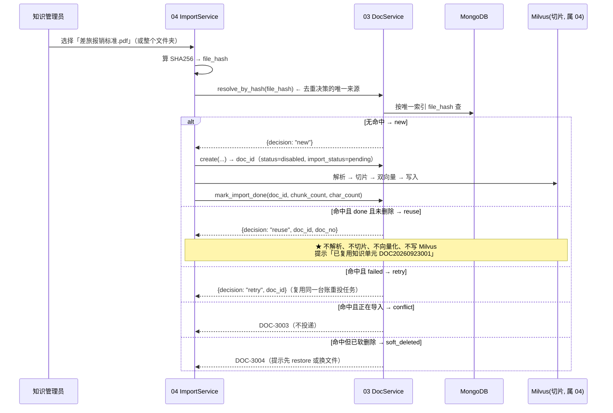
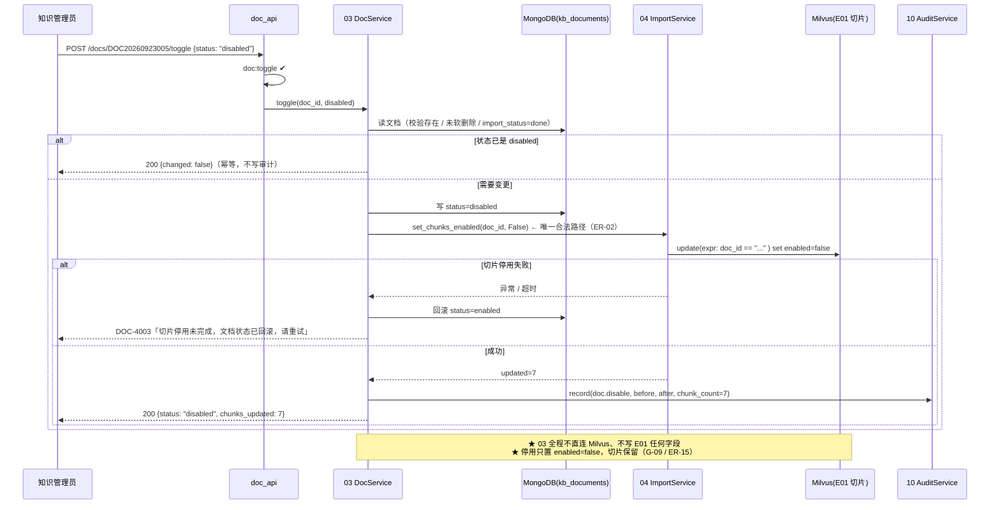
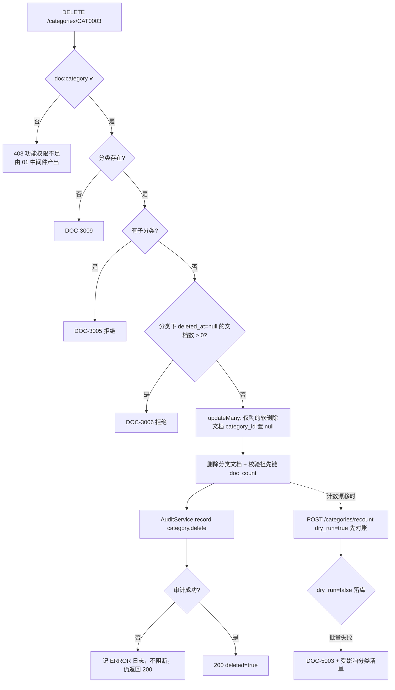

# 03 · 知识单元与分类管理

> **文档编号**：04_模块Spec / 03
> **所属项目**：knowledge_manager（PRD 2.9）
> **上游依据**：`00_模块划分与边界.md` · `01_数据实体/数据实体设计.md`（E04 / E05）· `02_概要设计/概要设计.md`（§4.3 关键索引 / §5 接口总览 / AD-03 / AD-05）
> **对应原型**：`03_原型图/02_知识维护与导入中心.pen`（左「知识分类」树 / 顶部 4 个筛选器 / 「知识单元台账」9 列表 / `dlCount` 汇总 / 分页 / 关键需求标注 1~6）
> **状态**：Step 4 产物 · 待评审
> **错误码前缀**：`DOC`（见总纲 §3）

---

## 1. 模块职责与边界

### 1.1 做什么

| # | 职责 | 对应 PRD / 原型 |
|---|---|---|
| 1 | **知识单元台账列表**：按分类 / 状态 / 权限标签筛选 + 关键词搜索 + 分页；9 列严格对齐原型（编号、标题、格式、分类、权限标签、切片数、状态、更新时间、操作） | 2.9.3；原型 `docTblH0T~H8T` |
| 2 | **详情与编辑**：改标题（原型「编辑」）、改所属分类、改自定义标签 | 2.9.3 |
| 3 | **启用 / 停用**（`status`）；停用时连带停用其切片 | 2.9.1「知识单元生命周期管理」；原型操作列「停用 / 启用」 |
| 4 | **软删除**（`deleted_at`）与**恢复**；物理清理不在本模块（ER-15） | 2.9.1 |
| 5 | **按 `file_hash`（SHA256）去重**：同哈希重复上传**复用已有知识单元、不重复解析**（幂等） | 原型标注第 4 条；概要设计 §6「幂等」 |
| 6 | **分类树维护**：新建 / 编辑（改名 / 移动 / 排序）/ 删除；`path[]` 物化路径；同级唯一；删除前置校验 | 原型「知识分类」+「＋ 新建分类」 |
| 7 | **权限标签（`permission_summary`）的落库与刷新**：供台账展示，**仅展示** | 原型标注第 2 / 3 条 |
| 8 | **分类文档计数（`doc_count`）维护**：含子分类口径，使原型「公司制度（46）」等数字自洽 | 原型 `c2T~c6T` |
| 9 | 台账与分类相关**审计留痕**（经 10 模块的 `AuditService`，ER-05） | 2.9.8 |

### 1.2 不做什么（明确列出归属别的模块的事）

| 不做 | 归属 |
|---|---|
| **上传、解析、切片、双向量、写 Milvus**（原型「上传文档」「批量导入 / 文件夹」「开始导入」） | **04 文档导入与向量化**（E01 切片、E03 文件对象、E06 导入任务的唯一写入者） |
| **切片查看与调整**（权限码 `doc:chunk` 由 04 的路由声明，本模块不使用该码）；**导入任务进度与阶段展示**（原型「导入队列」「阶段顺序」） | 04（本模块对 E06 **只读**，仅判断台账行是否导入中） |
| **四维数据权限的读写**（原型操作列「权限」按钮 → `04_四维数据权限配置弹窗.pen`） | **05 四维数据权限与鉴权引擎**（E07 的唯一写入者） |
| **任何数据权限判定**（`allow = is_global or ...` 这份逻辑在本项目**只有一份实现**） | **05**（ER-03）——本模块**一行判定代码都不写** |
| **鉴权过滤与受限提示** | 05 + 06 |
| **功能权限校验的实现** | 01（本模块只在路由上声明权限码，拦截由 01 中间件完成，ER-08 / ER-09） |
| **切片 `enabled` 字段的写入** | **04**（ER-02）——本模块**只能调 04 的服务**，**禁止直连 Milvus** |
| **回收站清理脚本与物理删除** | 本步不做（见 §8 OQ-03-03） |

### 1.3 归属实体

| 实体 | 集合 | 本模块权限 |
|---|---|---|
| E04 知识单元 | `kb_documents` | **唯一写入者**（ER-02） |
| E05 知识分类 | `kb_categories` | **唯一写入者** |
| E03 文件对象 | MinIO 桶（属 04） | **只读元信息**（`storage` 仅作展示与溯源，不写桶） |
| E06 导入任务 | 属 04 | **只读**（只读其 `import_status` 语义，§3.14） |
| E07 四维数据权限 | 属 05 | **不读不写**；列表的权限标签读 **E04 自己的 `permission_summary`** |

> ⚠️ **总纲 §5 的第 2 处易混点就在本模块**：`permission_summary` 在 E04 里，**写它的是 03**。因此 05
> 改完权限后**必须调 `DocService.update_permission_summary()` 回填摘要**，不得自己写 `kb_documents`（ER-02）。

### 1.4 三条必须先说清的边界（本模块最容易被写错的地方）

**① `permission_summary` 不是鉴权依据。**

| 项 | 结论 |
|---|---|
| 是什么 | E04 上的冗余**展示快照** `{is_global, dept_cnt, role_cnt, user_cnt, label}` → `全局公开` / `受限(2部门/1角色)` / `未配置(默认不可读)` |
| 为什么要有 | 台账 128 行若逐行去 E07 查权限会产生 **N+1**（与 ER-13 同类问题） |
| **为什么不能拿它鉴权** | 它是**快照**：05 改权限后到本模块回填之间存在时间窗。用它鉴权就会出现"摘要说公开、权限表已收回"的**越权泄漏**——本项目最严重的缺陷类型（ER-03 / ER-04） |
| 唯一鉴权入口 | 05 的 `PermissionService.check()` / `batch_check()`，读 **E07** |
| 本模块的义务 | ① 任何写路径都**不读它**做判断；② 接口文档与前端注明「仅展示」 |

**② 本模块不实现任何数据权限判定。** 台账列表对所有有 `doc:read` 的人返回**同一份**数据（功能权限是唯一门槛，数据权限只在问答链路与 `/perm/check` 生效）。**为什么这样切**：2.3 项目的缺陷根因就是"每个模块各写一份 allow 判定"，本步用 ER-03 把它钉死在 05 一个模块。

**③ 切片 `enabled` 的唯一写入者是 04，本模块只发起、不落笔。**

| 动作 | 本模块做什么 | 本模块**绝不**做什么 |
|---|---|---|
| 停用 / 启用 | 写 `kb_documents.status` → 调 `ImportService.set_chunks_enabled(doc_id, bool)` | 不连 Milvus、不写 E01 任何字段 |
| 软删除 / 恢复 | 写 `deleted_at` → 调同一方法（软删除置 `false`，恢复按 `restore_status`） | 不物理删切片（ER-15 / AD-05：E04 + MinIO 原文件才是真源，切片可重建） |

> **为什么不是 03 直接改 Milvus**：一是 ER-02（单写者），二是 04 在批量更新时还要处理分片数上限、失败重试
> 与 `enabled` 倒排索引的一致性，两处各写一份必然分叉。**调用失败怎么办**：**整笔失败并回滚文档状态**，
> 返回 `DOC-4003`（§4.3）。宁可"停用没成功"，也不能出现"文档显示已停用、切片仍可被召回"的**假停用**。

### 1.5 依赖模块

| 方向 | 模块 | 用途 |
|---|---|---|
| 依赖 | 00 公共基础 | 配置、错误注册、统一响应、Mongo 连接、前端壳与 hash 路由（页面挂 `#/docs`） |
| 依赖 | 01 登录与功能权限 | JWT 中间件（ER-08）、路由权限码校验（ER-09）、`PermissionCache` |
| 依赖 | **04 文档导入** | `ImportService.set_chunks_enabled()`（切片唯一写入口，ER-02）；其上传链路反向调本模块 `DocService` 建台账与去重 |
| 依赖 | 10 审计日志 | `AuditService.record()` 留痕（ER-05） |
| 被依赖 | 04 | 上传 / 批量导入前调 `DocService.resolve_by_hash()` 去重；创建台账；导入完成回填 |
| 被依赖 | 05 | 权限变更后调 `DocService.update_permission_summary()` 刷新展示摘要 |
| 被依赖 | 06 | 问答取 `doc_id`、标题、分类做溯源卡片 |
| 被依赖 | 08 | 知识缺口一键转建：调 `DocService.create_placeholder()` 建待补充单元 |
| 被依赖 | 07 / 09 / 10 | 07 读 `kb_categories`；09 用知识单元总数口径；10 查 `target_type=doc` / `category` |

---

## 2. 数据契约

### 2.1 E04 · 知识单元 `kb_documents`（Mongo，**本模块唯一写入**）

| 字段 | 类型 | 必填 | 说明 |
|---|---|:--:|---|
| `_id` | string | ✔ | 主键 `doc_id`：`DOC{yyyyMMdd}{6位零填充序列}`，如 `DOC20260923000001` |
| `doc_no` | string | ✔ | 原型展示编号（「编号」列）：`DOC{yyyyMMdd}{序列去前导零后 ≥3 位}`，如 `DOC20260923001`（**与原型 `docTblR0C0T` 逐字一致**） |
| `title` | string | ✔ | 标题（默认取文件名去扩展名，可改）；长度 1~200 |
| `file_name` | string | ✔ | 原始文件名（含扩展名；原型搜索框要搜它） |
| `file_ext` | enum | ✔ | `pdf` / `md` / `docx` / `txt`（枚举组 `file_ext`） |
| `file_size` | long | ✔ | 字节数 |
| `file_hash` | string | ✔ | **SHA256**，去重依据，**唯一索引**（§2.3） |
| `category_id` | string \| null | | 所属分类，关联 E05；`null` = 未分类 |
| `tags` | array\<string\> | | 自定义标签，≤ 10 个、每个 ≤ 20 字；**与「权限标签」无关** |
| `storage` | object | ✔ | `{bucket, object_key, md_object_key}`，**由 04 写入**，本模块只读（E03 属 04） |
| `chunk_count` | int | ✔ | 切片数，**由 04 经 `mark_import_done()` 回填**（ER-02） |
| `char_count` | int | | 正文字符数，同上回填 |
| `status` | enum | ✔ | `enabled` / `disabled`（枚举组 `doc_status`） |
| `import_status` | enum | ✔ | `pending` / `parsing` / `embedding` / `done` / `failed`（枚举组 `import_status`），**由 04 回填** |
| `permission_summary` | object | ✔ | `{is_global, dept_cnt, role_cnt, user_cnt, label}`；**仅展示，不是鉴权依据**（§1.4 ①） |
| `created_by` / `updated_by` | string | ✔ | 操作人 `user_id` |
| `created_at` / `updated_at` | long | ✔ | 毫秒时间戳；`updated_at` 是列表默认排序键 |
| `deleted_at` | long \| null | | **软删除**标记；`null` = 未删除。**唯一索引不豁免软删除**（§2.3） |
| `deleted_by` | string | | 软删除操作人（回收站视图展示） |

> **为什么编号分 `_id` 与 `doc_no`**：Step 1 要求 6 位序列（保容量与稳定排序），原型展示 3 位。**落库保容量、
> 展示对齐原型**，换算规则写死在 `doc_no` 一行，避免前端各实现一套。**为什么不用业务字段做 `_id`**：
> `_id` 会进 URL 与审计，必须**不可变**；日期 + 序列天然满足。

### 2.2 E05 · 知识分类 `kb_categories`（Mongo，**本模块唯一写入**）

| 字段 | 类型 | 必填 | 说明 |
|---|---|:--:|---|
| `_id` | string | ✔ | 主键 `category_id`：`CAT{4位零填充序列}`，如 `CAT0003` |
| `name` | string | ✔ | 分类名（**同级唯一**）；1~50 字，禁止含 `/`（会与物化路径分隔混淆） |
| `parent_id` | string \| null | ✔ | 父分类；`null` = 根分类 |
| `path` | array\<string\> | ✔ | 名称物化路径（**含自身**）：`["公司制度","财务报销"]`（与 Step 1 E05 / E08 的 `path` 同语义） |
| `path_ids` | array\<string\> | ✔ | ID 物化路径（含自身）：`["CAT0002","CAT0003"]`，**子树筛选与计数用** |
| `level` | int | ✔ | 层级，根为 0；**上限 5 层（`level ≤ 4`）** |
| `sort` | int | ✔ | **同级**排序（原型分类树显示序） |
| `doc_count` | int | ✔ | 该分类**含子分类**的未软删除文档数（冗余；原型 `公司制度（46）` 靠它） |
| `created_by` / `updated_by` | string | ✔ | 操作人 |
| `created_at` / `updated_at` | long | ✔ | 毫秒时间戳 |

> **为什么分类可以硬删除（不像文档那样软删除）**：分类是纯组织维度，不承载正文、切片与权限；删除前置校验
> 已保证没有数据失去归属。硬删省掉一整套"已删分类"的树渲染与筛选逻辑。**为什么需要 `path_ids`**：改名时
> `path` 要级联重写，按名称做子树匹配会在改名瞬间失配；`path_ids` 只依赖不可变 ID，**筛选与计数永远用
> `path_ids`，`path` 只用于展示**（与 02 模块部门树同法）。

### 2.3 索引设计（对齐概要设计 §4.3，并补足本模块的查询形状）

| # | 集合 | 索引 | 唯一 | 用途 / 为什么 |
|---|---|---|---|---|
| 1 | `kb_documents` | `file_hash` | **✔** | **去重的唯一依据**（概要设计 §4.3 指定）；把并发上传同一文件挡在数据库层 |
| 2 | `kb_documents` | `deleted_at + category_id + status + updated_at desc` | — | 台账主查询（选了分类 + 状态，按更新时间倒序） |
| 3 | `kb_documents` | `deleted_at + updated_at desc` | — | 「全部分类」时的列表查询。**为什么单独建**：索引 2 的前缀是 `deleted_at + category_id`，不选分类时 `category_id` 位置空，**无法利用后续字段排序**，会退化为全表扫描 + 内存排序 |
| 4 | `kb_documents` | `deleted_at + permission_summary.label` | — | 原型筛选项「全部权限 ▾」（`fPermT`） |
| 5 | `kb_documents` | `title(text) + file_name(text)`，权重 `title:3, file_name:1` | — | 原型搜索框是「**搜索标题 / 文件名**」，两列都要搜；Step 1 只写了 `title`，本步扩为复合文本索引 |
| 6 | `kb_documents` | `created_at desc` | — | 概要设计 §4.3 指定（新建顺序回溯） |
| 7 | `kb_documents` | `import_status + updated_at asc` | — | 04 的回填 / 补偿扫描；本模块只读 |
| 8 | `kb_categories` | `parent_id + name` | **✔** | 同级唯一。`parent_id` 为 `null` 时用哨兵值 `"__root__"` 落库，否则 Mongo 唯一索引对多个 `null` 不去重（与 02 模块部门树完全同法） |
| 9 | `kb_categories` | `path_ids` | — | 子树筛选与 `doc_count` 聚合 |
| 10 | `kb_categories` | `level + sort` | — | 树渲染顺序 |

> ⚠️ **索引 1 的两个后果**：① 唯一索引**不区分软删除**——已软删除的文档仍占用 `file_hash`，因此"重复上传
> 一个已进回收站的文件"**不能静默复用**（其切片已 `enabled=false`，复用会得到"上传成功但检索不到"的假
> 成功），本模块返回 `DOC-3004`；不改"部分唯一索引豁免软删除"是因为那会让同哈希同时存在两条记录，
> 去重语义与 ER-02 的单写者语义都会变模糊，回收站里"同一文件两个编号"还会让审计无法解释。
> ② 启动时**必须校验该索引已建立**；缺失即 **fail-closed 拒绝任何建台账请求**（`DOC-4004`），理由同 ER-04：
> 宁可上传失败，不能静默产生重复知识单元。

### 2.4 枚举引用（**按 ER-10 各自定义，禁止共用一个通用 `StatusEnum`**）

| 枚举组 | 取值 | 适用字段 | 说明 |
|---|---|---|---|
| `doc_status` | `enabled` `disabled` | E04.`status` | **与 `user_status` / `import_status` 取值域不同，类也必须是不同的类** |
| `file_ext` | `pdf` `md` `docx` `txt` | E04.`file_ext` | 不从文件名后缀自由推断，须在 04 校验后传入 |
| `import_status` | `pending` `parsing` `embedding` `done` `failed` | E04.`import_status` | 本模块**只读**；注意它与 E06 的 6 值任务状态（含 `timeout` / `cancelled`）**不是同一枚举** |
| `permission_label` | `global` `limited` `unconfigured` | E04.`permission_summary.label` | **本模块定义的派生展示枚举**（不落 E07，只表示列表标签） |
| `category_level` | 常量 `MAX_LEVEL = 4` | E05.`level` | 不是枚举而是上限常量，与 02 模块部门树取同一值（5 层），保证两棵树的运维心智一致 |

### 2.5 派生展示规则（服务端算好，前端不再推导）

**① 权限标签文案（对齐原型 `docTblR0C4T~R4C4T`）**

| `permission_summary` | 渲染文案 | 原型证据 |
|---|---|---|
| `is_global=true` | `全局公开` | `docTblR0C4T` |
| `label=limited`，`dept_cnt=2, role_cnt=1` | `受限(2部门/1角色)` | `docTblR1C4T` |
| `label=limited`，`role_cnt=1` | `受限(1角色)` | `docTblR2C4T` |
| `label=unconfigured`（无 E07 记录，或各维度全 0 且 `is_global=false`） | `未配置(默认不可读)` | `docTblR4C4T` |

规则：**非零维度才列出**，顺序固定 `部门 → 角色 → 用户`；`unconfigured` 行**必须带视觉标记（原型为橙色）**，依据是 PRD「默认状态下知识单元无任何公开访问权限」。

**② 状态列文案（对齐原型 `docTblR0C6T` / `docTblR4C6T`）**：`deleted_at != null` → `已删除`（仅 `status=deleted` 视图）；`import_status != done` → `导入中` / `导入失败`；其余按 `status` → `已启用` / `已停用`。

**③ 列表汇总（对齐原型 `dlCount`：`共 128 个知识单元 · 已启用 121`）**：

```jsonc
"summary": { "total": 128, "enabled": 121, "disabled": 7, "importing": 0, "deleted": 3 }
```

前四项与当前筛选一致但**不受分页影响**；`deleted` 为回收站总数。

### 2.6 与 Step 1 的字段差异（本步扩展，逐条说明）

| 集合 | 新增字段 | 为什么必须加 |
|---|---|---|
| `kb_documents` | `doc_no` | 原型展示编号与落库编号位数不同，需服务端统一换算（§2.1） |
| `kb_documents` | `deleted_by` | 回收站视图与审计需要"谁删的"；列表渲染不该为一行去 join 审计 |
| `kb_documents` | `permission_summary.label` | 原型「全部权限」筛选需要服务端可筛选的标量字段（§2.3 索引 4） |
| `kb_categories` | `path_ids` / `level` / `created_by` / `updated_by` / `created_at` / `updated_at` | 树筛选、层级上限校验、审计都需要（与 E08 部门结构一致，降低两份树代码的差异） |
| `kb_categories` | `sort` 语义明确为「同级排序」 | Step 1 只写"排序"未说范围；同级排序才能稳定渲染原型分类树 |

> 未改动 Step 1 既有字段的语义：`status`、`deleted_at`、`chunk_count`、`permission_summary` 含义完全一致。

---

## 3. 接口清单

> **统一约定（本节所有接口适用）**
> ① 全部经 01 模块 JWT 中间件（ER-08），白名单只有 `/health` 与登录；
> ② 功能权限码**只取 01 模块 §2.3 的 34 个码之一**，且必须已在权限字典注册（ER-09）；
> ③ 写操作成功后调 `AuditService.record()`（ER-05）；**审计失败只记 ERROR，不阻断业务**（§7）；
> ④ 响应用总纲 §6.2 契约，分页用总纲 §6.3 契约（`page_size` 上限 200）；
> ⑤ 本模块**不做**数据权限判定（ER-03），对有该功能权限的人返回一致数据。

### 3.1 `GET /api/v1/docs` — 知识单元台账列表

| 项 | 内容 |
|---|---|
| 功能权限 | `doc:read` |
| 入参 | `category_id`（`none` = 未分类）· `include_sub`（默认 `true`，含子分类）· `status`（`enabled` / `disabled` / `deleted`；省略 = 未删除全部）· `permission_label`（`global` / `limited` / `unconfigured`）· `keyword`（同时匹配 `title` 与 `file_name`）· `sort_by`（`updated_at` 默认 / `created_at` / `title` / `chunk_count`）· `page` / `page_size`（默认 1 / 20） |
| 出参 | `items[]`：`doc_id`、`doc_no`（「编号」列）、`title`、`file_ext`（「格式」列）、`file_name` / `file_size` / `file_hash`、`category_id` / `category_name` / `category_path`（「分类」列）、`permission_summary`（含 `display` 文案，「权限标签」列）、`chunk_count`（「切片数」列）、`status` / `import_status`（「状态」列）、`updated_at`（「更新时间」列）、`deleted_at`；`summary`（§2.5 ③）；`total` / `page` / `page_size` |
| 说明 | 对应原型 9 列表 + 4 个筛选器（`fCateT` / `fStatusT` / `fPermT` / `fKwT`）+ `dlCount` 汇总 + `pgInfo` 分页 |

**服务端规则**

| # | 规则 | 失败码 |
|---|---|---|
| R-01 | `page ≥ 1`、`1 ≤ page_size ≤ 200`，越界即拒——**不静默截断**，否则前端会以为拿到了全量 | `DOC-1001` |
| R-02 | `status` / `permission_label` / `sort_by` 必须在各自枚举内 | `DOC-1001` |
| R-03 | 省略 `status` 时不返回 `deleted_at != null` 的记录；`status=deleted` 才返回回收站内容 | — |
| R-04 | `include_sub=true` → 用 `path_ids` **前缀匹配**展开子树（**不用 `path` 名称匹配**，改名会失配） | — |
| R-05 | `category_id != none` 时必须存在；已删除的分类 ID 即拒（返回空列表会让用户以为"库里没数据"） | `DOC-3009` |
| R-06 | `chunk_count` / `import_status` / `permission_summary` **只读展示**；响应**不含**任何"这个人能不能读这一行"的字段（ER-03） | — |

> **为什么 `include_sub` 默认 `true`**：原型分类树的数字自证了口径——`公司制度（46）= 财务报销（22）+
> 人力资源（24）`，且 `46 + 产品资料 52 + 客户服务 30 = 128 = 全部文档`（`c1T`）。若默认精确匹配，
> `公司制度` 只会显示 0 条，与原型直接矛盾。
>
> ⚠️ **与 G-02 的区别（易错点）**：**分类**含子分类只影响**展示筛选**；**数据权限**的部门判定仍是
> **精确匹配、不含子部门**（G-02 已裁定）。两者语义无关，**不得互相套用**。

### 3.2 `GET /api/v1/docs/{doc_id}` — 知识单元详情

| 项 | 内容 |
|---|---|
| 功能权限 | `doc:read` |
| 入参 | 路径 `doc_id`；可选 `include_deleted` |
| 出参 | §2.1 全部字段 + `detail_extra: { import_task_url, chunks_url, permission_url }`（后三者是跳转到 04 / 05 的链接，**本模块不代理实现**） |

**服务端规则**

| # | 规则 | 失败码 |
|---|---|---|
| R-01 | `doc_id` 必须存在 | `DOC-3001` |
| R-02 | **已软删除的文档默认不返回详情**（避免回收站内容被当作在库知识使用）；`include_deleted=true` 时返回并带 `deleted_at` | `DOC-3002` |
| R-03 | 可返回 `storage.object_key`（E03 元信息，属 04）——**只读**，用于溯源 | — |
| R-04 | `doc:read` 是唯一门槛，**不因调用者部门 / 角色裁剪字段**（ER-03） | — |

### 3.3 `PUT /api/v1/docs/{doc_id}` — 编辑（标题 / 分类 / 标签）

| 项 | 内容 |
|---|---|
| 功能权限 | `doc:edit` |
| 入参 | `{ "title"?: string, "category_id"?: string \| null, "tags"?: string[] }`（空对象即拒绝） |
| 出参 | `{ "doc_id", "changed": { "title": {"before","after"}, ... }, "updated_at" }` |

**服务端规则**

| # | 规则 | 失败码 |
|---|---|---|
| R-01 | `doc_id` 存在且**未软删除** | `DOC-3001` / `DOC-3002` |
| R-02 | `title` 非空、长度 1~200、去首尾空白后不得为空 | `DOC-1002` |
| R-03 | `category_id` 若给出必须存在（`null` = 移出分类，合法） | `DOC-3009` |
| R-04 | `tags` ≤ 10 个、每个 1~20 字、去重后落库 | `DOC-1006` |
| R-05 | **`import_status != done` 时禁止编辑**：04 正在回填 `title` / `char_count`，并发编辑会被回填覆盖（数据丢失） | `DOC-3012` |
| R-06 | 改 `category_id` 成功 → **同步重算新旧两个分类及其祖先链的 `doc_count`**（§4.4） | `DOC-5003` |
| R-07 | 不接受 `file_hash` / `file_name` / `chunk_count` / `status` / `permission_summary` / `import_status`（改了会破坏 04 与 05 的口径）；出现即拒 | `DOC-1001` |
| R-08 | 写审计 `doc.update`（带 `before` / `after`） | — |

> **为什么 `file_name` 不可改**：它是 `file_hash` 的人类可读对应物，也是去重提示的展示依据；改名会让
> "同名不同内容"的告警失去参照。要换名就重新上传（会走一次哈希）。

### 3.4 `POST /api/v1/docs/{doc_id}/toggle` — 启用 / 停用

| 项 | 内容 |
|---|---|
| 功能权限 | `doc:toggle` |
| 入参 | `{ "status": "enabled" \| "disabled" }`（显式传目标状态，而非"翻转"，保证可重放） |
| 出参 | `{ "doc_id", "status", "changed": bool, "chunks_updated": int }` |

**服务端规则**

| # | 规则 | 失败码 |
|---|---|---|
| R-01 | `doc_id` 存在且未软删除（回收站里的文档不能启用） | `DOC-3001` / `DOC-3002` |
| R-02 | **启用前必须 `import_status == done`**，否则会产生"已启用但一条切片都没有"的假可用状态，用户提问永远召不到它 | `DOC-3010` |
| R-03 | `status` 与当前值相同 → **幂等返回 200 + `changed=false`**，不报错、不写审计 | — |
| R-04 | 调 `ImportService.set_chunks_enabled(doc_id, status == "enabled")` —— **唯一合法路径**，不得直连 Milvus | `DOC-4003` |
| R-05 | 切片调用失败 → **回滚本模块刚写的 `status`**，整笔失败（不允许"文档已停用、切片仍可召回"） | `DOC-4003` |
| R-06 | 成功 → 写审计 `doc.disable` / `doc.enable`（含 `chunk_count` 便于核对影响面） | — |

> **为什么 R-03 选幂等而非报"状态未变化"冲突**：`status` 会被 **04 的导入完成流程**自动置为 `enabled`，
> 前端按钮可能在同一秒被重复点击，报冲突只会让用户看到无意义的错误。（01 模块的"权限未变化"报冲突，
> 是因为权限变更带授权意图与留痕要求，语义不同。）

### 3.5 `DELETE /api/v1/docs/{doc_id}` — 软删除

| 项 | 内容 |
|---|---|
| 功能权限 | `doc:delete` |
| 入参 | `{ "reason"?: string }`（可选，写入审计备注） |
| 出参 | `{ "doc_id", "deleted_at", "status": "disabled", "chunks_updated": int }` |

**服务端规则**

| # | 规则 | 失败码 |
|---|---|---|
| R-01 | `doc_id` 存在；**重复软删除幂等**（返回现有 `deleted_at`，不报错、不重复写审计） | `DOC-3001` |
| R-02 | 写 `deleted_at` / `deleted_by`，并**同时置 `status=disabled`**（回收站里的文档不应仍标记为启用） | — |
| R-03 | 调 `ImportService.set_chunks_enabled(doc_id, False)` —— **切片绝不物理删除**（ER-15 / AD-05：切片可从 E04 + MinIO 原文件重建） | `DOC-4003` |
| R-04 | **`import_status != done` 时拒绝软删除**：04 正在写切片，删除会产生"孤儿切片" | `DOC-3012` |
| R-05 | 切片停用失败 → **回滚 `deleted_at`**（文档留在库中），返回失败 | `DOC-4003` |
| R-06 | 写审计 `doc.delete`（`target_type=doc`，含 `reason`） | — |

> **为什么"软删除不物理删切片"要单列一条**：2.3 项目里"删了台账但向量库还有"，导致检索结果指向不存在的
> 文档、前端渲染溯源卡片时空指针。AD-05 把"切片可重建"作为前提，因此**物理清理必须是显式脚本**，
> 不进业务路径（§8 OQ-03-03）。

### 3.6 `POST /api/v1/docs/{doc_id}/restore` — 从回收站恢复

| 项 | 内容 |
|---|---|
| 功能权限 | `doc:delete`（能删的人才能恢复） |
| 入参 | `{ "restore_status"?: "disabled" \| "enabled" }`，默认 `disabled` |
| 出参 | `{ "doc_id", "status", "chunks_updated": int }` |

**服务端规则**

| # | 规则 | 失败码 |
|---|---|---|
| R-01 | 文档必须处于已软删除状态；清空 `deleted_at` / `deleted_by`，**默认恢复为 `disabled`** | `DOC-3001` |
| R-02 | 调 `ImportService.set_chunks_enabled(doc_id, restore_status == "enabled")` | `DOC-4003` |
| R-03 | `restore_status=enabled` 且 `import_status != done` → 拒绝 | `DOC-3010` |
| R-04 | 写审计 `doc.restore` | — |

> **为什么默认 `disabled`**：回收站恢复的常见动机是"删错了，先把资料找回来核对"，不是"立刻放回问答库"。
> 默认停用让管理员先检查分类与权限标签——权限在软删除期间可能已被调整。

### 3.7 `POST /api/v1/docs/dedup-check` — 按 `file_hash` 批量去重预检

| 项 | 内容 |
|---|---|
| 功能权限 | `doc:read` |
| 说明 | 供 **04 的上传链路**与前端在**真正上传前**提示"同内容将复用已有知识单元"（原型 `drSupport`：**"同名或同内容（SHA256 相同）会提示复用已有知识单元"**） |
| 入参 | `{ "items": [ { "file_hash", "file_name", "file_size"? } ], "category_id"? }`（`items` 长度 1~200） |
| 出参 | `{ "results": [ { "file_hash", "file_name", "decision", "doc_id"?, "doc_no"?, "title"?, "import_status"?, "name_conflict": bool, "message" } ], "summary": { "new", "reuse", "retry", "conflict", "soft_deleted" } }` |

`decision` 取值与语义（**04 必须按它分支**）

| `decision` | 条件 | 04 应该做什么 | 伴随码 |
|---|---|---|---|
| `new` | 无同哈希记录 | 正常导入：调 `DocService.create()` 建台账（`status=disabled`）→ 投递任务 | — |
| `reuse` | 同哈希存在，`deleted_at == null` 且 `import_status == done` | **直接复用已有 `doc_id`，不重复解析、不重复切片、不重复向量化** | —（`code: 0`） |
| `retry` | 同哈希存在，`import_status == failed` | 复用同一 `doc_id`，**重投导入任务**（不新建台账，避免唯一索引冲突） | —（`code: 0`） |
| `conflict` | 同哈希存在，`import_status ∈ {pending, parsing, embedding}` | **不投递**，提示"该文件正在导入中" | `DOC-3003` |
| `soft_deleted` | 同哈希存在但 `deleted_at != null` | 提示先恢复或换文件 | `DOC-3004` |

**服务端规则**

| # | 规则 | 失败码 |
|---|---|---|
| R-01 | `items` 长度 1~200（一次文件夹导入可能几百个文件，分片调用） | `DOC-1007` |
| R-02 | `file_hash` 必须是 64 位十六进制（大小写归一为小写） | `DOC-1001` |
| R-03 | `name_conflict=true`（同类目下存在同名 `file_name`）**不阻断**，只在 `message` 提示"同名但内容不同，将新建为独立知识单元" | — |
| R-04 | **本接口不写任何数据**（含 `updated_at`），可安全重放；唯一索引未就绪 → fail-closed 拒绝 | `DOC-4004` |
| R-05 | `conflict` / `soft_deleted` **逐条**在 `results[i]` 里给码（整体仍 200）：一次批量里常常部分新建、部分复用，**用整体错误码会让 04 无法继续处理其余文件** | — |

> **为什么去重预检放在 03**：`file_hash` 是 `kb_documents` 的字段，**E04 的写入者是 03**（ER-02）。04 自己查库
> 判断"是否存在"尚可（只读），但**创建 / 复用决策必须由 03 服务给出**，否则"04 认为要新建、03 认为该复用"
> 的分叉迟早出现。**为什么不是上传后才发现重复**：原型要求"提示复用"发生在导入队列之前；事后发现等于
> 白白消耗一次 MinerU 解析 + 一次 BGE-M3 向量化（本项目最贵的两步）。

### 3.8 `GET /api/v1/categories` — 分类树

| 项 | 内容 |
|---|---|
| 功能权限 | `doc:read`（04 的导入界面同样读它；`kb_admin` 同时具备两个码，无实际差异） |
| 入参 | `with_doc_count`（默认 `true`）、`flat`（默认 `false`） |
| 出参 | 树形 `{ "items": [ { "category_id", "name", "parent_id", "path", "path_ids", "level", "sort", "doc_count", "children": [...] } ], "total_doc_count": 128, "uncategorized_count": 0 }` |

**服务端规则**

| # | 规则 | 失败码 |
|---|---|---|
| R-01 | `doc_count` 为**含子分类**口径（§2.2），由写路径增量维护，可用 §3.12 全量重算 | — |
| R-02 | 树按 `level + sort` 稳定排序，**不因筛选而变化** | — |
| R-03 | `uncategorized_count` 供「未分类」视图使用（`category_id = null` 的未删除文档数），使所有文档都能被选中；出参不含任何权限字段（分类不参与数据权限，ER-03） | — |

### 3.9 `POST /api/v1/categories` — 新建分类

| 项 | 内容 |
|---|---|
| 功能权限 | `doc:category` |
| 入参 | `{ "name": string, "parent_id"?: string \| null, "sort"?: int }` |
| 出参 | `{ "category_id", "path", "path_ids", "level" }` |

**服务端规则**

| # | 规则 | 失败码 |
|---|---|---|
| R-01 | `name` 非空、1~50 字、不含 `/` | `DOC-1003` |
| R-02 | **同级唯一**（同 `parent_id` 下不重名；`parent_id=null` 用哨兵 `"__root__"` 参与唯一索引） | `DOC-3007` |
| R-03 | `parent_id` 若给出必须存在 | `DOC-3009` |
| R-04 | 层级上限：`parent.level + 1 ≤ 4`（最多 5 层） | `DOC-1004` |
| R-05 | 计算 `path` / `path_ids` / `level`；`doc_count` 初始化为 **0**；写审计 `category.create` | — |

### 3.10 `PUT /api/v1/categories/{category_id}` — 编辑分类（改名 / 移动 / 排序）

| 项 | 内容 |
|---|---|
| 功能权限 | `doc:category` |
| 入参 | `{ "name"?: string, "parent_id"?: string \| null, "sort"?: int }` |
| 出参 | `{ "category_id", "changed": {...}, "affected_children": int }` |

**服务端规则**

| # | 规则 | 失败码 |
|---|---|---|
| R-01 | `category_id` 存在 | `DOC-3009` |
| R-02 | 改名 → 同级不重名 + 名称合法 | `DOC-3007` / `DOC-1003` |
| R-03 | **禁止移动到自己的子孙节点下**（用 `path_ids` 判定：目标父的 `path_ids` 含自身 ID 即成环） | `DOC-3008` |
| R-04 | 移动导致**自身或任一子孙**层级超限（`level > 4`） | `DOC-3011` |
| R-05 | 移动 / 改名成功 → **级联重算所有子孙的 `path` / `path_ids` / `level`**（一次批量更新；`path_ids` 是筛选与计数依据，晚一步重算就会筛出错误结果） | `DOC-5002` |
| R-06 | 顺带校验 `doc_count` 一致性（文档仍在同一子树内则计数不变）；写审计 `category.update`（带 `before` / `after`） | — |

### 3.11 `DELETE /api/v1/categories/{category_id}` — 删除分类

| 项 | 内容 |
|---|---|
| 功能权限 | `doc:category` |
| 出参 | `{ "deleted": true, "moved_to_uncategorized": int }` |

**服务端规则（前置校验，任一不满足即拒）**

| # | 规则 | 失败码 |
|---|---|---|
| R-01 | `category_id` 存在 | `DOC-3009` |
| R-02 | **无子分类** | `DOC-3005` |
| R-03 | **无知识单元**：该分类下 `deleted_at == null` 的文档数必须为 0 | `DOC-3006` |
| R-04 | 若分类下**只有已软删除的文档** → 允许删除，并把这些文档的 `category_id` 置 `null`（一次 `updateMany`），返回 `moved_to_uncategorized`。**为什么不连软删除文档一起拒绝**：回收站内容不应阻塞分类整理，且 `category_id=null` 是可展示的合法态 | — |
| R-05 | 删除的是空分类，祖先链 `doc_count` 不变；仍触发一次祖先计数校验（把潜在漂移暴露在日志里）；写审计 `category.delete` | — |

### 3.12 `POST /api/v1/categories/recount` — 分类计数全量重算（兜底）

| 项 | 内容 |
|---|---|
| 功能权限 | `doc:category` |
| 入参 | `{ "dry_run"?: bool }`（默认 `false`） |
| 出参 | `{ "categories": int, "fixed": [ { "category_id", "before", "after" } ], "elapsed_ms": int }` |
| 用途 | 冗余字段 `doc_count` 一旦因异常（如 §3.3 R-06 重算失败）漂移，用它一次性校正；`dry_run=true` 只报告不落库 |

**服务端规则**

| # | 规则 | 失败码 |
|---|---|---|
| R-01 | 只统计 `deleted_at == null` 的文档；含子分类口径由 `path_ids` 聚合得出 | — |
| R-02 | 全量重算失败（批量更新中途异常）→ 返回受影响分类清单，**不静默吞掉** | `DOC-5003` |
| R-03 | 写审计 `category.recount` | — |

### 3.13 接口一览

| 方法 | 路径 | 功能权限 | 说明 |
|---|---|---|---|
| GET | `/api/v1/docs` | `doc:read` | 台账列表（筛选 + 搜索 + 分页 + 汇总） |
| GET | `/api/v1/docs/{doc_id}` | `doc:read` | 详情 |
| PUT | `/api/v1/docs/{doc_id}` | `doc:edit` | 编辑标题 / 分类 / 标签 |
| POST | `/api/v1/docs/{doc_id}/toggle` | `doc:toggle` | 启用 / 停用 |
| DELETE | `/api/v1/docs/{doc_id}` | `doc:delete` | 软删除 |
| POST | `/api/v1/docs/{doc_id}/restore` | `doc:delete` | 从回收站恢复 |
| POST | `/api/v1/docs/dedup-check` | `doc:read` | 按 `file_hash` 批量去重预检 |
| GET | `/api/v1/categories` | `doc:read` | 分类树 |
| POST | `/api/v1/categories` | `doc:category` | 新建分类 |
| PUT | `/api/v1/categories/{category_id}` | `doc:category` | 编辑 / 移动 / 排序分类 |
| DELETE | `/api/v1/categories/{category_id}` | `doc:category` | 删除分类 |
| POST | `/api/v1/categories/recount` | `doc:category` | 分类计数重算（兜底） |

> 路由前缀 `/api/v1/docs/*` 与 `/api/v1/categories/*` 由总纲 §6.1 分配给本模块。`/api/v1/import/*`（上传与任务
> 进度）属 04；`/api/v1/perm/*` 属 05（原型操作列「权限」按钮跳那边）；切片查看接口声明 `doc:chunk` 权限码、归 04。

### 3.14 内部服务契约（**跨模块调用的唯一合法入口**，落实 ER-02）

> AD-01 是**单应用**，模块间在同一进程内，因此跨模块写操作**一律走 Service 方法**，不走 HTTP、不直连集合。

| 提供方 | 方法 | 调用方 | 语义与约束 |
|---|---|---|---|
| 03 | `DocService.resolve_by_hash(file_hash) -> DedupDecision` | 04 | §3.7 的五种 `decision`；**去重决策的唯一来源** |
| 03 | `DocService.create(file_name, file_ext, file_size, file_hash, storage, created_by, category_id?) -> doc_id` | 04 | 建台账：`status=disabled`、`import_status=pending`、`chunk_count=0`、`permission_summary.label=unconfigured`；**同哈希并发创建靠唯一索引兜底**（捕获冲突后改判为 `reuse`） |
| 03 | `DocService.mark_import_done(doc_id, chunk_count, char_count)` | 04 | 导入完成后回填 `chunk_count` / `char_count` / `import_status=done` / `status=enabled`（概要设计 §3.1 末步）；**04 不得直写这些字段** |
| 03 | `DocService.mark_import_failed(doc_id, stage, code, message)` | 04 | 置 `import_status=failed`；台账保留待重试 |
| 03 | `DocService.update_permission_summary(doc_id, {is_global, dept_cnt, role_cnt, user_cnt})` | **05** | 05 写完 E07 后回填摘要；**`label` 由本模块计算并落库**（05 不写 `kb_documents`）。丢失该调用只让列表标签陈旧，**不影响鉴权**（§1.4 ①） |
| 03 | `DocService.get(doc_id)` / `assert_exists(doc_id)` | 05 / 06 / 08 / 09 | 只读；06 溯源卡片取 `title` / `category_path`，09 统计知识单元总数 |
| 03 | `DocService.create_placeholder(title, source, created_by, category_id?) -> doc_id` | **08** | 知识缺口一键转建：建 `status=disabled`、`import_status=pending`、`chunk_count=0` 的待补充单元（无文件），由管理员后续上传正文 |
| 03 | `CategoryService.ensure_path(names, created_by) -> category_id` | 04（**仅在 G-01 裁定启用文件夹自动映射分类时**） | 按名称路径逐级查 / 建分类，`path_ids` 保持一致；默认**不启用** |
| **04**（本模块调用） | `ImportService.set_chunks_enabled(doc_id, enabled) -> int` | **03** | **切片 `enabled` 的唯一写入口**（ER-02 / ER-12）。本模块**禁止**直连 Milvus、禁止自写 E01 |
| **10**（本模块调用） | `AuditService.record(action, target_type, target_id, before, after, reason?)` | 03 | ER-05 |

---

## 4. 关键流程

### 4.1 台账列表查询（含分类子树展开与汇总）

```mermaid
sequenceDiagram
    participant A as 知识管理员
    participant API as doc_api
    participant DS as DocService
    participant DB as MongoDB

    A->>API: GET /docs?category_id=CAT0002&status=enabled&permission_label=limited&keyword=报销
    API->>API: 01 中间件：JWT ✔ + doc:read ✔
    API->>DS: 校验 page/page_size/枚举/sort_by 白名单
    alt 参数非法
        DS-->>A: DOC-1001（不静默截断）
    end
    DS->>DS: 取该分类 path_ids（include_sub 子树展开）
    DS->>DB: find({deleted_at: null, category_id: {$in: 子树}, status, label, $text})
                  .sort(updated_at: -1).skip().limit()
    DS->>DB: 并行 count + summary 聚合（受筛选影响、不受分页影响）
    API-->>A: 200 { items, summary, total, page, page_size }
    Note over DS: ★ 全程不做任何数据权限判定（ER-03）<br/>permission_summary 只用来渲染「权限标签」列
```

| 步 | 动作 | 关键点 |
|---|---|---|
| 1 | 功能权限校验 | `doc:read` 是唯一门槛，由 01 中间件产出 403 |
| 2 | 参数校验 | `page_size > 200` / 枚举外取值一律拒（**不静默截断**） |
| 3 | 分类子树展开 | 用 `path_ids` 而非 `path` 名称（改名后名称匹配会失配，§2.2） |
| 4 | 主查询 + 汇总 | 命中索引 2/3/4/5；`summary` 与筛选同步、与分页无关（原型 `dlCount`） |
| 5 | 标签渲染 | 服务端算好 `display` 文案（§2.5 ①），前端不再推导，避免两套口径 |

### 4.2 按 `file_hash` 去重（04 上传链路 ←→ 03）



| 决策 | 为什么 |
|---|---|
| 用 **SHA256 内容哈希**而不是文件名 | 原型 `drSupport` 明确区分"同名"与"同内容"：**同名不同内容要允许并存**（不同版本的同名制度文件），**同内容不同名必须复用**（同一份 PDF 改名后再传） |
| 唯一索引兜底并发 | 同一文件被双击上传、或批量导入里出现两份时，两个请求可能都读到"无命中"；唯一索引让第二个写入失败，服务端捕获后**改判为 `reuse` 返回**，而不是把 500 抛给用户 |
| `failed` 走 `retry` 而非新建 | 失败任务已有 `doc_id`、可能已有部分切片；新建台账既会撞唯一索引，又会留下"两条记录指同一文件"的审计黑洞 |
| 软删除不做静默复用 | 见 §2.3 索引 1 的后果：复用会得到"上传成功但检索不到"的假成功 |

### 4.3 停用文档 → 批量停用其切片（**跨模块写操作的样板流程**）



| 选择 | 后果 |
|---|---|
| 容忍失败、只告警 | 文档显示"已停用"，但用户在问答里**仍能检索到它的内容** → 停用功能形同虚设 |
| **回滚整笔（本 Spec 选择）** | 操作"要么全成、要么全不成"，用户重试即可；代价是一次状态回写 |
| 完全不做切片联动 | 违反 G-09 / ER-15 的结论（概要设计 §7 明确"停用文档时批量置 `enabled=false`"） |

### 4.4 分类删除与 `doc_count` 重算



| 步 | 动作 | 关键点 |
|---|---|---|
| 1 | 前置校验 | 子分类、在用文档**任一存在即拒**（`DOC-3005` / `DOC-3006`）——**不做级联删除**：级联会把大量文档变成"未分类"，属破坏性操作，必须由人逐个决定 |
| 2 | 回收站文档处理 | 只有软删除文档时允许删分类，并把它们的 `category_id` 置 `null`（一次 `updateMany`），响应告知影响条数 |
| 3 | 计数兜底 | 删的是空分类，祖先计数本不变（仍校验一次）；`doc_count` 是冗余字段，任何写路径失败都可能漂移，`recount` 提供 `dry_run` 对账能力 |

---

## 5. 错误码表（前缀 `DOC`）

> 段位约定（总纲 §3）：`1xxx` 参数/校验 · `2xxx` 鉴权/权限 · `3xxx` 资源/状态 · `4xxx` 依赖/外部服务 · `5xxx` 内部错误。前缀 `DOC` **只属于本模块**（ER-01）。

| 错误码 | HTTP | 消息 | 触发条件 |
|---|---|---|---|
| `DOC-1001` | 400 | 请求参数不合法 | `page` / `page_size` 越界（`page_size > 200`）；`status` / `permission_label` / `sort_by` 不在枚举内；提交了不可写字段（`file_hash` / `file_name` / `chunk_count` / `status` / `permission_summary` / `import_status`）；`file_hash` 非 64 位十六进制；编辑请求体为空 |
| `DOC-1002` | 400 | 文档标题不合法 | `title` 缺失 / 长度不在 1~200 / 去空白后为空 |
| `DOC-1003` | 400 | 分类名称不合法 | `name` 缺失 / 长度不在 1~50 / 含 `/` |
| `DOC-1004` | 400 | 分类层级超出上限（5 层） | 新建分类时 `parent.level + 1 > 4`（只看请求参数即可判定） |
| `DOC-1005` | 400 | 不支持的文件格式 | 建台账时 `file_ext` 不在 `pdf` / `md` / `docx` / `txt`。04 已校验，本模块二次防御，防绕过上传接口直接建台账 |
| `DOC-1006` | 400 | 标签数量或长度超出限制 | `tags` 超过 10 个，或单个标签长度不在 1~20 |
| `DOC-1007` | 400 | 批量去重检查条目数超限 | `dedup-check` 的 `items` 长度不在 1~200 |
| `DOC-2001` | 401 | 登录态无效或缺失 | 服务层被非 HTTP 入口（08 转建、初始化脚本、后台补偿）调用且未注入可信主体 → **fail-closed 直接拒绝**（ER-04） |
| `DOC-2002` | 403 | 功能权限码未注册 | 启动自检发现本模块路由声明的权限码（`doc:read` / `doc:edit` / `doc:toggle` / `doc:delete` / `doc:category`）未在权限字典中 → **相关接口一律拒绝**（ER-09：宁可不给用，也不能出现"矩阵页没这个码、接口却放行"） |
| `DOC-3001` | 404 | 知识单元不存在 | `doc_id` 无对应 E04（含格式非法与已物理清理的历史 ID） |
| `DOC-3002` | 409 | 知识单元已软删除 | 对 `deleted_at != null` 的文档执行详情（未带 `include_deleted`）、编辑、启停 |
| `DOC-3003` | 409 | 同哈希文件正在导入中 | 去重决策为 `conflict`：`import_status ∈ {pending, parsing, embedding}`，**不重复投递任务** |
| `DOC-3004` | 409 | 同哈希文件已软删除，需先恢复 | 去重决策为 `soft_deleted`；唯一索引不豁免软删除（§2.3），静默复用会产生"上传成功但检索不到"的假成功 |
| `DOC-3005` | 409 | 该分类下仍有子分类 | 删除分类时仍存在 `parent_id = 目标` 的分类 |
| `DOC-3006` | 409 | 该分类下仍有知识单元 | 删除分类时该分类下 `deleted_at == null` 的文档数 > 0 |
| `DOC-3007` | 409 | 同级已存在同名分类 | 新建 / 改名 / 移动后与同 `parent_id` 下的既有分类重名 |
| `DOC-3008` | 409 | 不能把分类移动到自己的子分类下 | 环检测：目标父分类的 `path_ids` 含自身 ID |
| `DOC-3009` | 404 | 知识分类不存在 | `category_id` / `parent_id` 无对应 E05；或列表筛选传入的分类已被删除 |
| `DOC-3010` | 409 | 知识单元仍在导入中，暂不可启用 | 请求启用（含恢复时 `restore_status=enabled`）但 `import_status != done`，会产生"已启用但零切片"的假可用状态 |
| `DOC-3011` | 409 | 分类移动后层级超出上限（5 层） | 移动导致**自身或任一子孙**的 `level > 4`（与 `DOC-1004` 的区别：1004 只看请求参数，3011 需读库算子树高度） |
| `DOC-3012` | 409 | 知识单元正在导入中，暂不可编辑或删除 | `import_status != done` 时编辑标题 / 分类或软删除：04 正在回填，会产生覆盖丢失或孤儿切片 |
| `DOC-4001` | 500 | 知识单元存储访问失败 | `kb_documents` 读写异常（Mongo 不可用 / 超时）——**硬依赖，无降级** |
| `DOC-4002` | 500 | 知识分类存储访问失败 | `kb_categories` 读写异常——**硬依赖，无降级** |
| `DOC-4003` | 503 | 切片启停同步失败 | 调 04 的 `ImportService.set_chunks_enabled()` 失败或超时；**本模块已回滚文档状态**，操作整体不生效（§4.3） |
| `DOC-4004` | 500 | 去重索引未就绪 | `kb_documents.file_hash` 唯一索引缺失 → **fail-closed 拒绝建台账**（避免产生重复知识单元） |
| `DOC-5001` | 500 | 知识单元编号生成失败 | `DOC{yyyyMMdd}{6位序列}` 的日序列生成器异常（并发计数器 / 序列集合不可用） |
| `DOC-5002` | 500 | 分类物化路径级联重算失败 | 改 `parent_id` 后批量重写子孙 `path` / `path_ids` / `level` 中途异常；响应附**受影响分类清单**供人工核对 |
| `DOC-5003` | 500 | 分类文档计数重算失败 | `doc_count` 增量更新或 `/categories/recount` 全量重算异常；响应附 `before` / `after` 差异清单 |

> **为什么 `2xxx` 只有两条**：功能权限"不足"的判定与报码**只有 01 中间件一个实现**（ER-08 / ER-09）。
> 本模块若再定义一条"功能权限不足"，就会出现同一现象两个码指向两处实现——正是 2.3 项目
> "多模块共用 / 重定义状态码"缺陷的翻版。`DOC-2001` / `DOC-2002` 覆盖的是**非 HTTP 入口的自检**。

---

## 6. 验收标准

| 编号 | 验收项 | 判定方式 |
|---|---|---|
| **AC-03-01** | 台账列表返回 9 列且与原型逐列对应（编号 / 标题 / 格式 / 分类 / 权限标签 / 切片数 / 状态 / 更新时间 / 操作）；`doc_no` 形态与原型 `DOC20260923001` 一致 | 接口返回比对原型表格 |
| **AC-03-02** | 三个筛选器（分类 `fCateT` / 状态 `fStatusT` / 权限标签 `fPermT`）与关键词 `fKwT`（标题 + 文件名）可组合生效；`sort_by` 非法值返回 `DOC-1001`；`page_size=201` 返回 `DOC-1001` 而**不静默截断为 200** | 逐条件构造请求 |
| **AC-03-03** | 选中「公司制度」时 `total` **等于**其子分类「财务报销」+「人力资源」之和（原型 46 = 22 + 24）；`include_sub=false` 时只返回该分类直属文档 | 按原型分类树构造数据核算 |
| **AC-03-04** | 分类树 `doc_count` 与列表筛选后的 `total` 一致；三个根分类之和等于「全部文档」数（原型 46 + 52 + 30 = 128） | 对比接口与原型数字 |
| **AC-03-05** | 台账列表**不因调用者角色 / 部门不同而返回不同行**（只有功能权限门槛）；响应中不存在任何 `allow` / `denied` 类字段 | 用两个不同部门的 `kb_admin` 各请求一次对比 |
| **AC-03-06** | **同内容（SHA256 相同）重复上传 → `decision=reuse` 且返回已有 `doc_id`；`kb_documents` 不新增记录、Milvus 切片数不变、不产生新的解析任务** | 同一 PDF 上传两次；对比集合文档数、切片数与任务列表 |
| **AC-03-07** | 同名但内容不同（`file_hash` 不同）→ `decision=new`、`name_conflict=true`，成功新建为独立知识单元 | 改一个字后上传同名文件 |
| **AC-03-08** | 命中正在导入 → `DOC-3003` 且**不投递第二个任务**；命中已软删除 → `DOC-3004`，`restore` 后可复用；命中 `failed` → `decision=retry` 且 `doc_id` 不变 | 三种状态分别构造 |
| **AC-03-09** | 停用文档后**其全部切片 `enabled=false`**，问答检索不再召回其内容；切片**未被物理删除**（条数不减）；启用后全部恢复 `true` | 停用 → 查 Milvus → 提问；再反向验证 |
| **AC-03-10** | 模拟 04 的切片服务不可用 → 停用返回 `DOC-4003`，且 `kb_documents.status` **回滚为原值**（不出现"文档已停用、切片仍可召回"） | 注入异常后核对文档状态 |
| **AC-03-11** | 本模块代码中**没有任何直连 Milvus 的调用**（切片 `enabled` 只经 04 的服务） | 代码检索 + 依赖注入检查 |
| **AC-03-12** | 软删除后文档不再出现在默认列表（`deleted_at != null` 被过滤），`status=deleted` 视图可见，且 `status` 已置为 `disabled`；重复软删除幂等（不报错、不重复写审计） | 接口验证 + 连续两次 DELETE |
| **AC-03-13** | 分类同级重名返回 `DOC-3007`（根分类也受约束，`null` 用哨兵参与唯一索引） | 建两个同名根分类 |
| **AC-03-14** | 把「公司制度」移到「财务报销」下返回 `DOC-3008`；移动分类后**所有子孙**的 `path` / `path_ids` / `level` 均被正确重算 | 构造环 + 移动后遍历子树 |
| **AC-03-15** | 删除有子分类 / 有在用文档 / 只有软删除文档的分类分别返回 `DOC-3005` / `DOC-3006` / 成功且这些文档 `category_id` 变为 `null` | 三种前置分别构造 |
| **AC-03-16** | 层级受控：新建第 6 层返回 `DOC-1004`；移动导致子孙超限返回 `DOC-3011` | 构造请求 |
| **AC-03-17** | `import_status != done` 时编辑 / 删除返回 `DOC-3012`，启用返回 `DOC-3010` | 导入中构造请求 |
| **AC-03-18** | `permission_summary` 的 `label` 与文案符合 §2.5 ①（`全局公开` / `受限(2部门/1角色)` / `受限(1角色)` / `未配置(默认不可读)`），`unconfigured` 行有视觉标记；且**该字段不参与任何鉴权** | 接口返回 + 检索调用链检查 |
| **AC-03-19** | 05 改完 E07 后调 `update_permission_summary()`，台账标签随之更新；**若该回填被跳过，问答鉴权结果依然按 E07 正确判定** | 跳过回填后再提问，验证无越权 |
| **AC-03-20** | 人为删除 `file_hash` 唯一索引后建台账返回 `DOC-4004`（fail-closed）；并发上传同一文件最终**只有一条**记录，另一请求以 `reuse` 成功返回 | 删索引 → 请求；并发压测 |
| **AC-03-21** | 所有写操作（编辑 / 启停 / 软删 / 恢复 / 分类增删改 / recount）在审计集合留痕，`target_type` 为 `doc` 或 `category`，含 `before` / `after`；**审计写入失败时业务仍返回 200** | 查审计 + 停掉审计写入模拟 |
| **AC-03-22** | 缺少 `doc:read` 的用户访问 `/docs` 返回 403，且该 403 **由 01 中间件产出**（本模块不产出功能权限不足码） | 用普通用户构造请求并核对日志来源 |
| **AC-03-23** | 启动自检能发现"索引缺失"与"权限码未注册"两种情况并拒绝服务（`DOC-4004` / `DOC-2002`） | 分别删除索引与权限字典记录后重启 |

---

## 7. 依赖与前置

### 7.1 依赖表与降级行为（逐项）

| 依赖 | 内容 | 缺失 / 异常时的降级行为 |
|---|---|---|
| 00 公共基础 | 配置、错误注册、统一响应、Mongo 连接、`@require_perm` 装饰器、前端壳与 hash 路由 | **无法启动**（硬依赖）。缺少权限装饰器时启动自检直接失败，不允许"无门槛路由"上线 |
| 01 登录与功能权限 | JWT 中间件、功能权限码校验、权限字典 | **无法对外提供服务**（硬依赖）。**降级边界**：本模块**不自行兜底鉴权**——中间件不可用时一律拒服务，绝不退化为"放行"（ER-04 fail-closed） |
| **04** —— `ImportService.set_chunks_enabled()` | 切片 `enabled` 的唯一写入口（ER-02） | **降级：不降级。** 启停 / 软删 / 恢复整笔失败并回滚文档状态，返回 `DOC-4003`。宁可操作不生效，也不能出现假停用（§4.3） |
| **04** —— `mark_import_done()` / `mark_import_failed()` | 回填 `chunk_count` / `import_status` / `status` | 台账行停留在导入中状态，启停与编辑被 `DOC-3010` / `DOC-3012` 拒绝——**这是刻意的安全侧降级**（不确定就别放行检索） |
| 10 审计日志 —— `AuditService.record()` | 留痕（ER-05） | **降级**：审计写失败只记 ERROR 日志，**不阻断**业务（与 01 / 02 模块策略一致） |
| MongoDB（本模块两个集合） | `kb_documents` / `kb_categories` | **硬依赖**。不可用时列表 / 详情返回 `DOC-4001` / `DOC-4002`（500），**不返回空列表**——空列表会被误读为"库是空的"，比报错更危险 |
| 唯一索引 `file_hash`、`parent_id + name` | 去重与同级唯一 | **fail-closed**：索引缺失 → 建台账返回 `DOC-4004`、建分类被拒（启动自检应提前发现） |
| 文本索引 `title + file_name` | 关键词搜索 | **降级**：退化为 `$regex` 前缀匹配（大小写不敏感），并在响应 `warning` 标注 `search_degraded: true`；**不静默降级**，否则用户会以为"库里有但搜不到" |
| MinIO（E03，属 04） | `storage.object_key` 展示与溯源 | **降级**：本模块只返回 object key 字符串，**不访问 MinIO**；MinIO 不可用**不影响台账**（原文件是否可下载由 04 负责，它已标记 `storage_degraded`） |
| 05 —— `update_permission_summary()` 的调用方 | 权限摘要回填 | **降级**：摘要陈旧 → 列表标签可能与真实权限不一致。**该降级不影响安全**（摘要从不鉴权，§1.4 ①），但页面需加"标签仅供参考"的说明 |

### 7.2 前置数据（初始化脚本 `scripts/seed.py`）

| 数据 | 内容 | 对齐依据 |
|---|---|---|
| 索引 | `kb_documents` 的 7 个索引、`kb_categories` 的 3 个索引**在启动时校验存在性**，缺失即自检失败 | §2.3 |
| 分类树 | 根：**公司制度** / **产品资料** / **客户服务**；公司制度下：**财务报销** / **人力资源** | 原型 `c2T~c6T` |
| 知识单元 | **128 条**演示台账，其中**已启用 121 / 已停用 7**；切片数示例 42 / 18 / 96 / 31 / 7 / 24 | 原型 `dlCount`、`docTblR*C5T` |
| 权限摘要样本 | 至少各 1 条 `全局公开`、`受限(2部门/1角色)`、`受限(1角色)`、`未配置(默认不可读)` | 原型 `docTblR0C4T~R4C4T` |
| 格式分布 | `pdf` / `docx` / `md` / `txt` 四种都要有 | 原型 `docTblR0C2T~R4C2T` |
| 账户 | `kb_admin`（知识管理员）账号至少 1 个，用于演示台账操作 | 01 模块 §2.3 |

> **顺序约束**：分类必须先于知识单元（`category_id` 外键语义），知识单元必须先于 E07 权限记录与
> `permission_summary`（摘要由权限配置驱动）。因此 seed 顺序固定为：**分类 → 知识单元 → 权限（05 提供）
> → 摘要回填（调本模块服务）**。

---

## 8. 开放问题

| 编号 | 问题 | 现状 | 影响 |
|---|---|---|---|
| **OQ-03-01** | 台账默认排序用 `updated_at desc`（与原型行序一致）；是否允许用户按「切片数」等列排序？ | 后台支持 `sort_by` 的 4 个白名单值，前端**只暴露更新时间序**（原型未画排序交互） | 加列头排序只需放开前端；索引 2/3 已覆盖 |
| **OQ-03-02** | 分类层级上限取 **5 层**（`level ≤ 4`），与 02 模块部门树一致；PRD 未规定 | 已定为 5 层 | 更深的分类树需同时改 §2.4 常量与两处校验 |
| **OQ-03-03** | 回收站的**保留期**与**切片物理清理脚本**（何时提供、由谁执行）？ | 本步**不清理**：软删除永久保留，物理清理走显式脚本（ER-15 明确"物理清理走显式脚本"） | 存储增长；演示环境可接受，上线前需补脚本与操作手册 |
| **OQ-03-04** | 是否需要**批量操作**（批量停用 / 批量改分类 / 批量软删除）？ | 本步**不做**（原型无该交互） | 128 条演示数据可接受；真实题库会需要 |
| **OQ-03-05** | 台账是否需要**导出**（Excel / CSV）？ | 本步**不做** | 若要做，需先扩权限字典——现有 `metric:export` / `audit:export` 都与台账无关，**不得挪用** |
| **OQ-03-06** | 分类是否支持**多选归属**（一篇文档属多个分类）？ | 本步**单选**（`category_id` 单值） | 多选会让 `doc_count` 与「全部文档」求和不再自洽（原型 46 + 52 + 30 = 128 的口径会被打破） |
| **OQ-03-07** | `import_status=failed` 的台账在列表如何呈现与处置（重试入口放 03 还是 04）？ | 本步：列表显示「导入失败」，**重试入口在 04 的导入队列**（`decision=retry` 由 04 处理） | 若要求在台账「操作」列直接重试，需加一个调用 04 的入口 |

**承接的上游悬空点**

| 编号 | 内容 | 本模块的处理 |
|---|---|---|
| **G-01** | 文件夹导入是否自动映射为分类 | **默认不自动映射**（维持 Step 1 取值）。能力已预留：`path` / `path_ids` 支持路径化，§3.14 已定义 `CategoryService.ensure_path()` 供 04 调用；若裁定启用，只需 04 在上传链路调用它，**本模块无需改数据结构** |
| **G-09** | 文档停用后，其切片是否保留 | **保留**（只置 `enabled=false`），与 ER-15 / AD-05 一致：停用与软删除都**不物理删切片**，物理清理走显式脚本（OQ-03-03）。落地在 §3.4 R-04/R-05、§3.5 R-03、§4.3 |
| **G-02** | 部门授权是否含子部门 | **不适用**（判定属 05），但**本模块必须防混淆**：分类筛选 `include_sub` 默认 `true`（原型数字自证），数据权限仍精确匹配。已在 §3.1 醒目区分，避免实现者把"分类含子分类"错抄进权限判定 |
| **C-03** | 导入任务状态原为纯内存、重启即丢 | **不适用**（E06 属 04）。本模块对导入状态**只读**，只依赖 `import_status` 一个语义（决定能否编辑 / 启用 / 删除）；04 持久化后，`DOC-3010` / `DOC-3012` 在重启后依然可靠 |
| **D-02** | 页面组织：单页 + hash 路由 | 台账与分类页挂 `#/docs`；**本模块只提供数据接口**，路由与页面壳由 00 模块注册，页内「权限」按钮跳 05 的四维权限弹窗 |
| **Step 1 §9.3-5** | 文档软删除后，切片何时物理清理 | 由概要设计 §7 裁定为「停用即批量置 `enabled=false`，物理删除走手动脚本」；本模块按此落地（§3.4 / §3.5 / §4.3），清理脚本登记为 OQ-03-03 |

> **属其它模块、本 Spec 不涉及的上游悬空点**（列出以免评审误判为遗漏）：G-03 / G-05（缓存与挖掘阈值，07 模块）、
> G-04（召回放大倍数）、G-06（缺口阈值，08 模块）、G-07 / G-08（Token 与延时分位口径，09 模块）、
> G-10（审计防篡改，10 模块）、G-12（会话可见性，06 模块）、D-01（ECharts vendor，00 模块）、
> D-03（Milvus 字段兼容）、D-04（引用格式，06 模块）。
