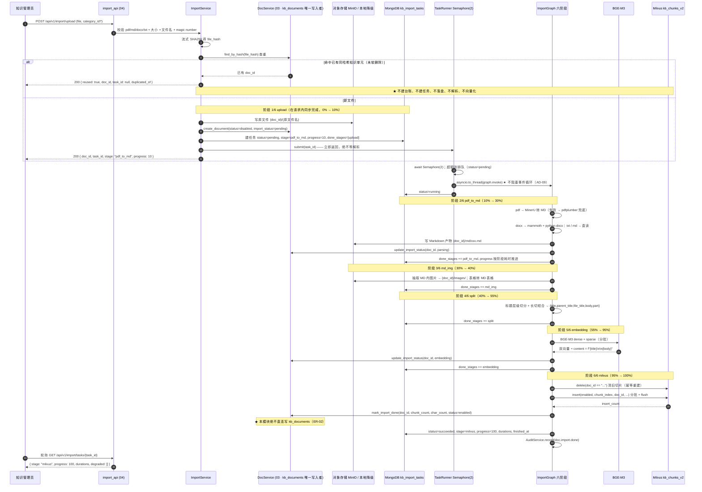
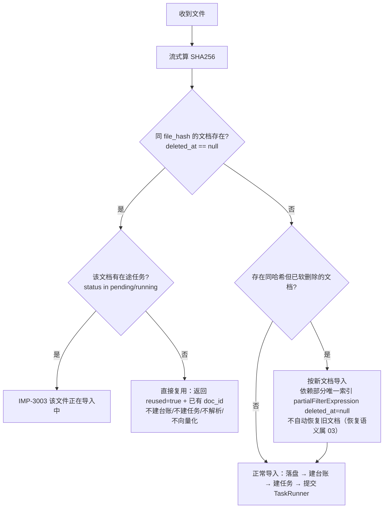
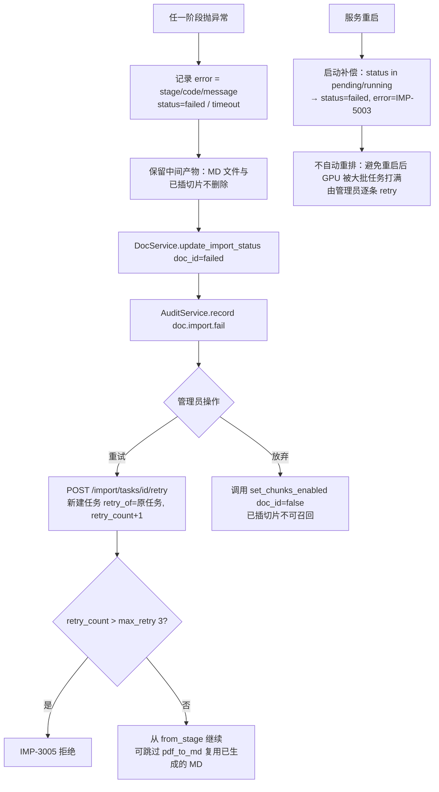
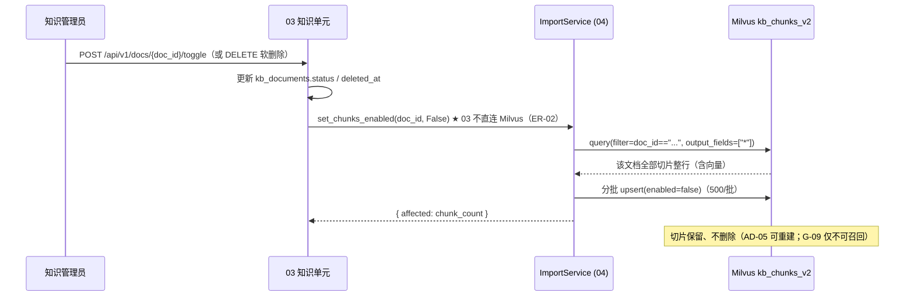

# 04 · 文档导入与向量化

> **文档编号**：04_模块Spec / 04
> **所属项目**：knowledge_manager（PRD 2.9）
> **上游依据**：`00_模块划分与边界.md` · `01_数据实体/数据实体设计.md`（E01 / E03 / E06，及 §6.1 裁定一、§9.2 冲突 C-01/C-03/C-05/C-06）· `02_概要设计/概要设计.md`（§3.1、§4.2、§4.4、§5、§6；AD-01 / AD-05 / AD-09 / AD-10）
> **对应原型**：`03_原型图/02_知识维护与导入中心.pen`（上传区「＋ 上传文档」「＋ 批量导入 / 文件夹」、拖拽区、导入队列、阶段顺序条）
> **状态**：Step 4 产物 · 待评审
> **错误码前缀**：`IMP`（见总纲 §3）

---

## 1. 模块职责与边界

### 1.1 做什么

| # | 职责 | 对应 PRD / 依据 |
|---|---|---|
| 1 | **单文件上传**：`POST /import/upload`，支持 **PDF / MD / DOCX / TXT** 四种格式（枚举 `file_ext`） | 2.9.1「多格式文档」；原型 `02`「＋ 上传文档」 |
| 2 | **批量 / 文件夹上传**：`POST /import/batch`，一次最多 50 个文件，支持浏览器文件夹拖拽（`webkitRelativePath`） | 2.9.3「批量文档 / 文件夹拖拽导入」；原型 `02`「＋ 批量导入 / 文件夹」 |
| 3 | **按 `file_hash`（SHA256）查重**：命中已有知识单元则**直接复用、不重复解析、不重复向量化、不建任务** | 2.9.3；原型 `02` 标注第 4 条 |
| 4 | **六阶段导入流水线**：`upload → pdf_to_md → md_img → split → embedding → milvus` | 概要设计 §3.1（阶段名与进度） |
| 5 | **受限并发执行**（AD-09）：`asyncio.to_thread` + `Semaphore(2)`，**不得阻塞事件循环** | AD-01 / AD-09；概要设计 §4.4 `TaskRunner` |
| 6 | **任务进度持久化**（AD-10）：落 `kb_import_tasks`，刷新页面 / 重启服务都不丢进度；对外仍按 `task_id` 查（**C-03**，对前端透明） | 原型 `02` 标注第 6 条 |
| 7 | **写 Milvus `kb_chunks_v2`**：双向量（BGE-M3 dense + sparse）+ 切片元数据，含显式字段 `doc_id` / `chunk_index` / `enabled` | 概要设计 §4.2；数据实体 §6.1 裁定一 |
| 8 | **切片启停**：文档停用 / 软删除时批量置 `enabled=false`（**ER-15**），不物理删切片 | AD-05；总纲 ER-15 |
| 9 | **切片预览**：`GET /import/docs/{doc_id}/chunks`，供知识管理员核对切片质量（对接 `doc:chunk`） | 原型 `02` 台账「切片数」列 |
| 10 | 导入动作**审计留痕**（经 `AuditService`，**ER-05**） | 2.9.8 |

### 1.2 不做什么（明确排除，避免与别的模块抢职责）

| 不做 | 归属 |
|---|---|
| **建 / 改 / 删知识单元台账**（`kb_documents`） | **03 知识单元与分类**（E04 的唯一写入者是 03）。本模块**只经 `DocService` 回填**导入相关字段（§2.7），**禁止直连写库**（ER-02）；总纲 §5 特别注明了这一点 |
| 台账列表、分类树、标题编辑、启停用按钮、软删除动作 | **03**（本模块只提供 `set_chunks_enabled()` 内部服务供 03 启停用时调用） |
| **能不能读某篇知识**的判定（四维数据权限） | **05 四维数据权限与鉴权引擎**（ER-03：判定只有一份实现）。本模块**一行 allow/deny 逻辑都不写** |
| 切片在检索时的**权限过滤** | **06 AI 鉴权问答**（AD-02：应用层过滤；本模块只负责写入 `enabled` 与 `doc_id`） |
| `kb_permissions` 的读写 | **05**（E07 归属 05） |
| FAQ 沉淀、知识缺口转建 | **07 / 08**。08 的「一键转建」回到本模块的导入接口（同一条链路，不另建通道） |
| 指标桶与看板 | **09**（Mongo 写入与分析） |
| MinerU / BGE-M3 / rerank **模型服务本身的实现与参数配置** | 模型调用封装属 00 的 infra；参数配置见 02 模块 §8 OQ-02-01 |
| 对象存储、Milvus、Mongo 的**连接与集合创建脚手架** | **00 公共基础**（`app/infra/{minio,milvus,mongo}.py`）；本模块只声明所需 schema |
| 导入的**前端视觉与交互** | 00 的前端壳 + 原型 `02`；本模块只提供接口 |

### 1.3 归属实体

| 实体 | 集合 / 存储 | 本模块权限 |
|---|---|---|
| E01 切片 | Milvus `kb_chunks_v2` | **唯一写入者**（ER-02）。06 只读 |
| E03 文件对象 | MinIO 桶 `knowledge-base-files`（降级为本地路径） | **唯一写入者**（ER-02）。03 只读元信息 |
| E06 导入任务 | Mongo `kb_import_tasks` | **唯一写入者**（ER-02）。03 只读（展示导入中的状态） |
| E04 知识单元 | Mongo `kb_documents` | **只读 + 经 `DocService` 回填**（写属 03） |
| E05 知识分类 | Mongo `kb_categories` | **只读**（写属 03；`category_id` 校验用） |
| E21 审计日志 | Mongo `audit_logs` | **只写经 `AuditService`**（ER-05），实体归属 10 |

> ⚠️ **本文档不新增任何集合**：集合名只有 `kb_chunks_v2` / `kb_import_tasks`，桶只有 `knowledge-base-files`。
> 存量电商集合 `kb_chunks_v1` **只读命名参照，绝不写入**（C-01，见 §2.1）。

### 1.4 依赖模块

| 方向 | 模块 | 用途 |
|---|---|---|
| 依赖 | 00 公共基础 | 配置、错误注册、统一响应、trace_id、Mongo/Milvus/MinIO 连接、**`TaskRunner`（受限并发）**、枚举基类 |
| 依赖 | 01 登录与功能权限 | JWT 中间件 + `doc:upload` / `doc:read` / `doc:chunk` 功能权限拦截（ER-08） |
| 依赖 | 03 知识单元与分类 | **`DocService`**：建台账、回填存储定位、推进 `import_status`、`mark_import_done()`、按 `file_hash` 查重 |
| 依赖 | 10 审计日志 | `AuditService.record()`（`doc.import.start` / `doc.import.done` / `doc.import.fail` / `doc.import.cancel`） |
| 被依赖 | 03 知识单元与分类 | 启停用 / 软删除文档时调用 `ImportService.set_chunks_enabled()` 改切片 `enabled`（**ER-15**，E01 的写入者仍是 04） |
| 被依赖 | 06 AI 鉴权问答 | 读 `kb_chunks_v2`（召回）与 E06（展示"知识补充中"状态） |
| 被依赖 | 08 知识缺口 | 「一键转建知识补充任务」→ 走本模块导入接口 |
| **不依赖** | 05 四维数据权限 | 导入过程**不做**任何数据权限判定；权限在问答时由 05 实时判定（AD-02 / ER-03） |

### 1.5 三处最容易混的边界（本模块的"地雷"）

| 易混点 | 正确理解 |
|---|---|
| **「启用」≠「可读」** | 导入完成把 `kb_documents.status` 置 `enabled`，只表示**允许被 Milvus 召回**（`enabled==true`）。**能否进 Prompt 由 05 的四维判定决定**，新文档 `kb_permissions` 为空 → fail-closed 判不可读（PRD：「默认状态下知识单元无任何公开访问权限」）。所以「启用」与「授权」是两件事，不能互相替代 |
| **切片 `enabled` 由谁写** | 唯一写入者是**本模块**。03 的「停用文档」按钮**不得**直接 `update` Milvus，必须调 `ImportService.set_chunks_enabled(doc_id, False)`（§3.8）。这是 ER-02 在本项目里最容易被写错的一处 |
| **查重命中不建任务** | 命中同 `file_hash` 时**不产生 E06 记录**、不建台账、不入 Milvus，只回 `reused=true` + 已有 `doc_id`。否则前端会看到一条"永远 100% 的假任务" |
| **阶段名固定 6 槽** | 即使上传的是 `.txt`（无需 PDF 转换、无图片），流水线**仍然走完 6 个阶段名**，只是对应阶段耗时趋近 0。理由：`task_stage` 是 E06 枚举与前端渲染契约，固定槽位可让前端零分支（原型 `02` 的阶段条是写死的 6 段） |
| **重试 = 新任务** | 重试不复活旧任务记录，而是**新建一条**带 `retry_of` 的任务，保留失败现场（`error` / `durations`）供排障 |

---

## 2. 数据契约

### 2.1 E01 · 切片 `kb_chunks_v2`（Milvus）

**集合名固定 `kb_chunks_v2`。** ⚠️ **C-01**：存量 `kb_chunks_v1` 的 `item_name` 是 schema 显式声明的必需字段，而 2.9 无此概念；若沿用 v1 就必须写入空 `item_name`（技术债）。**处理：新建 v2，不覆盖 v1，不迁移数据**（存量无业务数据）。

| 字段 | 类型 | 必填 | 索引 | 说明 |
|---|---|:--:|---|---|
| `chunk_id` | INT64 | ✔（auto_id） | 主键 | 主键自增 |
| `dense_vector` | FLOAT_VECTOR(1024) | ✔ | `AUTOINDEX` / `COSINE` | BGE-M3 dense |
| `sparse_vector` | SPARSE_FLOAT_VECTOR | ✔ | `SPARSE_INVERTED_INDEX` / `IP` | BGE-M3 sparse |
| `content` | VARCHAR(65535) | ✔ | — | **`f"{title}\n\n{body}"`**（见 §2.6） |
| `title` | VARCHAR(65535) | ✔ | — | 切片标题（切分锚点） |
| `parent_title` | VARCHAR(65535) | | — | 父级标题；根级切片写 `""` |
| `file_title` | VARCHAR(65535) | ✔ | — | 文档标题**快照**（E04.title） |
| **`doc_id`** | VARCHAR(64) | ✔ | **INVERTED** | 关联 E04；**鉴权与引用溯源的关键** |
| **`chunk_index`** | INT64 | ✔ | — | 文档内顺序，从 0 递增 |
| **`enabled`** | BOOL | ✔ | **INVERTED** | 检索 `expr` 的**唯一条件** |
| **`part`** | INT64 | ✔ | — | 章节二次切分段号；未二次切分写 `0` |
| ~~`item_name`~~ | — | **不建** | — | v1 的电商字段，v2 删除（C-01） |

**创建要点**

```python
# 裁定一（数据实体 §6.1）：doc_id / enabled / chunk_index 声明为显式字段，
# 不使用 enable_dynamic_field —— 显式字段才能建 INVERTED 标量索引、有类型约束、可 describe 评审。
schema = MilvusClient.create_schema(auto_id=True, enable_dynamic_field=False)
```

**检索表达式（本模块的写入契约，交给 06 使用）**

| 场景 | `expr` |
|---|---|
| 常规召回 | `enabled == true` |
| 按文档重导前的清理 | `doc_id == "{doc_id}"`（先 delete 再 insert，保证**幂等重建**） |
| **禁止** | 任何权限相关条件（**ER-11** / AD-02）；任何 `enabled` 之外的过滤（ER-12：切片不冗余权限字段） |

### 2.2 E03 · 文件对象（MinIO 桶 `knowledge-base-files`）

| 项 | 内容 |
|---|---|
| 桶名 | **`knowledge-base-files`**（沿用，不可改名） |
| 对象前缀 | **`{doc_id}/`**（存量是 `{文件名}/...`；2.9 改为按 doc_id 分层，便于按知识单元整体删除 / 重建） |
| 原文件 | `{doc_id}/{原文件名}` |
| Markdown 产物 | `{doc_id}/md/{basename}.md` |
| 抽出的图片 | `{doc_id}/images/{seq}.{ext}` |
| 对象元数据 | `Content-Type`；自定义头 `x-amz-meta-doc-id`、`x-amz-meta-file-hash` |
| 存三类内容 | ① 上传原文件 ② Markdown 转换产物 ③ 从 MD 抽出的图片（对应 E03 定义） |
| **生命周期** | 与文档同生命周期。**文档软删除不删对象**（AD-05：**原文件才是真源**，切片可随时重建） |
| 覆盖策略 | 同一对象键允许覆盖写（内容由 `file_hash` 保证一致） |
| **越界保护** | 任何读写对象前校验对象键属于 `{doc_id}/` 前缀，否则拒绝（§5 `IMP-2002`）——防路径穿越与跨文档越权取文件 |
| **降级落盘** | MinIO 不可用 → 落本地 `storage/import/{doc_id}/...`；`kb_documents.storage.bucket = "LOCAL"`，`object_key` 为项目内相对路径；任务标 `storage_degraded = true`（见 §7.2） |

### 2.3 E06 · 导入任务 `kb_import_tasks`（Mongo）

⚠️ **C-03**：存量 `task_util.py` 是**纯内存 dict**，服务重启即丢进度；且前端靠轮询 `task_id` 查进度。**处理：持久化到 `kb_import_tasks`，对外接口语义完全不变**（仍按 `task_id` 查，数据源从内存换成 Mongo）——对前端透明。

| 字段 | 类型 | 必填 | 来源 | 说明 |
|---|---|:--:|---|---|
| `_id` | string | ✔ | Step 1 | 任务号 `IMP{yyyyMMdd}{6位序列}` |
| `doc_id` | string | ✔ | Step 1 | 关联 E04 |
| `status` | enum | ✔ | Step 1 | `task_status`（6 值，见 §2.5） |
| `stage` | enum | ✔ | Step 1 | `task_stage`（6 值，**当前阶段**） |
| `progress` | int | ✔ | Step 1 | 0~100，按 §4.2 权重推进 |
| `done_stages` | array | ✔ | Step 1 | 已完成阶段（对齐存量 `task_util` 的 `done_list` 语义） |
| `durations` | object | | Step 1 | 各阶段耗时 `{"pdf_to_md": 8123, ...}`（ms），存量已有此结构，直接复用 |
| `error` | object \| null | | Step 1 | `{stage, code, message}`；失败时写入，成功时为 `null` |
| `retry_count` | int | ✔ | Step 1 | 重试次数，默认 0 |
| `storage_degraded` | bool | ✔ | Step 1 | MinIO 是否降级（E03 定义，默认 `false`） |
| `created_by` | string | ✔ | Step 1 | 发起人（user_id） |
| `created_at` | long | ✔ | Step 1 | 时间戳（TTL 依据） |
| `finished_at` | long \| null | | Step 1 | 终态时写入 |
| `file_name` | string | | **本 Spec 追加** | 原型 `02` 导入队列第一列「文件」直接渲染，免 join E04 |
| `file_hash` | string | | **本 Spec 追加** | 冗余一份，用于「同哈希是否有在途任务」（`IMP-3003`）的**单集合**查询 |
| `batch_id` | string \| null | | **本 Spec 追加** | 批量 / 文件夹导入分组（原型 `02` 一次拖入多文件的进度归组） |
| `degraded` | array | | **本 Spec 追加** | 降级记录 `[{stage, kind, detail}]`，`kind ∈ {minio_local, mineru_pdfplumber, rerank_skip, gpu_cpu}`（§7.2） |
| `retry_of` | string \| null | | **本 Spec 追加** | 重试来源 `task_id`（保留失败现场，便于排障） |
| `cancel_requested` | bool | | **本 Spec 追加** | **协作式取消**标记：工作线程在阶段边界读取（`to_thread` 无法安全强杀，见 §3.5） |

> ★ **追加字段的处理**：以上 6 个 ★ 字段是 E06 落地所必需（否则前端要 join E04、取消无法协作式实现、降级无处记录）。
> **需回填 `01_数据实体/数据实体设计.md` §5 E06**，已登记为 §8.1 `OQ-04-09`。除这 6 个字段外，**不得再扩 E06**。

### 2.4 索引设计

| 存储 | 索引 | 用途 |
|---|---|---|
| Milvus `kb_chunks_v2` | `dense_vector` `AUTOINDEX`/`COSINE` | 稠密向量召回 |
| | `sparse_vector` `SPARSE_INVERTED_INDEX`/`IP` | 稀疏向量召回（hybrid） |
| | `doc_id` INVERTED | 按文档删旧切片（幂等重建）、引用溯源、按文档启停 |
| | `enabled` INVERTED | **检索的唯一预过滤条件**（ER-11） |
| Mongo `kb_import_tasks` | `doc_id` | 某知识单元的导入历史（重导 / 排障） |
| | `status + created_at desc` | 导入队列列表；**启动补偿扫描**（§4.5） |
| | `file_hash` | 在途任务查重（`IMP-3003`） |
| | `batch_id` | 按批次查询一次导入的全部任务 |
| | TTL `created_at`（90 天） | 数据保留策略（Step 1 §7）。任务在跑时 `created_at` 必然新鲜，不会被 TTL 误删 |
| Mongo `kb_documents`（**属 03，本模块只提要求**） | 唯一 `file_hash`，**`partialFilterExpression: { deleted_at: null }`** | 本模块查重的**前提**：只有部分唯一索引才能让"软删除的文档不参与去重、也不阻塞同文件重新导入"。若 03 建成普通唯一索引，软删除后同文件将**永远无法再导入**（登记 §8.1 `OQ-04-10`） |

### 2.5 枚举定义（**ER-10：按实体各自定义，禁止共用**）

| 枚举组 | 类名（`app/core/enums.py`） | 取值 | 用于 |
|---|---|---|---|
| `file_ext` | `FileExtEnum` | `pdf` / `md` / `docx` / `txt` | E04.file_ext（本模块写入前校验） |
| `task_status` | `TaskStatusEnum` | `pending` / `running` / `succeeded` / `failed` / `timeout` / `cancelled` | E06.status |
| `task_stage` | `TaskStageEnum` | `upload` / `pdf_to_md` / `md_img` / `split` / `embedding` / `milvus` | E06.stage |
| `import_status` | `DocImportStatusEnum` | `pending` / `parsing` / `embedding` / `done` / `failed` | E04.import_status（本模块经 03 回填） |
| `degradation_kind` | `DegradationKindEnum`（★本 Spec 追加） | `minio_local` / `mineru_pdfplumber` / `rerank_skip` / `gpu_cpu` | E06.degraded[].kind |

> ⚠️ **禁止共用一个通用 `StatusEnum`**（2.9 有 5 种不同取值域的 `status`）。
> 特别注意 `task_status`（6 值）与 `import_status`（5 值）**取值域不同**：两者都有 `failed`，但**语义不同**
> （任务失败 ≠ 台账导入状态失败：任务可能因超时而 `timeout`，而台账 `import_status` 只能落 `failed`），因此**必须两个类**。

**扩展名 → 枚举映射（C-06 的落地口径）**

| 扩展名 | `file_ext` | 解析通道 |
|---|---|---|
| `.pdf` | `pdf` | MinerU →（失败）pdfplumber |
| `.md` / `.markdown` | `md` | 直读（`.markdown` 归一为 `md`） |
| `.docx` | `docx` | mammoth（+ python-docx 读表格） |
| `.txt` | `txt` | 直读 |
| `.doc` / `.pptx` / `.xlsx` / `.html` 等 | — | **不支持**，返回 `IMP-1003`（见 §8.1 `OQ-04-02`） |

> **C-06 的扩展方式**：存量只支持 `.pdf` / `.md`。本模块在导入图的 **`entry` 节点按扩展名分支**，
> **四条分支统一汇聚为 Markdown**，之后再进入 `md_img → split → embedding → milvus` 公共节点。
> 这样"新增一种格式"只需加一条分支，公共链路零改动——这是选择"先归一为 MD"而不是"每格式各写一套切分"的原因。

### 2.6 切片装配规则（本模块对 E01 的写入口径）

| 项 | 规则 | 为什么 |
|---|---|---|
| 切分输入 | `{title, parent_title, file_title, body, part}`（存量 `document_split` 输出） | 沿用已验证的切分策略（不改检索内核） |
| `content` | **`f"{title}\n\n{body}"`** | 把标题一并向量化，提升"标题即答案"型查询（如"差旅报销标准"）的召回；`title` 仍单独保留供引用溯源卡片渲染 |
| `chunk_index` | 按切分输出顺序从 **0** 递增，全局唯一于该文档 | 上下文拼接（取相邻切片）与"跳转到第 N 片"定位 |
| `part` | 同一标题下二次切分的段号，从 `0` 起；未二次切分写 `0` | 显式化（存量是动态字段）才能排序 |
| `enabled` | 初始 = 台账 `status`：`auto_enable=true` 写 `true`，否则写 `false` | 避免"台账显示已停用、切片却可召回"的不一致态 |
| `file_title` | 建档时 E04.title 的**快照** | 文档改名**不回写切片**（回写代价高、收益低）；引用溯源卡片优先用 `doc_id` 现查 E04.title，`file_title` 仅兜底 |
| 长度上限 | `content` ≤ 65535 字节（Milvus `VARCHAR` 上限）；超长**强制**按 `part` 二次切分 | 写入前拦截，避免 Milvus 写入报错 |
| 写入方式 | **先 `delete(doc_id == ...)` 再 `insert`**（分批，默认 500 条/批）+ `flush` | 幂等重建：重试 / 重新解析不会产生重复切片 |

### 2.7 E04 `kb_documents` 的字段动作（**全部经 03 的 `DocService`**）

| 字段 | 本模块动作 | 唯一合法路径 |
|---|---|---|
| `title` / `file_name` / `file_ext` / `file_size` / `file_hash` / `category_id` / `created_by` | 建台账时写入 | `DocService.create_document(...)` |
| `storage` | 落盘后回填对象定位 | `DocService.update_storage(doc_id, storage)` |
| `import_status` | 阶段推进时回填（`parsing` / `embedding`） | `DocService.update_import_status(doc_id, import_status)` |
| `chunk_count` / `char_count` / `import_status` / `status` | **导入完成时一次性回填** | **`DocService.mark_import_done(doc_id, chunk_count, char_count, status)`** |
| `file_hash` | 查重 | `DocService.find_by_hash(file_hash)`（只读） |

> 🚫 **硬性禁令**：本模块代码中**不得出现**对 `kb_documents` 的直接写操作
> （`update_one` / `update_many` / `find_one_and_update` / `insert_one`）；**ER-02** 与总纲 §5 的注意点 1。
> 落地校验：代码评审 + AC-04-16 的静态检查。

---

## 3. 接口清单

> **统一说明**：① 全部接口在 `/api/v1/import/*` 分区（总纲 §6.1），均过 01 的 JWT 中间件（ER-08）；
> ② 响应体遵循总纲 §6.2 统一契约（成功 `code:0`，失败 `code:"IMP-xxxx"`）；
> ③ 本模块**不做数据权限判定**（ER-03），也不返回权限相关字段。

### 3.1 `POST /api/v1/import/upload` — 单文件上传

| 项 | 内容 |
|---|---|
| 功能权限 | **`doc:upload`** |
| 请求 | `multipart/form-data` |
| 出参 | `{ "doc_id", "task_id" \| null, "reused": bool, "file_hash", "file_ext", "file_size", "stage", "progress", "duplicated_of": string \| null }` |
| HTTP | 新文件与命中复用**都返回 `200`**（统一契约只有 `code:0`；任务在后台跑，靠 `task_id` 轮询——对齐存量语义，对前端透明） |

**入参表**

| 参数 | 位置 | 类型 | 必填 | 说明 |
|---|---|:--:|:--:|---|
| `file` | form | file | ✔ | 单文件，≤ `import.max_file_mb`（默认 100MB） |
| `category_id` | form | string | | 目标分类（E05）；不传则 `null`（未分类） |
| `title` | form | string | | 显示标题；默认取文件名（去扩展名），长度 ≤ 200 |
| `auto_enable` | form | bool | | 默认 `true`：导入完成后是否置 `kb_documents.status=enabled`（见 §1.5 与 `OQ-04-03`） |

**服务端规则表（规则 → 失败码）**

| # | 规则 | 失败码 |
|---|---|---|
| R-01 | `file` 缺失 / 0 字节 | `IMP-1001` |
| R-02 | 文件大小 > `import.max_file_mb` | `IMP-1002` |
| R-03 | 扩展名不在 `file_ext`（`.pdf/.md/.markdown/.docx/.txt`） | `IMP-1003` |
| R-04 | **文件名非法**：含 `/` `\` `..`、控制字符、长度 > 200、去扩展名后为空 | `IMP-1005` |
| R-05 | **扩展名与内容不符**（magic number 校验：`.pdf` 必须是 `%PDF-`，`.docx` 必须是 ZIP(PK)） | `IMP-1006` |
| R-06 | `category_id` 不存在（E05，只读校验） | `IMP-3007` |
| R-07 | 上传流中断 / 实际字节数少于声明长度 | `IMP-1009` |
| R-08 | **流式计算 SHA256**（边落临时文件边算，**不把整文件读进内存**）；哈希或查重失败 | `IMP-5005` |
| R-09 | **命中未软删除的同 `file_hash` 文档 → 直接复用**：不建台账、不建任务、不落盘、不解析、不向量化；返回 `reused=true` + 已有 `doc_id` + `task_id=null` + `duplicated_of=原文件名` | —（成功） |
| R-10 | 同 `file_hash` 已有 `status ∈ {pending, running}` 的任务 | `IMP-3003` |
| R-11 | 落盘：MinIO 优先，失败降级本地（`storage_degraded=true`）；**两者都失败** | `IMP-4002` |
| R-12 | 建台账（`DocService.create_document()`，`status=disabled`、`import_status=pending`）失败 | `IMP-4005` |
| R-13 | 建任务 `kb_import_tasks(status=pending, stage=pdf_to_md, progress=10, done_stages=["upload"])` 失败 → **回滚已落盘对象**（避免孤儿文件） | `IMP-4005` |
| R-14 | 导入队列等待数 ≥ `import.max_queue`（默认 20） | `IMP-3008`（429） |
| R-15 | 提交 `TaskRunner` 后**立即返回**，**绝不在请求内等待解析**（解析在后台线程） | — |
| R-16 | 写审计 `doc.import.start`（经 `AuditService`；审计失败只记 ERROR，不阻断——ER-05 降级） | — |

> **为什么 `upload` 阶段在请求内同步完成**：需要立即返回 `file_hash` / `doc_id` 才能让前端开始轮询；
> 且落盘失败就不该产生台账孤儿记录。与概要设计 §3.1 的书写顺序（先建台账后落盘）**语义等价**，只是把 SVC 内部顺序调整为"先落盘再建台账"。

### 3.2 `POST /api/v1/import/batch` — 批量 / 文件夹上传

| 项 | 内容 |
|---|---|
| 功能权限 | **`doc:upload`** |
| 请求 | `multipart/form-data` |
| 出参 | `{ "batch_id", "total", "accepted", "reused_count", "rejected": [ { "file_name", "code", "message" } ], "items": [ { "doc_id", "task_id" \| null, "file_name", "reused", "file_hash" } ] }` |

**入参表**

| 参数 | 位置 | 类型 | 必填 | 说明 |
|---|---|:--:|:--:|---|
| `files[]` | form | file[] | ✔ | 1~`import.max_batch_files`（默认 **50**）个文件；对应原型 `02` 的「＋ 批量导入 / 文件夹」与拖拽区 |
| `relative_paths[]` | form | string[] | | 文件夹拖拽时浏览器的 `webkitRelativePath`（如 `制度/财务/差旅.pdf`）；**必须与 `files[]` 一一对应** |
| `category_id` | form | string | | 统一目标分类 |
| `auto_map_category` | form | bool | | 默认 **`false`**：是否按 `relative_paths` 的目录层级自动建/配分类（**G-01 未确认**，接口先预留） |
| `auto_enable` | form | bool | | 同 §3.1 |

**服务端规则表（规则 → 失败码）**

| # | 规则 | 失败码 |
|---|---|---|
| R-01 | `files[]` 为空 | `IMP-1001` |
| R-02 | 文件数 > `import.max_batch_files` | `IMP-1004` |
| R-03 | 批次总量 > `import.max_batch_mb`（默认 500MB） | `IMP-1004` |
| R-04 | `relative_paths[]` 与 `files[]` 数量不一致 | `IMP-1008` |
| R-05 | **逐文件独立校验**（§3.1 R-01~R-08 每条都适用单文件）：**部分成功返回 `200`**，失败项进 `rejected[]`（带各自的 `code`）；**仅当全部被拒才返回 `400`**，`code` 取第一条失败项的码 | 见各条 |
| R-06 | 批量提交时**逐个**走查重（R-09 复用语义相同），命中项 `task_id=null` 且计入 `reused_count` | — |
| R-07 | 生成本批 `batch_id` 并写入这批任务的 `batch_id` 字段 | — |
| R-08 | `auto_map_category=true` 时按 `relative_paths` 目录层级匹配 / 新建分类——**分类的写入者是 03**，必须经其服务；本步默认关闭（G-01） | `IMP-3007`（分类服务异常） |
| R-09 | 队列容量按**本批待执行任务数**整体判断，超出即整批拒绝（避免半批入队导致进度看板口径混乱） | `IMP-3008`（429） |

> **为什么"部分成功"不返回 400**：批量语义下"一个坏文件让整批 50 个可用文件全部失败"是不可接受的体验；
> 因此 `rejected[]` 明细必须逐项返回，由前端在导入队列里逐行标红（对齐原型 `02` 的队列表结构）。

### 3.3 `GET /api/v1/import/tasks/{task_id}` — 任务进度

| 项 | 内容 |
|---|---|
| 功能权限 | **`doc:read`** |
| 入参 | 路径 `task_id`（`IMP{yyyyMMdd}{6位}`） |
| 出参 | `{ "task_id", "doc_id", "doc_title", "file_name", "status", "stage", "stage_index", "stage_total", "progress", "done_stages", "durations", "error", "retry_count", "storage_degraded", "degraded", "created_by", "created_at", "finished_at" }` |
| 说明 | 语义与存量 `/status/{task_id}` **完全一致**（仍按 `task_id` 查），仅数据源由内存换成 `kb_import_tasks`（**C-03，对前端透明**） |

**入参表**

| 参数 | 位置 | 类型 | 必填 | 说明 |
|---|---|:--:|:--:|---|
| `task_id` | path | string | ✔ | 任务号 `IMP{yyyyMMdd}{6位序列}` |

**服务端规则表**

| # | 规则 | 失败码 |
|---|---|---|
| R-01 | `task_id` 不存在（含超过 90 天 TTL 已被清理） | `IMP-3001` |
| R-02 | `stage_index` / `stage_total` 由后端算好（`stage_total` 固定 **6**），前端零分支渲染阶段条 | — |
| R-03 | 轮询友好：**不加限流**，但响应必须 < 50ms（单集合按 `_id` 主键查）；前端建议 1s 间隔 | — |
| R-04 | 任务完成后 `progress=100`、`done_stages` 含全部 6 个阶段 | — |

### 3.4 `GET /api/v1/import/tasks` — 导入队列

| 项 | 内容 |
|---|---|
| 功能权限 | **`doc:read`** |
| 入参 | `?doc_id=&status=&batch_id=&stage=&page=1&page_size=20`（`page_size` 上限 200，见总纲 §6.3） |
| 出参 | 分页 `{ "items": [ { "task_id", "doc_id", "doc_title", "file_name", "status", "stage", "progress", "storage_degraded", "created_by", "created_at" } ], "total", "page", "page_size" }` |
| 说明 | 原型 `02` 导入抽屉的「导入队列（按阶段显示进度）」三列：**文件 / 阶段 / 进度** |

**服务端规则表**

| # | 规则 | 失败码 |
|---|---|---|
| R-01 | `page` / `page_size` 非正整数或 `page_size > 200` | `IMP-1007` |
| R-02 | `status` / `stage` 不在枚举取值域 | `IMP-1007` |
| R-03 | 默认按 `created_at desc` 排序（最新导入在最上，与原型一致） | — |

### 3.5 `POST /api/v1/import/tasks/{task_id}/cancel` — 取消导入

| 项 | 内容 |
|---|---|
| 功能权限 | **`doc:upload`**（+ 资源归属校验，见 R-02） |
| 入参 | `{ "reason"?: string }` |
| 出参 | `{ "task_id", "status": "cancelled", "cancel_pending": bool }` |
| 说明 | 对应原型 `02` 导入抽屉的「取消」按钮 |

**入参表**

| 参数 | 位置 | 类型 | 必填 | 说明 |
|---|---|:--:|:--:|---|
| `task_id` | path | string | ✔ | 任务号 |
| `reason` | body | string | | 取消原因（写入审计 `doc.import.cancel`），≤ 200 字 |

**服务端规则表**

| # | 规则 | 失败码 |
|---|---|---|
| R-01 | 仅 `status ∈ {pending, running}` 可取消；已是终态（`succeeded` / `failed` / `timeout` / `cancelled`） | `IMP-3002` |
| R-02 | **归属校验**：非任务创建者取消他人任务，须具备 `doc:delete`（管理级动作） | `IMP-2001` |
| R-03 | **协作式取消**：置 `cancel_requested=true`，工作线程在**阶段边界**读取后中止。`asyncio.to_thread` 无法安全强杀线程，故取消不保证立即生效 → 响应带 `cancel_pending=true`，前端显示"取消中" | — |
| R-04 | 取消后处理：已写入的切片**保留但置 `enabled=false`**（绝不允许半截切片被召回）；经 `DocService.update_import_status(doc_id, "failed")` 落台账 | `IMP-5004`（回填失败） |
| R-05 | 写审计 `doc.import.cancel`（含 `reason`） | — |

### 3.6 `POST /api/v1/import/tasks/{task_id}/retry` — 重试导入

| 项 | 内容 |
|---|---|
| 功能权限 | **`doc:upload`** |
| 入参 | `{ "from_stage"?: "pdf_to_md" \| "md_img" \| "split" \| "embedding" \| "milvus" }`，默认从 `pdf_to_md` 开始（原文件已在存储中，`upload` 不重做） |
| 出参 | `{ "task_id", "retry_of", "retry_count", "status" }` |
| 说明 | 「失败/重试」流程的入口（§4.5） |

**入参表**

| 参数 | 位置 | 类型 | 必填 | 说明 |
|---|---|:--:|:--:|---|
| `task_id` | path | string | ✔ | 待重试的原任务号 |
| `from_stage` | body | enum | | 从哪个阶段续跑，取值见 `task_stage`；默认 `pdf_to_md`（`upload` 不重做） |

**服务端规则表**

| # | 规则 | 失败码 |
|---|---|---|
| R-01 | 仅 `status ∈ {failed, timeout, cancelled}` 可重试 | `IMP-3002` |
| R-02 | `retry_count + 1 > import.max_retry`（默认 3） | `IMP-3005` |
| R-03 | **重试 = 新建任务**（`retry_of` 指向原任务、`retry_count` 继承并 +1），保留失败现场供排障 | — |
| R-04 | **幂等重建**：进入 `milvus` 阶段前先 `delete(doc_id == ...)`，不产生重复切片 | `IMP-4004` |
| R-05 | `from_stage` 跳过解析阶段的**前提**是中间产物（MD 文件）仍在存储中；若已丢失则自动从 `pdf_to_md` 重新开始，并在 `degraded` 追加 `{stage:"pdf_to_md", kind:"mineru_pdfplumber", detail:"中间产物缺失，已从解析阶段重新开始"}` | — |
| R-06 | 重新入队仍受 `Semaphore(2)` 约束（`status=pending` 排队） | `IMP-3008`（429，队列满） |

### 3.7 `GET /api/v1/import/docs/{doc_id}/chunks` — 切片预览

| 项 | 内容 |
|---|---|
| 功能权限 | **`doc:chunk`** |
| 入参 | `?page=1&page_size=20&keyword=&full=false`（`page_size` 上限 200） |
| 出参 | `{ "doc_id", "doc_title", "import_status", "total", "items": [ { "chunk_id", "chunk_index", "title", "parent_title", "file_title", "part", "enabled", "char_count", "content" } ] }` |
| 说明 | 供知识管理员核对切片质量（切太长 / 太碎 / 标题错），也用于答辩演示"切片可查看与调整" |

**入参表**

| 参数 | 位置 | 类型 | 必填 | 说明 |
|---|---|:--:|:--:|---|
| `doc_id` | path | string | ✔ | 知识单元编号 |
| `page` / `page_size` | query | int | | 分页，默认 `1` / `20`，`page_size` 上限 200 |
| `keyword` | query | string | | 在 `title` / `content` 上做包含匹配 |
| `full` | query | bool | | 默认 `false`（返回 200 字预览）；`true` 返回全文（单条上限 4000 字） |

**服务端规则表**

| # | 规则 | 失败码 |
|---|---|---|
| R-01 | `doc_id` 不存在或已软删除 | `IMP-3004` |
| R-02 | 文档 `import_status ∈ {parsing, embedding}` → 切片尚不完整，**拒绝预览**（展示半截切片会误导） | `IMP-3006` |
| R-03 | 默认返回 `content` 前 200 字预览；`full=true` 时返回全文，**单条上限 4000 字**（超出截断并标 `truncated`） | — |
| R-04 | 按 `chunk_index` 升序返回（与文档原始顺序一致） | — |
| R-05 | 分页参数非法 | `IMP-1007` |

### 3.8 内部服务接口（**Python 方法，不暴露 HTTP 路由**）

| 方法 | 调用方 | 作用 | 约束 |
|---|---|---|---|
| `ImportService.import_file(...)` | 08 知识缺口「一键转建」（转建后触发导入） | 与 §3.1 同一实现 | 不另建通道，复用同一条链路 |
| **`ImportService.set_chunks_enabled(doc_id, enabled)`** | **03 知识单元**（启停用 / 软删除文档时） | 批量改 `kb_chunks_v2.enabled` | **ER-15 / ER-02**：03 禁止直连改 Milvus。实现见 §4.6（`query → upsert`），返回受影响切片数 |
| `ImportService.rebuild_chunks(doc_id)` | 运维脚本 / 切片策略调整后 | 从原文件重建切片（AD-05「切片可重建」） | 仅脚本或内部调用；不对外暴露 HTTP |
| `DocService.create_document(...)` | **本模块调用 03** | 建台账 | 03 提供；禁止直连写 `kb_documents`（ER-02） |
| `DocService.update_storage(doc_id, storage)` | 本模块调用 03 | 回填对象定位 | 同上 |
| `DocService.update_import_status(doc_id, import_status)` | 本模块调用 03 | 推进导入状态 | 同上 |
| `DocService.mark_import_done(doc_id, chunk_count, char_count, status)` | 本模块调用 03 | **导入完成回填**（`chunk_count` / `import_status=done` / `status`） | **C-03 之外最关键的一条边界**（总纲 §5 注意点 1） |
| `DocService.find_by_hash(file_hash)` | 本模块调用 03 | 查重（只读） | 依赖 §2.4 的部分唯一索引 |

### 3.9 接口一览

| 方法 | 路径 | 功能权限 | 说明 |
|---|---|---|---|
| POST | `/api/v1/import/upload` | `doc:upload` | 单文件上传（含查重复用） |
| POST | `/api/v1/import/batch` | `doc:upload` | 批量 / 文件夹上传 |
| GET | `/api/v1/import/tasks/{task_id}` | `doc:read` | 任务进度（阶段 + 百分比 + 各阶段耗时） |
| GET | `/api/v1/import/tasks` | `doc:read` | 导入队列列表 |
| POST | `/api/v1/import/tasks/{task_id}/cancel` | `doc:upload` | 取消导入（协作式） |
| POST | `/api/v1/import/tasks/{task_id}/retry` | `doc:upload` | 重试导入（新建任务） |
| GET | `/api/v1/import/docs/{doc_id}/chunks` | `doc:chunk` | 切片预览 |

> **权限码来源**：`doc:upload`（知识单元上传 / 批量文件夹导入）、`doc:chunk`（切片查看与调整）见 `01_登录与功能权限（RBAC）.md` §2.3 B 表；
> `doc:read` 用于任务查询（对齐概要设计 §5 的 `/import/tasks/{id}` 行）。
> **无新增权限码**，也不得借用别模块的码（ER-09）。

---

## 4. 关键流程

### 4.1 导入全链路（六阶段）



### 4.2 六阶段说明与进度权重

| # | 阶段名（`task_stage`） | 做什么 | 沿用存量节点 | 进度区间 | 权重 |
|---|---|---|---|---|:--:|
| 1 | `upload` | 校验 → 算 SHA256 → 查重 → 落盘 → 建台账 / 建任务 | `entry`（改造） | 0 → 10 | 10 |
| 2 | `pdf_to_md` | **格式归一为 Markdown**：pdf→MinerU；docx→mammoth；txt / md→直读 | `pdf2md`（扩展 docx / txt 分支，**C-06**） | 10 → 30 | 20 |
| 3 | `md_img` | 图片抽取入库、图注（Qwen3-VL，可选）、表格转 MD | `md_img`（沿用） | 30 → 40 | 10 |
| 4 | `split` | 标题层级切分 + 长切短合 → `{title,parent_title,file_title,body,part}` | `document_split`（沿用） | 40 → 55 | 15 |
| 5 | `embedding` | BGE-M3 dense + sparse 双向量 | `bge_embedding`（沿用） | 55 → 95 | 40 |
| 6 | `milvus` | 按 `doc_id` 删旧切片 → insert（带 `doc_id`/`enabled`/`chunk_index`）→ flush → 回填台账 | 写库节点（改造） | 95 → 100 | 5 |

> **权重与原型自洽**：原型 `02` 导入队列给出的三个样例值 **12% / 45% / 82%** 分别落在
> `pdf_to_md`（10~30）、`split`（40~55）、`embedding`（55~95）区间内，说明本权重表与原型设计一致。
>
> **阶段名固定 6 槽（不按格式裁剪）**：`.txt` 文件没有"PDF 转 MD"、也可能没有图片，但**阶段名仍然走完**。
> 理由：`task_stage` 是 E06 的枚举契约、也是前端阶段条的渲染依据（原型 `02` 的「阶段顺序」条写死 6 段）；
> 固定槽位让前端、看板、审计的口径统一，代价只是两个耗时趋近 0 的阶段。

### 4.3 `file_hash` 查重与复用（幂等入口）



| 场景 | 行为 | 依据 |
|---|---|---|
| 同哈希 + 未软删除 | **复用**，返回已有 `doc_id`，不产生任何新记录 | 原型 `02` 标注第 4 条；`kb_documents` 唯一 `file_hash` |
| 同哈希 + 有在途任务 | `IMP-3003`，提示"该文件正在导入中" | 防并发重复导入同一文件 |
| 同哈希 + 已软删除 | 允许作为新知识单元导入；**不自动恢复**旧文档 | 需 §2.4 的**部分唯一索引**；否则唯一索引会永久阻塞重导（`OQ-04-10`） |
| 同一 `doc_id` 重试 / 重建 | `milvus` 阶段先 `delete(doc_id == ...)` 再 `insert` | 幂等重建（AD-05） |
| 批量中重复文件 | 逐个查重，命中项进 `items[].reused=true`，不计入待执行任务 | §3.2 R-06 |

### 4.4 为什么要受限并发、为什么不能阻塞事件循环（AD-01 + AD-09）

```python
# 00 模块提供，本模块使用
class TaskRunner:
    _sem = asyncio.Semaphore(2)          # 最多 2 个导入并发
    async def submit(self, task_id: str, fn):
        async with self._sem:            # 排队期间任务 status=pending
            await asyncio.to_thread(fn)  # 同步的 LangGraph 导入流程丢到线程池
```

| 决策 | 若不做会怎样 |
|---|---|
| **必须 `asyncio.to_thread`** | BGE-M3 推理与 MinerU 解析都是**同步阻塞调用**（几十秒~几分钟）。若直接在事件循环里 `await`，AD-01 单应用下**问答链路的 SSE 流式输出、心跳、指标异步写全部停摆**——导入一个 100 页 PDF，问答就会卡住十几秒。这是"导入绝不能阻塞问答"的具体含义 |
| **必须 `Semaphore(2)`** | ① GPU 显存与吞吐有限（BGE-M3 与 reranker 共存）；② 无限制并发会让 GPU 排队，**问答的检索链路（同样要用 BGE-M3 向量化问题）被导入任务饿死**；③ 磁盘 IO 与 MinerU 进程也会互相拖慢。默认 2 是"能跑满 GPU 又不至于让问答劣化"的折中，值可配 |
| **排队任务 `status=pending`** | 前端能区分"在跑"与"在排队"（原型导入队列的进度列）；也让 `import.max_queue` 的 429 保护有意义 |
| **GPU 不可用时并发降到 1** | CPU 推理占满所有核心，若仍有 2 个并发，问答延迟会明显劣化（§7.2） |

### 4.5 失败、超时、重试与中断恢复



| 情形 | 处理 | 码 |
|---|---|---|
| 阶段内异常 | `error={stage, code, message}`、`status=failed`；**保留中间产物**（已生成的 MD 文件是重试时跳过的依据） | `IMP-4001`~`IMP-4005` |
| **超时** | `TaskRunner` watchdog 扫描 `running` 任务的 `durations` 与心跳；超过 `import.timeout_min`（默认 30 分钟）无阶段推进 → `status=timeout` | `IMP-4006` |
| 重试 | 新建任务（`retry_of`），上限 `import.max_retry`（默认 3）；重试前不清旧切片，进入 `milvus` 阶段时按 `doc_id` 先删后插 | `IMP-3005` |
| **服务重启** | 启动补偿：`status ∈ {pending, running}` → `failed` + `error.code=IMP-5003`。**不自动重排**（避免重启后 GPU 被大批任务打满），由管理员显式 retry | `IMP-5003` |
| 切片已写但台账回填失败 | 出现"Milvus 有切片、台账 `chunk_count=0`"的不一致态 → 返回 `IMP-5004`，任务 `failed`，**必须人工/脚本重试回填**（不回滚切片：切片可复用，回滚只会放大代价） | `IMP-5004` |
| 取消 | 协作式（阶段边界生效），已插切片置 `enabled=false` | `IMP-3002` / `IMP-2001` |

### 4.6 文档停用 / 软删除 → 切片 `enabled=false`（ER-15 + ER-02）



| 决策 | 说明 |
|---|---|
| **为什么用 `query → upsert` 而不是"批量更新"** | Milvus **不提供按表达式就地改标量**的能力；`enabled` 是 schema 里的普通标量字段，唯一可靠路径是取回整行再 `upsert` 回写。代价是要搬运向量（单文档通常几十~几百切片、约 MB 级），而启停用是**低频人工操作**，可接受 |
| **为什么不删切片** | AD-05：切片可重建，但重建要重新解析 + 重新向量化（分钟级）；保留切片才能在"重新启用"时**秒级恢复召回**（G-09） |
| **为什么物理清理要显式脚本** | ER-15：软删除不物理删切片；物理清理走 `scripts/` 显式脚本，避免误删不可恢复 |
| **大文档的代价** | 若单文档切片 > 1 万，`query → upsert` 会明显变慢（需搬大量向量）→ 已登记 `OQ-04-05` |

---

## 5. 错误码表

> 前缀：**`IMP`**（总纲 §3，本模块专属，禁止借用别模块前缀）。
> 格式 `IMP-{4位}`；段位约定：`1xxx` 参数 · `2xxx` 鉴权 · `3xxx` 资源/状态 · `4xxx` 依赖 · `5xxx` 内部。

| 错误码 | HTTP | 消息 | 触发条件 |
|---|---|---|---|
| `IMP-1001` | 400 | 上传文件缺失或为空 | `file` 未提供 / 0 字节（§3.1 R-01） |
| `IMP-1002` | 400 | 文件大小超出上限 | 单文件 > `import.max_file_mb`（§3.1 R-02） |
| `IMP-1003` | 400 | 不支持的文件格式 | 扩展名不在 `pdf / md / docx / txt`（含 `.doc` `.pptx` 等） |
| `IMP-1004` | 400 | 批量导入数量或总量超出上限 | 文件数 > 50 或批次总量 > `import.max_batch_mb` |
| `IMP-1005` | 400 | 文件名非法 | 含 `/` `\` `..`、控制字符、超长、去扩展名后为空 |
| `IMP-1006` | 400 | 文件内容与扩展名不符 | magic number 校验失败（伪装扩展名） |
| `IMP-1007` | 400 | 查询参数不合法 | 分页参数非法、`status` / `stage` 不在枚举取值域 |
| `IMP-1008` | 400 | 批量参数不匹配 | `relative_paths[]` 与 `files[]` 数量不一致 |
| `IMP-1009` | 400 | 上传数据不完整 | 连接中断 / 实际字节数少于声明长度 |
| `IMP-2001` | 403 | 无权操作他人的导入任务 | 非创建者取消 / 重试他人任务且不具备 `doc:delete` |
| `IMP-2002` | 403 | 文件对象与知识单元不匹配 | 对象键不属于 `{doc_id}/` 前缀（防路径穿越 / 越权取文件） |
| `IMP-3001` | 404 | 导入任务不存在 | `task_id` 无对应记录（含超过 90 天 TTL 已被清理） |
| `IMP-3002` | 409 | 任务当前状态不允许该操作 | 对终态任务取消；对非失败态任务重试 |
| `IMP-3003` | 409 | 该文件正在导入中 | 同 `file_hash` 已有 `pending/running` 任务（§4.3） |
| `IMP-3004` | 404 | 知识单元不存在或已删除 | `doc_id` 无效或 `deleted_at` 非空 |
| `IMP-3005` | 409 | 重试次数已达上限 | `retry_count + 1 > import.max_retry`（默认 3） |
| `IMP-3006` | 409 | 导入进行中，切片暂不可查看 | 文档 `import_status ∈ {parsing, embedding}` 时调切片预览 |
| `IMP-3007` | 404 | 知识分类不存在 | `category_id` 无对应 E05 记录（只读校验） |
| `IMP-3008` | 429 | 导入队列已满，请稍后重试 | 排队任务数 ≥ `import.max_queue`（默认 20） |
| `IMP-4001` | 500 | PDF 解析失败 | MinerU 失败且 **pdfplumber 兜底也失败**（§7.2） |
| `IMP-4002` | 500 | 文件存储写入失败 | MinIO 与本地降级路径**都**不可写 |
| `IMP-4003` | 500 | 向量化失败 | BGE-M3 模型不可用 / 推理异常 / 维度不符 |
| `IMP-4004` | 500 | 向量库写入失败 | Milvus 不可用、集合 `kb_chunks_v2` 缺失、insert / flush 异常 |
| `IMP-4005` | 500 | 导入元数据写入失败 | `kb_import_tasks` 写失败，或经 03 的 `DocService` 建台账 / 更新状态失败 |
| `IMP-4006` | 504 | 导入任务超时 | 超过 `import.timeout_min` 无阶段推进。**异步场景下作为 `task.error.code` 返回（此时 HTTP 仍为 200）**；仅在同步返回超时时用 504 |
| `IMP-4007` | 503 | 依赖服务预检失败 | 启动 / 提交前预检：Mongo 不可用（硬依赖）；Milvus / 存储不可用但仍可降级时**不报此码** |
| `IMP-5001` | 500 | 导入流程内部异常 | 未捕获异常（兜底），`trace_id` 必须回传以便定位 |
| `IMP-5002` | 500 | 任务状态机非法迁移 | 代码缺陷导致非法状态跳转（如 `succeeded → running`），**不可自动恢复**，需修代码 |
| `IMP-5003` | 500 | 任务因服务重启而中断 | 启动补偿把 `pending/running` 置 `failed`（§4.5） |
| `IMP-5004` | 500 | 切片已写入但台账回填失败 | `DocService.mark_import_done()` 失败 → 出现"有切片、`chunk_count=0`"的不一致态，需重试回填 |
| `IMP-5005` | 500 | 文件哈希与查重失败 | 读流异常 / SHA256 计算失败 / 查重查询异常 |

> **段位使用说明**：`2xxx` 只用于**资源归属与越界**这类模块自身的鉴权语义；
> **功能权限不足**、**未登录 / 令牌失效**由 **01 模块的中间件**统一返回（ER-08 / 总纲 §6.2），本模块**不重复定义**（ER-01）。

---

## 6. 验收标准

| 编号 | 验收项 | 判定方式 |
|---|---|---|
| **AC-04-01** | **四种格式都能导入成功**：PDF / MD / DOCX / TXT 各 1 个文件，导入完成后 `status=succeeded`、`progress=100`、台账 `chunk_count > 0` | 各上传 1 个样例文件，查 `kb_import_tasks` 与台账 |
| **AC-04-02** | **不支持格式被拒**：`.doc` / `.pptx` / `.xlsx` 返回 `IMP-1003`，且**不产生台账、不产生任务** | 构造请求 + 查库 |
| **AC-04-03** | **按 `file_hash` 查重复用**：同一文件二次上传返回 `reused=true`、`task_id=null`、返回**同一 `doc_id`**，且 `kb_import_tasks` **不新增记录**、Milvus 切片数不变 | 连续上传两次同文件，前后对比集合计数 |
| **AC-04-04** | **批量 / 文件夹导入**：一次提交含 10 个文件（其中 2 个非法格式）返回 `200`，`rejected` 恰好 2 条且各带 `code`；8 个合法文件各自产生任务并带同一 `batch_id` | 接口 + 查库 |
| **AC-04-05** | **六阶段与进度**：`stage` 依次经过 `upload → pdf_to_md → md_img → split → embedding → milvus`，`done_stages` 最终含全部 6 项，`progress` 单调不减 | 1s 间隔轮询记录序列 |
| **AC-04-06** | **进度与原型自洽**：任务进行中能观测到落在 10~30 / 40~55 / 55~95 区间的进度值（对应原型 12% / 45% / 82%） | 同上 |
| **AC-04-07** | **任务状态持久化（AD-10 / C-03）**：导入进行中**重启服务**，`GET /import/tasks/{task_id}` 仍能按 `task_id` 查到该任务；中断任务被置 `failed` + `IMP-5003`，其余任务进度不丢 | 在 `embedding` 阶段重启再查询 |
| **AC-04-08** | **导入不阻塞问答（AD-09）**：并发提交 2 个 100 页 PDF 导入，同时请求 `GET /health` 与 `POST /qa/ask`，事件循环不被阻塞（`/health` 响应 < 200ms；问答 SSE 首个 token 正常到达，端到端 P95 仍 < 12s） | 并发压测 + 计时 |
| **AC-04-09** | **并发上限为 2**：一次提交 5 个任务，任意时刻 `status=running` 的任务数 **≤ 2**，其余为 `pending` | 轮询统计 |
| **AC-04-10** | **不覆盖存量集合（C-01）**：写入目标为 `kb_chunks_v2`；`describe_collection("kb_chunks_v2")` 可见 `doc_id` / `chunk_index` / `enabled` / `part` 为**显式字段**（非动态字段），且**不存在 `item_name`** | `describe_collection` 输出 |
| **AC-04-11** | **检索表达式合规（ER-11 / ER-12）**：`kb_chunks_v2` 中不存在任何权限相关字段；检索 expr 只有 `enabled == true`（可选 `doc_id in [...]`） | 检查 schema 与检索代码 |
| **AC-04-12** | **切片结构正确**：任取一文档的切片，`content == f"{title}\n\n{body}"`，`chunk_index` 从 0 连续递增无重复，`doc_id` = 该文档 ID，`enabled` 与台账 `status` 一致 | 调 `GET /import/docs/{doc_id}/chunks` + 抽样比对 |
| **AC-04-13** | **幂等重建**：对同一文档重复导入 / 重试 3 次后，该 `doc_id` 的切片总数**不叠加**（等于最后一次的切片数） | 重试 3 次后统计 `doc_id` 切片数 |
| **AC-04-14** | **失败可重试**：构造 `IMP-4001`（关闭 MinerU 且让 pdfplumber 也失败）后，`retry` 生成新任务且 `retry_of` 正确；连续重试超过 3 次返回 `IMP-3005` | 构造失败 + 重试 |
| **AC-04-15** | **取消生效且不留可召回的半截切片**：在 `embedding` 阶段取消，任务终态 `cancelled`，已写入切片 `enabled=false`，检索 `enabled==true` 查不到该文档任何切片 | 取消后查 Milvus |
| **AC-04-16** | **不直连写台账（ER-02）**：代码中不存在对 `kb_documents` 的直接写操作；台账回填**只**经 `DocService.mark_import_done()` / `update_import_status()` / `update_storage()` | 静态检查（grep 写操作关键字）+ 代码评审 |
| **AC-04-17** | **文档停用 → 切片不可召回（ER-15）**：在 03 停用文档后，该 `doc_id` 全部切片 `enabled=false` 且**未被物理删除**；重新启用后切片可再次召回（无需重新解析） | 启停用前后对比 Milvus |
| **AC-04-18** | **MinIO 降级**：停掉 MinIO 后导入仍成功，任务 `storage_degraded=true`，文件落在本地且台账 `storage.bucket="LOCAL"`；恢复 MinIO 不影响后续导入 | 停服 → 导入 → 查库 |
| **AC-04-19** | **MinerU 降级**：MinerU 不可用时 PDF 仍导入成功，`degraded` 含 `kind="mineru_pdfplumber"`，且切片可被问答召回（表格退化为纯文本） | 停 MinerU → 导入 → 问答验证 |
| **AC-04-20** | **GPU 降级**：`torch.cuda.is_available()==False` 时导入仍成功，`degraded` 含 `kind="gpu_cpu"`，且并发上限自动降为 1 | 强制 CPU 环境导入 + 观察 running 数 |
| **AC-04-21** | **审计留痕（ER-05）**：每次导入产生 `doc.import.start` / `doc.import.done`（或 `doc.import.fail` / `doc.import.cancel`）记录；审计服务不可用时**导入仍成功**（只记 ERROR 日志） | 查 `audit_logs` + 停审计服务复测 |
| **AC-04-22** | **权限码正确（ER-09）**：无 `doc:upload` 的账号（如 `asker`）调上传接口被 01 的中间件拒绝（403）；`doc:read` 可查任务进度但**不能**上传 | 用三种角色分别请求 |
| **AC-04-23** | **队列保护**：排队任务达到上限后新上传返回 `IMP-3008`（429），且**不产生孤儿台账** | 灌满队列后上传 |
| **AC-04-24** | **文件名安全**：文件名含 `../` 或 `\` 被拒（`IMP-1005`）；对象键前缀校验生效（构造越界对象键返回 `IMP-2002`） | 构造恶意文件名 |

---

## 7. 依赖与前置

### 7.1 依赖表

| 依赖 | 内容 | 缺失 / 异常时的降级 |
|---|---|---|
| 00 公共基础 | 配置、错误注册、统一响应、Mongo/Milvus/MinIO 连接、**`TaskRunner`**、trace_id | **无法启动**（硬依赖） |
| 01 登录与功能权限 | JWT 中间件 + `doc:upload` / `doc:read` / `doc:chunk` 拦截 | **无法调用**（硬依赖） |
| 03 知识单元与分类 | `DocService`：建台账 / 回填存储 / 推进状态 / `mark_import_done` / `find_by_hash` | **无法导入**（硬依赖）。**禁止**绕过它直连写台账（ER-02） |
| MongoDB | `kb_import_tasks`（本模块写入）、`kb_documents`（只经 03） | **无法启动导入**（硬依赖） |
| Milvus | `kb_chunks_v2` 集合（pymilvus 3.0.1） | **降级**：`IMP-4004`；任务置 `failed`，**已生成的 MD 产物保留**，Milvus 恢复后可直接 `retry` 且从 `embedding`/`milvus` 阶段续跑 |
| MinIO 7.2.20 | 桶 `knowledge-base-files` | **降级**：本地路径 + `storage_degraded=true`（§7.2 ①） |
| **MinerU 4.0.6** + Qwen3-VL | PDF → Markdown、图片 / 表格处理 | **降级**：pdfplumber 兜底（§7.2 ②） |
| **pdfplumber 0.11.10** | PDF 兜底解析 | **降级**：无兜底时 PDF 直接 `IMP-4001`（**硬失败**，但 MD/DOCX/TXT 不受影响） |
| **mammoth 1.12.2** + **python-docx 1.2.0** | Word（`.docx`）解析与表格提取 | **硬失败**（仅限 `.docx` 这一种格式）：返回 `IMP-4001` 并提示"Word 解析组件不可用"；PDF / MD / TXT 三种格式**不受影响** |
| **sentence-transformers 6.1.0** + **torch 2.7.1+cu118** + BGE-M3 本地模型 | dense + sparse 双向量 | **硬失败**：`IMP-4003`（无向量则无法入库，且无法降级为纯文本检索）。GPU 不可用时**降级为 CPU**（§7.2 ④） |
| rerank（bge-reranker-large） | **本模块不调用**；关联点在导入后的切片自检检索 | **降级**：跳过重排（§7.2 ③） |
| LangGraph 1.2.12 | 导入图编排（六阶段） | **无法导入**（硬依赖） |
| 10 审计日志 | `AuditService.record()` | **降级**：审计失败只记 ERROR 日志，**不阻断**导入（与 01/02 一致，ER-05） |
| 05 四维数据权限 | —— | **不适用**：导入过程不做数据权限判定（ER-03）。**不构成依赖** |

### 7.2 降级行为（逐项，四类必覆盖）

**① MinIO 不可用 → 本地路径 + `storage_degraded=true`**

| 项 | 内容 |
|---|---|
| 触发 | 连接失败 / 桶不存在且创建失败 / 写入超时 |
| 行为 | 落本地 `storage/import/{doc_id}/...`；台账 `storage.bucket="LOCAL"`，`object_key` 为项目内相对路径；任务 `storage_degraded=true` |
| 不阻断 | 导入全链路继续（原文件、MD 产物、图片都落本地） |
| 代价 | 换机 / 清目录后原文件失效 → **切片重建能力丧失**（AD-05 受影响）；台账详情页需提示"存储已降级" |
| 恢复 | 提供"本地 → MinIO 回传"脚本（`scripts/`）；回传后更新 `storage` 并清 `storage_degraded`（**OQ-04-06** 待确认优先级） |

**② MinerU 失败 → pdfplumber 兜底**

| 项 | 内容 |
|---|---|
| 触发 | MinerU 进程崩溃 / 超时 / 输出为空 / 模型不可用 |
| 行为 | 改用 **pdfplumber 0.11.10**：逐页 `extract_text()` → 按页码拼成带标题层级的 Markdown；**标记** `degraded += {stage:"pdf_to_md", kind:"mineru_pdfplumber"}` |
| 不阻断 | 导入成功、切片可召回、可问答 |
| 代价 | 丢失版式 / 表格结构 / 图片来源；表格退化为纯文本、图片丢失 → **检索质量下降但仍可用**（必须在上层提示降级） |
| 兜底也失败 | `IMP-4001`，任务 `failed`；`.md` / `.docx` / `.txt` **完全不受影响** |

**③ rerank 不可用 → 跳过重排**

| 项 | 内容 |
|---|---|
| 触发 | reranker 模型加载失败 / 推理超时 |
| 行为 | **跳过重排**，直接用 RRF 融合结果作为最终召回（`top_k` 不变），标记 `degraded += {kind:"rerank_skip"}` |
| 不阻断 | **导入链路完全不受影响**——本模块只做 embedding，不调用 rerank |
| 关联点 | 本模块的「切片自检检索」（导入后抽样验证召回质量）与 06 的问答检索使用同一检索链；rerank 不可用时自检退化为纯向量召回，仅影响报告质量 |
| 代价 | 检索精度下降（排序质量），由 06 在答案质量上体现 |

**④ GPU 不可用（`torch.cuda.is_available() == False`）→ CPU 推理**

| 项 | 内容 |
|---|---|
| 触发 | 无 CUDA 设备 / 驱动异常 / 显存不足（OOM） |
| 行为 | BGE-M3 落 CPU；**并发上限由 2 降到 1**（`Semaphore` 动态调整）；任务标 `degraded += {kind:"gpu_cpu"}` |
| 不阻断 | 导入仍必须成功，只是**慢**（单文档耗时约上升一个数量级） |
| 为什么要降并发 | CPU 推理会占满核心；若仍保持 2 并发，问答的问题向量化会被饿死，**问答延迟劣化**——这违反"导入不阻塞问答"的目标 |
| 超时保护 | `import.timeout_min` 默认 30 分钟；CPU 环境下 100 页 PDF 应在该阈值内完成，否则置 `timeout`（`IMP-4006`） |

### 7.3 前置数据与前置条件

| 前置 | 内容 | 由谁准备 |
|---|---|---|
| Milvus 集合 | `kb_chunks_v2` 不存在则按 §2.1 schema 创建（含 4 个索引），启动时加载 | 00 的 `app/infra/milvus.py`（本模块提供 schema 常量） |
| MinIO 桶 | `knowledge-base-files` 不存在则创建 | 00 的 `app/infra/minio.py` |
| Mongo 集合与索引 | `kb_import_tasks` 及 §2.4 的 5 个索引（含 TTL 90 天） | 00 + 本模块启动钩子 |
| `kb_documents` 的部分唯一索引 | 唯一 `file_hash` + `partialFilterExpression: {deleted_at: null}` | **03 模块**（本模块查重的前提，见 `OQ-04-10`） |
| 模型文件 | BGE-M3 本地权重（dense + sparse）；MinerU 4.0.6 及其 VLM 权重；pdfplumber 无需权重 | 环境已就位（选型总表 §1.1） |
| 分类数据 | 至少 1 个知识分类（E05）用于 `category_id` 校验与演示（原型 `02` 左侧分类树） | 03 的 `scripts/seed.py` |
| 账号与权限 | 演示账号 `zhangwei`（`kb_admin`，含 `doc:upload` / `doc:read` / `doc:chunk`） | 01 + 02 的 seed |
| 配置项 | `import.max_file_mb=100`、`import.max_batch_files=50`、`import.max_batch_mb=500`、`import.max_queue=20`、`import.max_retry=3`、`import.timeout_min=30`、`import.embed_batch_size`、`import.concurrency=2`（GPU 不可用自动降 1） | 00 的 `app/core/config.py`（取值待确认，`OQ-04-01`） |

---

## 8. 开放问题

### 8.1 本模块新增开放问题

| 编号 | 问题 | 现状 | 影响 |
|---|---|---|---|
| **OQ-04-01** | 单文件上限 / 批量文件数 / 批次总量 / 队列上限的**具体取值**？ | 本 Spec 取 **100MB / 50 个 / 500MB / 20 个排队**（可由配置覆盖） | PRD 未定义；取值过小会挡住真实文档，过大则风险与耗时不可控 |
| **OQ-04-02** | 是否需要支持 **`.doc` / `.pptx` / `.html` / `.xlsx`**？ | **不支持**（PRD 只要求 PDF/MD/Word/TXT；`mammoth` 只吃 `.docx`） | 若老师提供 `.doc` 样例，需要额外的 `libreoffice` 或 `antiword` 转换前置 |
| **OQ-04-03** | 导入完成后 `kb_documents.status` 是否**直接置 `enabled`**？ | 本 Spec **对齐概要设计 §3.1**（`mark_import_done` 回填 `status=enabled`），并提供 `auto_enable` 开关。**注意**：总纲 §7.1 描述的是"建档 disabled → 配权限 → 手动启用"的两段式。二者不冲突于安全（`enabled` 只影响可召回性，**可读性仍由 05 fail-closed 判定**），但流程口径需统一 | 影响台账"启用状态"列与演示脚本；若要求严格两段式，把 `auto_enable` 默认值改为 `false` 即可 |
| **OQ-04-04** | 「切片自检检索」（导入后抽样验证召回质量）**是否要做**？ | 本 Spec 只定义了接口位（§7.2 ③ 提到），**未列接口** | 做了能提前发现"切片太碎/太长"，但增加一次检索开销与实现量 |
| **OQ-04-05** | 大文档（切片 > 1 万）的**文档级停用**代价高（需 `query → upsert` 搬全部向量） | 当前按 500/批 `upsert`（§4.6） | 若必须支持超万级切片，需改为"重建式停用"或调整 `enabled` 的表达方式（会牵动 ER-11） |
| **OQ-04-06** | MinIO 降级后本地文件的**回传脚本**是否本期实现？ | **本期不做**（只标记 `storage_degraded`） | 降级期间产生的知识单元在换机后无法重建切片 |
| **OQ-04-07** | 服务重启后中断的任务**是否自动重排**？ | **不自动**，只置 `failed`（`IMP-5003`），由管理员 `retry` | 自动重排体验更好，但重启瞬间可能把大批任务灌进 GPU，拖垮问答 |
| **OQ-04-08** | 是否需要**导入实时日志**（`/import/tasks/{id}/logs`）？ | **不做**（原型只显示阶段 + 百分比） | 失败排障只能看 `error` 单条；若老师要求"能看到进度细节"，需补轻量日志缓冲 |
| **OQ-04-09** | E06 `kb_import_tasks` 的 **6 个追加字段**（`file_name` / `file_hash` / `batch_id` / `degraded` / `retry_of` / `cancel_requested`）需**回填 Step 1** | 本 Spec 已给出字段级定义（§2.3） | 不回填会造成"Step 1 ↔ Step 4"字段口径不一致，ER-02 核对会报差异 |
| **OQ-04-10** | `kb_documents` 的 `file_hash` 唯一索引是否改为**部分唯一索引**（`deleted_at: null`）？ | 需 **03 模块**同步（本 Spec §2.4 已提要求） | 若维持普通唯一索引，**软删除后的同文件将永久无法重新导入**，形成无法自愈的阻塞 |

### 8.2 承接的上游悬空点

| 编号 | 内容 | 本模块处理 |
|---|---|---|
| **C-01** | 存量 `kb_chunks_v1` 的 `item_name` 是必需字段，2.9 要删 | **新建 `kb_chunks_v2`，不覆盖 v1、不迁移数据**；§2.1 明确 `item_name` **不建**；AC-04-10 验收 |
| **C-03** | 导入任务状态是**纯内存**，重启即丢 | **持久化到 `kb_import_tasks`**（AD-10）；接口语义保持按 `task_id` 查（对前端透明）；AC-04-07 验收 |
| **C-05** | 存量 `task_util` 的节点中文名映射含 `item_name_recognition` 等电商节点 | **阶段名改为 2.9 的 6 个**（`upload → pdf_to_md → md_img → split → embedding → milvus`），中文名映射表同步重写；§4.2 |
| **C-06** | 存量只支持 `.pdf` / `.md`，2.9 要 Word / TXT | **`entry` 节点按扩展名分支**，四条分支统一归一为 Markdown 后进公共链路；`file_ext` 枚举四值；依赖补 `python-docx 1.2.0` / `mammoth 1.12.2`；AC-04-01/02 验收 |
| **G-01** | 文件夹导入是否**自动映射为分类** | **默认不映射**（`auto_map_category=false`）；接口已预留该参数并经 03 的分类服务落地；§3.2 R-08 |
| **G-09** | 文档停用后，其切片是否保留 | **保留**（`enabled=false`），仅不可召回；§4.6 的 `query → upsert` 就是为避免删切片；AC-04-17 验收 |
| **D-03** | Milvus 是否需保留 `item_name` 以兼容存量检索代码 | **不保留**（`kb_chunks_v2` 无此字段）；对应地，存量 `item_name_confirm` / 商品名确认前置**必须删除**（属 06 的 C-04 改造范围）；本模块只保证写入侧无 `item_name` |
| **ER-15 / AD-05** | 软删除不物理删切片；切片可重建 | 本模块提供 `set_chunks_enabled()`（供 03 调用）与 `rebuild_chunks()`（脚本）；物理清理走显式脚本，**不自动** |
