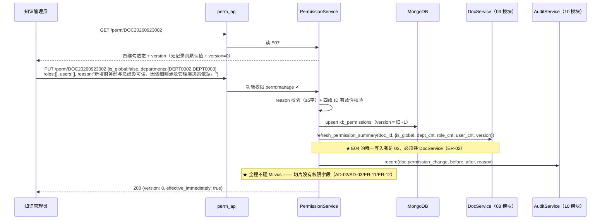
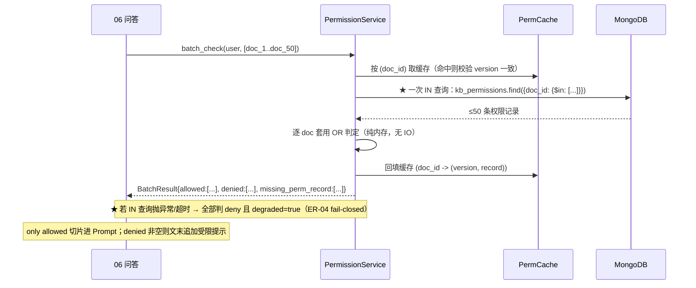
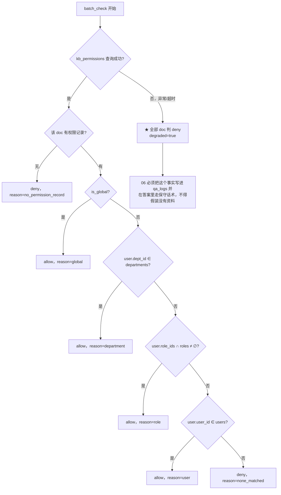

# 05 · 四维数据权限与鉴权引擎

> **文档编号**：04_模块Spec / 05
> **所属项目**：knowledge_manager（PRD 2.9）
> **上游依据**：`00_模块划分与边界.md` · `01_数据实体/数据实体设计.md`（E07）· `02_概要设计/概要设计.md`（AD-02 / AD-03 / AD-04 / AD-08）
> **对应原型**：`03_原型图/04_四维数据权限配置弹窗.pen`
> **状态**：Step 4 产物 · 待评审
> **错误码前缀**：`PERM`（见总纲 §3）
> **★ 本模块是 2.9 的核心**：PRD 2.9.4 的「四维混合数据权限」与「鉴权检索与未授权拦截」全部落在这里。

---

## 1. 模块职责与边界

### 1.1 做什么

| # | 职责 | 对应 PRD | 对应原型 |
|---|---|---|---|
| 1 | **四维权限配置**：全局 / 部门 / 角色 / 个人 四维的读、写、回显 | 2.9.4 | `04` 弹窗 |
| 2 | **鉴权判定引擎**：给定用户上下文 + 文档，判定 `allow` / `deny` | 2.9.4 | `04` 弹窗的「判定逻辑」区 |
| 3 | **批量判定**（一次 `IN` 查完，防 N+1） | 概要设计 §3.3 第 3 步 | — |
| 4 | **鉴权判定接口** `POST /perm/check`（PRD 验收明确要求「调用鉴权接口」） | 2.9.4 | `08` 矩阵行 8 ★ |
| 5 | **权限变更即时生效**：变更不动 Milvus，鉴权实时判定 | 2.9.4 | `04` 弹窗「生效说明」 |
| 6 | **受限提示语义产出**：`denied` 非空 → 供 06 生成「部分参考资料因权限受限无法展示」 | 2.9.4 | — |
| 7 | 权限变更**审计留痕**（含 `before`/`after` + 变更原因） | 2.9.8 / G-11 | `04` 弹窗「变更原因」 |

### 1.2 不做什么（**本模块的边界极其重要**）

| 不做 | 归属 | 原因 |
|---|---|---|
| **功能权限**（菜单 / 按钮 / 接口能不能用） | **01 登录与功能权限** | 两套权限体系**完全独立**（原型 `08` 标注第 1 条）。本模块只回答「能不能读这篇知识」 |
| 检索 / 召回 / 重排 / 生成 | **06 AI 鉴权问答** | 本模块只提供 `allow/deny` 判定，不碰检索 |
| 部门树 / 用户 / 角色的维护 | **02 组织架构** | 本模块只**读** `sys_users` / `sys_departments` / `sys_user_roles` |
| 写 `kb_documents.permission_summary` | **03 知识单元与分类** | E04 的唯一写入者是 03（ER-02）。本模块**必须调** `DocService.refresh_permission_summary()` |
| Milvus 侧的 `expr` 权限过滤 | — | **明确禁止**（ER-11）：权限变了要即时生效，不能回写向量库 |
| 在切片上冗余权限字段 | — | **明确禁止**（ER-12） |

### 1.3 归属实体

| 实体 | 集合 | 本模块权限 |
|---|---|---|
| E07 知识单元数据权限 | `kb_permissions` | **唯一写入者**（ER-02） |
| E04 知识单元 | `kb_documents` | **只读**（且只能经 `DocService` 刷新摘要） |
| E08 部门 / E09 用户 / E10 角色 / E11 用户角色绑定 | `sys_*` | **只读** |
| E21 审计日志 | `audit_logs` | 只经 `AuditService` 写（ER-05） |

### 1.4 权限语义（PRD 2.9.4 原文级落地）

```
   allow(user, doc) =
        perm.is_global
     OR (user.dept_id ∈ perm.departments)          ← 精确匹配，不含子部门（G-02）
     OR (user.role_ids ∩ perm.roles ≠ ∅)
     OR (user.user_id ∈ perm.users)
```

| 规则 | 内容 | 出处 |
|---|---|---|
| **R-1 OR 逻辑** | 四维满足**任意一项**即可读 | PRD 2.9.4；原型 `04` 的「判定逻辑」区 |
| **R-2 默认拒绝** | `is_global` 默认 `false`；**无权限记录时一律不可读**（不能因为查不到记录就放行） | PRD 2.9.4「默认状态下知识单元无任何公开访问权限」；原型 `04` 的 `gTxtS` 警告文案 |
| **R-3 部门精确匹配** | 授权「财务部」**不含**「财务部/报销组」 | 悬空点 **G-02 已确认** |
| **R-4 fail-closed** | 权限查询失败 / 超时 / 数据异常 → **一律拒绝** | 总纲 **ER-04** |
| **R-5 即时生效** | 权限只存文档级，鉴权在应用层实时判定，**不回写 Milvus** | **AD-02 / AD-03** |
| **R-6 唯一性** | 一个文档最多一条权限记录（`doc_id` 唯一索引） | 实体设计 E07 |
| **R-7 版本号** | 每次变更 `version+1`（用于缓存与审计追溯） | 实体设计 E07 |

### 1.5 依赖模块

| 方向 | 模块 | 用途 |
|---|---|---|
| 依赖 | 00 公共基础 | 配置、错误、统一响应、Mongo 连接 |
| 依赖 | 01 登录与功能权限 | 提供**用户上下文**（`user_id` / `dept_id` / `role_ids`）；`/perm/check` 用 `perm:check` 功能权限码 |
| 依赖 | 02 组织架构 | 读部门与用户角色；组织变更时经 `PermissionCache` 失效 |
| 依赖 | 03 知识单元与分类 | **经 `DocService`** 刷新 `permission_summary`、校验 `doc_id` 存在且未软删除 |
| 依赖 | 10 审计日志 | `AuditService.record()` |
| **被依赖** | **06 AI 鉴权问答** | **问答链路每一步都必须过本模块的 `batch_check()`**（ER-03） |
| 被依赖 | 03 / 07 / 08 | 展示权限标签、候选 FAQ 的关联文档、缺口的建议分类 |

---

## 2. 数据契约

### 2.1 E07 · 知识单元数据权限 `kb_permissions`

| 字段 | 类型 | 必填 | 默认 | 说明 |
|---|---|:--:|---|---|
| `_id` | string | ✔ | — | 权限记录编号 `PM{6位序列}` |
| `doc_id` | string | ✔ | — | 关联 E04，**唯一** |
| `is_global` | bool | ✔ | **`false`** | 全局公开；**默认关闭**（PRD：默认无任何公开访问权限） |
| `departments` | array\<string\> | ✔ | `[]` | 部门 ID 列表（**精确匹配，不含子部门**，G-02） |
| `roles` | array\<string\> | ✔ | `[]` | 角色 ID 列表 |
| `users` | array\<string\> | ✔ | `[]` | 用户 ID 列表（特例授权） |
| `version` | int | ✔ | `1` | 权限版本，每次变更 `+1` |
| `reason` | string | | — | **最近一次**变更原因（≥ 5 字，G-11） |
| `updated_by` | string | ✔ | — | 最后操作人 |
| `created_at` / `updated_at` | long | ✔ | — | 时间戳 |

**索引**

| 索引 | 用途 |
|---|---|
| **唯一 `doc_id`** | 鉴权主查询 —— **全系统最高频的查询** |
| `is_global` | 统计公开知识数（看板） |
| `departments` | 反查「该部门被授权了哪些文档」（部门删除前置校验 `ORG-3008`） |
| `roles` / `users` | 同上，用于管理端排查 |

> ⚠️ **不建 `doc_id + version` 复合索引**：`doc_id` 已唯一，复合索引无意义。

### 2.2 内存结构：判定结果缓存

```python
class PermCache:
    """按 (doc_id, version) 缓存权限记录，避免问答里重复查库。

    为什么按 version 做 key：权限变更必然 version+1，旧 key 自然失效，
    不需要任何主动失效逻辑 —— 这是 version 字段最主要的存在意义。
    """
    _items: dict[str, tuple[int, PermRecord]]   # doc_id -> (version, record)
    _ttl: int = 300                            # 秒；兜底防内存泄漏
```

### 2.3 用户上下文（**本模块的输入契约，由 01 提供**）

```python
@dataclass(frozen=True)
class UserContext:
    user_id: str
    dept_id: str          # 当前部门（单值，见 OQ-02-04）
    role_ids: frozenset[str]
```

> **关键点**：判定**只依赖这个快照**，不再查 `sys_users`。
> 因此**用户调岗后下一次请求立即按新部门判定**（配合 02 模块的 `PermissionCache.invalidate_user()`）。

---

## 3. 接口清单

### 3.1 `GET /api/v1/perm/{doc_id}` — 读取权限配置

| 项 | 内容 |
|---|---|
| 功能权限 | `perm:manage` |
| 出参 | `{ "doc_id", "doc_title", "is_global", "departments": [{"dept_id","name"}], "roles": [{"role_id","code","name"}], "users": [{"user_id","real_name","dept_name"}], "version", "updated_by", "updated_at" }` |
| 回显语义 | 原型 `04` 弹窗的 `dlgSub` 显示「DOC编号 · 标题」；四维分组分别回显勾选态 |
| 无记录时 | 返回**默认值**（`is_global=false`，四维全空），且 `"version": 0` —— 表示"尚未配置"，前端据此提示「当前无人可读」 |

> **为什么无记录不返回 404**：原型 `04` 的 `gTxtS` 明确提示「关闭且其余三维全空时，该知识单元对所有人都不可读」——
> 这是**合法的初始状态**，不是错误。用 `version=0` 区分"未配置"与"已配置"。

### 3.2 `PUT /api/v1/perm/{doc_id}` — 保存四维权限

| 项 | 内容 |
|---|---|
| 功能权限 | `perm:manage` |
| 入参 | `{ "is_global": bool, "departments": [id...], "roles": [id...], "users": [id...], "reason": string }` |
| 出参 | `{ "doc_id", "version": int, "effective_immediately": true }` |

**服务端规则（逐条对应错误码）**

| # | 规则 | 失败码 |
|---|---|---|
| 1 | `reason` 必填且 ≥ 5 字（**G-11 已确认「需要」**，原型 `04` 的 `rsL` 标 `*` 并注明「将写入审计」） | `PERM-1001` |
| 2 | `doc_id` 存在、未被软删除 | `PERM-3001` |
| 3 | `departments` 中每个 ID 都在 `sys_departments` 存在且 `active` | `PERM-1002` |
| 4 | `roles` 中每个 ID 都在 `sys_roles` 存在 | `PERM-1003` |
| 5 | `users` 中每个 ID 都在 `sys_users` 存在 | `PERM-1004` |
| 6 | 四维列表**去重**，单维长度上限 **200** | `PERM-1005` |
| 7 | **允许配成"全员不可读"**（`is_global=false` 且三维全空）—— 这是合法状态，只是记一条 `WARN` 日志 | 不报错 |
| 8 | upsert E07，`version = 旧version + 1`（不存在则 `1`） | `PERM-4001` |
| 9 | **经 `DocService.refresh_permission_summary(doc_id, summary)`** 刷新 E04 的 `permission_summary`（**不得直连 `kb_documents`**，ER-02） | `PERM-4002` |
| 10 | **经 `AuditService.record("doc.permission_change", before, after)`** 写审计（ER-05） | 降级不阻断 |
| 11 | **不触碰 Milvus**（R-5 / ER-11 / ER-12） | — |

**`permission_summary` 的计算口径（必须与 03 模块一致）**

```jsonc
{
  "is_global": false,
  "dept_cnt": 2,        // departments 长度
  "role_cnt": 1,        // roles 长度
  "user_cnt": 0,        // users 长度
  "version": 7          // ★ 带上版本，便于 03 判断摘要是否过期
}
```

> ⚠️ **`permission_summary` 只用于台账列表展示「权限标签」，绝不是鉴权依据**（实体设计 E04 明确警告）。
> 鉴权**只**读 E07。若摘要与 E07 不一致，**以 E07 为准**。

### 3.3 `POST /api/v1/perm/check` — **鉴权判定接口**（PRD 验收明确要求）

| 项 | 内容 |
|---|---|
| 功能权限 | `perm:check`（**三角色都有** —— 原型 `08` 标注第 5 条：它只返回判定结果，不泄漏知识内容） |
| 入参 | `{ "doc_id": string, "user_id"?: string }` |
| 出参 | `{ "doc_id", "allowed": bool, "reason_code": "global" \| "department" \| "role" \| "user" \| "no_permission_record" \| "none_matched", "evaluated_as": { "user_id", "dept_id", "role_ids" }, "version": int }` |

**语义要点**

| 要点 | 说明 |
|---|---|
| `user_id` 可省略 | 省略时判定**当前登录用户**；显式传入时只有 `sys_admin`（`user:manage`）可代查他人，否则 `PERM-2001` |
| `reason_code` | 让调用方知道"为什么放行/拒绝"，便于排障；**不返回文档内容** |
| HTTP 状态 | **恒为 200**（判定本身是成功操作）；只有参数错才是 400 |
| 对应验收 | PRD 2.9.4 要求"调用鉴权接口"验证拦截效果 —— 这个接口就是验收入口 |

**判定过程的中间态（内部接口，不对外）**

```python
# 06 问答模块调用的内部接口（不经 HTTP）
async def batch_check(user: UserContext, doc_ids: Sequence[str]) -> BatchResult:
    """一次 IN 查询完成全部判定（ER-13）。"""

@dataclass
class BatchResult:
    allowed: list[str]                    # 放行的 doc_id
    denied: list[str]                     # 拦截的 doc_id
    denied_detail: dict[str, str]         # doc_id -> reason_code（供受限提示与排查）
    missing_perm_record: list[str]        # 无权限记录的 doc_id（= 默认拒绝）
    degraded: bool = False                # ★ 是否发生过 fail-closed 降级
```

### 3.4 接口一览

| 方法 | 路径 | 功能权限 | 说明 |
|---|---|---|---|
| GET | `/api/v1/perm/{doc_id}` | `perm:manage` | 权限配置回显（无记录返回默认值 + `version=0`） |
| PUT | `/api/v1/perm/{doc_id}` | `perm:manage` | 保存四维权限 + 原因 |
| POST | `/api/v1/perm/check` | `perm:check` | **鉴权判定接口**（对外验收入口） |

**内部接口（Python 层，不经 HTTP）**

| 函数 | 调用方 | 说明 |
|---|---|---|
| `check(user, doc_id) -> bool` | 03 单文档操作、08 缺口转建 | 单文档判定 |
| `batch_check(user, doc_ids) -> BatchResult` | **06 问答**（核心） | 批量判定，一次 `IN` |
| `needs_notice(result) -> bool` | 06 问答 | `len(denied) > 0` |
| `build_notice(result) -> str` | 06 问答 | 生成「部分参考资料因权限受限无法展示」文案 |

---

## 4. 关键流程

### 4.1 权限配置（保存 → 即时生效）



### 4.2 问答链路中的鉴权（**本模块的主战场**）



**逐步说明**

| 步 | 动作 | 为什么这样做 |
|---|---|---|
| 1 | 收 `doc_ids`（可能 50 个，来自放大 5 倍召回） | **AD-04**：放大召回是为补偿过滤损耗 |
| 2 | **一次 `$in` 查询** | **ER-13**：否则 50 个切片 = 50 次查询（N+1） |
| 3 | 缺失记录的 doc → 判 **deny** | **R-2 默认拒绝**（PRD：默认无任何公开访问权限） |
| 4 | 纯内存套用 OR 判定 | 无额外 IO，50 条判定耗时 < 1ms |
| 5 | 返回 `BatchResult` | 06 据此产出 `allowed_chunks` / `denied_chunks` 三列表（**AD-08**） |
| 6 | 异常 → 全 deny + `degraded=true` | **ER-04 fail-closed**：宁可少答，不可越权 |

### 4.3 fail-closed 的边界（**必须写清，否则会被误当成 bug**）



> **为什么 fail-closed 而不是 fail-open**：本项目的主张是"零越权泄漏"（概要设计 §6）。
> 数据库抖动时放行 = 把私密文档泄漏给全员，**这是不可接受的失败模式**；
> 而拒绝的代价只是"这次没答上来"，用户可重试。

### 4.4 权限变更为什么能"即时生效"（**本项目核心卖点，逐环节说明**）

| 环节 | 传统做法（A 方案：Milvus 侧过滤） | **本项目（B 方案：应用层过滤）** |
|---|---|---|
| 权限存哪 | 每个切片冗余部门/角色/用户数组 | **只存文档级 E07 一条**（AD-03） |
| 改权限时 | 需**批量回写几十万切片**，期间权限不一致 | **只写一条记录**，耗时 < 10ms |
| 何时生效 | 回写完成后才生效（可能几分钟） | **下一次请求立即生效**（AD-02） |
| 检索时 | Milvus `expr` 过滤 | Milvus 只按 `enabled==true` 召回，**应用层按 doc_id 判定** |
| 代价 | — | 召回 Top-K 可能被大量过滤 → **用 AD-04 放大 5 倍补偿** |
| 能否产出 `denied_chunks` | 难（被过滤掉的拿不到） | **能精确产出**（AD-08 的三列表依赖它） |

---

## 5. 错误码表（前缀 `PERM`）

| 错误码 | HTTP | 消息 | 触发条件 |
|---|---|---|---|
| `PERM-1001` | 400 | 变更原因必填且不少于 5 字 | §3.2 规则 1（**G-11**） |
| `PERM-1002` | 400 | 部门不存在或已停用 | `departments` 含无效 ID |
| `PERM-1003` | 400 | 角色不存在 | `roles` 含无效 ID |
| `PERM-1004` | 400 | 用户不存在 | `users` 含无效 ID |
| `PERM-1005` | 400 | 授权项超出数量上限 | 任一维长度 > 200 |
| `PERM-1006` | 400 | 请求参数格式不合法 | 四维中任一不是数组 |
| `PERM-2001` | 403 | 无权代他人查询鉴权结果 | `/perm/check` 传了别人的 `user_id` 但当前用户不是 `sys_admin` |
| `PERM-2002` | 403 | 功能权限不足 | 无 `perm:manage` 却调 GET/PUT `/perm/{doc_id}` |
| `PERM-3001` | 404 | 知识单元不存在或已删除 | `doc_id` 无效 / `deleted_at` 非空 |
| `PERM-3002` | 404 | 权限记录不存在 | 仅内部使用：显式要求"必须已配置"时（对外 GET 返回默认值，不报此错） |
| `PERM-4001` | 500 | 权限保存失败 | Mongo 写入异常（**幂等可重试**） |
| `PERM-4002` | 500 | 权限摘要刷新失败 | `DocService.refresh_permission_summary()` 失败；**权限本身已保存成功**，摘要会在下次保存时修正（记 WARN） |
| `PERM-5001` | 500 | 鉴权判定服务不可用 | 判定过程中出现未预期异常；**调用方必须按 deny 处理**（ER-04） |

> ⚠️ **注意 `PERM-4002` 的语义**：权限记录已写入，只是 E04 的展示摘要没刷新。
> **不影响鉴权正确性**（鉴权只读 E07），所以**不返回给用户错误**，只记 WARN 并异步重试一次。
> 这是"摘要不是鉴权依据"这一设计带来的直接好处。

---

## 6. 验收标准

| 编号 | 验收项 | 判定方式 |
|---|---|---|
| **AC-05-01** | **OR 逻辑**：四种授权方式各自单独生效（全局 / 部门 / 角色 / 个人） | 分别构造 4 组数据，各测一次 allow |
| **AC-05-02** | **默认拒绝**：无 `kb_permissions` 记录时，任何用户都**不可读** | 建文档→不配权限→问答，答案中不得出现该文档内容 |
| **AC-05-03** | **默认拒绝**：`is_global=false` 且三维全空时，**所有人（含 `sys_admin`）不可读** | 同上 |
| **AC-05-04** | **部门精确匹配（G-02）**：授权「财务部」时，「财务部/报销组」的用户**不可读** | 构造父子部门用户对比 |
| **AC-05-05** | **即时生效**：`PUT /perm/{doc_id}` 后**立即**（同一秒）再问答，结果按新权限 | 改权限→立刻提问 |
| **AC-05-06** | **不动 Milvus**：改权限前后 `kb_chunks_v2` 的 `num_entities` 与内容**完全不变** | `describe_collection` + 抽样比对 |
| **AC-05-07** | **无 N+1**：一次问答只产生 **1 次** `kb_permissions` 查询（无论召回多少切片） | 打开 Mongo 慢查询日志计数 |
| **AC-05-08** | **fail-closed**：人为让 Mongo 查询抛异常时，`batch_check` 返回**全部 deny** 且 `degraded=true`；**答案中绝不出现受限内容** | 注入异常后提问 |
| **AC-05-09** | **受限提示**：`denied` 非空时，答案文末出现「部分参考资料因权限受限无法展示」 | 构造"部分可读"场景 |
| **AC-05-10** | **`/perm/check` 对外可用**：三角色都能调，返回 `allowed` + `reason_code`，**响应体不含任何文档内容** | 三角色分别调用并检查响应字段 |
| **AC-05-11** | **`/perm/check` 不越权代查**：普通用户传别人的 `user_id` 返回 `PERM-2001` | 构造请求 |
| **AC-05-12** | **变更原因必填**：`reason` 为空或少于 5 字返回 `PERM-1001`（G-11） | 构造请求 |
| **AC-05-13** | **审计可追溯**：每次权限变更在 `audit_logs` 有一条 `doc.permission_change`，含 `before`/`after` + `reason` | 查 `audit_logs` |
| **AC-05-14** | **version 递增**：连续 3 次保存，`version` 为 1→2→3；缺失记录时 GET 返回 `version=0` | 接口比对 |
| **AC-05-15** | **摘要不参与鉴权**：手工把 `kb_documents.permission_summary` 改成"公开"，鉴权结果**不变**（仍按 E07） | 改库后问答验证 |
| **AC-05-16** | **四维可组合**：同时配部门 + 角色 + 个人时，任一方满足即放行（OR 而非 AND） | 构造"部门不对但角色对"的用户 |

---

## 7. 依赖与前置

| 依赖 | 内容 | 缺失/异常时的降级 |
|---|---|---|
| 00 公共基础 | 配置、错误、统一响应、Mongo 连接 | 无法启动（硬依赖） |
| 01 登录与功能权限 | `UserContext`（`user_id` / `dept_id` / `role_ids`）、`perm:manage` / `perm:check` 权限码 | **硬依赖**：拿不到用户上下文就无法判定。此时一律 deny（ER-04） |
| 02 组织架构 | 部门与角色存在性校验（写权限时） | 校验接口不可用 → 拒绝保存（`PERM-1002/1003`），**不放过无效 ID** |
| 03 知识单元与分类 | `DocService.get_doc()` 校验 `doc_id`；`refresh_permission_summary()` | 摘要是非关键路径 → 失败只记 WARN（`PERM-4002`），**不影响鉴权正确性** |
| 10 审计日志 | `AuditService.record()` | **降级**：审计失败不阻断权限保存，记 ERROR |
| Mongo `kb_permissions`（唯一索引 `doc_id`） | 判定数据源 | **不可用 → 全部 deny 且 `degraded=true`**（ER-04，**这是最关键的一条降级**） |

**前置数据**：无。权限记录按需创建（首次 GET 返回默认值，首次 PUT 创建）。

**性能预算**

| 环节 | 目标 |
|---|---|
| `batch_check`（50 个 doc） | **< 10ms**（1 次 Mongo 查询 + 纯内存判定） |
| `GET /perm/{doc_id}` | < 30ms |
| `PUT /perm/{doc_id}` | < 80ms（含 upsert + 摘要刷新 + 审计） |

---

## 8. 开放问题

| 编号 | 问题 | 现状 | 影响 |
|---|---|---|---|
| ~~**OQ-05-01**~~ | ~~是否新增第 4 个内置角色「部门主管」？~~ | ✅ **已裁定（依 PRD）：不新增内置角色**。PRD 2.9.2 用 `- ` 列表穷举了 3 个角色，属封闭集合。<br>PRD 2.9.9 所需的「管理层角色」由**业务角色**（`is_system=false`）承载，见 `01_..._.md` §2.3 裁定 A。<br>本模块的权限配置对象是 `sys_roles` 的**全部角色**（内置 + 业务），弹窗角色列表**动态调 `GET /org/roles`** | — |
| **OQ-05-02** | 权限变更是否需要支持**批量**（一次给多篇文档配同样权限）？ | 本步**只支持单文档** | 台账页若要多选批量授权需加接口 |
| **OQ-05-03** | 是否需要「**权限模板**」（如"财务部标准模板"）？ | 本步**不做** | 大量同类文档配置繁琐 |
| **OQ-05-04** | `is_global=true` 的文档，是否对**未登录用户**也可读？ | **否**。本系统所有接口都要登录（ER-08），"全局公开"仅指**对所有登录用户**公开 | 若老师理解成"公网可读"需澄清 |
| **OQ-05-05** | 判定结果缓存 TTL 设 **300 秒**是否合适？ | 已按 `version` 做 key，TTL 只是兜底防泄漏 | 基本无影响，可调 |
| **OQ-05-06** | 是否需要在 `perm/check` 里返回**被拒原因的用户可读文案**？ | 当前只返回机器可读的 `reason_code` | 前端若要展示"你无权访问，请联系管理员"需补文案映射 |

**承接的上游悬空点**

| 编号 | 内容 | 本模块处理 |
|---|---|---|
| **G-02** | 部门授权是否含子部门 | ✅ **不含（精确匹配）**：§1.4 R-3 + §4.3 判定树；AC-05-04 专测 |
| **G-04** | 召回放大倍数 5 倍 | 本模块**不实现**放大（属 06），但 §4.2 说明了它是本模块过滤损耗的补偿手段；倍数可配 |
| **G-11** | 四维权限变更是否强制填写原因 | ✅ **需要**：§3.2 规则 1，原型 `04` 的 `rsL` 也标了 `*` |
| **G-12** | 历史问答是否跨用户可见 | 本模块不涉及；相关联的是"同一部门内两人的权限可能不同"，因此**问答日志的可见性不能按部门放行** |
| **C-01** | 切片 `item_name` 必需字段 | 本模块**完全不受影响**（不碰 Milvus），这也正是 AD-02 的价值之一 |
