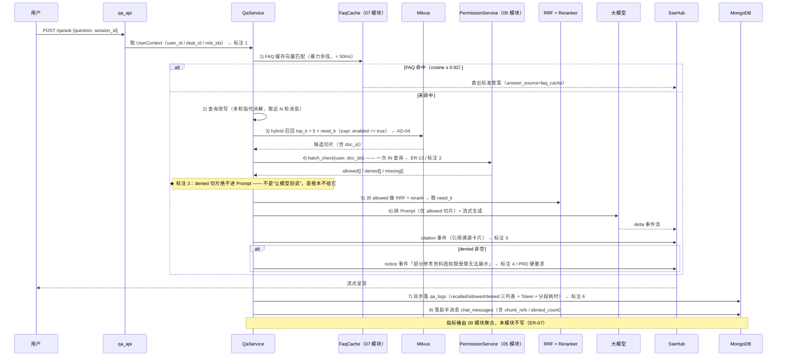
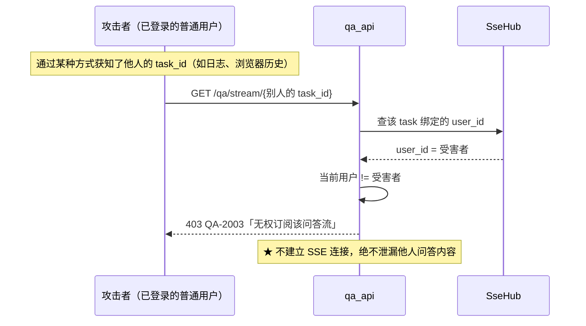
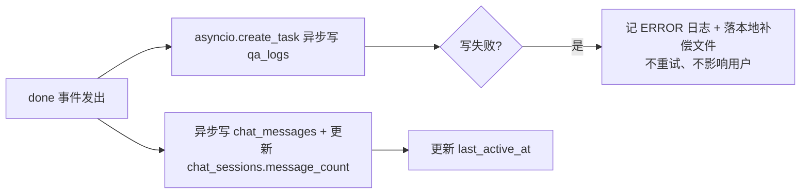

# 06 · AI 鉴权问答

> **文档编号**：04_模块Spec / 06
> **所属项目**：knowledge_manager（PRD 2.9）
> **上游依据**：`00_模块划分与边界.md` · `01_数据实体/数据实体设计.md`（E14 / E02 / E15，读 E01）· `02_概要设计/概要设计.md`（AD-01 / AD-04 / AD-08 / AD-11 / AD-12）
> **对应原型**：`03_原型图/03_AI智能问答工作台.pen`（含 7 条关键需求标注）
> **状态**：Step 4 产物 · 待评审
> **错误码前缀**：`QA`（见总纲 §3）
> **★ 本模块是 2.9 的另一核心**：PRD 2.9.4 的「鉴权检索与未授权拦截」「引用溯源」「多轮上下文」「流式输出」全部落在这里。

---

## 1. 模块职责与边界

### 1.1 做什么

| # | 职责 | 对应原型标注 | 对应 PRD |
|---|---|---|---|
| 1 | **问答主链路**：FAQ 缓存匹配 → 召回 → **鉴权过滤** → RRF/rerank → 拼 Prompt → 流式生成 | 标注 1~3 | 2.9.4 |
| 2 | **鉴权过滤**：调 05 的 `batch_check()`，**被拒切片绝不进 Prompt** | **标注 3** | 2.9.4 |
| 3 | **受限提示**：`denied` 非空时显式标注「部分参考资料因权限受限无法展示」 | **标注 4** | 2.9.4 硬要求 |
| 4 | **引用溯源卡片**：返回切片标题 + 文档标题，可定位原文 | **标注 5** | 2.9.1 |
| 5 | **多轮上下文**：会话消息 + 查询改写（指代消解） | — | 2.9.1 |
| 6 | **SSE 流式输出** + **订阅归属校验** | **标注 7** | 2.9.1 |
| 7 | **问答日志**：三列表 + Token + 分段耗时，落 `qa_logs` | **标注 6** | 2.9.8 |
| 8 | 历史会话侧边栏与消息回溯 | — | 2.9.1 |

### 1.2 不做什么

| 不做 | 归属 |
|---|---|
| **权限判定逻辑本身** | **05 四维数据权限与鉴权引擎**（ER-03：判定**只有一份实现**，本模块只**调用**） |
| **FAQ 的挖掘 / 审核 / 发布** | **07 FAQ 沉淀** |
| **FAQ 缓存的构建与失效** | **07**（E18 的唯一写入者）。06 **只读**，且只能经 `FaqCache.match()` |
| 知识缺口的识别与聚合 | **08 知识缺口**（06 只落日志，不做缺口判定） |
| 指标桶写入 | **09 运营看板**（06 只落 `qa_logs`，09 负责聚合） |
| 文档导入与切片 | **04** |
| 在 Milvus 里做权限过滤 | **禁止**（ER-11） |

### 1.3 归属实体

| 实体 | 集合 | 本模块权限 |
|---|---|---|
| E14 会话 | `chat_sessions` | **唯一写入者**（ER-02） |
| E02 会话消息 | `chat_messages` | **唯一写入者** |
| E15 问答日志 | `qa_logs` | **唯一写入者**（ER-06：07/08/09 只读） |
| E01 切片 | `kb_chunks_v2`（Milvus） | **只读**（写属 04） |
| E18 FAQ 缓存 | 进程内 | **只读**（写属 07） |
| E07 四维权限 | `kb_permissions` | **只读，且只能经 `PermissionService`**（ER-03） |
| E04 知识单元 | `kb_documents` | **只读**（引用溯源取标题） |

### 1.4 与存量的关系（`shopkeeper_brain`）

| 环节 | 存量 | 2.9 的改造 | 冲突编号 |
|---|---|---|---|
| 查询图入口 | **商品名确认**（电商专用） | **必须拆除**，改为「意图识别 + （可选）指代消解」 | **C-04** |
| 节点中文名映射 | 含 `item_name_recognition` 等 | 改为 2.9 的阶段名映射 | **C-05** |
| SSE 订阅 | `task_id` 随机但**不校验订阅者身份** | **新增归属校验**（任何人拿到 task_id 就能窃听） | 见 §4.5 |
| 消息表 | `chat_message` **无 `user_id`** | 新集合 `chat_messages`（复数），带 `user_id` | **C-02** |
| 检索通道 | 向量 / HyDE / **WebSearch** 多路 | 保留向量（dense+sparse）+ 可选 HyDE；**WebSearch 默认关闭** | **D-06** |
| 商品名向量集合 | `ITEM_NAME_COLLECTION` | **废弃** | 实体设计 §1 |

### 1.5 依赖模块

| 方向 | 模块 | 用途 |
|---|---|---|
| 依赖 | 00 公共基础 | 配置、错误、统一响应、Mongo/Milvus 连接、`SseHub`（含归属校验）、`TaskRunner` |
| 依赖 | 01 登录与功能权限 | `UserContext`；`qa:use` / `qa:history` 权限码 |
| 依赖 | **05 四维数据权限与鉴权引擎** | `batch_check()` —— **本模块的鉴权唯一入口** |
| 依赖 | 04 文档导入 | Milvus 集合 `kb_chunks_v2` 的结构与索引（只读） |
| 依赖 | 07 FAQ 沉淀 | `FaqCache.match()`（只读） |
| 依赖 | 03 知识单元与分类 | 引用溯源取文档标题（只读） |
| 依赖 | 10 审计日志 | 鉴权拒绝可留痕（`auth.denied`，可选） |

---

## 2. 数据契约

### 2.1 E14 · 会话 `chat_sessions`

| 字段 | 类型 | 必填 | 说明 |
|---|---|:--:|---|
| `_id` | string | ✔ | 会话编号 `SESS{...}` |
| `user_id` | string | ✔ | 发起人（**鉴权与 UV 统计的关键**） |
| `title` | string | ✔ | 会话标题 = **首轮提问前 20 字** |
| `message_count` | int | ✔ | 消息数（原型 `s1S` 显示「6 轮」） |
| `last_active_at` | long | ✔ | 最后活跃（会话列表排序） |
| `created_at` | long | ✔ | — |

**索引**：`user_id + last_active_at desc`（侧边栏按人按时间）。
**保留**：永久。

### 2.2 E02 · 会话消息 `chat_messages`（**改造：新增 5 个字段**）

| 字段 | 类型 | 必填 | 变更 | 说明 |
|---|---|:--:|---|---|
| `_id` | ObjectId | ✔ | 沿用 | — |
| `session_id` | string | ✔ | 沿用 | 关联 E14 |
| `role` | enum | ✔ | 沿用 | `user` / `assistant`（枚举组 `message_role`） |
| `text` | string | ✔ | 沿用 | 消息正文（助手消息为**完整答案**，非流式分片） |
| `rewritten_query` | string | | 沿用 | 改写后的查询（多轮指代消解产物） |
| `ts` | long | ✔ | 沿用 | 时间戳 |
| `user_id` | string | ✔ | **新增** | **鉴权必需**（冲突 C-02：存量没有） |
| `chunk_refs` | array | | **新增** | `[{chunk_id, doc_id, title}]` —— **引用溯源卡片**的数据源（标注 5） |
| `denied_count` | int | | **新增** | 本轮被拦截的切片数 → 前端据此渲染 `deniedT` 提示条 |
| `token_usage` | object | | **新增** | `{prompt, completion, total}` |
| `elapsed_ms` | int | | **新增** | 本轮端到端耗时 |

**索引**：`session_id + ts`。
**删除字段**：`item_names`（电商专用，2.9 无用）。

**保留**：永久。

### 2.3 E15 · 问答日志 `qa_logs`（**新建，一表两用**）

> 一表两用：① 运营看板的数据源（09 只读）② FAQ 挖掘与知识缺口识别的原料（07/08 只读）。

| 字段 | 类型 | 必填 | 说明 |
|---|---|:--:|---|
| `_id` | string | ✔ | 日志编号 `QL{...}` |
| `request_id` | string | | **幂等键**（同 `request_id` 重复提交只落一条） |
| `session_id` / `user_id` | string | ✔ | 会话与用户 |
| `dept_id` | string | ✔ | **提问时所属部门快照**（调岗后统计仍准确） |
| `role_ids` | array | ✔ | **提问时角色快照** |
| `question` | string | ✔ | 原始提问 |
| `rewritten_query` | string | | 改写后查询 |
| `asked_at` | long | ✔ | 提问时间 |
| `recalled_chunks` | array | ✔ | **全部召回** `[{chunk_id, doc_id, score}]`（含被拦截的，标注 6） |
| `allowed_chunks` | array | ✔ | 鉴权**通过**的切片 ID |
| `denied_chunks` | array | ✔ | 鉴权**拦截**的切片 ID（含 `doc_id`） |
| `faq_hit` | bool | ✔ | 是否命中 FAQ 缓存直出 |
| `answer_source` | enum | ✔ | `faq_cache` / `rag` / `no_knowledge` |
| `token_usage` | object | | `{prompt, completion, total}` |
| `elapsed_ms` | int | ✔ | 端到端耗时 |
| `retrieval_ms` / `rerank_ms` / `auth_ms` / `llm_ms` | int | | **分段耗时**（定位瓶颈；`auth_ms` 是 2.9 新增的观测点） |
| `max_score` | float | | 最高相似度（**知识缺口判定**要用，08 读） |
| `degraded` | bool | | 本轮是否发生降级（如鉴权 fail-closed、rerank 跳过） |
| `feedback` | object \| null | | `{rating: up/down, comment, at}`（PRD 未要求，预留） |

**索引**：`asked_at desc`（+**TTL 180 天**）；`user_id + asked_at desc`；`session_id`；`faq_hit`；`max_score`；唯一 `request_id`（稀疏索引）。

### 2.4 `answer_source` 的语义边界（**容易混淆，必须写清**）

| 场景 | `faq_hit` | `answer_source` | `denied_chunks` | 前端表现（原型） |
|---|:--:|---|---|---|
| FAQ 缓存命中直出 | `true` | `faq_cache` | `[]` | 直接出标准答案（毫秒级） |
| 正常 RAG 回答 | `false` | `rag` | `[]` | `bdRagT`「RAG · 已鉴权过滤」+ 引用卡片 |
| 库中确实没有资料 | `false` | `no_knowledge` | `[]` | 兜底话术「知识库中暂无相关内容」 |
| **找到了但全部被拦截** | `false` | `no_knowledge` | **非空** | **`deniedT` 警告条 + 保守话术**（原型第 3 轮） |
| **找到了，部分被拦截** | `false` | `rag` | **非空** | 正常回答 + 文末受限提示（标注 4） |

> ⚠️ **为什么"全被拦截"不新增一个 `answer_source` 枚举值**：
> 枚举在 Step 1 已冻结（`faq_cache` / `rag` / `no_knowledge`）。
> 用 **`denied_chunks` 是否为空**即可区分「真没有」与「有但无权」——
> **零枚举变更，且信息量等价**。前端判断条件：`answer_source == "no_knowledge" && denied_count > 0`。

---

## 3. 接口清单

### 3.1 `POST /api/v1/qa/ask` — 提问（**同步返回 task_id**）

| 项 | 内容 |
|---|---|
| 功能权限 | `qa:use` |
| 入参 | `{ "question": string, "session_id"?: string, "request_id"?: string }` |
| 出参 | `{ "task_id": string, "session_id": string, "message_id": string, "stream_url": "/api/v1/qa/stream/{task_id}" }` |

**服务端规则**

| # | 规则 | 失败码 |
|---|---|---|
| 1 | `question` 非空，长度 1~500 | `QA-1001` |
| 2 | `session_id` 省略则**新建会话**（标题取 question 前 20 字）；提供则校验**归属当前用户** | `QA-3001`（不存在）/ `QA-2001`（非本人） |
| 3 | `request_id` 提供且已存在 → **幂等返回原 `task_id`**，不重复执行 | — |
| 4 | 取当前用户上下文（`UserContext`） | `QA-2002`（上下文缺失 → 401，标注 1） |
| 5 | 落用户消息到 `chat_messages` | `QA-4001` |
| 6 | 注册 `task_id` 到 `SseHub`，**绑定 `user_id`** | — |
| 7 | 异步启动问答链路（`asyncio.create_task`），**接口立即返回** | — |

> **为什么先返回 task_id 再流式推送**：LLM 首 token 可能需要数百毫秒到数秒；
> 同步等待会让前端感觉卡死。返回 `task_id` 后前端立刻打开 SSE，**首字节到达即可展示"正在思考"**。

### 3.2 `GET /api/v1/qa/stream/{task_id}` — SSE 流式答案

| 项 | 内容 |
|---|---|
| 功能权限 | `qa:use` |
| 归属校验 | **必须**：`SseHub` 中该 `task_id` 绑定的 `user_id` == 当前用户（**ER-14 / 标注 7**） |
| Content-Type | `text/event-stream` |

**SSE 事件契约**

```
event: meta
data: {"task_id":"...","session_id":"...","faq_hit":false,"answer_source":"rag","recalled":50,"allowed":7,"denied":43}

event: delta
data: {"text":"根据《差旅报销标准（2026版）》："}

event: citation
data: {"citations":[{"idx":1,"chunk_id":...,"doc_id":"DOC...","title":"第三章 住宿标准","doc_title":"差旅报销标准（2026版）"}]}

event: notice
data: {"notice":"部分参考资料因权限受限无法展示","denied_count":43}

event: done
data: {"message_id":"...","token_usage":{"prompt":1280,"completion":186,"total":1466},"elapsed_ms":8340,"retrieval_ms":820,"auth_ms":6,"rerank_ms":410,"llm_ms":6900}

event: error
data: {"code":"QA-4002","message":"大模型调用失败，请稍后重试"}
```

| 事件 | 时机 | 说明 |
|---|---|---|
| `meta` | 立即 | 携带召回/放行/拦截数量，前端可先渲染 `bdRagT` 徽标 |
| `delta` | 流式 | 增量文本 |
| `citation` | 生成结束前 | 引用溯源卡片（标注 5） |
| `notice` | **仅当 `denied > 0`** | 受限提示（标注 4，**PRD 硬要求**） |
| `done` | 结束 | Token 与分段耗时 |
| `error` | 异常 | 业务错误码 |

**归属校验失败**：返回 `QA-2003`（HTTP 403），**不建立流**。

### 3.3 `GET /api/v1/qa/sessions` — 历史会话侧边栏

| 项 | 内容 |
|---|---|
| 功能权限 | `qa:history` |
| 入参 | `?keyword=&page=&page_size=` |
| 出参 | `{ "items": [ { "session_id", "title", "message_count", "last_active_at" } ], "total", "page", "page_size" }` |
| **范围** | **仅本人**（`user_id == 当前用户`）—— **G-12 已确认：历史问答不跨用户可见** |
| 对应原型 | 侧边栏「历史会话」区（`s1T`/`s1S` 的「今天 10:24 · 6 轮」） |

### 3.4 `GET /api/v1/qa/sessions/{session_id}/messages` — 会话消息与溯源

| 项 | 内容 |
|---|---|
| 功能权限 | `qa:history`（**仅本人**） |
| 入参 | `?page=&page_size=` |
| 出参 | `{ "session_id", "messages": [ { "message_id", "role", "text", "chunk_refs": [...], "denied_count", "token_usage", "elapsed_ms", "ts" } ] }` |
| 说明 | `chunk_refs` 即引用溯源卡片；`denied_count > 0` 时前端渲染警告条 |

### 3.5 `POST /api/v1/qa/messages/{message_id}/feedback` — 答案反馈（预留）

| 项 | 内容 |
|---|---|
| 功能权限 | `qa:feedback` |
| 入参 | `{ "rating": "up" \| "down", "comment"?: string }` |
| 出参 | `{ "message_id", "rating" }` |
| 说明 | 写 `qa_logs.feedback`；PRD 未要求，**预留**（且**`qa:feedback` 权限码已并入三内置角色**） |

### 3.6 接口一览

| 方法 | 路径 | 功能权限 | 说明 |
|---|---|---|---|
| POST | `/api/v1/qa/ask` | `qa:use` | 提问，同步返回 `task_id` |
| GET | `/api/v1/qa/stream/{task_id}` | `qa:use` | SSE 流式答案（**校验归属**） |
| GET | `/api/v1/qa/sessions` | `qa:history` | 会话侧边栏（仅本人） |
| GET | `/api/v1/qa/sessions/{id}/messages` | `qa:history` | 会话消息与溯源（仅本人） |
| POST | `/api/v1/qa/messages/{id}/feedback` | `qa:feedback` | 答案反馈（预留） |

---

## 4. 关键流程

### 4.1 问答主链路（**全项目最核心的一张图**）



### 4.2 召回与鉴权的参数关系（**AD-04 的量化说明**）

| 参数 | 默认 | 含义 | 调小的后果 | 调大的后果 |
|---|---|---|---|---|
| `need_k` | 10 | 最终喂给 rerank/LLM 的切片数 | 上下文不足，答不全 | 超长 Prompt，成本上升 |
| `recall_multiplier` | **5** | 召回放大倍数（**G-04**） | **鉴权过滤后可能不足 need_k** → 漏答 | Milvus/rerank 开销线性上升 |
| `recall_top_k` | `5 × need_k = 50` | 实际向 Milvus 请求的条数 | — | — |

```
若召回 50 条中只有 3 条 allowed（权限收得很紧）
  → 最终只喂 3 条（不足 need_k=10）→ 答案可能不完整
  → 这是正确行为，不是 bug：宁可答得少，不可越权
  → 前端 meta 事件会显示 "recalled:50 allowed:3 denied:47"，便于观测
```

### 4.3 查询改写（多轮指代消解）

```mermaid
flowchart TD
    A[当前提问] --> B{是首轮?}
    B -->|是| C[直接使用原问题]
    B -->|否| D[取本会话近 5 轮消息]
    D --> E[调大模型做指代消解<br/>"那高管的薪酬呢" → "高管的薪酬和股权激励是怎么规定的"]
    E --> F{改写失败/超时?}
    F -->|是| G[降级：用原问题检索<br/>qa_logs.degraded=true]
    F -->|否| H[用改写后问题检索<br/>写 chat_messages.rewritten_query]
    C --> I[进入召回]
    G --> I
    H --> I
```

> **改造要点（冲突 C-04）**：存量的查询图**入口是「商品名确认」节点**——那是电商逻辑，
> 通用知识库会被它误拦。2.9 的入口改为「**意图识别 + （可选）指代消解**」：
> - 首轮 → 直接检索
> - 多轮 → 指代消解后检索
> - **不引入任何"确认商品名/确认实体"的前置步骤**

### 4.4 受限提示的三种形态（**标注 4 的完整落地**）

| 情况 | `allowed` | `denied` | 答案 | 文末提示 | 前端元素 |
|---|:--:|:--:|---|---|---|
| 全部可读 | 非空 | `[]` | 正常 RAG 回答 | 无 | 引用卡片 |
| **部分受限** | 非空 | 非空 | 用 allowed 正常回答 | **「部分参考资料因权限受限无法展示」** | 引用卡片 + 提示 |
| **全部受限** | `[]` | 非空 | 保守话术：`我在知识库中检索到了相关文档，但您当前无权查阅……` | **同上** | `deniedT` 警告条（原型第 3 轮） |
| 库里真没有 | `[]` | `[]` | 「知识库中暂无相关内容，已记录该问题」 | 无 | 兜底话术 |

> ⚠️ **保守话术的边界**：全部受限时**不得**用大模型凭空作答，也**不得**透露被拒文档的**标题或内容**。
> 原型里展示的「检测到相关制度文档，但您当前所属部门/角色无权查阅该内容」是**允许**的粒度——
> 它只说明「存在相关文档」，不泄漏标题。**此口径已裁定（见 §8 OQ-06-02）**，与 PRD 2.9.9 示例场景原文一致。

### 4.5 SSE 订阅归属校验（**修补存量的真实安全缺陷**）



| 要点 | 说明 |
|---|---|
| 绑定时机 | `POST /qa/ask` 时把 `task_id → user_id` 写入 `SseHub` |
| 校验时机 | `GET /qa/stream/{task_id}` **建立流之前** |
| 过期清理 | `task_id` 在 `done`/`error` 后 **5 分钟**回收，防止内存泄漏 |
| 存量对比 | 存量 `sse_util` **无此校验** —— 任何人拿到 `task_id` 就能窃听（概要设计 §4.4 明确点名） |

### 4.6 异步落日志（不阻塞流式输出）



> **为什么异步**：日志写入若同步执行，会给每轮问答额外增加 10~30ms；
> 而 `qa_logs` 是**看板与挖掘的原料**，允许极小概率丢失（有补偿文件兜底）。
> 概要设计 §7 对此的结论是「**异步写**（问答返回后触发，不阻塞流式输出）」。

---

## 5. 错误码表（前缀 `QA`）

| 错误码 | HTTP | 消息 | 触发条件 |
|---|---|---|---|
| `QA-1001` | 400 | 提问内容不合法 | 空 / 长度 > 500 |
| `QA-1002` | 400 | 反馈参数不合法 | `rating` 不是 `up`/`down` |
| `QA-1003` | 400 | 会话编号格式不合法 | `session_id` 非 `SESS` 前缀 |
| `QA-2001` | 403 | 无权访问该会话 | `session_id` 不属于当前用户（**G-12**） |
| `QA-2002` | 401 | 用户上下文缺失 | 标注 1：无法取得 `user_id`/`dept_id`/`role_ids`，**不允许未登录问答** |
| `QA-2003` | 403 | 无权订阅该问答流 | **SSE 归属校验失败**（§4.5 / 标注 7 / ER-14） |
| `QA-3001` | 404 | 会话不存在 | `session_id` 无效 |
| `QA-3002` | 404 | 消息不存在 | `message_id` 无效 |
| `QA-3003` | 409 | 会话已超过消息上限 | 单会话 > 200 条（防上下文爆炸） |
| `QA-4001` | 500 | 消息保存失败 | Mongo 异常 |
| `QA-4002` | 502 | 大模型调用失败 | LLM 超时 / 鉴权失败 / 限流（**SSE 走 `error` 事件**） |
| `QA-4003` | 503 | 向量检索不可用 | Milvus 连接失败 → 降级为无检索，`answer_source=no_knowledge`，`degraded=true` |
| `QA-4004` | 503 | Rerank 模型不可用 | **降级**：跳过重排，直接用 RRF 融合结果，`degraded=true` |
| `QA-4005` | 503 | Embedding 模型不可用 | 无法向量化 → 无法检索 → `no_knowledge` 兜底（**FAQ 缓存也失效**，因为它同样依赖向量） |
| `QA-4006` | 500 | 问答日志写入失败 | 异步写失败，**仅记日志，不返回给用户**（此处供运维查询用） |

> **注意**：`QA-4003/4004/4005` 是**降级类**错误，多数情况下**不直接抛给用户**，
> 而是记录 `qa_logs.degraded=true` 并走兜底话术；只有完全无法产出任何回答时才用 `error` 事件告知。

---

## 6. 验收标准

> **下列 AC-06-01 ~ AC-06-07 直接对应原型 `03` 的 7 条关键需求标注**，是本模块的验收主干。

| 编号 | 验收项 | 对应标注 | 判定方式 |
|---|---|---|---|
| **AC-06-01** | **未登录不可问答**：无 JWT 调 `/qa/ask` 返回 401；问答链路中始终持有 `user_id`/`dept_id`/`role_ids` | 标注 1 | 无 token 请求 |
| **AC-06-02** | **召回放大 5 倍 + 一次 IN 查询**：召回数为 `5 × need_k`；整个问答只产生 **1 次** `kb_permissions` 查询 | 标注 2 | Mongo 慢日志计数 + 日志核对 |
| **AC-06-03** | **被拒切片绝不进 Prompt**：构造"部分受限"场景，抓取实际发给 LLM 的 Prompt，**不得包含任何 denied 切片内容** | 标注 3 | 拦截 Prompt 逐字检查 |
| **AC-06-04** | **受限提示必现**：`denied` 非空时，SSE 必发 `notice` 事件，文案含「部分参考资料因权限受限无法展示」 | 标注 4 | 构造场景看 SSE |
| **AC-06-05** | **引用溯源卡片**：`citation` 事件含 `chunk_id` / `doc_id` / 切片标题 / 文档标题，且能在 `chat_messages.chunk_refs` 中回放 | 标注 5 | 对照原型 `cite1t`/`cite2t` |
| **AC-06-06** | **问答日志三列表**：`qa_logs` 每轮都有 `recalled_chunks` / `allowed_chunks` / `denied_chunks` **三个非空校验位**（`denied` 可为空数组但字段必须存在）+ `token_usage` + 分段耗时 | 标注 6 | 查库逐字段核对 |
| **AC-06-07** | **SSE 归属校验**：用 A 用户的 `task_id` 以 B 用户身份订阅 → 403 `QA-2003`，且**不建立流** | 标注 7 | 构造越权订阅 |
| **AC-06-08** | **FAQ 缓存命中即直出**：命中时 `faq_hit=true`、`answer_source=faq_cache`、**不调用大模型**，端到端 < 50ms | — | 先发布 FAQ 再问同义问题 |
| **AC-06-09** | **多轮指代消解**：第 2 轮「那高管的薪酬呢」能被改写为独立可检索的问题，`chat_messages.rewritten_query` 非空 | — | 两轮对话后查库 |
| **AC-06-10** | **历史会话仅本人可见**：用户 A 无法通过任何接口读到用户 B 的会话与消息（**G-12**） | — | 交叉请求 |
| **AC-06-11** | **全部受限时保守作答**：不使用大模型凭空生成，且**不泄漏被拒文档的标题与内容** | §4.4 | 构造全拒绝场景逐字检查答案 |
| **AC-06-12** | **分流式输出**：`/qa/ask` 在 **200ms 内**返回 `task_id`，不等 LLM | — | 计时 |
| **AC-06-13** | **降级可见**：停掉 Milvus → `answer_source=no_knowledge` + `degraded=true`，不抛 500；停掉 reranker → 跳过重排仍能作答 | §5 | 分别停服务 |
| **AC-06-14** | **幂等**：同一 `request_id` 重复提交只执行一次，返回相同 `task_id`，`qa_logs` 只落一条 | — | 重放请求 |
| **AC-06-15** | **异步落日志**：`done` 事件后 `qa_logs` 在 **1 秒内**可查到；日志写失败不影响用户已看到的答案 | — | 查库时序 |

---

## 7. 依赖与前置

| 依赖 | 组件/模块 | 用途 | 缺失/异常时的降级 |
|---|---|---|---|
| 00 公共基础 | 配置、错误、统一响应、`SseHub`、`TaskRunner` | 基建 | 无法启动（硬依赖） |
| 01 登录与功能权限 | `UserContext` | 鉴权与日志快照 | **硬依赖**：取不到上下文 → `QA-2002` 拒绝 |
| **05 四维数据权限** | `batch_check()` | **本模块鉴权唯一入口** | **硬依赖**：判定不可用 → 05 内部 fail-closed 全 deny → 本模块走"全部受限"保守话术（**绝不漏权**） |
| 07 FAQ 沉淀 | `FaqCache.match()` | 缓存直出 | **降级**：缓存未就绪 → 全部走 RAG，`faq_hit=false` |
| 04 文档导入 | Milvus `kb_chunks_v2` | 向量召回 | **降级**：Milvus 不可用 → `QA-4003`，退化为"无知识" |
| Milvus（`192.168.6.170:19530`） | dense + sparse 检索 | 召回 | 同上 |
| BGE-M3（本地，CUDA） | 问题向量化 + sparse | 检索与缓存匹配 | **降级**：模型不可用 → 无法检索也无法匹配缓存 → `QA-4005` 兜底话术 |
| bge-reranker-large（本地） | 重排 | 提升精度 | **降级**：跳过重排，用 RRF 结果（`QA-4004`） |
| 大模型（OpenAI 兼容，`.env` 密钥） | 生成 + 改写 | 答案 | **降级**：失败发 `error` 事件（`QA-4002`）；改写失败则退回原问题检索 |
| `LangGraph` 1.2.12 | 查询图编排 | 流程 | 可退化为顺序调用（图本身不复杂） |
| Mongo `chat_sessions` / `chat_messages` / `qa_logs` | 会话与日志 | — | 会话写入失败 → `QA-4001`；日志失败 → 仅记日志 |
| 10 审计日志 | `auth.denied` 留痕（可选） | 合规 | 降级不阻断 |

**前置数据**：无（会话按需创建）。
**前置能力**：`kb_chunks_v2` 已由 04 模块建好并有数据；FAQ 缓存由 07 模块在启动时重建。

**性能预算**（概要设计 §6）

| 环节 | 目标 |
|---|---|
| `POST /qa/ask` 返回 | **< 200ms**（不等 LLM） |
| FAQ 缓存命中端到端 | **< 50ms** |
| 检索 + 鉴权 + 重排（不含生成） | **P95 < 3s** |
| 端到端（含流式生成） | **P95 < 12s** |
| `batch_check`（50 doc） | < 10ms |

---

## 8. 开放问题

| 编号 | 问题 | 现状 | 影响 |
|---|---|---|---|
| **OQ-06-01** | `need_k` 默认 **10** 与 `recall_multiplier` **5** 是否合适？（**G-04**） | 取默认值，**可配**（`system_config`） | 权限收得紧时 `allowed` 可能不足 `need_k`；需在演示数据上实测 |
| ~~**OQ-06-02**~~ | ~~「全部受限」时是否可以告诉用户「存在相关文档」？~~ | ✅ **已裁定（2026-09-24）：可以告诉**。原型 `deniedT` 的写法即为准——**只说「检测到相关制度文档、您无权查阅」，不透露标题与内容**。<br>该表述与 PRD 2.9.9 示例场景原文一致 | — |
| **OQ-06-03** | 是否需要 **HyDE** 检索通道？ | 本步**默认关闭**，保留开关 | 开启可提升召回，但多一次 LLM 调用 |
| **OQ-06-04** | **WebSearch（联网检索）** 节点是否保留？ | **默认关闭**（**D-06** 建议） | 企业知识库通常只允许内部知识；若开启需额外说明数据边界 |
| **OQ-06-05** | 是否需要**答案反馈（点赞/点踩）**的完整前端？ | 接口已预留（`qa:feedback`），前端原型**未画** | PRD 未要求，属加分项 |
| **OQ-06-06** | 引用溯源「点击定位原文」的落地方式：前端内联展示切片全文，还是跳到台账详情页？ | **未定**（**承接 D-04**） | 影响前端工作量；建议内联展示（无需跳页） |
| **OQ-06-07** | 单会话消息上限 200 条是否合适？ | 取 200（`QA-3003`） | 防上下文爆炸；演示用不到 |
| **OQ-06-08** | `qa_logs` 保留 **180 天 TTL** 是否够看板与挖掘用？ | 180 天（实体设计建议） | 若要做年度对比需去掉 TTL |

**承接的上游悬空点**

| 编号 | 内容 | 本模块处理 |
|---|---|---|
| **C-02** | 存量 `chat_message` 无 `user_id` | ✅ 新集合 `chat_messages` 带 `user_id`；**旧数据不迁移**（无 `user_id` 的历史无法鉴权回溯） |
| **C-04** | 查询图入口是"商品名确认" | ✅ §4.3：**拆除**该前置，改为「意图识别 +（可选）指代消解」 |
| **C-05** | `task_util` 节点中文名映射含电商节点 | ✅ 本模块的阶段名一律用 2.9 的语义（检索/鉴权/重排/生成） |
| **D-04** | 引用格式（`[1]` 角标 vs 文末卡片） | 原型 `03` 已确定为 **`[1]` 角标 + 文末卡片**（`cite1nT`/`cite1t`），本 Spec 按此实现 |
| **D-06** | 是否保留 WebSearch 节点 | ✅ **默认关闭**（OQ-06-04） |
| **G-04** | 召回放大倍数 | ✅ §4.2 量化说明；OQ-06-01 待实测 |
| **G-07** | Token 统计是否含 embedding | ✅ **不含**：`token_usage` 只统计大模型 `prompt + completion` |
| **G-12** | 历史问答是否跨用户可见 | ✅ **不可**：AC-06-10 + 接口均限定 `user_id == 当前用户` |
