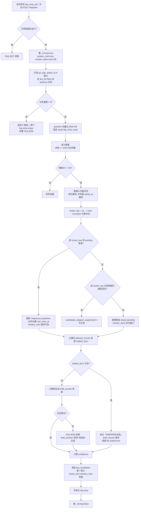
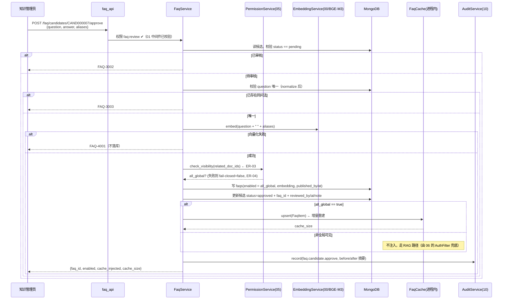
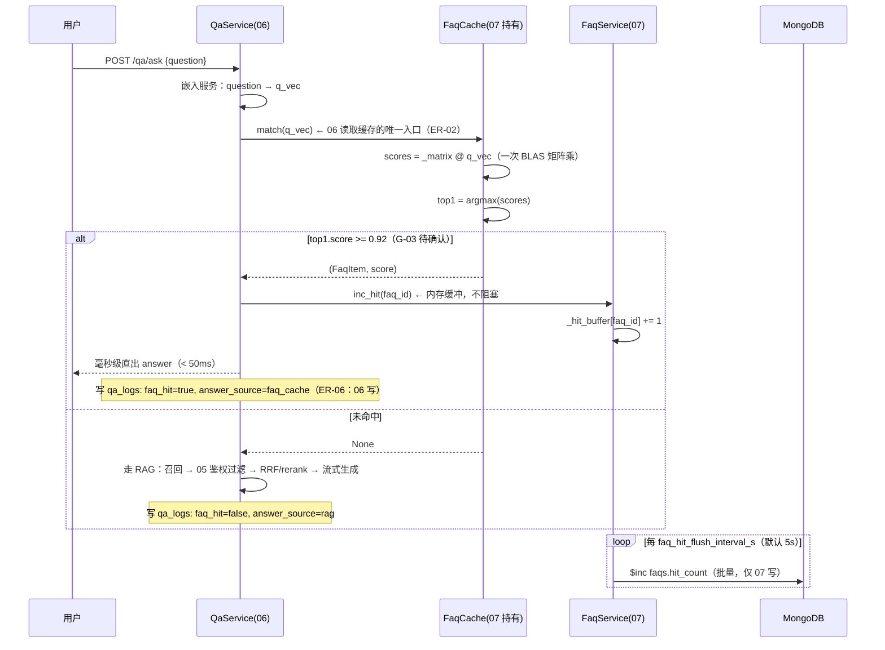
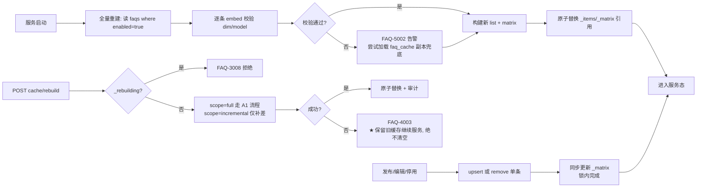

# 07 · FAQ 沉淀

> **文档编号**：04_模块Spec / 07
> **所属项目**：knowledge_manager（PRD 2.9）
> **上游依据**：`00_模块划分与边界.md`（ER-01~ER-15）· `01_数据实体/数据实体设计.md`（E16 / E17 / E18、§6.3 裁定三、§7 数据保留、§10 G-03 / G-05）· `02_概要设计/概要设计.md`（§3.4 FAQ 沉淀闭环、§4.4 `FaqCache`、AD-01、AD-06、§5 接口总览、§6 非功能）
> **对应原型**：`03_原型图/05_知识沉淀与运营管理页.pen` —— 区块「FAQ 挖掘与审核发布」「已发布 FAQ 知识库」
> **状态**：Step 4 产物 · 待评审
> **错误码前缀**：`FAQ`（见总纲 §3；段位 `1xxx` 参数 · `2xxx` 鉴权 · `3xxx` 资源/状态 · `4xxx` 依赖 · `5xxx` 内部）

---

## 1. 模块职责与边界

### 1.1 做什么

| # | 职责 | 对应 PRD / 原型 |
|---|---|---|
| 1 | **定时挖掘**：从 `qa_logs` 拉取**近 N 天**（默认 **30 天**）日志 → **语义聚类**（embedding + 相似度阈值）→ 生成/更新候选 | 2.9.1「高频问题聚类挖掘」；原型 `cdHint`「近 30 天日志 · 频次阈值 ≥20 · 聚类相似度 ≥0.85」 |
| 2 | **聚类与阈值**：频次阈值 **≥ 20**、聚类相似度 **≥ 0.85**（**G-05，默认值待确认**） | G-05 |
| 3 | **候选去重**：`faq_candidates` 唯一索引 **`cluster_key + window_start`**，防止同一窗口重复生成；并保证**待审池不膨胀**（§4.1 决策 DEC-07-2） | 概要设计 §4.3 索引表 |
| 4 | **人工审核**：编辑标准问法与答案、通过 / 驳回；`status` 枚举 `pending`/`approved`/`rejected`；留痕 `reviewed_by` / `reviewed_at` / `review_note` | 2.9「FAQ 推荐候选卡片」；原型 `candTblR*C5T`「采纳编辑 / 发布 / 驳回」 |
| 5 | **发布**：写 `faqs`（`enabled=true`，`embedding` = 问法向量化）；`question` **唯一**（防重复发布） | E17 |
| 6 | **FAQ 缓存（E18）注入 / 失效 / 重建**：主形态**进程内内存**；发布 / 编辑 / 停用**增量重建**，服务启动时**全量重建** | 2.9.4「同步写入内存缓存」；概要设计 §7 |
| 7 | **缓存匹配能力供给**：向 06 模块暴露 `FaqCache.match()`（向量化 → 暴力余弦 → top1 → ≥ 阈值直出，**< 50 ms**） | 2.9.4「命中毫秒级直接返回」；概要设计 §6 |
| 8 | **已发布 FAQ 管理**：检索问答对、编辑、**启用开关（PRD「问答缓存生效控制」）**、删除、`hit_count` 累计命中（供 09 看板算命中率） | 2.9「知识沉淀与运营管理」；原型 `pubTbl*` |
| 9 | **手动触发挖掘**（演示用）：`POST /api/v1/faq/mine` | 原型 `cdMineT`「▶ 立即挖掘」 |
| 10 | 本模块写操作的**审计留痕**（经 `AuditService`，ER-05） | 2.9.8 |

**覆盖的原型界面用词（逐字对齐，前端不得另造词）**

| 原型元素 | 原文 | 本 Spec 的落点 |
|---|---|---|
| 区块标题 | `FAQ 挖掘与审核发布` | §3.1 候选列表页 |
| 阈值提示 | `近 30 天日志 · 频次阈值 ≥20 · 聚类相似度 ≥0.85` | §2.4 配置项 + §3.4 `mine` 入参默认值 |
| 按钮 | `▶ 立即挖掘` | §3.4 `POST /api/v1/faq/mine` |
| 候选表列 | `聚类问题簇` / `聚合频次` / `关联知识单元` / `推荐标准答案` / `置信度` / `操作` | §3.1 出参字段 |
| 候选操作 | `采纳编辑 / 发布 / 驳回`、`驳回 / 转建文档` | §3.2 / §3.3 |
| 区块标题 | `已发布 FAQ 知识库` | §3.5 FAQ 列表页 |
| 搜索框 | `检索问答对` | §3.5 入参 `keyword` |
| 统计条 | `共 36 条 · 缓存已生效 34 条` | §3.5 出参 `total` / `enabled_count` / `cache_size` |
| 按钮 | `重建缓存` | §3.8 `POST /api/v1/faq/cache/rebuild` |
| FAQ 表列 | `标准问法` / `答案摘要` / `关联文档` / `命中次数` / `缓存生效` / `操作` | §3.5 出参字段 |
| 缓存生效取值 | `已生效` / `已停用` | `enabled=true` / `false` 的中文映射（§2.5） |
| FAQ 操作 | `编辑 / 停用 / 删除`、`编辑 / 启用 / 删除` | §3.6 / §3.7 / §3.9 |

### 1.2 不做什么（明确排除，避免与别的模块抢职责）

| 不做 | 归属 | 依据 |
|---|---|---|
| **召回 / 鉴权过滤 / RRF / rerank / 流式生成 / 引用溯源** | **06 AI 鉴权问答** | 总纲 §1 |
| **数据权限判定**（某篇文档能否被某用户读） | **05 四维数据权限与鉴权引擎** | **ER-03**：判定只有 05 一份实现；本模块**不写** `allow = is_global or ...` |
| **写 `qa_logs`**（包括 `faq_hit` / `answer_source` 落库） | **06** | **ER-06**：`qa_logs` 只由 06 写入，07 **只读** |
| **写 `knowledge_gaps`（E19）** | **08 知识缺口** | **ER-02**：E19 归属 08。本模块发现「整簇未命中任何知识单元」时**只把结论投递给 08 的 `GapService`**，不直连集合 |
| 候选卡片上的 **`转建文档`** 操作 | **08**（`gap:convert`） | 原型 `candTblR1C5T`：该行是「未命中任何文档」的簇，本质是知识缺口 |
| **指标桶写入与命中率计算** | **09 运营看板** | **ER-07**；07 只提供 `faqs.hit_count` 与 `qa_logs.faq_hit`（后者由 06 写） |
| **embedding 模型本身的加载与管理** | **00 公共基础**（模型服务）+ **04**（导入侧同模型） | 本模块**复用** BGE-M3（AD-06），不新增模型 |
| **审计落库实现** | **10 审计日志** | **ER-05**：只调用 `AuditService.record()` |
| **定时任务调度器框架**（cron 解析、进程内调度、重启恢复） | **00 公共基础** | 本模块只**注册任务体** `faq_mine_job` |
| 知识缺口清单页（`gpTbl*` 区块） | **08** | 同页不同区块 |

> ⚠️ **本模块最容易越界的两处**：
> 1. **「转建文档」按钮**看起来在候选卡片上，但它的写入对象是 `kb_documents`（03）与 `knowledge_gaps`（08），**07 只做转发**（§3.3 规则 R-06）。
> 2. **缓存直出绕过数据权限**——这是本模块**独有的风险点**，处置见 §1.4，绝不允许在 07 里重写一遍鉴权（ER-03）。

### 1.3 归属实体

| 实体 | 集合 / 结构 | 本模块权限 |
|---|---|---|
| **E16 FAQ 候选** | `faq_candidates` | **唯一写入者**（ER-02） |
| **E17 已发布 FAQ** | `faqs` | **唯一写入者**（含 `hit_count` 累加，§3.10） |
| **E18 FAQ 缓存** | **进程内** `FaqCache`（+ 可选副本集合 `faq_cache`） | **唯一写入者**（ER-02） |
| E15 问答日志 | `qa_logs` | **只读**（ER-06；写属 06） |
| E04 知识单元 | `kb_documents` | **只读**（`related_docs` 反推、展示「关联知识单元 / 关联文档」标题） |
| E05 知识分类 | `kb_categories` | **只读**（发布时校验 `category_id`） |
| E07 四维数据权限 | `kb_permissions` | **只读，且必须经 05 的 `PermissionService`**（ER-03；用于 §1.4 的 `is_global` 校验，**不直连集合**） |
| E19 知识缺口 | `knowledge_gaps` | **只读/不写**（投递给 08 的 `GapService`） |

### 1.4 关键语义一：缓存是**进程内**对象 —— 本模块成立的前提是 **AD-01（单应用单端口）**

| 项 | 说明 |
|---|---|
| 主形态 | `FaqCache._items: list[FaqItem]`，**进程内内存**，不落库（PRD 2.9.4 明确「同步写入内存缓存」） |
| 06 与 07 如何共享 | 06 与 07 **必须运行在同一进程**（AD-01 合并两个 FastAPI 为一个应用、单端口 8102）。06 通过 **`FaqCache.match()`** 读取，这是**同进程对象调用**，不是 RPC、不是 HTTP |
| 因此产生的硬约束 | 若部署成**多 worker**（`uvicorn --workers N` / `WEB_CONCURRENCY>1`），每个 worker 各持一份缓存，会出现「A 进程刚发布、B 进程命中不到」与「重建不同步」。**本模块在启动自检中显式拒绝这种部署**：记录 `FAQ-2002` 并只允许其中一个进程持有缓存（演示环境固定 `workers=1`） |
| 06 的读取边界 | **06 禁止直连 `faqs` 集合**（ER-02）。命中后需要累加命中次数时，调用本模块的 **`FaqService.inc_hit(faq_id)`**，不得自己 `$inc` |
| 可选持久化副本 | 集合 `faq_cache`（仅 embedding 与元数据）**不是**主形态，仅用于：① 启动全量重建失败时的兜底加载；② 排查「某问题为何没命中」时比对向量。**真源永远是 `faqs`** |

> **为什么不做成 Redis / 独立缓存服务**：本项目的规模假设是**数百~数千条 FAQ**（§2.3），一次匹配只是一次 BLAS 矩阵乘；
> 引入 Redis 会增加一个部署件、一次网络往返（会把「< 50 ms」恶化到 1~3 ms 的网络抖动上）、以及「Redis 内容与 `faqs` 不一致」的新风险。
> **代价**：失去了跨进程共享能力 —— 所以必须用 `FAQ-2002` 把「多 worker」这条路径**堵死而不是忽略**。

### 1.5 关键语义二：缓存直出**不做**数据权限过滤 —— 所以只允许「全局可见」的 FAQ 进缓存

这是本项目**最容易被忽略的越权路径**：RAG 路径下每次回答都过 05 的 `AuthFilter`（AD-02），
但 **FAQ 缓存命中是「毫秒级直出」**（概要设计 §3.3 第 1 步），它**根本不经过召回与过滤**。
若某个 FAQ 的标准答案是从「只有财务部能看」的文档里凝练出来的，那它会对**全体用户**直出 → **越权泄漏**。

**处置（fail-closed，呼应 ER-04）**

| 规则 | 内容 |
|---|---|
| 准入校验（发布时） | `related_doc_ids` 为空 → 允许进缓存（纯运营沉淀的 FAQ，无文档来源）；非空 → 其中**每一篇**都必须 `is_global=true`，否则**拒绝启用缓存**（`FAQ-2001`），但**仍允许发布**，只是 `enabled=false`（走 RAG 路径，由 06 的过滤兜底） |
| 判定方式 | 调 **05 的 `PermissionService.check_visibility(doc_ids)`**（ER-03），**不直连** `kb_permissions` |
| 判定失败时 | **视为非全局**（fail-closed）→ `enabled=false`，并记 WARN（ER-04） |
| 权限收紧后 | 05 侧把某文档从全局改为受限时，**本模块不会自动感知**（05 无反向通知）→ 登记 **OQ-07-04**；当前依赖「缓存重建」时的复核，见 §3.8 规则 R-03 |

### 1.6 关键语义三：为什么用**向量相似**而不是字符串匹配（AD-06 / Step1 §6.3 裁定三）

| 方案 | 能否命中下面两个问题 | 结论 |
|---|---|---|
| 字符串精确 / 前缀匹配 | 「**生鲜食品破损如何申请退款**」与「**水果烂了怎么申请赔付**」→ **命不中**（字面几乎无公共前缀） | ❌ 直接违反 PRD 的「FAQ 高速缓存匹配加速」目标 |
| **向量相似（余弦）** | 两句 embedding 余弦通常 **> 0.92**，命中同一条 FAQ | ✅ **采用** |

> **为什么不用字符串**：用户提问是**自然语言**，同一意图的措辞差异极大（原型 `candTblR0C0T` 一个簇里就有
> 「生鲜食品破损如何申请退款 / 水果烂了怎么赔 / 到货坏了怎么办」**三种说法**）。
> **复用 BGE-M3**（与 `kb_chunks_v2.dense_vector` 同模型）意味着**不需要额外模型、不额外占显存**，这是 AD-06 的成本优势。

### 1.7 依赖模块

| 方向 | 模块 | 用途 |
|---|---|---|
| 依赖 | 00 公共基础 | 配置（阈值项）、错误注册、统一响应、Mongo 连接、**定时任务骨架**、**BGE-M3 embedding 服务**、进程内单例注册 |
| 依赖 | 01 登录与功能权限 | JWT 中间件；权限码 `faq:review` / `faq:manage`（ER-08/ER-09） |
| 依赖 | 05 四维数据权限与鉴权引擎 | `PermissionService.check_visibility()` 判 `is_global`（ER-03） |
| 依赖 | 06 AI 鉴权问答 | ① **只读** `qa_logs` 作为挖掘数据源（ER-06）；② 运行时调用 `FaqCache.match()`；③ 命中后调 `FaqService.inc_hit()` |
| 依赖 | 10 审计日志 | `AuditService.record()`（ER-05） |
| 通知 | 08 知识缺口 | 「整簇无 `allowed_chunks`」的结论**投递**给 `GapService`（原型「转建文档」） |
| 通知 | 09 运营看板 | 提供 `faqs.hit_count`；看板命中率 = `qa_logs.faq_hit` 比例，由 09 计算 |

---

## 2. 数据契约

### 2.1 E16 · FAQ 候选 `faq_candidates`

| 字段 | 类型 | 必填 | 说明 |
|---|---|:--:|---|
| `_id` | string | ✔ | 候选编号 `CAND{6位序列}` |
| `cluster_key` | string | ✔ | 聚类簇标识。定义：`"ck_" + sha1(normalize(representative_question))[:16]`；`normalize` = 去首尾空白 + 全角转半角 + 去句末标点 + 连续空白折叠 + 英文小写。**同一簇跨窗口稳定** |
| `questions` | array | ✔ | **簇内原始提问**（保留原话，供人工参考措辞；上限 50 条，超出按 `asked_at` 取最近） |
| `representative_question` | string | ✔ | 代表问法（簇心）：簇内**出现次数最多**者；并列时取 `asked_at` **最早**者（保证确定性） |
| `frequency` | int | ✔ | 聚合频次（PRD：「达到设定阈值自动生成推荐 FAQ」） |
| `related_docs` | array | ✔ | 关联知识单元 `doc_id` 列表（从簇内各问答的 `allowed_chunks` 反推去重）；**整簇未命中则为空数组** |
| `draft_answer` | string | | 大模型生成的参考答案草案；生成失败时为空串（§7 降级） |
| `confidence` | float | ✔ | 置信度。定义：`mean(簇内两两余弦) × min(1, frequency / (2 × freq_threshold))`，保留 2 位小数（原型 `candTblR0C4T` = `0.91`） |
| `status` | enum | ✔ | 枚举组 **`faq_status`**：`pending` / `approved` / `rejected`（**按 ER-10 独立定义**，不与其它实体的 `status` 共用） |
| `reviewed_by` | string | | 审核人 `user_id`（留痕） |
| `reviewed_at` | long | | 审核时间（留痕） |
| `review_note` | string | | 审核备注；**驳回时必填 ≥ 5 字**（G-11 的一致性做法，§5 `FAQ-1004`） |
| `faq_id` | string | | 审核通过后发布的 FAQ ID（本 Spec 补充字段，用于「候选 ↔ FAQ」双向追溯） |
| `first_seen_at` / `last_seen_at` | long | ✔ | 该簇首次 / 最近出现时间 |
| `window_start` / `window_end` | long | ✔ | 本次挖掘的时间窗。**`window_start` 一旦写入不再变更**（作为唯一索引的一部分，见 §4.1 决策 DEC-07-2） |
| `created_at` / `updated_at` | long | ✔ | 本 Spec 补充 |

**索引**

| 索引 | 类型 | 用途 |
|---|---|---|
| `cluster_key + window_start` | **唯一** | **防重复生成**（概要设计 §4.3 / Step1） |
| `status + frequency desc` | 组合 | 审核列表（默认按 `pending` + 聚合频次降序，对齐原型 `candTbl*` 的行序） |
| `cluster_key + status` | 组合 | 挖掘时的「pending 复用 / rejected 抑制」查询（§4.1） |
| `last_seen_at desc` | 单列 | 运维排查 |

> ⚠️ **为什么唯一索引是 `cluster_key + window_start` 而不是只 `cluster_key`**：
> 同一个簇在**不同窗口**是两次独立的挖掘产出，`frequency` 需要重算；唯一索引的职责只是**同一窗口内不重复生成**。
> 跨窗口的「不重复打扰」由 §4.1 的 **pending 复用 / rejected 抑制** 两条应用层规则承担，两者职责不重叠。

### 2.2 E17 · 已发布 FAQ `faqs`

| 字段 | 类型 | 必填 | 说明 |
|---|---|:--:|---|
| `_id` | string | ✔ | FAQ 编号 `FAQ{6位序列}` |
| `question` | string | ✔ | **标准问法**（人工可润色，**与 `faq_candidates.representative_question` 解耦**——原型标注第 3 条）；`2~200` 字 |
| `answer` | string | ✔ | 标准答案（人工可编辑），`1~2000` 字 |
| `aliases` | array | ✔ | 同义问法（提升命中率，**参与向量化**，§2.3）；上限 10 条 |
| `category_id` | string | | 分类，关联 E05（只读校验） |
| `related_doc_ids` | array | ✔ | 关联知识单元（溯源用）；**也是缓存准入校验的输入**（§1.5） |
| `enabled` | bool | ✔ | **缓存生效开关**（PRD「问答缓存生效控制」）；原型 `缓存生效` 列的 `已生效` / `已停用` |
| `hit_count` | int | ✔ | 累计命中次数（原型 `命中次数` 列；供 09 算命中率）；**只由本模块累加**（§3.10） |
| `published_by` | string | ✔ | 发布人 `user_id` |
| `published_at` | long | ✔ | 发布时间 |
| `embedding` | array | ✔ | 问法向量（`float32`，维度以 00 的 `EMBED_DIM` 为准，BGE-M3 默认 **1024**）；**发布时若向量化失败则不落库**（§5 `FAQ-4001`） |
| `updated_by` / `updated_at` | string / long | ✔ | 本 Spec 补充（编辑留痕，与 `published_*` 分离） |

**索引**

| 索引 | 类型 | 用途 |
|---|---|---|
| `question` | **唯一** | **防重复发布**（比较前先 `normalize`：trim + 全角半角归一 + 连续空白折叠） |
| `enabled + published_at desc` | 组合 | 列表筛选（`缓存生效` 列过滤） |
| `question`（文本索引） | 文本 | 原型 `pbSearchT`「检索问答对」 |
| `category_id` | 单列 | 分类筛选 |

**数据保留（承接 Step1 §7）**

| 集合 | 保留 | 方式 | 理由 |
|---|---|---|---|
| `faqs` | **永久** | 物理删除走显式接口（§3.9） | 是 FAQ 缓存与问答直出的真源 |
| `faq_candidates` | **永久** | — | 含**审核留痕**（`reviewed_by`/`reviewed_at`/`review_note`），删掉就无法回答「这条 FAQ 当初为什么发」。Step1 §7 **未定义**该集合的保留策略 → 登记 **OQ-07-02** |
| `faq_cache`（可选副本） | 与进程同生命周期 | 每次重建覆盖 | 只是兜底副本，**没有保留价值** |

> ⚠️ **为什么 `faqs` 用物理删除而不是软删除**：Step1 未给 `faqs` 设计 `deleted_at`；
> 且 `question` 是唯一索引，软删除会让「同一标准问法无法重新发布」。
> **代价**：删除后 `metric_buckets` 里 `bucket_type=faq` 的历史桶会变成孤儿（仍可通过 `bucket_key` 追溯 ID，不报错）。
> 因此接口层**要求前端二次确认**，并建议先「停用」（§3.7）而非直接删除 → 若需可恢复删除，登记 **OQ-07-05**。

### 2.3 E18 · FAQ 缓存（**进程内** + 可选持久化副本）

**A. 进程内结构（主形态）**

```python
class FaqItem:                      # 缓存条目
    faq_id: str
    question: str                   # 标准问法
    aliases: list[str]              # 同义问法（展示与排查用）
    embedding: np.ndarray           # float32, shape=(EMBED_DIM,)  ← question + aliases 拼接后向量化
    answer: str
    enabled: bool

class FaqCache:                     # 进程内单例，由 00 注册
    _items: list[FaqItem]           # 仅包含 enabled=True 的 FAQ
    _matrix: np.ndarray             # (N, EMBED_DIM) float32，随 _items 同步
    _lock: asyncio.Lock             # 重建/写入互斥
    _rebuilding: bool               # 并发重建保护（对应 FAQ-3008）
```

| 字段 | 类型 | 说明 |
|---|---|---|
| `faq_id` | string | 关联 E17 |
| `question` | string | 标准问法（直出时用于回显「命中标准问法」） |
| `aliases` | array | 同义问法（**只读展示**；匹配依赖 `embedding`，不做字符串匹配） |
| `embedding` | float32 array | `embed(question + " " + " ".join(aliases))` 的**单条**向量（Step1 E18 定义为单值 → 采用拼接口径） |
| `answer` | string | 标准答案（直出内容） |
| `enabled` | bool | **缓存内只保留 `true`**；`enabled=false` 的 FAQ 不进入 `_items`（原型「已停用」的语义就是「不在缓存里」） |

**B. 可选持久化副本 `faq_cache`（**不是**主形态）**

| 字段 | 类型 | 说明 |
|---|---|---|
| `_id` | string | = `faq_id`（幂等覆盖） |
| `faq_id` / `question` / `aliases` | — | 元数据 |
| `embedding` | array | 向量副本（`float32` 序列化） |
| `dim` / `model` | int / string | 维度与模型名（启动自检用，对应 `FAQ-5002`） |
| `enabled` | bool | 与 `faqs.enabled` 保持一致的**快照** |
| `rebuilt_at` / `version` | long / int | 重建时间与版本号 |

> **为什么副本里不存 `answer`**：`faqs.answer` 是唯一真源，副本再存一份就有「两处答案不一致」的风险（ER-02 的同类问题）。
> 副本的用途只有两个：**启动兜底**与**排查比对**。

**C. 匹配算法（毫秒级，概要设计 §6「< 50 ms」）**

| 步骤 | 动作 | 复杂度 |
|---|---|---|
| 1 | 用户问题 → BGE-M3 向量化（与文档向量**同模型**） | O(1) 次前向 |
| 2 | `scores = _matrix @ q_vec / (‖_matrix‖ · ‖q_vec‖)` —— **一次 BLAS 矩阵乘**得到全部余弦 | O(N × D) |
| 3 | 取 `top1`（索引 + 分数） | O(N) |
| 4 | `score ≥ faq_cache_sim_threshold`（**默认 0.92，G-03 待确认**）→ **直出** `answer` + `question`；否则返回未命中，交 06 走 RAG | O(1) |

**规模假设与「为什么暴力比对而不是 ANN 索引」**

| 论据 | 说明 |
|---|---|
| 规模 | FAQ 量级为**数百~数千条**（本项目演示种子 36 条，原型 `pbStat`）；`N=5000, D=1024` → `float32` 内存 ≈ **20 MB** |
| 性能 | `5000 × 1024` 的矩阵乘 ≈ 5.1 M 次乘加，单次 BLAS 调用约 **1~5 ms**，已优于 50 ms 目标 |
| 一致性 | ANN 索引（faiss / Milvus）需要「建索引 → 生效」，而本缓存要求**发布即生效**（§4.4）；暴力比对**数据即索引**，发布后下一次匹配立即生效 |
| 复杂度 | 少一个依赖、少一套索引生命周期管理、少一处「索引与真源不一致」的故障点 |
| 何时才需要 ANN | 若 FAQ 量级超过 **5 万条**（内存 > 200 MB、单次匹配 > 30 ms）再考虑；登记为**触发条件**而非当前需求 |

> **为什么用 `enabled` 过滤在集合层面（只把 `true` 的放进缓存）而不是匹配后再过滤**：
> 匹配后过滤会让「已停用」的 FAQ 仍然占据 top1，导致本该走 RAG 的问题被判为「命中但不可用」（原型「已停用」行正是要它回到 RAG 路径）。

### 2.4 配置项（由 00 公共基础承载，`system_config` + 内存热更新）

| 配置键 | 默认 | 说明 | 依据 |
|---|---|---|---|
| `faq_mine_window_days` | **30** | 挖掘时间窗（天）；合法 `1~180`（`qa_logs` TTL 也是 180 天） | 原型 `cdHint`「近 30 天日志」 |
| `faq_mine_freq_threshold` | **20** | 簇频次阈值 | **G-05 待确认** |
| `faq_mine_sim_threshold` | **0.85** | 聚类相似度阈值 | **G-05 待确认** |
| `faq_cache_sim_threshold` | **0.92** | **缓存命中阈值（余弦）** | **G-03 待确认**；AD-06 |
| `faq_cache_enabled` | `true` | 缓存总开关（全局降级开关） | §7 降级 |
| `faq_hit_flush_interval_s` | **5** | `hit_count` 内存缓冲的刷盘周期（§3.10） | §4.3 |
| `faq_mine_cron` | `0 3 * * *` | 定时挖掘计划（每天 03:00，错开业务高峰） | 概要设计 §3.4 定时任务 |
| `faq_mine_suppress_days` | **30** | 已驳回 `cluster_key` 的抑制天数（§4.1） | §4.1 决策 DEC-07-3 |
| `faq_mine_seed` | `20260101` | 聚类随机种子（**可复现**要求，概要设计 §6） | §6 非功能 |

### 2.5 枚举引用（**按 ER-10 各自定义**）

| 枚举组 | 取值 | 适用字段 | 定义位置 | 中文映射（前端展示） |
|---|---|---|---|---|
| **`faq_status`** | `pending` / `approved` / `rejected` | E16.`status` | `app/core/enums.py::FaqCandidateStatus`（**独立类**） | 待审核 / 已通过 / 已驳回 |
| —（bool，非枚举） | `true` / `false` | E17.`enabled` | 无需枚举类 | **已生效 / 已停用**（原型 `缓存生效` 列） |
| `answer_source` | `faq_cache` / `rag` / `no_knowledge` | E15.`answer_source` | 属 **06**，本模块**只读** | —（本模块不展示） |

> ⚠️ **ER-10 提醒**：`faq_status` **不得**复用文档的 `doc_status`、用户的 `user_status` 或导入任务的 `task_status`。
> 本项目 5 种 `status` 取值域不同，共用枚举会直接导致「用文档状态去判断候选状态」这类串味缺陷。

---

## 3. 接口清单

> **统一说明**：路由前缀 `/api/v1/faq/*` 与 `/api/v1/faqs/*`（总纲 §6.1）。
> 所有接口经 **01 的 JWT 中间件**（ER-08）；写操作都经 **`AuditService.record()`**（ER-05，失败不阻断，§7）。
> 权限码只用 **`faq:review`**（候选审核与发布）与 **`faq:manage`**（已发布 FAQ 管理 / 缓存开关）。
>
> ⚠️ **与概要设计 §5 的一处细化**：概要把整组 FAQ 接口写成 `faq:review`；本 Spec 按 **01 模块 §2.3 的字典语义**细分 ——
> **候选**相关（列表 / 审核 / 挖掘）用 `faq:review`，**已发布 FAQ 管理与缓存**（列表 / 编辑 / 停用 / 删除 / 重建）用 `faq:manage`。
> 两者都在 34 个权限码之内，且都只授予 `kb_admin`（`sys_admin` **不含** `faq:*`，与原型 `08` 矩阵的「—」一致）。

### 3.1 `GET /api/v1/faq/candidates` — 候选列表（聚类问题簇）

| 项 | 内容 |
|---|---|
| 功能权限 | `faq:review` |
| 入参 | `?status=pending&min_frequency=&keyword=&page=1&page_size=20` |
| 出参 | `{ "items": [ { "candidate_id", "cluster_key", "questions", "representative_question", "frequency", "related_docs": [{"doc_id","title"}], "draft_answer", "confidence", "status", "reviewed_by", "reviewed_at", "review_note", "first_seen_at", "last_seen_at", "window_start", "window_end" } ], "total", "page", "page_size", "window": {"window_start","window_end","freq_threshold","sim_threshold"} }` |
| 说明 | 对齐原型候选表 6 列：`聚类问题簇` = `questions`（前端以 `/` 连接展示）、`聚合频次` = `frequency`（展示为 `53 次`）、`关联知识单元` = `related_docs`（**空数组时展示「（未命中任何文档）」**）、`推荐标准答案` = `draft_answer`（**空时展示「—（建议先补文档）」**）、`置信度` = `confidence` |
| 默认排序 | `frequency desc, last_seen_at desc`（对齐原型的 53 / 27 / 24 次行序） |

**服务端规则**

| 规则 | 说明 | 失败码 |
|---|---|---|
| R-01 | `page_size` 上限 **200**，`page ≥ 1` | `FAQ-1007` |
| R-02 | `status` 非法取值（不在 `faq_status` 内）拒绝 | `FAQ-1007` |
| R-03 | 仅返回**本模块自有实体**的字段；`related_docs` 的 `title` 通过 03 的**只读**接口补齐，**不做 join 写库** | — |

### 3.2 `POST /api/v1/faq/candidates/{candidate_id}/approve` — 审核通过并发布

| 项 | 内容 |
|---|---|
| 功能权限 | `faq:review` |
| 入参 | `{ "question": string, "answer": string, "aliases"?: [string], "category_id"?: string, "related_doc_ids"?: [string], "review_note"?: string }` |
| 出参 | `{ "candidate_id", "status": "approved", "faq_id", "enabled": bool, "cache_size": int, "cache_injected": bool }` |
| 说明 | 原型操作 `采纳编辑 / 发布`：**先编辑**标准问法与答案再发布。入参的 `question`/`answer` 是**人工改写后的最终值**，与候选的 `representative_question`/`draft_answer` **解耦保存**（原型标注第 3 条） |
| 默认值 | `question` 缺省取 `representative_question`；`answer` 缺省取 `draft_answer`；`related_doc_ids` 缺省取候选的 `related_docs` |

**服务端规则**

| # | 规则 | 失败码 |
|---|---|---|
| R-01 | 候选必须存在 | `FAQ-3001` |
| R-02 | 候选 `status` 必须为 `pending`（已审核不可重复审核） | `FAQ-3002` |
| R-03 | `question` 长度 `2~200`，trim 后非空 | `FAQ-1002` |
| R-04 | `answer` 长度 `1~2000`，trim 后非空 | `FAQ-1003` |
| R-05 | `aliases` 必须为数组、≤ 10 条、单条 `2~200` 字、不得与 `question` 重复 | `FAQ-1005` |
| R-06 | `related_doc_ids` 非空时，**每一篇**都必须存在且未被软删除（**只读校验，经 03 的 `DocService.get_many()`**） | `FAQ-3004` |
| R-07 | 候选 `related_docs` 为空**且** `draft_answer` 为空 → 拒绝发布，提示改为驳回并转建文档（原型 `candTblR1`：无来源的簇应走 08） | `FAQ-3004` |
| R-08 | `question` 经 normalize 后**全局唯一**（`faqs.question` 唯一索引） | `FAQ-3003` |
| R-09 | 向量化：`embedding = embed(question + " " + " ".join(aliases))`；**向量化失败则不落库**（不允许出现无 `embedding` 的 FAQ） | `FAQ-4001` |
| R-10 | 缓存准入：`related_doc_ids` 非空且存在**非全局可见**文档 → **仍发布但 `enabled=false`**，`cache_injected=false`；接口返回 `enabled=false` 并在 `message` 中说明原因 | 记 WARN（不阻断） |
| R-11 | 缓存准入校验**必须经 05 的 `PermissionService`**（ER-03）；判定失败 → fail-closed 视为非全局（ER-04） | 记 WARN（不阻断） |
| R-12 | 事务顺序：先写 `faqs`（含 `embedding`）→ 再更新候选 `status=approved` + `faq_id` + 留痕 → **最后**注入缓存。任一步失败**不回滚已发布的 FAQ**（幂等重试） | `FAQ-4003` |
| R-13 | `enabled=true` 时 → `FaqCache.upsert(faq_item)`（**增量重建**，§4.4） | — |
| R-14 | 写审计 `faq.candidate.approve`（含 `candidate_id` / `faq_id` / `before`(候选原文) / `after`(最终问法答案)**摘要**） | — |
| R-15 | 发布可在**候选卡片上直接完成**（原型操作列有「发布」），不强制先跳编辑页 | — |

### 3.3 `POST /api/v1/faq/candidates/{candidate_id}/reject` — 驳回

| 项 | 内容 |
|---|---|
| 功能权限 | `faq:review` |
| 入参 | `{ "review_note": string, "convert_to_gap"?: bool }` |
| 出参 | `{ "candidate_id", "status": "rejected", "gap_forwarded": bool }` |
| 说明 | 原型操作 `驳回` 与 `驳回 / 转建文档`；`convert_to_gap=true` 对应后者（**无来源的簇**） |

**服务端规则**

| # | 规则 | 失败码 |
|---|---|---|
| R-01 | 候选存在 | `FAQ-3001` |
| R-02 | `status == pending` | `FAQ-3002` |
| R-03 | `review_note` **必填且 ≥ 5 字**（与 G-11「变更需说明原因」的口径一致） | `FAQ-1004` |
| R-04 | 写候选 `status=rejected` + `reviewed_by/reviewed_at/review_note` | — |
| R-05 | 该 `cluster_key` 进入**抑制名单**：后续 `faq_mine_suppress_days`（默认 30 天）内不再生成候选（§4.1 决策 DEC-07-3） | — |
| R-06 | `convert_to_gap=true` → **投递给 08 的 `GapService.upsert_from_cluster()`**（首次转建才写 E19，**07 不直连 `knowledge_gaps`**，ER-02）；投递失败时**候选仍为 rejected**，只返回 `gap_forwarded=false` | 记 ERROR |
| R-07 | 写审计 `faq.candidate.reject`（含 `review_note`、`convert_to_gap`） | — |

### 3.4 `POST /api/v1/faq/mine` — 手动触发挖掘（演示用）

| 项 | 内容 |
|---|---|
| 功能权限 | `faq:review` |
| 入参 | `{ "window_days"?: int, "freq_threshold"?: int, "sim_threshold"?: float, "seed"?: int }`（全部可选，缺省取 §2.4 配置） |
| 出参 | `{ "window_start", "window_end", "scanned_logs", "clusters", "candidates_created", "candidates_updated", "candidates_skipped_suppressed", "gaps_forwarded", "elapsed_ms" }` |
| 说明 | 对齐原型 `▶ 立即挖掘`；**同步返回**（演示需要即时看到结果），内部对 `window_days` 与日志量设上限 |
| 依据 | 概要设计 §5 `/api/v1/faq/mine`「手动触发挖掘（演示用）」 |

**服务端规则**

| # | 规则 | 失败码 |
|---|---|---|
| R-01 | `window_days` 为整数且 `1 ≤ n ≤ 180`（`qa_logs` TTL 界限） | `FAQ-1001` |
| R-02 | `freq_threshold ∈ [2, 1000]`，`sim_threshold ∈ [0.5, 1.0]` | `FAQ-1006` |
| R-03 | **手动挖掘与定时挖掘互斥**：已有挖掘在运行（进程内 `_mining` 标志）则拒绝，避免重复生成 | `FAQ-3007` |
| R-04 | 日志量上限保护：`scanned_logs > 200000` 时按 `asked_at desc` 截断并记 WARN（演示环境不会触发） | — |
| R-05 | 时间窗内**无任何日志** → 返回 `candidates_created=0` 与 `FAQ-3009` 的**告警信息**（HTTP 200，不算失败），并写审计 `faq.mine.empty` | — |
| R-06 | 固定随机种子（入参 `seed` 或缺省 `faq_mine_seed`）→ **同参数二次运行产出相同 `cluster_key` 集合**（可复现，概要设计 §6） | — |
| R-07 | 只读 `qa_logs`（**不写**，ER-06）；过滤条件：`asked_at ∈ 窗口` 且 `faq_hit == false` 且 `question` 非空 | — |
| R-08 | 挖掘结束后写审计 `faq.mine`（含窗口、阈值、`created/updated` 计数） | — |

### 3.5 `GET /api/v1/faqs` — 已发布 FAQ 列表

| 项 | 内容 |
|---|---|
| 功能权限 | `faq:manage` |
| 入参 | `?keyword=&enabled=&category_id=&page=1&page_size=20` |
| 出参 | `{ "items": [ { "faq_id", "question", "answer_brief", "related_doc_ids", "related_doc_titles", "hit_count", "enabled", "enabled_text", "published_by", "published_at", "updated_at" } ], "total", "enabled_count", "cache_size", "page", "page_size" }` |
| 说明 | 对齐原型 FAQ 表 6 列：`标准问法` = `question`、`答案摘要` = `answer_brief`（前 40 字 + `…`）、`关联文档` = `related_doc_titles`、`命中次数` = `hit_count`、`缓存生效` = `enabled_text`（`已生效` / `已停用`）、`操作` = 前端按 `enabled` 渲染 `编辑 / 停用 / 删除` 或 `编辑 / 启用 / 删除` |
| 统计条 | 原型 `共 36 条 · 缓存已生效 34 条` = `total` + `enabled_count`；`cache_size` 应恒等于 `enabled_count`（不等则触发 `FAQ-5002` 自检告警） |

**服务端规则**

| 规则 | 说明 | 失败码 |
|---|---|---|
| R-01 | `keyword` 走 `question` 文本索引，`page_size ≤ 200` | `FAQ-1007` |
| R-02 | **不返回 `embedding` 字段**（1024 维数组会让响应膨胀数百 KB） | — |
| R-03 | `answer` 只返回 `answer_brief`；完整答案在编辑时由 §3.6 的详情接口按需取（前端本地已有） | — |

### 3.6 `PUT /api/v1/faqs/{faq_id}` — 编辑已发布 FAQ

| 项 | 内容 |
|---|---|
| 功能权限 | `faq:manage` |
| 入参 | `{ "question"?, "answer"?, "aliases"?, "category_id"?, "related_doc_ids"? }` |
| 出参 | `{ "faq_id", "changed": {...}, "cache_reinjected": bool, "enabled": bool }` |

**服务端规则**

| # | 规则 | 失败码 |
|---|---|---|
| R-01 | FAQ 存在 | `FAQ-3005` |
| R-02 | 字段校验同 §3.2 R-03/R-04/R-05 | `FAQ-1002` / `FAQ-1003` / `FAQ-1005` |
| R-03 | 改 `question` → normalize 后唯一性校验 | `FAQ-3003` |
| R-04 | 改 `question` 或 `aliases` → **必须重新向量化**（`embedding` 与文本不一致会导致「答案对不上问题」） | `FAQ-4001` |
| R-05 | 改 `related_doc_ids` → **重新做缓存准入校验**（§1.5）：变为非全局可见 → 自动 `enabled=false` 并移出缓存 | 记 WARN |
| R-06 | 成功后 → **增量重建**该条缓存（`FaqCache.upsert` 或 `FaqCache.remove`） | — |
| R-07 | 写审计 `faq.update`（`before`/`after`，**剔除 `embedding`**） | — |

### 3.7 `POST /api/v1/faqs/{faq_id}/toggle` — 缓存生效开关（启用 / 停用）

| 项 | 内容 |
|---|---|
| 功能权限 | `faq:manage` |
| 入参 | `{ "enabled": bool, "reason"?: string }` |
| 出参 | `{ "faq_id", "enabled", "enabled_text", "cache_size" }` |
| 说明 | **PRD「问答缓存生效控制」**；原型 `停用` / `启用` 两个方向共用此接口 |

**服务端规则**

| # | 规则 | 失败码 |
|---|---|---|
| R-01 | FAQ 存在 | `FAQ-3005` |
| R-02 | `reason` 若提供则 `≥ 5` 字 | `FAQ-1004` |
| R-03 | `enabled=true` → **必须先过缓存准入校验**（§1.5，经 05 判定）；不通过则拒绝启用 | `FAQ-2001` |
| R-04 | `enabled=true` → `FaqCache.upsert()`；`enabled=false` → `FaqCache.remove()`（**增量重建**） | — |
| R-05 | 停用后该问题**回到 RAG 检索路径**（原型标注第 5 条），`hit_count` **不清零**（历史命中仍有效） | — |
| R-06 | 写审计 `faq.toggle`（含 `before`/`after` 与 `reason`） | — |
| R-07 | 停用**不影响** `qa_logs` 中已记录的 `faq_hit` 历史值（ER-06：不回溯改日志） | — |

### 3.8 `POST /api/v1/faq/cache/rebuild` — 重建缓存

| 项 | 内容 |
|---|---|
| 功能权限 | `faq:manage` |
| 入参 | `{ "scope": "incremental" \| "full", "recheck_visibility"?: bool }` |
| 出参 | `{ "scope", "total", "enabled_count", "cache_size", "disabled_by_visibility": int, "elapsed_ms", "rebuilt_at" }` |
| 说明 | 对齐原型 `重建缓存` 按钮；`full` = 从 `faqs` 全量重建（等价于启动行为）；`incremental` = 仅补差（新增 / 编辑 / 停用的条目） |

**服务端规则**

| # | 规则 | 失败码 |
|---|---|---|
| R-01 | `scope` 非法取值拒绝 | `FAQ-1007` |
| R-02 | 已有重建在跑（`FaqCache._rebuilding`）→ 拒绝，避免重复构建 | `FAQ-3008` |
| R-03 | `recheck_visibility=true` → 对**全部** `enabled=true` 的 FAQ **复核** `related_doc_ids` 的全局可见性（**这是 OQ-07-04 的当前兜底手段**）；复核不通过的条目**自动置 `enabled=false`** 并计入 `disabled_by_visibility` | 记 WARN |
| R-04 | **重建采用「构建新列表 → 原子替换引用」**，绝不「原地清空后逐条 append」——否则重建期间的并发匹配会命中空缓存（命中率瞬时归零） | — |
| R-05 | 单条向量化失败 → **跳过该条并记 ERROR**，不让整次重建失败（可用性优先）；跳过的条数在 WARN 日志中列出 | — |
| R-06 | 重建失败 → **保留旧缓存继续服务**（绝不清空），返回 `FAQ-4003` | `FAQ-4003` |
| R-07 | 写审计 `faq.cache.rebuild`（含 `scope` / 条数 / `disabled_by_visibility`） | — |

### 3.9 `DELETE /api/v1/faqs/{faq_id}` — 删除已发布 FAQ

| 项 | 内容 |
|---|---|
| 功能权限 | `faq:manage` |
| 出参 | `{ "deleted": true, "cache_size": int }` |

**服务端规则**

| # | 规则 | 失败码 |
|---|---|---|
| R-01 | FAQ 存在 | `FAQ-3005` |
| R-02 | **物理删除** `faqs` 文档（§2.2 决策），同时 `FaqCache.remove(faq_id)` | — |
| R-03 | 删除**不级联删除** `faq_candidates`（候选是留痕，须保留）；也不删除 `metric_buckets` 中 `bucket_type=faq` 的历史桶（09 的命中率口径需要连续历史） | — |
| R-04 | 写审计 `faq.delete`（`before` = 被删 FAQ 的**摘要**，含 `question` 与 `hit_count`） | — |
| R-05 | 文档中若某 `related_doc_ids` 已被 03 软删除 → **不阻止删除**（FAQ 自身可独立删除） | — |

### 3.10 `GET /api/v1/faq/cache/status` — 缓存状态（运维 / 演示用）

| 项 | 内容 |
|---|---|
| 功能权限 | `faq:manage` |
| 出参 | `{ "cache_size", "enabled_count", "total", "threshold", "embed_dim", "model", "last_rebuilt_at", "match_p95_ms", "hit_buffer_pending", "multi_worker": bool }` |
| 说明 | 支撑原型 `共 36 条 · 缓存已生效 34 条` 的实时一致性核对；`multi_worker=true` 时返回 `FAQ-2002` 告警信息 |

### 3.11 供 06 模块调用的**进程内 Service 方法（非 HTTP 接口）**

| 方法 | 签名 | 说明 | 约束 |
|---|---|---|---|
| `FaqCache.match()` | `(q_vec: np.ndarray) -> tuple[FaqItem, float] \| None` | 暴力余弦取 top1；`score ≥ 阈值` 才返回，否则 `None` | **06 读取缓存的唯一入口**（ER-02） |
| `FaqService.inc_hit()` | `(faq_id: str) -> None` | 命中计数（**内存缓冲 + 周期刷盘**，不阻塞直出） | **06 累加 `hit_count` 的唯一入口**，禁止 `$inc` `faqs` |
| `FaqService.on_visibility_changed()` | `(doc_ids: list[str]) -> int` | 05 权限变更后可选回调：复核受影响 FAQ 并停用不合规条目 | 当前**未接线**，登记 **OQ-07-04** |

> **为什么不给 06 开 HTTP 接口**：缓存是**同进程对象**（§1.4），06 与 07 在 AD-01 的单应用内。
> 走 HTTP 会让每次提问多一次网络往返，直接破坏「< 50 ms」目标。
> **但 `faqs` 集合仍只能由 07 写** —— 所以 06 需要改数据时（`inc_hit`）必须回到 07 的 Service（ER-02）。

### 3.12 接口一览

| 方法 | 路径 | 功能权限 | 说明 |
|---|---|---|---|
| GET | `/api/v1/faq/candidates` | `faq:review` | 候选列表（聚类问题簇） |
| POST | `/api/v1/faq/candidates/{candidate_id}/approve` | `faq:review` | 审核通过并发布（可编辑） |
| POST | `/api/v1/faq/candidates/{candidate_id}/reject` | `faq:review` | 驳回（可转建缺口） |
| POST | `/api/v1/faq/mine` | `faq:review` | 手动触发挖掘（演示用） |
| GET | `/api/v1/faqs` | `faq:manage` | 已发布 FAQ 列表 |
| PUT | `/api/v1/faqs/{faq_id}` | `faq:manage` | 编辑已发布 FAQ |
| POST | `/api/v1/faqs/{faq_id}/toggle` | `faq:manage` | 缓存生效开关（启用 / 停用） |
| DELETE | `/api/v1/faqs/{faq_id}` | `faq:manage` | 删除已发布 FAQ |
| POST | `/api/v1/faq/cache/rebuild` | `faq:manage` | 重建缓存（增量 / 全量） |
| GET | `/api/v1/faq/cache/status` | `faq:manage` | 缓存状态 |

---

## 4. 关键流程

### 4.1 定时挖掘 → 聚类 → 生成候选（流程图）



**决策说明**

| 编号 | 决策 | 为什么 |
|---|---|---|
| **DEC-07-1** | 过滤 `faq_hit == false` 的日志 | 已命中缓存的提问**不代表新的高频需求**，把它们喂回聚类会让缓存**自我强化**、抑制新 FAQ 的发现（也会让 `frequency` 虚高） |
| **DEC-07-2** | 同一 `cluster_key` 已存在 `pending` 候选时**只更新不新建**，且 `window_start` 保持不变 | 唯一索引只保证「同一窗口不重复」；若每个窗口都新建，**待审池会每天膨胀一倍**，审核人无法使用。`window_start` 保持不变是为了让它继续命中唯一索引，避免同窗口并发写入产生两条 |
| **DEC-07-3** | 已驳回的 `cluster_key` 在 `faq_mine_suppress_days`（默认 30 天）内**不再生成** | 避免「驳回 → 明天又出现 → 再驳回」的打扰循环；30 天与挖掘窗口对齐，等于「本轮次不再提」 |
| **DEC-07-4** | `related_docs` 为空 → **不生成草案答案**，直接投递给 08 | 原型 `candTblR1C3T` 写的是「—（建议先补文档）」：没有知识来源就不该凭空生成答案（否则会把大模型的幻觉固化成 FAQ 直出内容） |
| **DEC-07-5** | 大模型生成草案失败**不阻断候选生成** | 候选的价值首先是「告诉人这里有个高频问题」，草案只是辅助；人工完全可以自己写答案（§7 降级） |
| **DEC-07-6** | 聚类在**单次挖掘内全量完成**，不跨窗口增量合并 | 增量合并会带来「簇心漂移」，让 `cluster_key` 不稳定、`frequency` 口径混乱。全窗口重算 + 唯一索引 + 抑制名单，三件套已经足够 |

### 4.2 审核发布 → 缓存注入（时序图）



**步骤说明**

| 步 | 动作 | 关键约束 |
|---|---|---|
| 1 | 权限校验 | `faq:review`；由 **01 中间件**完成（ER-08/ER-09），业务层不重复判权限 |
| 2 | 候选状态校验 | 只有 `pending` 可审核（`FAQ-3002`），保证「一条候选只发一次」 |
| 3 | 问法唯一性 | `normalize` 后比较，避免「生鲜破损如何退款」与「生鲜破损如何退款 」被当成两条 |
| 4 | **向量化** | 与文档向量**同模型**（BGE-M3）；**失败即不落库**，不给缓存留下无向量的条目 |
| 5 | **缓存准入校验** | 经 **05 的 `PermissionService`**（ER-03；**不是**自己查 `kb_permissions`）；失败 fail-closed（ER-04） |
| 6 | 写 `faqs` | `enabled` 由第 5 步结果决定；`related_doc_ids` 非全局时**发布但仍不进缓存** |
| 7 | 更新候选留痕 | `status=approved` + `faq_id` + `reviewed_by/reviewed_at/review_note` |
| 8 | **缓存注入** | **增量重建**：只 `upsert` 这一条，不重建全量；重建期间匹配照常 |
| 9 | 审计 | `faq.candidate.approve`，`before`/`after` 为摘要（避免把整篇答案与 1024 维向量写进审计）；审计失败只记 ERROR，**不阻断发布**（§7） |

### 4.3 缓存匹配（06 调用）与 `hit_count` 累加



| 决策 | 内容 | 为什么 |
|---|---|---|
| **DEC-07-7** | 缓存匹配**不查 Mongo、不做鉴权判定** | 直出的是**已发布的标准答案文本**，不是文档切片；权限风险已在**发布/启用时**把关（§1.5），把校验从热路径移到冷路径才能做到毫秒级 |
| **DEC-07-8** | `hit_count` 用**内存缓冲 + 周期刷盘**（默认 5 s） | 命中路径写库会让「< 50 ms」受 Mongo 抖动影响；缓冲窗口内崩溃最多丢几秒计数，对看板命中率口径无实质影响 |
| **DEC-07-9** | 命中阈值取**保守值 0.92**（G-03 待确认） | 「宁可不命中，也不给错答案」——误命中会把**错误的答案直出**给用户，而没有 RAG 的引用可核验；未命中只是退化为原 RAG 路径，代价小得多 |
| **DEC-07-10** | 匹配失败 / 缓存为空 → 返回 `None`，**不抛错** | 这是**性能优化路径**而非主链路，任何异常都不能让问答不可用（§7 降级） |

### 4.4 缓存重建时机（增量 vs 全量）

| 时机 | 方式 | 触发点 | 说明 |
|---|---|---|---|
| **发布** | **增量** | §3.2 R-13 | `FaqCache.upsert(item)`，发布即生效（概要设计 §7「发布即增量重建」） |
| **编辑** | **增量** | §3.6 R-06 | 文本或向量变化 → 覆盖同 `faq_id` 的条目 |
| **停用** | **增量** | §3.7 R-04 | `FaqCache.remove(faq_id)`，该问题回到 RAG |
| **服务启动** | **全量** | 00 的 lifespan | 从 `faqs` 中 `enabled=true` 的条目重建；**这是唯一的全量入口** |
| 手动 | 全量 / 增量 | §3.8 | 原型「重建缓存」按钮；`recheck_visibility=true` 时可顺带复核权限（OQ-07-04 兜底） |
| 定时挖掘 | 不涉及 | §4.1 | 挖掘只产出**候选**，**不动缓存**（候选未经审核，绝不能进缓存） |



> **为什么「原子替换引用」这么重要**：如果重建实现成 `_items.clear()` 然后逐条 append，
> 在 36 条（放大到数千条更明显）的重建窗口内，**所有并发提问都会命中空缓存**并退化到 RAG，
> 表现为「点一次重建缓存，命中率瞬间掉到 0」——这是最容易在演示中被抓到的缺陷。

---

## 5. 错误码表

> 前缀 **`FAQ`**（见总纲 §3，**未使用** `SYS`/`AUTH`/`ORG`/`DOC`/`IMP`/`PERM`/`QA`/`GAP`/`MET`/`AUD`）。
> 段位：`1xxx` 参数 · `2xxx` 鉴权/权限 · `3xxx` 资源/状态 · `4xxx` 依赖 · `5xxx` 内部。

| 错误码 | HTTP | 消息 | 触发条件 |
|---|---|---|---|
| `FAQ-1001` | 400 | 挖掘时间窗参数非法 | `window_days` 非整数或不在 `1~180`（`qa_logs` TTL 界限） |
| `FAQ-1002` | 400 | 标准问法不合法 | 为空 / trim 后 < 2 字 / > 200 字 |
| `FAQ-1003` | 400 | 标准答案不合法 | 为空 / > 2000 字 |
| `FAQ-1004` | 400 | 备注必填且不少于 5 字 | 驳回未带 `review_note`；或 toggle 的 `reason` 过短 |
| `FAQ-1005` | 400 | 同义问法不合法 | `aliases` 非数组 / > 10 条 / 单条不在 `2~200` 字 / 与 `question` 重复 |
| `FAQ-1006` | 400 | 挖掘阈值参数非法 | `freq_threshold` 不在 `[2,1000]` 或 `sim_threshold` 不在 `[0.5,1.0]` |
| `FAQ-1007` | 400 | 分页或筛选参数非法 | `page < 1`、`page_size > 200`、`status`/`scope` 取值不在枚举内 |
| `FAQ-2001` | 403 | 关联知识单元非全局可见，禁止进入缓存 | `related_doc_ids` 中任一文档 `is_global=false`（或 05 判定失败 fail-closed）。**防缓存直出越权**（§1.5、ER-04） |
| `FAQ-2002` | 403 | FAQ 缓存所有权校验失败 | 启动自检发现多 worker（`WEB_CONCURRENCY > 1`）：进程内缓存无法跨进程共享 → 缓存写入/重建被拒（**AD-01 前提被破坏**，§1.4） |
| `FAQ-3001` | 404 | 候选不存在 | `candidate_id` 无对应 E16 |
| `FAQ-3002` | 409 | 该候选已审核 | 候选 `status != pending`（`approved` / `rejected` 都不可再审） |
| `FAQ-3003` | 409 | 标准问法已存在 | `faqs.question` 唯一索引冲突（normalize 后比较） |
| `FAQ-3004` | 409 | 关联知识单元缺失或无效，不能发布 | ① `related_docs` 为空**且** `draft_answer` 为空（无来源的簇 → 应驳回并**转建文档**，08）；② `related_doc_ids` 含不存在 / 已软删除的文档 |
| `FAQ-3005` | 404 | 已发布 FAQ 不存在 | `faq_id` 无对应 E17 |
| `FAQ-3006` | 409 | 该时间窗的候选已存在 | 唯一索引 `cluster_key + window_start` 冲突；**正常路径用 upsert 更新**，此码仅在非幂等写入路径下返回 |
| `FAQ-3007` | 409 | 已有挖掘任务在运行 | 手动挖掘与定时挖掘并发（进程内 `_mining` 互斥） |
| `FAQ-3008` | 409 | 缓存正在重建中 | 并发调用 `POST /faq/cache/rebuild`（`FaqCache._rebuilding` 为真） |
| `FAQ-3009` | **200** | 时间窗内无可用问答日志（**业务告警，非失败**） | `qa_logs` 在该窗口无记录或全部被过滤（`faq_hit=true`）。按总纲 §6.2「`200` + 业务语义」返回，前端据此区分「窗口内真没数据」与「确实 0 候选」，而**不走错误分支** |
| `FAQ-4001` | 500 | 问题向量化失败 | BGE-M3 / embedding 服务异常或超时。**发布时**：不写 `faqs`（不允许无向量条目）；**匹配时**：缓存视为未命中 |
| `FAQ-4002` | 500 | 挖掘失败：日志读取或聚类异常 | `qa_logs` 读失败、聚类内存不足；**不产生半成品候选**（写入前一次性构建） |
| `FAQ-4003` | 500 | 缓存重建失败 | 读 `faqs` 失败或 `faq_cache` 副本写入失败 → **保留旧缓存继续服务**，绝不清空 |
| `FAQ-4004` | 503 | 参考答案草案生成失败（降级） | 大模型不可用 → `draft_answer` 置空，**候选仍然生成**，由人工填写答案（§7 降级） |
| `FAQ-5001` | 500 | 候选生成内部错误 | 未捕获异常；日志中记录 `cluster_key` 与窗口便于复现（同 seed 可重放） |
| `FAQ-5002` | 500 | 缓存结构与 `faqs` 不一致 | 启动/重建自检发现条数不等、`dim`/`model` 与配置不符 → 告警并强制全量重建；`cache_size != enabled_count` 时在 §3.10 也上报 |
| `FAQ-5003` | 500 | 定时任务注册失败 | 启动时向 00 的调度器注册 `faq_mine_job` 失败 → 记 ERROR；**手动挖掘仍可用**，不阻断启动 |

> **`FAQ-2001` 的定位要特别注意**：它是本项目**唯一一处「FAQ 模块自己产生的权限类错误」**，
> 但它**不是**在重写鉴权 —— 判定仍然由 05 的 `PermissionService` 给出，07 只是**消费结论**（ER-03）。

---

## 6. 验收标准

| 编号 | 验收项 | 判定方式 |
|---|---|---|
| **AC-07-01** | 同一 `window_start` 重复挖掘**不产生重复候选**（唯一索引 `cluster_key + window_start` 生效） | 同参数连跑 2 次 `POST /faq/mine`，比对 `faq_candidates` 条数与 `candidates_created`（第 2 次应为 0） |
| **AC-07-02** | 只有 `frequency ≥ 20` 的簇生成候选 | 构造频次 19 / 20 / 21 的三个簇，检查产出 |
| **AC-07-03** | 聚类相似度阈值 `0.85` 生效 | 构造余弦 `0.84` 与 `0.86` 的两组提问，前者不同簇、后者同簇；改配置为 `0.8` 后前者也被合并 |
| **AC-07-04** | 「生鲜食品破损如何申请退款 / 水果烂了怎么赔 / 到货坏了怎么办」被聚成**同一个候选**，`questions` 三条齐全、`frequency=53`（原型 `candTblR0`） | 用演示种子日志跑挖掘，比对候选卡片 |
| **AC-07-05** | 候选列表字段与原型 `05` 的 6 列**逐字对应**（聚类问题簇 / 聚合频次 / 关联知识单元 / 推荐标准答案 / 置信度 / 操作），且「无来源簇」显示「（未命中任何文档）」与「—（建议先补文档）」 | 页面比对（原型对齐） |
| **AC-07-06** | 审核通过时可**改写**标准问法与答案；`faqs.question` 与 `faq_candidates.representative_question` **是两个独立字段**（改写候选不影响已发布 FAQ，反之亦然） | 改写后分别查两个集合 |
| **AC-07-07** | 审核留痕 `reviewed_by` / `reviewed_at` / `review_note` 均落库；驳回未填 `review_note` 时返回 `FAQ-1004` | 接口 + 查库 |
| **AC-07-08** | 重复发布同一标准问法被拒（`FAQ-3003`），且大小写/全角/尾部空格差异**视为同一条** | 构造 `生鲜食品破损如何申请退款` 与带尾部空格的同句 |
| **AC-07-09** | 发布成功后 **≤ 1 秒**（无需重启）`FaqCache` 即包含该 FAQ，`cache_size` 增加 1 | 发布 → 立即 `GET /faq/cache/status` |
| **AC-07-10** | **不同措辞**的问题能命中同一 FAQ：「水果烂了怎么申请赔付」命中「生鲜食品破损如何申请退款」 | 构造提问，检查 `faq_hit=true` 且 `answer_source=faq_cache` |
| **AC-07-11** | FAQ 缓存命中耗时 **< 50 ms**（goal：P95 < 50 ms，含向量化） | 压测 100 次命中，取 P95；同时检查 `match_p95_ms` |
| **AC-07-12** | 余弦 **< 0.92** 的问题**不直出**，正常走 RAG（`answer_source=rag`） | 构造相似度 0.90 的改写问句 |
| **AC-07-13** | 停用某条 FAQ 后，其**立即**从缓存移除，同一问题回到 RAG 路径（原型「已停用」行：入职体检费用能否报销） | toggle → 立即提问 → 检查 `answer_source` |
| **AC-07-14** | 服务启动时从 `faqs` **全量重建**缓存；`cache_size == enabled_count`（原型 `共 36 条 · 缓存已生效 34 条`） | 重启服务后查 `/faq/cache/status` |
| **AC-07-15** | `related_doc_ids` 含**非全局可见**文档的 FAQ：**可发布**但 `enabled=false`、不注入缓存；尝试 `toggle(enabled=true)` 返回 `FAQ-2001` | 用 05 把某文档改为部门受限，再对该 FAQ 操作 |
| **AC-07-16** | 05 判定服务异常时，缓存准入 **fail-closed**（视为非全局、不注入缓存），且**不抛 500**（发布仍成功） | 停掉 05 的判定模拟异常 |
| **AC-07-17** | `hit_count` 随命中累加，且在 `faq_hit_flush_interval_s`（默认 5 s）内落库 | 命中 10 次 → 等 6 s → 查 `faqs.hit_count` |
| **AC-07-18** | `hit_count` 只由 07 写入：全局搜索代码确认**无其它模块** `$inc faqs` 或直写 `faqs`（ER-02） | 代码审查 + 增加写库拦截测试 |
| **AC-07-19** | 07 **不写** `qa_logs`、**不写** `knowledge_gaps`（ER-02/ER-06）：全模块无这两个集合的写操作 | 代码审查；跑挖掘后比对两个集合文档数不变 |
| **AC-07-20** | 手动挖掘与定时挖掘**互斥**：并发触发返回 `FAQ-3007` | 同时发两个 `POST /faq/mine` |
| **AC-07-21** | 挖掘**可复现**：相同 `window_days` + 相同 `seed` 二次运行产出相同的 `cluster_key` 集合 | 连跑两次并 diff |
| **AC-07-22** | 大模型不可用时，候选**仍然生成**（`draft_answer` 为空）并返回 `FAQ-4004` 告警；人工可手填答案后发布成功 | 断开大模型配置后跑挖掘 |
| **AC-07-23** | embedding 服务不可用时：`POST /faq/mine` 返回 `FAQ-4001`；`approve` 返回 `FAQ-4001` 且 **`faqs` 无新增文档**（不允许无向量条目） | 断开 embedding 配置 |
| **AC-07-24** | 缓存重建失败时**旧缓存继续服务**，重建前后命中率不塌陷（无空缓存窗口） | 重建中途注入异常，同时并发提问 |
| **AC-07-25** | 重建采用**原子替换**：重建过程中并发匹配**不返回空**（用 5000 条 FAQ + 高频并发匹配验证） | 压测并发 rebuild + match |
| **AC-07-26** | 多 worker 启动时，缓存所有权自检告警（`FAQ-2002`），且演示部署固定单 worker | 用 `--workers 2` 启动观察 |
| **AC-07-27** | 所有写操作（approve / reject / publish / update / toggle / delete / cache.rebuild / mine）都产生 `audit_logs`，且**不含 `embedding`** | 查 `audit_logs` |
| **AC-07-28** | 审计服务不可用时，上述业务写操作**仍然成功**（降级不阻断） | 停掉审计写入模拟 |
| **AC-07-29** | 无 `faq:review` 权限的用户调候选接口返回 403（由 01 中间件产生 `AUTH-2004`，**不是** `FAQ-*`） | 用 `asker` 与 `sys_admin` 分别请求（两者都无 `faq:*`） |
| **AC-07-30** | 候选卡片上的「转建文档」走 **08 的接口**（`gap:convert`），07 不直接创建文档或缺口 | 抓取调用链，检查 07 无 `kb_documents` / `knowledge_gaps` 写操作 |
| **AC-07-31** | 定时任务按 `faq_mine_cron`（默认每日 03:00）触发，且与手动挖掘共用同一互斥标志 | 把 cron 改为 1 分钟后观察日志 |
| **AC-07-32** | `GET /faqs` 响应**不含 `embedding`**；100 条列表响应体 < 100 KB | 抓包测体积 |

---

## 7. 依赖与前置

### 7.1 依赖表与降级行为

| 依赖 | 内容 | 缺失 / 异常时的降级 |
|---|---|---|
| **00 公共基础** | 配置项（§2.4）、错误注册、统一响应、`AsyncMongoClient`、**定时任务骨架**、**BGE-M3 embedding 服务**、进程内单例注册 | **硬依赖：无法启动**。但 `faq_mine_cron` 注册失败（`FAQ-5003`）**不阻断启动**，手动挖掘仍可用 |
| **01 登录与功能权限** | JWT 中间件（ER-08）、权限码 `faq:review` / `faq:manage`（ER-09） | **硬依赖**：无 `faq:review` 则整个模块不可访问（返回 `AUTH-2004`，非 `FAQ-*`） |
| **05 四维数据权限与鉴权引擎** | `PermissionService.check_visibility()` 判 `is_global`（ER-03） | **降级为 fail-closed**（ER-04）：判定失败 → 视为**非全局** → FAQ **可发布但 `enabled=false`**、不进缓存。**绝不**"查不到就放行" |
| **06 AI 鉴权问答** | ① 提供 `qa_logs` 作为挖掘数据源（ER-06，07 只读）；② 运行时调用 `FaqCache.match()` | ① 无日志 → 挖掘产出 0 候选（**不报错**，返回 `FAQ-3009` 提示），模块仍可用；② 06 不接入缓存 → 功能可用但**无加速收益**（命中率恒为 0） |
| **08 知识缺口** | `GapService.upsert_from_cluster()` 承接「无来源簇」 | **降级**：投递失败时**候选仍为 `rejected`**，接口返回 `gap_forwarded=false`，前端提示「转建失败，可稍后重试」；**07 不自行写 `knowledge_gaps`**（ER-02） |
| **10 审计日志** | `AuditService.record()`（ER-05） | **降级**：审计失败只记 ERROR 日志，**不阻断**发布 / 审核 / 缓存重建（与 01、02 的降级策略一致） |
| **03 知识单元与分类** | 只读校验 `related_doc_ids` 存在性、补齐 `related_doc_titles`、校验 `category_id` | **降级**：校验接口不可用时 → `related_docs` 只存 ID、标题显示为「（文档信息不可用）」；**不阻止发布**（文档 ID 已在候选里校验过一次） |
| **BGE-M3 embedding** | 发布 / 编辑 / 匹配 / 挖掘四处都需要 | **硬依赖（发布与匹配）**：发布时向量化失败 → `FAQ-4001` 且**不落库**；匹配时失败 → 视为**未命中**（退化为 RAG，问答不中断） |
| **大模型（草案生成）** | §4.1 生成 `draft_answer` | **降级**：`FAQ-4004` 告警 → `draft_answer` 置空，**候选照常生成**，人工手填答案 |
| **`faq_cache` 可选副本** | 启动兜底与排查比对 | **完全可选**：缺失时仅内存缓存，不影响任何功能（真源始终是 `faqs`） |
| **Mongo `faq_candidates` / `faqs` 集合** | 候选与已发布 FAQ | **硬依赖**：集合不存在 → 启动时自动创建（唯一索引必须建成功，否则**拒绝启动**：缺唯一索引会导致重复发布） |

### 7.2 全局降级开关

| 开关 | 行为 |
|---|---|
| `faq_cache_enabled=false` | **缓存整体停用**：`FaqCache.match()` 恒返回 `None`，全部问答走 RAG（**这是缓存异常时的一键回退手段**）；候选审核与 FAQ 管理仍可用 |
| `FAQ-4003` 重建连续失败 3 次 | 自动置 `faq_cache_enabled=false` 并在 `/health` 上暴露告警（**宁可慢，不可错**） |

### 7.3 前置数据（初始化脚本 `scripts/seed.py`）

| 数据 | 内容 | 依据 |
|---|---|---|
| 权限 | `faq:review`、`faq:manage` 已入库并绑定 `kb_admin`（ER-09） | 01 §2.3 |
| 账号 | 至少 1 个 `kb_admin`（如原型 `07` 的 `zhangwei`）；`sys_admin` **无** `faq:*` | 01 §2.3 D 表 |
| `qa_logs` 种子 | 近 30 天日志，且**必须包含**三个可聚类的簇：① 生鲜退款类 **53 次** ② 清关延误类 **27 次**（无来源）③ 年假折现类 **24 次** | 原型 `candTbl*` 三行 |
| `faq_candidates` 种子 | 3 条 `pending` 候选，`frequency` / `confidence`（0.91 / 0.42 / 0.88）与原型一致；第 2 条 `related_docs=[]`、`draft_answer=""` | 原型 `candTbl*` |
| `faqs` 种子 | **36 条**（`total=36`），其中 **34 条 `enabled=true`**、**2 条 `enabled=false`**（含「入职体检费用能否报销」）；`hit_count` 与原型一致（128 / 96 / 61 / 18） | 原型 `pbStat`、`pubTbl*` |
| **缓存预热** | seed 完成后**调用 `FaqCache.rebuild_full()`**，保证首屏 `共 36 条 · 缓存已生效 34 条` 与真实缓存一致 | §3.5 统计条 |
| `knowledge_gaps` 种子 | 4 条（清关延误 27 / 供应商对账 14 / 社保缴纳 11 / 设备借用 8） | 原型 `gapTbl*`（**写入者是 08**） |

> ⚠️ **种子必须带 `embedding`**：`faqs` 的 `embedding` 是必填字段，seed 若跳过向量化，
> 缓存全量重建会把 36 条全部跳过（§3.8 R-05），演示时缓存恒不命中 —— 这是最容易踩的种子坑。

---

## 8. 开放问题

| 编号 | 问题 | 现状 | 影响 |
|---|---|---|---|
| **OQ-07-01** | 定时挖掘复用 **00 的调度骨架**还是独立调度（APScheduler / 系统 cron）？ | 暂定**复用 00**（`faq_mine_cron` 注册到统一调度器）。**不引入系统级 cron** | 若 00 未提供调度骨架，需在本模块内建（增加 `FAQ-5003` 的处理复杂度） |
| **OQ-07-02** | `faq_candidates` 的**保留策略**（Step1 §7 未定义） | 暂定**永久保留**（审核留痕价值高） | 长期会积累大量 `rejected` 候选；若需清理，建议 > 180 天且仅清 `rejected` |
| **OQ-07-03** | **缓存直出绕过数据权限**的处置是否足够？当前方案是「只有全局可见的 FAQ 才允许进缓存」（§1.5、`FAQ-2001`） | 已按**最保守**实现 | 副作用：部门专属的高频问题**永远享受不到缓存加速**。若要求「受限 FAQ 也能加速」，则必须在 06 的直出路径上补一次鉴权判定 —— **建议不做**（会破坏毫秒级目标） |
| **OQ-07-04** | 05 把文档从全局改为受限后，**已启用的 FAQ 不会自动停用**（无反向通知） | 当前依赖：① `toggle` / 编辑时的复核；② `rebuild(recheck_visibility=true)` 手动复核；③ 无自动路径 | **存在一个窗口期的越权直出风险**。建议在 05 写权限后调 `FaqService.on_visibility_changed()`（§3.11 已留接口，**未接线**） |
| **OQ-07-05** | `faqs` 删除是否需要**软删除 / 可恢复**？ | 当前**物理删除**（Step1 无 `deleted_at`；`question` 唯一索引与软删冲突） | 误删后只能从审计摘要人工恢复（`answer` 全文不在审计里） |
| **OQ-07-06** | `aliases` 是否参与向量化？ | 当前**拼接参与**（`embed(question + " " + aliases)`）；Step1 E18 只定义单个 `embedding` | 拼接会让长 alias 稀释主问法的语义；备选方案是**每条分别向量化取最大余弦**（内存 ×(1+aliases)），需实测命中率 |
| **OQ-07-07** | 「置信度」`confidence` 的算法未定义 | 本 Spec 暂定 `mean(簇内两两余弦) × min(1, frequency/(2×阈值))` | 原型展示 `0.91 / 0.42 / 0.88`，需与老师确认是否需要更可解释的口径（如直接展示平均相似度） |
| **OQ-07-08** | `cluster_key` 用**代表问法的文本哈希**，代表问法漂移时会换 key | 当前 + DEC-07-2/DEC-07-3 兜底 | 备选：用**簇心向量分桶哈希**（更稳但不可读、调试困难） |
| **OQ-07-09** | 是否需要 **Redis / 持久化缓存**以支持多 worker 水平扩展？ | 当前**不引入**（`FAQ-2002` 显式限制为单 worker） | 演示环境够用；生产化时必须重新设计 |
| **OQ-07-10** | `hit_count` 内存缓冲在进程崩溃时**最多丢 5 秒计数** | 已接受（对看板口径无实质影响） | 若要求精确，需改为每命中同步 `$inc`（破坏 50 ms 目标） |

**承接的上游悬空点**

| 编号 | 内容（上游原文摘要） | 本模块处理 |
|---|---|---|
| **G-03** | FAQ 缓存命中阈值：默认**余弦 ≥ 0.92** | **已落地但标注待确认**：配置项 `faq_cache_sim_threshold`（§2.4）、§2.3 C 表第 4 步、§4.3 决策 DEC-07-9、AC-07-12 |
| **G-05** | FAQ 挖掘的**频次阈值 ≥ 20** 与**聚类相似度 ≥ 0.85** | **已落地但标注待确认**：配置项 `faq_mine_freq_threshold` / `faq_mine_sim_threshold`（§2.4）、§4.1 流程、§3.4 入参、AC-07-02/03；与原型的 `cdHint` 文案一致 |
| **G-06** | 知识缺口的相似度阈值（最高相似度 **< 0.75** 判为缺口） | **不在本模块实现**：阈值判定属 **08**；07 只消费「整簇 `allowed_chunks` 为空」这一结论并投递（§4.1 DEC-07-4、§3.3 R-06） |
| **G-11** | 权限类变更是否需**强制填写变更原因** | **口径对齐**：本模块的**驳回**强制 `review_note ≥ 5 字`（`FAQ-1004`，§3.3 R-03），`toggle` 的 `reason` 可填（§3.7） |
| **D-05** | 前端是否需要「权限缺失占位卡片」的独立视觉样式（概要设计 §8，**待定**） | **同源视觉约定**：本模块候选卡片的「（未命中任何文档）」「—（建议先补文档）」占位文案与 `D-05` 属同类待定项，**复用同一套占位样式**，待原型定稿后统一 |
| **Step1 §9.3 遗留问题 2** | FAQ 缓存重建时机：发布即重建 vs 定时重建 | **已由概要设计 §7 裁定并落地**：**发布即增量重建 + 启动时全量重建**（§4.4），并补上「重建失败保留旧缓存」与「原子替换」两条实现约束（AC-07-24/25） |

> **本模块不涉及的存量冲突**：`C-01`~`C-06`（`kb_chunks_v1` 字段、`chat_message` 无 `user_id`、任务状态纯内存、电商前置节点、节点中文名、Word/TXT 扩展）**全部属于导入与问答链路**，
> 与 FAQ 沉淀无交集；本模块只通过 `qa_logs` 与 `faqs` 两个**新建集合**工作，**不改造任何存量结构**。
