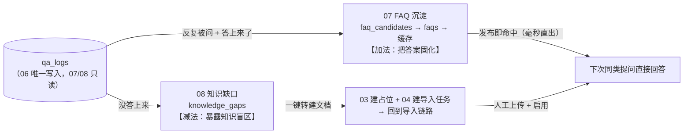
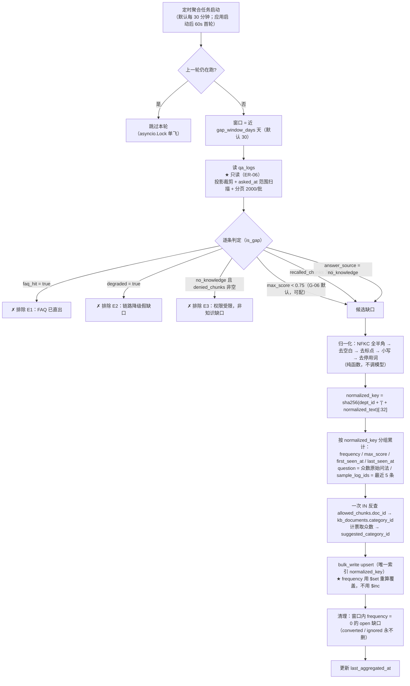
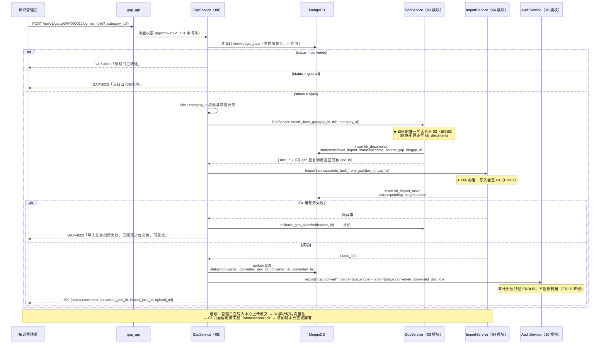
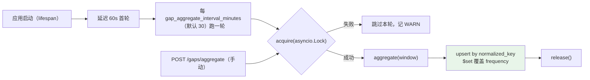

# 08 · 知识缺口

> **文档编号**：04_模块Spec / 08
> **所属项目**：knowledge_manager（PRD 2.9）
> **上游依据**：`00_模块划分与边界.md` · `01_数据实体/数据实体设计.md`（E19，读 E15 / E04 / E05）· `02_概要设计/概要设计.md`（§3.4 沉淀闭环 / §4.3 索引 / §5 接口总览 / AD-01 / AD-05 / AD-08）
> **对应原型**：`05_知识沉淀与运营管理页.pen` 的「知识缺口清单」区块（`gpT` / `gpDeptT` / `gpHint` / `gpExportT` / `gapTblH0T`~`gapTblH5T` / `gapTblR0C5T`）+ 关键标注第 2、6 条
> **状态**：Step 4 产物 · 待评审
> **错误码前缀**：`GAP`（见总纲 §3）

---

## 1. 模块职责与边界

### 1.1 做什么

| # | 职责 | 对应 PRD / 原型 |
|---|---|---|
| 1 | **未命中识别**：定时从 `qa_logs` 识别三类未命中（相似度不足 / 召回为空 / `no_knowledge`） | 2.9.1「未命中知识缺口识别」；原型 `gpHint` |
| 2 | **归一化与合并计数**：按 `normalized_key` 唯一索引把同部门同义问法合并为**一条**缺口并累计频次 | 原型关键标注第 6 条 |
| 3 | **缺口诊断清单**：未命中提问文本 / 提问部门 / 近期频次 / 最高相似度 / 建议创建分类 | 2.9.8「知识缺口诊断清单」 |
| 4 | **建议创建分类推断**：由该问题历次召回的 `allowed_chunks` 反查 `kb_documents.category_id`，取出现最多的分类 | 实体设计 E19 |
| 5 | **代表性样本**：`sample_log_ids` 保留**最多 5 条**代表性 `qa_logs` ID，供详情页展开同义问法 | 实体设计 E19 |
| 6 | **一键转建文档**：跨模块调用 **03 创建知识单元占位 + 04 建立导入任务**，把缺口送回导入链路 | 原型 `gapTblR0C5T`「一键转建文档」 |
| 7 | **缺口状态管理**：`open` / `converted` / `ignored`，并识别「**转建后仍被提问**」的复现信号 | 实体设计 E19 `gap_status` |
| 8 | **聚合任务调度与幂等**：进程内轻量定时器 + 单飞锁 + 重算覆盖，保证重复跑不重复计数 | 概要设计 §3.4「定时任务」 |
| 9 | 缺口清单**导出**（CSV，UTF-8 BOM，Excel 可直接打开） | 原型 `gpExportT`「导出清单」 |

### 1.2 不做什么（明确排除，避免与别的模块抢职责）

| 不做 | 归属 | 为什么 |
|---|---|---|
| **判定"某篇知识能不能读"** | **05 四维数据权限与鉴权引擎** | ER-03：判定**只有一份实现**。本模块读 `qa_logs` 里 06 已经算好的 `allowed_chunks` / `denied_chunks`，**不自己调权限**，也不实现任何 `allow = is_global or ...` |
| **写 `qa_logs`** | **06 AI 鉴权问答** | **ER-06**：E15 的唯一写入者是 06。本模块对 `qa_logs` **只有 `find` / `aggregate` / `count`**，代码评审会逐条检查无 `insert` / `update` / `delete` |
| **FAQ 的挖掘 / 聚类 / 审核 / 发布 / 缓存** | **07 FAQ 沉淀** | 两者共享同一份 `qa_logs` 原料但产出不同，见 §1.4 |
| **创建知识单元 / 上传文件 / 解析 / 切片 / 向量化** | **03 / 04** | **ER-02**：E04 的唯一写入者是 03、E06 的唯一写入者是 04。本模块转建时**必须调用 Service**，禁止直连写 `kb_documents` / `kb_import_tasks` |
| **分类树的维护** | **03 知识单元与分类** | 本模块只**读** `kb_categories` 取分类路径用于展示 |
| **直读部门表** | **02 组织架构** | 总纲 §5 的 E08 允许读取模块清单**未包含 08**，故本模块经 `OrgService.get_dept_names()` 取部门名（见 §8 OQ-08-11） |
| **写指标桶** | **09 运营看板** | **ER-07**：需看"缺口数"时由 09 **只读** `knowledge_gaps`（总纲 §5 已授权 09 读 E19），本模块不投递指标 |
| **让 `sys_admin` 看缺口清单** | — | 01 模块 §2.3 C 表里 `sys_admin` **不含** `gap:read` / `gap:convert`；缺口清单仅知识管理员可见，本模块**不为其开后门** |
| 缺口自动闭环（自动补文档 / 自动发 FAQ） | — | 转建只产出 `disabled` 占位文档与 `pending` 导入任务，**后续上传与启用由人工完成**（见 §8 OQ-08-08） |

### 1.3 归属实体

| 实体 | 集合 | 本模块权限 |
|---|---|---|
| E19 知识缺口 | `knowledge_gaps` | **唯一写入者**（ER-02） |
| E15 问答日志 | `qa_logs` | **只读**（ER-06：唯一写入者是 06） |
| E04 知识单元 | `kb_documents` | **只读**（只反查 `category_id`；写属 03） |
| E05 知识分类 | `kb_categories` | **只读**（取 `path` 拼展示路径；写属 03） |
| E06 导入任务 | `kb_import_tasks` | **不可读写**，转建时经 04 的 `ImportService`（ER-02） |
| E08 部门 | `sys_departments` | **不直读**，经 02 的 `OrgService.get_dept_names()` 取名称 |
| E09 用户 | `sys_users` | **不读**（缺口清单**不展示提问人姓名**，见 §1.5） |
| E21 审计日志 | `audit_logs` | 只经 `AuditService.record()` 写（ER-05） |

### 1.4 与 07 FAQ 沉淀的分工（**最容易混的一处，先讲清**）



| 维度 | 07 FAQ 沉淀 | **08 知识缺口** |
|---|---|---|
| 原料 | `qa_logs`（**只读**） | `qa_logs`（**只读**） |
| 判据 | 同一问题被反复问到**且答得上来**（`allowed_chunks` 非空） | **没答上来**（相似度低 / 召回空 / `no_knowledge`） |
| 阈值来源 | G-05（频次 ≥ 20、聚类相似度 ≥ 0.85） | **G-06（`max_score < 0.75`）** |
| 产出 | `faq_candidates` → `faqs` → `FaqCache` | `knowledge_gaps` |
| 产出后动作 | 审核发布，**发布即生效** | 一键转建 → **回到导入链路**，需人工补文档 |
| 实现依赖 | 需 BGE-M3 做 embedding 聚类 | **纯规则，不调用任何模型**（这是 08 比 07 轻的关键） |
| 覆盖关系 | 一条日志**可能同时**进入两侧（"没答好但被反复问"）。两者**互不排斥，也不写同一集合** | 同左 |

> **裁定（原型关键标注第 2 条的落地，DEC-08-10）**：07 的候选卡片若 `related_docs` 为空（原型 `candTblR1C2T`「（未命中任何文档）」），说明这一簇本身就是知识缺口。链路为**两段**：
>
> | 段 | 动作 | 跨模块形式 | 谁写 E19 / E04 |
> |---|---|---|---|
> | ① 登记缺口 | 07 驳回候选（`convert_to_gap=true`）时投递 **`GapService.upsert_from_cluster()`** | **进程内 Service 调用（不经 HTTP）** | **08**（E19 的唯一写入者，ER-02） |
> | ② 真正转建 | 前端携 `gap_id` 跳转到 08 缺口清单（`?keyword={代表问法}` 预筛选），由知识管理员点「一键转建文档」→ `POST /gaps/{gap_id}/convert` | HTTP（`gap:convert`） | 03（E04）+ 04（E06） |
>
> **理由**：总纲 §4 的依赖图里只有 `08 → 03` 这条边，**没有 `07 → 03 / 04`**。因此 07 **只能把结论投给 08**，
> E19 由 08 落库、E04/E06 由 03/04 落库，谁都不越界（ER-02）；本模块据此提供 `upsert_from_cluster()`，
> 与 `07_FAQ沉淀.md` §3.3 R-06、AC-07-30 的契约严格对齐。

### 1.5 隐私边界裁定（**缺口清单要展示"别人的提问原文"，必须划清范围**，DEC-08-8）

| 项 | 裁定 | 理由 |
|---|---|---|
| 可见角色 | **仅拥有 `gap:read` 的角色（当前 = `kb_admin`）** | 未命中的提问原文可能含敏感内容；普通用户与 `sys_admin` 均不可见（§1.2） |
| 展示内容 | 提问**文本** + 提问**部门** + 频次 + 最高相似度 | PRD 2.9.8 明确要求这四项，是诊断所必需 |
| **不展示** | **提问人姓名、`user_id` 以外的身份信息** | 原型未展示提问人；**G-12** 已确立"问答内容不跨用户可见"的保守原则，缺口清单是必要例外，**不应再扩大暴露面** |
| 部门维度 | 用 `qa_logs.dept_id` **提问时快照**，不回查用户当前部门 | 与 06 模块一致：调岗后统计仍准确 |

### 1.6 依赖模块

| 方向 | 模块 | 用途 |
|---|---|---|
| 依赖 | 00 公共基础 | 配置、错误注册、统一响应、Mongo 连接、**轻量定时器**、`@require_perm` 装饰器 |
| 依赖 | 01 登录与功能权限 | `gap:read` / `gap:convert` 权限码；`UserContext`（`user_id` 用于 `converted_by`） |
| 依赖 | 02 组织架构 | `OrgService.get_dept_names(dept_ids)`（**批量**，取提问部门名） |
| **依赖** | **03 知识单元与分类** | `DocService.create_from_gap()` 建占位 + `DocService.rollback_gap_placeholder()` 补偿；只读 `kb_documents.category_id`、`kb_categories.path` |
| **依赖** | **04 文档导入** | `ImportService.create_task_from_gap()` 建导入任务 |
| 依赖 | 06 AI 鉴权问答 | 只读 `qa_logs`（`recalled_chunks`/`allowed_chunks`/`denied_chunks`/`max_score`/`answer_source`/`degraded`/`faq_hit`） |
| 依赖 | 10 审计日志 | `AuditService.record("gap.convert", before, after)`（ER-05） |
| 被依赖 | 07 FAQ 沉淀 | 候选簇"未命中任何文档"时的转建出口（§1.4） |
| 被依赖 | 09 运营看板 | 只读 `knowledge_gaps` 统计缺口数（**09 直读，不经本模块接口**） |

---

## 2. 数据契约

### 2.1 E19 · 知识缺口 `knowledge_gaps`（**本模块唯一归属的集合**）

| 字段 | 类型 | 必填 | 来源 | 说明 |
|---|---|:--:|---|---|
| `_id` | string | ✔ | Step 1 | 缺口编号 `GAP{6位序列}`（如 `GAP000012`） |
| `question` | string | ✔ | Step 1 | 未命中的提问 —— 取该 key 下**出现次数最多的原始问法**（众数；平局取最早出现者），保证清单标题稳定不跳动 |
| `normalized_key` | string | ✔ | Step 1 | **归一化键（唯一索引）**，见 §2.3；`sha256("{dept_id}\|{normalized_text}")[:32]` |
| `dept_id` | string \| null | ✔ | Step 1 | 提问部门，取自 `qa_logs.dept_id` 快照；**07 投递且簇内无部门信息时为 `null`**（见 OQ-08-13） |
| `frequency` | int | ✔ | Step 1 | **近期频次**：窗口内重算覆盖（非累加），见 §2.4 |
| `max_score` | float | ✔ | Step 1 | 历史最高相似度；未召回任何切片时记 **`0.0`**（保证排序与展示口径统一） |
| `suggested_category_id` | string \| null | ✔ | Step 1 | 建议创建分类，推断方式见 §2.5 |
| `sample_log_ids` | array\<string\> | ✔ | Step 1 | 代表性 `qa_logs` ID，**最多 5 条**（保留**最近** 5 条） |
| `first_seen_at` / `last_seen_at` | long | ✔ | Step 1 | 窗口内首次 / 最近出现时间（排序、复现检测、清理都依赖它） |
| `status` | enum | ✔ | Step 1 | `gap_status`：`open` / `converted` / `ignored` |
| `converted_doc_id` | string \| null | ✔ | Step 1 | 转建出的知识单元 ID（由 03 返回） |
| `normalized_text` | string | ✔ | **Step 4 补充** | §2.3 第 1~5 步的可读产物；用于排障与跨部门聚合视图（`group_by=question`） |
| `converted_at` / `converted_by` | long / string | | **Step 4 补充** | 转建时间与操作人；`converted_at` 是「转建后复现」判定的基准 |
| `ignored_at` / `ignored_by` | long / string | | **Step 4 补充** | 忽略留痕（与 `converted_*` 对称，便于审计对齐） |
| `ignore_reason` | string | | **Step 4 补充** | 忽略原因（≤ 200 字） |
| `created_at` | long | ✔ | **Step 4 补充** | 缺口首次生成时间（`$setOnInsert`，聚合不覆盖） |
| `last_aggregated_at` | long | ✔ | **Step 4 补充** | 最近一次被聚合任务更新的时间（数据新鲜度展示 + 排障） |

> **为什么补 7 个字段**：与 06 模块给 E02 补 `chunk_refs` 等字段是同一做法。
> Step 1 的 E19 表未列留痕字段，但 ① `status` 若不配 `converted_at` / `ignored_at`，就回答不了"什么时候转建的、转建后问题解决了没有"；
> ② `normalized_key` 是哈希，没有 `normalized_text` 就没法排障，也做不了跨部门聚合视图；
> ③ `last_aggregated_at` 是"清单数据是什么时候的"唯一证据。
>
> ⚠️ **ER-17 合规声明（必须读）**：上表标注「**Step 4 补充**」的 7 个字段，以及 `dept_id` 在 **07 投递且无部门信息时允许为 `null`** 这一放宽，
> 均已按 ER-17 登记，并**已由 Step 1 统一回填**：见 `01_数据实体/数据实体设计.md` **§11 Step 4 回填记录**（E19 共 5 行，日期 2026-09-24）与 E19 实体表的「Step 4 追加」标注。
> 本模块**未改名、未改类型、未删除** Step 1 的任何既有字段；上表对 Step 1 字段的原始定义逐字保留，落地字段以 Step 1 为准。
>
> ⚠️ **一处措辞需要澄清（已登记，见 §8.3 修订建议第 4 条）**：Step 1 的 E19 表把 `frequency` 写成「出现频次（**累加**）」。
> 这里的"累加"是**语义**描述（该问题在窗口内累计被问了多少次），而 DEC-08-5 规定的是**写入方式**：每轮聚合在窗口内**重算**后 `$set` 覆盖，而非用 `$inc` 自增。
> 二者不矛盾 —— 语义不变，只是把"累加"从数据库原子操作改成幂等的重算覆盖。建议 Step 1 把该列措辞改为「出现频次（窗口内累计，**由 08 重算覆盖**）」。

### 2.2 索引设计

| 索引 | 类型 | 用途 |
|---|---|---|
| `normalized_key` | **唯一** | **合并计数的基石**：同类问题只有一条记录（概要设计 §4.3 明确要求） |
| `status + frequency desc` | 复合 | 缺口清单**默认排序**（概要设计 §4.3 明确要求） |
| `dept_id + status + frequency desc` | 复合 | 原型 `gpDeptT`「全部部门 ▾」按部门筛选 |
| `max_score asc` | 单列 | 「**最该补**」排序 —— `max_score` 越接近阈值，说明离答对只差一点 |
| `last_seen_at desc` | 单列 | 「最近出现」排序 + 清理 `frequency = 0` 的扫描 |
| `converted_doc_id`（稀疏） | 单列 | 反查"某篇文档是由哪个缺口转建的" |
| `status + normalized_text`（稀疏） | 复合 | 跨部门聚合视图（`group_by=question`） |

**保留策略**（承接数据实体设计 §7，DEC-08-11）

| 场景 | 策略 |
|---|---|
| 通用 | **不设 TTL** —— 缺口是沉淀数据，要支持长期追踪"补了没有" |
| `status = open` 且窗口内 `frequency` 重算为 **0** | 聚合任务**物理删除**（派生数据，30 天内不再出现即视为已消失） |
| `status = converted` / `ignored` | **永久保留**（人工决策痕迹，且 09 看板可能统计） |

### 2.3 `normalized_key` 的归一化算法（**本模块的核心设计**）

**为什么必须归一化**：不归一化时，「差旅报销上限是多少？」「差旅报销上限是多少?」「差旅报销上限是多少」会被拆成 3 条缺口，
清单立刻被同义问法淹没（原型关键标注第 6 条点名了这个问题）。归一化后三者落到**同一个** `normalized_key`，`frequency` 合并计数。

**可实现的步骤**（`app/services/gap_normalizer.py` 纯函数，**无 IO、不依赖模型**）：

```python
import re, hashlib, unicodedata

# 00 模块 app/core/stopwords.py 提供（中文按字、英文按词）
CN_STOP, EN_STOP = load_stopwords()   # 见下方「停用词表的硬约束」

_PUNCT = re.compile(r"[\s\u3000!-/:-@\[-`{-~，。！？；：、“”‘’（）《》【】…—～·]+")

def normalize_question(q: str) -> str:
    # ① 全半角统一 + 兼容字符归一（NFKC：全角字母数字、罗马数字、带圈字符一并折叠）
    s = unicodedata.normalize("NFKC", q)
    # ② 去空白（含 NBSP \u00a0 与全角空格 \u3000），并把连续空白压平
    s = s.replace("\u00a0", " ").strip()
    # ③ 去标点与符号（直接删除而非替换为空格，使「差旅 报销 上限」与「差旅报销上限」等价）
    s = _PUNCT.sub("", s)
    # ④ 小写化（English；中文无大小写，无副作用）
    s = s.lower()
    # ⑤ 去停用词：中文按字过滤，英文按词过滤
    s = "".join(ch for ch in s if ch not in CN_STOP)
    s = " ".join(w for w in s.split() if w not in EN_STOP)
    # ⑥ 兜底：归一化后为空（整句都是标点/停用词）→ 退回 ②④ 的结果，绝不产出空 key
    return s or unicodedata.normalize("NFKC", q).strip().lower()

def build_normalized_key(dept_id: str, normalized_text: str) -> str:
    """唯一索引键。★ 用哈希而非原文，见下方「为什么存哈希」。"""
    return hashlib.sha256(f"{dept_id}|{normalized_text}".encode("utf-8")).hexdigest()[:32]
```

**停用词表的硬约束（写错会造成"错误的合并"，比不合并更危险）**

| 类别 | 是否去除 | 例 | 理由 |
|---|:--:|---|---|
| 疑问虚词 | **✔ 去** | 吗 / 呢 / 吧 / 请问 / 请教 / 一下 | 不携带知识内容 |
| 助词与结构词 | **✔ 去** | 的 / 了 / 着 / 是 | 同上 |
| **否定词** | **✘ 绝对不去** | 不 / 没 / 无 / 未 / 非 / 别 | 去掉会把「年假**能**折现吗」与「年假**不能**折现吗」合并成一条 → **语义反转** |
| 程度与数量词 | **✘ 不去** | 最 / 多少 / 几 / 上限 | 「上限是多少」与「上限」语义不同；保留更安全 |
| 英文冠词 / be 动词 | **✔ 去** | the / a / an / is / are / of | 中文问法为主，影响很小 |

> **设计原则：宁可少合并，不可错合并**（与 ER-04 fail-closed 同一思路——聚合口径保守）。
> 因此**不做**同义词替换、不做词干化、不做拼音归一。

**为什么 `normalized_key` 存哈希而不是原文**

| 理由 | 说明 |
|---|---|
| 绕开 MongoDB 索引键上限 | 索引键上限 **1024 字节**；`question` 允许 500 字，中文 UTF-8 下归一化文本仍可达 1300+ 字节，**直接建唯一索引会写失败** |
| 定长键更小更快 | 32 位十六进制 = 32 字节，索引体积与比较成本都显著下降 |
| 可读性不丢 | `normalized_text` 同文档存一份，排障与聚合视图都够用 |

**部门为什么要进 key（`{dept_id}|{normalized_text}`）**

| 方案 | 优点 | 缺点 | 裁定 |
|---|---|---|---|
| 只用文本 | 跨部门同问题天然合并，频次更高 | `dept_id` 只能存"主责部门"，**按部门筛选会漏/错**；建议分类被多部门问法污染 | ✘ |
| **文本 + 部门** ⭐ | 部门归因准确、建议分类准确、与 PRD「提问部门」列语义一致 | 跨部门同问题被拆散 | **✔ 采用** |

> **补偿手段**：清单接口提供 `?group_by=question` **跨部门聚合视图**（按 `normalized_text` 归并、`frequency` 求和、`dept_id` 变数组）。
> 它是**派生视图，不落库**，因此既不破坏唯一索引口径，又能回答"这个盲区是不是好几个部门都在踩"。

**归一化能力边界（**必须写明，否则会被当成 bug**）**

| 原始问法 A | 原始问法 B | 是否合并 | 说明 |
|---|---|---|---|
| 差旅报销上限是多少**？** | 差旅报销上限是多少 | ✔ 合并 | 标点差异 |
| 差旅报销上限是多少 | 差旅报销上限是多少 | ✔ 合并 | 全半角差异 |
| **请问**差旅报销上限**呢** | 差旅报销上限 | ✔ 合并 | 停用词差异 |
| **差旅**住宿费报销上限 | **出差**住宿报销上限 | **✘ 不合并** | 同义换词（差旅/出差）**规则归一化覆盖不了** |
| 年假**能**折现吗 | 年假**不能**折现吗 | **✘ 不合并** | 否定词语义相反，**故意不合并** |

> 同义换词的合并属于 **07 的向量聚类**职责（AD-06）。若老师要求 08 也覆盖，可追加"归一化后做 embedding 近邻归并"（OQ-08-12），
> 但那会让 08 引入模型依赖，**默认关闭**。

### 2.4 `frequency` 的重算口径与幂等性（**"重复跑不重复计数"的实现**）

| 决策 | 内容 | 为什么 |
|---|---|---|
| 窗口 | `[now - gap_window_days × 86400, now]`，**默认 30 天**（与 07 的挖掘窗口一致，原型 `cdHint` 写「近 30 天日志」） | 与 PRD「**近期**出现频次」字面一致；窗口可配 |
| 写法 | **`$set` 覆盖**，**不是 `$inc` 累加** | `$inc` 一旦重跑就会翻倍；重算覆盖天然幂等——**这是幂等性的第一重保证** |
| 唯一键 | `upsert=True` + `normalized_key` 唯一索引 | 并发或重复执行只会落到同一条记录——**第二重保证** |
| 单飞锁 | 进程内 `asyncio.Lock` 的 `try_acquire`：上一轮未结束则**跳过本轮** | 防止两轮并发互相覆盖——**第三重保证**（AD-01 单进程假设，见 OQ-08-09） |
| 首轮 | 集合为空时按窗口全量扫描（默认近 30 天） | 无需水位线，逻辑更简单 |
| `max_score` | `$max` 语义 → 用重算值 `$set`（批次内取 max；未召回记 `0.0`） | 与 `frequency` 同源，保证一致 |
| `first_seen_at` / `last_seen_at` | 批次内 `min` / `max` 重算覆盖 | 同上 |
| 人工状态保护 | `status` / `converted_*` / `ignored_*` 一律走 **`$setOnInsert`**，聚合**绝不覆盖** | **人工决策优先**：已被忽略的缺口不能被聚合任务改回 `open` |

> **代价与取舍（诚实交代）**：全量重算意味着每轮都扫 30 天日志。演示环境（126 用户）量级为数千~数万条，单轮 P95 < 3s 可接受。
> 若日志量增长到十万级，可切到"水位线增量 + `$inc`"模式（`gap_aggregate_mode = incremental`），但**必须接受重复跑会重复计数的风险**，故默认 `full`（幂等优先）。

### 2.5 `suggested_category_id` 的推断方式（**从 `allowed_chunks` 反查**）

```
① 取该缺口所有样本日志（含窗口内全部日志）的 allowed_chunks[].doc_id，去重
② ★ 一次 IN 查询 kb_documents（只读 E04）：find({_id: {$in: doc_ids}}, {category_id: 1})
   —— 禁止按 doc 逐个查询（ER-13 的 N+1 教训）
③ 按 category_id 计票，取**出现最多的分类**（众数；平局取 doc 数最多者，仍平局取字典序最小）
④ 兜底一：allowed_chunks 全空 → 用 recalled_chunks 中 **score 最高**那条的 doc_id 分类
   （它至少"最接近"，与 max_score 的语义一致）
⑤ 兜底二：仍取不到（无召回 / 文档未分类）→ suggested_category_id = null，前端展示「暂无建议分类」
```

| 出参字段 | 取值 | 说明 |
|---|---|---|
| `suggested_category_id` | `string \| null` | 落库字段 |
| `suggested_category_path` | `string \| null` | **响应字段**，由 `kb_categories.path` 拼成 `客户服务 / 跨境物流`（对齐原型 `gapTblR0C4T`） |
| `suggested_category_basis` | `allowed_chunks` \| `top_recalled` \| `unavailable` \| `none` | **响应字段**，说明建议是"算出来的"还是"兜底的"还是"依赖不可用" |

> **为什么只建议、不自动创建分类**：悬空点 **G-01**（文件夹导入是否自动映射分类）尚未确认，此时自动建分类树会与 03 的口径冲突。
> 转建时 `category_id` **默认取建议值但允许人工覆盖**，且**不新增分类**。

### 2.6 枚举引用（ER-10：**按实体各自定义，禁止共用通用 `StatusEnum`**）

| 枚举组 | 取值 | 适用字段 | 落地 |
|---|---|---|---|
| `gap_status` | `open` / `converted` / `ignored` | `knowledge_gaps.status` | 00 模块 `app/core/enums.py` 中定义**独立的** `GapStatus`；**不得**与 `doc_status` / `task_status` / `user_status` / `faq_status` 复用同一个类 |

> 数据实体设计 §8 第 4 条明确警告："多个实体都有 `status` 但取值域不同，必须按实体各自定义枚举类"。
> 本模块只认 `gap_status` 的三个值；收到 `enabled` / `pending` 之类的值一律按参数错处理（`GAP-1001`）。

---

## 3. 接口清单

> **统一说明**：全部接口都在 `/api/v1/gaps/*` 分区（总纲 §6.1）；除 `POST /gaps/aggregate` 外**均为只读或单文档状态变更**。
> 所有接口过 01 的 JWT 中间件（ER-08）；写操作经 `AuditService.record()`（ER-05，失败不阻断）。

### 3.1 `GET /api/v1/gaps` — 缺口清单（**主接口，对齐 PRD 2.9.8**）

| 项 | 内容 |
|---|---|
| 功能权限 | `gap:read` |
| 对应原型 | `gpT`「知识缺口清单」+ `gpDeptT`「全部部门 ▾」+ 6 列表头 |

**入参**

| 参数 | 类型 | 必填 | 默认 | 说明 |
|---|---|:--:|---|---|
| `status` | enum | | `open` | `open` / `converted` / `ignored` / `all` |
| `dept_id` | string | | — | 部门筛选（原型下拉） |
| `keyword` | string | | — | 包含匹配 `question` 与 `normalized_text`（正则转义，防 ReDoS） |
| `category_id` | string | | — | 按建议分类筛选 |
| `min_frequency` | int | | `1` | 频次下限 |
| `sort` | enum | | `frequency_desc` | `frequency_desc` / `frequency_asc` / `max_score_desc` / `max_score_asc` / `last_seen_desc` |
| `group_by` | enum | | `none` | `none` / `question`（跨部门聚合视图，见 §2.3） |
| `page` / `page_size` | int | | `1` / `20` | `page_size` 上限 **200** |

**出参**

```jsonc
{
  "items": [{
    "gap_id": "GAP000012",
    "question": "海外直邮保税仓清关延误要多久",
    "normalized_key": "3f2a9c1b7e4d5a6f8b0c2d3e4f5a6b7c",
    "dept_id": "DEPT0007", "dept_name": "客户服务部",
    "frequency": 27,
    "max_score": 0.42,
    "suggested_category_id": "CAT00031",
    "suggested_category_path": "客户服务 / 跨境物流",
    "suggested_category_basis": "allowed_chunks",
    "sample_log_ids": ["QL000123", "QL000456"],
    "first_seen_at": 1789000000000, "last_seen_at": 1790100000000,
    "status": "open",
    "converted_doc_id": null, "converted_at": null, "converted_by": null,
    "recurred": false,
    "last_aggregated_at": 1790100000000
  }],
  "summary": { "open": 12, "converted": 5, "ignored": 3, "total_frequency": 143 },
  "aggregated_at": 1790100000000,
  "total": 12, "page": 1, "page_size": 20
}
```

**服务端规则**

| # | 规则 | 失败码 |
|---|---|---|
| R-01 | 默认只返回 `status=open`（待处理口径，与「一键转建文档」按钮存在的前提一致） | — |
| R-02 | 无显式 `sort` 时按 `frequency desc, max_score desc, last_seen_at desc` **三级排序**，同频次结果稳定可翻页 | — |
| R-03 | `dept_name` 经 02 的 `OrgService.get_dept_names(dept_ids)` **一次批量**取回（ER-13 精神）；失败时 `dept_name` 回落为 `dept_id` | 不报错（降级） |
| R-04 | `suggested_category_path` 由 `kb_categories.path` 拼接；分类不可读时置 `null` 且 `basis="unavailable"` | — |
| R-05 | `recurred = (status == "converted") and (last_seen_at > converted_at)` —— 「**转建后仍被提问**」 | — |
| R-06 | `summary` 是**全量**统计（不受当前筛选影响），用于页面顶部计数 | — |
| R-07 | **清单永远读快照，不触发实时聚合**；响应带 `aggregated_at`（= `max(last_aggregated_at)`）供前端提示数据时间 | — |
| R-08 | `group_by=question`：按 `normalized_text` 归并同文本记录，`frequency` 求和、`max_score` 取最大、`dept_id`/`dept_name` 变**数组**；**不落库** | — |
| R-09 | 参数非法（`page_size > 200`、`sort` 非法、`status` 非 `gap_status` 取值、`min_frequency < 0`） | `GAP-1001` |
| R-10 | 无 `gap:read`（含 `asker` / `sys_admin`） | `GAP-2001` |
| R-11 | `knowledge_gaps` 不可读 | `GAP-5002`（不返回半截数据） |

### 3.2 `GET /api/v1/gaps/{gap_id}` — 缺口详情（含代表性样本）

| 项 | 内容 |
|---|---|
| 功能权限 | `gap:read` |
| 入参 | 路径参数 `gap_id` |
| 出参 | §3.1 的 `items[0]` 全部字段 + `samples` + `samples_expired` + `synonym_questions` |

```jsonc
{
  "gap_id": "GAP000012",
  "samples": [
    { "log_id": "QL000123", "question": "海外直邮清关要多久能到", "asked_at": 1790050000000,
      "answer_source": "no_knowledge", "max_score": 0.42,
      "recalled_cnt": 3, "allowed_cnt": 0, "denied_cnt": 0 }
  ],
  "synonym_questions": ["海外直邮保税仓清关延误要多久", "海外直邮清关要多久能到"],
  "samples_expired": false
}
```

**服务端规则**

| # | 规则 | 失败码 |
|---|---|---|
| R-01 | `sample_log_ids` 经 `qa_logs` **一次 `$in` 查询**（**只读，ER-06**），逐条不可单独查（防 N+1） | — |
| R-02 | `qa_logs` 有 **180 天 TTL**；样本日志已被清理时**跳过该条**并置 `samples_expired = true`（**不报错**，因为缺口数据本身有效） | — |
| R-03 | `synonym_questions` = 该 key 下所有样本的**去重原始问法**（即"同一归一化键下人类问法的真实分布"，供转建时写文档标题参考） | — |
| R-04 | **不返回提问人姓名**（§1.5 裁定） | — |
| R-05 | `gap_id` 不存在或已被清理 | `GAP-3002` |
| R-06 | 无 `gap:read` | `GAP-2001` |

### 3.3 `POST /api/v1/gaps/{gap_id}/convert` — **一键转建文档**（本模块唯一的跨模块写操作）

| 项 | 内容 |
|---|---|
| 功能权限 | `gap:convert` |
| 对应原型 | `gapTblR0C5T`「一键转建文档」 |
| 入参 | `{ "title"?: string, "category_id"?: string }` |
| 出参 | `{ "gap_id", "status": "converted", "converted_doc_id", "import_task_id", "doc_status": "disabled", "task_status": "pending", "upload_url": "/api/v1/import/upload?doc_id=…" }` |

**入参默认值**：`title` 缺省 = `gap.question`；`category_id` 缺省 = `gap.suggested_category_id`（可为 null → 03 建成的占位文档归入"未分类"）。

**服务端规则（规则 → 失败码）**

| # | 规则 | 失败码 |
|---|---|---|
| R-01 | `gap_id` 存在 | `GAP-3002` |
| R-02 | **仅 `status == open` 可转建**；`converted` → 拒绝 | `GAP-3001`（**总纲 §3 示例码**） |
| R-03 | `ignored` → 拒绝（需先在 §3.4 恢复? 本步不提供恢复，见 OQ-08-06） | `GAP-3003` |
| R-04 | `frequency == 0`（已被聚合判定为不再出现）→ 拒绝并提示刷新 | `GAP-3004` |
| R-05 | `title` 去空白后非空且 ≤ 200 字 | `GAP-1003` |
| R-06 | `category_id` 若传入，必须在 `kb_categories` 存在且 `status=active` | `GAP-1004` |
| R-07 | **经 `DocService.create_from_gap(gap_id, title, category_id)`（03 模块）**创建 E04 占位：`status=disabled`、`import_status=pending`、`source_gap_id=gap_id`。★ **08 绝不直连写 `kb_documents`（ER-02 / DEC-08-7）** | `GAP-4001` |
| R-08 | **经 `ImportService.create_task_from_gap(doc_id, gap_id)`（04 模块）**创建 E06 导入任务：`status=pending`、`stage=upload`。★ **08 绝不直连写 `kb_import_tasks`（ER-02 / DEC-08-7）** | `GAP-4002` |
| R-09 | R-08 失败 → **补偿**：调 `DocService.rollback_gap_placeholder(doc_id)` 撤销占位，**缺口状态保持不变（仍 `open`）**，可直接重试 | `GAP-4002` |
| R-10 | 成功后回写 E19（**E19 是本模块的，可直写**）：`status=converted`、`converted_doc_id`、`converted_at`、`converted_by` | `GAP-5001` |
| R-11 | **经 `AuditService.record("gap.convert", before={status:open}, after={status:converted, converted_doc_id})`**（ER-05）；写失败只记 ERROR，**不阻断** | 降级不阻断 |
| R-12 | **幂等**：重复点击第二次必然命中 R-02 → `GAP-3001`，且**不会**产生第二个占位文档或第二个导入任务 | `GAP-3001` |
| R-13 | R-10 失败时占位与任务**已创建**：响应体仍带 `converted_doc_id` / `import_task_id` 供人工核对，**不做静默回滚**（避免"文档在、任务没了"的不一致） | `GAP-5001` |

**跨模块幂等契约（**要求 03 / 04 配合实现，见 OQ-08-04**）**

| 被调方 | 方法 | 幂等键 | 重复调用的期望行为 |
|---|---|---|---|
| 03 | `DocService.create_from_gap(gap_id, title, category_id)` | `kb_documents.source_gap_id`（稀疏**唯一**索引） | 同一 `gap_id` **返回已存在的 `doc_id`**，不新建 |
| 03 | `DocService.rollback_gap_placeholder(doc_id)` | `doc_id` | 仅当该文档仍是"无切片、未上传"的占位态才可撤；否则返回失败（转人工） |
| 04 | `ImportService.create_task_from_gap(doc_id, gap_id)` | `kb_import_tasks` 上"同 `doc_id` 且 `status ∈ {pending, running}`" | **返回已存在的 `task_id`**，不重复建任务 |
| 02 | `OrgService.get_dept_names(dept_ids)` | 无（纯读） | — |

### 3.4 `POST /api/v1/gaps/{gap_id}/ignore` — 忽略缺口

| 项 | 内容 |
|---|---|
| 功能权限 | `gap:convert`（**34 个码中唯一的缺口写权限**，见 OQ-08-05） |
| 入参 | `{ "reason"?: string }`（≤ 200 字，写入 `ignore_reason` 与审计） |
| 出参 | `{ "gap_id", "status": "ignored" }` |

**服务端规则**

| # | 规则 | 失败码 |
|---|---|---|
| R-01 | `gap_id` 存在 | `GAP-3002` |
| R-02 | `converted` 的缺口不可忽略（已投入资源，语义冲突） | `GAP-3001` |
| R-03 | **已 `ignored` 时幂等返回当前状态 200**（前端重复点击不报错） | — |
| R-04 | 写 `status=ignored`、`ignored_at`、`ignored_by`、`ignore_reason`；**`converted_doc_id` 不动** | `GAP-5001` |
| R-05 | 写审计 `gap.ignore`（含 `reason`）；失败只记 ERROR | 降级不阻断 |

> **为什么需要这个接口**：E19 的 `gap_status` 明确定义了 `ignored`。若不提供写入口，该枚举值**永远不可达** —— 一个数据模型里定义了却无法进入的状态，
> 会让"缺口清单越积越长"，也会让课堂演示无法展示"排除误报"的动作。

### 3.5 `POST /api/v1/gaps/aggregate` — 手动触发聚合（**演示用**）

| 项 | 内容 |
|---|---|
| 功能权限 | `gap:convert` |
| 入参 | `{ "window_days"?: int }`（默认取配置 `gap_window_days` = 30，范围 **1~90**） |
| 出参 | `{ "trigger": "manual", "scanned_logs": 1842, "gap_keys": 37, "created": 6, "updated": 31, "removed": 2, "duration_ms": 1873 }` |
| 对应参照 | 与 07 的 `/api/v1/faq/mine`（手动触发挖掘）同构，便于课堂演示"点一下缺口就出来了" |

**服务端规则**

| # | 规则 | 失败码 |
|---|---|---|
| R-01 | 与**定时任务共用同一实现与同一把单飞锁**（不另写一套逻辑） | — |
| R-02 | 已有聚合在运行 → **不排队**，直接返回进行中 | `GAP-3005` |
| R-03 | `window_days` 超出 1~90 | `GAP-1002` |
| R-04 | 单轮扫描日志上限 `gap_max_scan_logs`（默认 50000），超出则本轮只处理最近的 N 条并记 WARN | — |
| R-05 | 内部异常 → 记 ERROR、保留已写入数据、返回失败（下一轮重试） | `GAP-5002` |
| R-06 | 无 `gap:convert` | `GAP-2001` |

### 3.6 `GET /api/v1/gaps/export` — 导出缺口清单

| 项 | 内容 |
|---|---|
| 功能权限 | `gap:read`（**34 个码中没有"缺口导出"码**，见 OQ-08-07） |
| 对应原型 | `gpExportT`「导出清单」 |
| 入参 | 与 §3.1 相同的筛选参数 + `format`（默认 `csv`） |
| 出参 | `text/csv; charset=utf-8`，**带 UTF-8 BOM**（Excel 双击不乱码），附件名 `knowledge_gaps_{yyyymmdd}.csv` |

**CSV 列（与页面列名一致，便于对照）**

| 序 | 列名 | 来源字段 |
|---|---|---|
| 1 | 缺口编号 | `gap_id` |
| 2 | 未命中提问 | `question` |
| 3 | 提问部门 | `dept_name` |
| 4 | 近期频次 | `frequency` |
| 5 | 最高相似度 | `max_score` |
| 6 | 建议创建分类 | `suggested_category_path` |
| 7 | 状态 | `status` |
| 8 | 首次出现 / 最近出现 | `first_seen_at` / `last_seen_at`（本地时区 `YYYY-MM-DD HH:mm`） |
| 9 | 已转建文档 | `converted_doc_id` |

**服务端规则**

| # | 规则 | 失败码 |
|---|---|---|
| R-01 | 导出上限 **5000 行**；超出 | `GAP-1005` |
| R-02 | 逐行流式输出，不在内存拼完整字符串（防大清单 OOM） | `GAP-5003` |
| R-03 | 无 `gap:read` | `GAP-2001` |

### 3.7 接口一览

| 方法 | 路径 | 功能权限 | 说明 |
|---|---|---|---|
| GET | `/api/v1/gaps` | `gap:read` | 缺口清单（筛选 / 排序 / 分页 / 跨部门视图） |
| GET | `/api/v1/gaps/{gap_id}` | `gap:read` | 缺口详情 + 代表性样本 + 同义问法分布 |
| POST | `/api/v1/gaps/{gap_id}/convert` | `gap:convert` | **一键转建文档**（跨模块调 03 + 04） |
| POST | `/api/v1/gaps/{gap_id}/ignore` | `gap:convert` | 忽略缺口（`ignored` 状态的唯一入口） |
| POST | `/api/v1/gaps/aggregate` | `gap:convert` | 手动触发聚合（演示用） |
| GET | `/api/v1/gaps/export` | `gap:read` | 导出 CSV 清单 |

**内部接口（Python 层，不经 HTTP）**

| 函数 | 调用方 | 说明 |
|---|---|---|
| `GapService.aggregate(window_days, trigger) -> AggregateResult` | 定时器 / §3.5 | 单轮聚合（幂等） |
| `GapService.convert(gap_id, title, category_id, actor) -> ConvertResult` | §3.3 | 转建主逻辑（§4.2） |
| **`GapService.upsert_from_cluster(cluster_key, representative_question, dept_id, related_doc_ids, window_start, window_end, operator_id) -> ClusterForwardResult`** | **07 FAQ 沉淀**（§3.3 R-06 的投递入口） | **★ 跨模块契约**：07 驳回"无来源簇"时投递，08 落 E19（**ER-02 的唯一写入者**），返回 `{ "gap_id", "created": bool }`。规则：① `dept_id` 为 `None` 时用哨兵分量构造 key 并置 `dept_id = null`；② **已存在的 key 只更新 `last_seen_at` / `last_aggregated_at`，绝不覆盖 `status` / `converted_*` / `ignored_*`**；③ 同一 `cluster_key` + 窗口重复投递**幂等**（返回既有 `gap_id`，`created=false`）；④ 失败向 07 抛异常，07 记 ERROR 并返回 `gap_forwarded=false`（**07 不自行写 `knowledge_gaps`**） |
| `normalize_question(q) -> str` | `GapService.aggregate` | **纯函数、无 IO、不依赖模型** |
| `build_normalized_key(dept_id, normalized_text) -> str` | `GapService.aggregate` | 唯一索引键（部门分量可为哨兵值） |
| `is_gap(log) -> tuple[bool, str]` | `GapService.aggregate` | 返回是否缺口 + 判据（`low_score` / `empty_recall` / `no_knowledge` / `excluded_faq_hit` / `excluded_degraded` / `excluded_permission_denied`），便于排障与单测 |

---

## 4. 关键流程

### 4.1 未命中识别与按 `normalized_key` 合并计数

**第一步：判定口径（三者是 OR 关系，DEC-08-1）**

| 序 | 情形 | 判据 | 出处 |
|---|---|---|---|
| 1 | **相似度不足** | `max_score < gap_threshold`，**默认 `0.75`（悬空点 G-06 的默认值，待确认）** | **G-06** |
| 2 | **召回为空** | `len(recalled_chunks) == 0` | 原型 `gpHint`「或未召回任何切片」 |
| 3 | **无知识** | `answer_source == "no_knowledge"` | 数据实体设计 §8 `answer_source` 枚举 |
| — | 上表三条 **OR**：满足**任意一条**即进入候选 | | |

**第二步：排除假缺口（**必须先判排除，否则清单会被噪声淹没**，DEC-08-1）**

| 序 | 排除情形 | 判据 | 为什么必须排除 |
|---|---|---|---|
| E1 | FAQ 缓存直出 | `faq_hit == true` | 已经答上了（毫秒级直出），不是缺口 |
| E2 | 链路降级 | `degraded == true` | Milvus / Embedding / rerank 挂掉时会产出 `no_knowledge`，**这是故障不是缺口**；不排除会误导管理员去补根本不缺的知识 |
| E3 | **权限受限** | `answer_source == "no_knowledge"` **且** `len(denied_chunks) > 0` | 知识**已经存在**，只是该用户无权读。若判为缺口，管理员会去"补"一篇已存在的文档（06 模块 §2.4 专门用 `denied_chunks` 区分这两种情况） |

**第三步：聚合与写库**



**步骤说明**

| 步 | 动作 | 为什么这样做 |
|---|---|---|
| 1 | 定时器每 30 分钟触发（可配） | 与 07 的挖掘周期解耦；缺口是"近实时"诊断，不需要秒级 |
| 2 | `try_acquire` 单飞锁 | 防两轮并发互相覆盖（§2.4 第三重幂等保证） |
| 3 | 读 `qa_logs`，**只读** | ER-06；投影只取判定与聚合所需字段，减少 IO |
| 4 | 逐条 `is_gap()` | 排除条件 E2/E3 **无法用 Mongo 索引表达**，必须在应用层二次过滤 |
| 5 | 归一化 + 哈希 key | 合并同义问法的唯一手段；哈希规避索引键 1024 字节上限 |
| 6 | 分组 + 众数取 `question` | 清单标题稳定；同义分布留给详情页 |
| 7 | 一次 `$in` 反查建议分类 | ER-13 的教训：禁止按文档逐个查 |
| 8 | `bulk_write` upsert，`$set` 覆盖 | 幂等性来源；`$setOnInsert` 保护人工状态（§2.4） |
| 9 | 清理 `frequency = 0` 的 `open` 缺口 | 30 天内不再出现的盲区自动消失；人工决策记录保留 |

### 4.2 「一键转建文档」时序图（**08 → 03 → 04 跨模块链路**）



**步骤说明**

| 步 | 动作 | 关键约束 |
|---|---|---|
| 1 | `gap:convert` 功能权限校验 | 01 中间件；`asker` / `sys_admin` 在此被拦（`GAP-2001`） |
| 2 | 校验缺口状态 | 仅 `open` 可转建；`GAP-3001` / `GAP-3003` / `GAP-3004` |
| 3 | 调 **03** `create_from_gap()` | **ER-02**：E04 的写入只能发生在 03 内部；响应只有 `doc_id` |
| 4 | 调 **04** `create_task_from_gap()` | **ER-02**：E06 的写入只能发生在 04 内部；响应只有 `task_id` |
| 5 | 04 失败 → 调 03 `rollback_gap_placeholder()` | 补偿事务；**缺口保持 `open`**，用户可直接重试（不产生"孤儿占位文档"） |
| 6 | 回写 E19 | E19 是本模块的，可直写；`$set` 四个字段 |
| 7 | 写审计 `gap.convert` | ER-05：只能经 `AuditService`；失败降级不阻断 |
| 8 | 返回 `upload_url` | 前端直接跳到 04 的上传页，省去人工找入口 |

> **为什么不做"08 直接 insert `kb_documents` + `kb_import_tasks`"**：这正是 2.3 项目 `device_user_cnt` 出问题的方式——
> 同一实体两处写入导致口径分叉。转建涉及的字段（`source_gap_id` / `import_status` / `chunk_count` / 分类校验）都有 03/04 的既有规则，
> 08 自行拼一条 `kb_documents` 必然与 03 的建文档逻辑不一致（例如漏了 `file_hash` 占位、漏了分类 `path` 校验）。

### 4.3 调度与幂等（**"重复跑不重复计数"的三重保证**）



| 保证 | 机制 | 反例（若没有它） |
|---|---|---|
| ① 重算覆盖（DEC-08-5） | `frequency` = 窗口内**重新统计**的结果，`$set` 写回 | 用 `$inc` 的话，手滑点两次"手动触发"频次就翻倍 |
| ② 唯一键 upsert | `normalized_key` 唯一索引 + `upsert=True` | 无唯一索引会出现两条同义缺口，各自计数 |
| ③ 单飞锁（DEC-08-12） | 进程内 `asyncio.Lock.try_acquire()`，定时与手动**共用同一把锁** | 两轮并发：后一轮读到旧的 `last_seen_at` 后覆盖前一轮结果 |
| ④ 人工状态保护（DEC-08-6） | `status` / `converted_*` / `ignored_*` 走 `$setOnInsert` | 聚合任务把管理员刚"忽略"的缺口改回 `open`，决策被抹掉 |

---

## 5. 错误码表（前缀 `GAP`）

| 错误码 | HTTP | 消息 | 触发条件 |
|---|---|---|---|
| `GAP-1001` | 400 | 查询参数不合法 | `page_size > 200` / `sort` 取值非法 / `status` 不在 `gap_status` 取值域 / `min_frequency < 0` |
| `GAP-1002` | 400 | 时间窗口参数不合法 | 手动聚合的 `window_days` 不在 1~90 |
| `GAP-1003` | 400 | 转建标题不合法 | `title` 去空白后为空，或长度 > 200 |
| `GAP-1004` | 400 | 指定的分类不存在或已停用 | 转建传入的 `category_id` 在 `kb_categories` 无对应或 `status != active` |
| `GAP-1005` | 400 | 导出条数超出上限 | 命中筛选的缺口 > 5000 行 |
| `GAP-2001` | 403 | 功能权限不足 | 无 `gap:read` 调清单/详情/导出；无 `gap:convert` 调转建/忽略/手动聚合（由 01 中间件判定，本模块负责返回本前缀码） |
| `GAP-3001` | 409 | 该缺口已转建 | `status == converted` 时重复调用转建（**总纲 §3 示例码**），或试图忽略一个已转建的缺口 |
| `GAP-3002` | 404 | 知识缺口不存在 | `gap_id` 无效，或该记录已被聚合任务清理（`frequency = 0`） |
| `GAP-3003` | 409 | 该缺口已被忽略 | `status == ignored` 时调用转建 |
| `GAP-3004` | 409 | 缺口数据已过期，请刷新清单 | `frequency == 0`（聚合已判定该问题在窗口内不再出现），转建前拒绝 |
| `GAP-3005` | 409 | 缺口聚合任务正在运行中 | 手动触发 `POST /gaps/aggregate` 时已有聚合在执行（单飞锁未获得） |
| `GAP-4001` | 500 | 知识单元占位创建失败 | 03 的 `DocService.create_from_gap()` 抛异常；**缺口状态不变（仍 `open`）**，可重试 |
| `GAP-4002` | 500 | 导入任务创建失败 | 04 的 `ImportService.create_task_from_gap()` 抛异常；**已调 03 回滚占位文档**，缺口仍 `open` |
| `GAP-4003` | 503 | 问答日志不可读 | `qa_logs` 查询失败/超时 → 聚合**本轮跳过**；清单接口**仍返回已有数据**并带旧 `aggregated_at` |
| `GAP-4004` | 503 | 建议分类反查不可用 | `kb_documents` / `kb_categories` 不可读 → `suggested_category_id = null`、`basis = "unavailable"`，**不阻断聚合与清单** |
| `GAP-5001` | 500 | 缺口状态回写失败 | E19 更新异常（转建时占位与任务**已创建**，响应仍带 `converted_doc_id` / `import_task_id` 供人工核对） |
| `GAP-5002` | 500 | 缺口聚合任务内部异常 | 单轮聚合出现未预期异常 → 记 ERROR，**已写入数据不回滚**，下一轮重试；清单接口读 `knowledge_gaps` 失败也复用本码 |
| `GAP-5003` | 500 | 缺口清单导出失败 | CSV 流式渲染中途异常 |

> **码段约定**（1xxx 参数 / 2xxx 鉴权 / 3xxx 资源状态 / 4xxx 依赖 / 5xxx 内部）已遵守。
> ⚠️ **需同步修订总纲**：总纲 §3 把 08 的段位写成 `1xxx~3xxx`，但转建**必然**要跨模块调 03/04，因此必须存在 `4xxx`（依赖失败）与 `5xxx`（内部失败）码；
> 故本模块实际段位为 `1xxx~5xxx`。**05 模块（`PERM-4001`/`PERM-4002`/`PERM-5001`）已出现同样情况**，建议一并修订总纲 §3 的段位列。

---

## 6. 验收标准

| 编号 | 验收项 | 判定方式 |
|---|---|---|
| **AC-08-01** | **三种判定口径 OR 生效**：分别构造 `max_score = 0.5`（有召回）/ `recalled_chunks = []` / `answer_source = no_knowledge` 三种日志，跑一轮聚合后**三种都生成缺口** | 构造 3 条日志 → 手动聚合 → 查 `knowledge_gaps` |
| **AC-08-02** | **阈值默认 0.75 且可配（G-06 待确认）**：把 `gap_threshold` 调到 0.9 再跑一轮，`max_score = 0.85` 的日志**新进入**缺口清单 | 改配置 → 重跑 → 对比 |
| **AC-08-03** | **同义问法合并计数**：同一部门投 3 条日志「差旅报销上限是多少？」/「差旅报销上限是多少?」/「**请问**差旅报销上限**呢**」，聚合后 `knowledge_gaps` 里**只有 1 条**，`frequency = 3`，`question` 为众数原文 | 查库计数 |
| **AC-08-04** | **`normalized_key` 唯一索引存在**，且对同一 key 重复 upsert 不产生第二条记录 | `list_indexes()` + 重跑聚合 |
| **AC-08-05** | **幂等**：连续手动触发聚合 3 次，`frequency` / `max_score` / 记录条数**完全不变**（不翻倍、不新增） | 连续触发并逐次比对 |
| **AC-08-06** | **假缺口被排除**：构造 `faq_hit=true`、`degraded=true`、以及 `no_knowledge` **且** `denied_chunks` 非空三类日志，聚合后**均不产生缺口** | 三组数据分别验证 |
| **AC-08-07** | **清单字段齐全（PRD 2.9.8）**：接口返回含 `question` / `dept_id` / `frequency` / `max_score` / `suggested_category_id` 五项 | 响应字段检查 |
| **AC-08-08** | **建议分类推断正确**：让某缺口的 `allowed_chunks` 指向 3 篇「财务报销」类 + 1 篇「技术」类文档，`suggested_category_id` 为**财务报销**类，`basis = allowed_chunks` | 构造数据 → 聚合 → 比对 |
| **AC-08-09** | **建议分类兜底链**：`allowed_chunks` 全空时用 `recalled_chunks` 中 score 最高者的分类（`basis = top_recalled`）；再无则 `null` + `basis = none`，**接口不报错** | 两级构造 |
| **AC-08-10** | **样本不超 5 条且为最近 5 条**：投 8 条日志，`sample_log_ids` 长度 = 5；详情接口能展开原始问法与 `synonym_questions` | 查库 + 详情接口 |
| **AC-08-11** | **一键转建全链路**：转建后 ① `gap.status = converted` 且 `converted_at`/`converted_by` 非空 ② `kb_documents` 新增 1 条 `status=disabled`、`source_gap_id` = 该缺口 ③ `kb_import_tasks` 新增 1 条 `status=pending`、`stage=upload` ④ 响应含 `upload_url` | 一次转建后三方核对 |
| **AC-08-12** | **不直连写库（ER-02）**：代码检索确认 08 模块对 `kb_documents` / `kb_import_tasks` **没有任何 insert/update/delete**，写入只发生在 03/04 的 Service 内 | 代码评审 + 运行时断点 |
| **AC-08-13** | **重复转建被拒且无副作用**：第二次点击返回 `GAP-3001`，且 `kb_documents` / `kb_import_tasks` **没有新增记录** | 连点两次后核对集合 |
| **AC-08-14** | **转建失败可补偿**：让 04 抛异常 → 返回 `GAP-4002`、占位文档被回滚、缺口仍为 `open`，**再次点击可成功** | 注入异常后重试 |
| **AC-08-15** | **只读 `qa_logs`（ER-06）**：全模块对 `qa_logs` 只有 `find` / `aggregate` / `count`，**无任何写操作** | 代码检索 |
| **AC-08-16** | **筛选与排序**：按 `status` / `dept_id` 筛选结果正确；`frequency desc`、`max_score asc`、`last_seen_desc` 三种排序结果与手工核算一致 | 逐项构造 |
| **AC-08-17** | **权限边界**：`asker` 与 `sys_admin` 调 `/gaps` 均返回 `GAP-2001`（403）；`kb_admin` 正常 | 三角色分别请求 |
| **AC-08-18** | **审计可追溯**：每次转建/忽略在 `audit_logs` 有一条 `gap.convert` / `gap.ignore`，含 `before`/`after`；审计服务不可用时**转建仍然成功** | 查 `audit_logs` + 停审计模拟 |
| **AC-08-19** | **定时调度与单飞**：服务启动后 60s 内首轮执行，之后按 30 分钟周期；在一轮未结束时手动触发 → `GAP-3005` | 打日志观察 + `GAP-3005` 构造 |
| **AC-08-20** | **转建后复现可识别**：对已转建缺口继续投同类日志，重跑聚合后其 `frequency` **继续增长**、`status` **保持 `converted`**、`recurred = true` | 转建 → 投日志 → 重跑 → 查响应 |
| **AC-08-21** | **忽略后不被聚合改写**：忽略一条缺口后重跑聚合，`status` 仍为 `ignored`；窗口内频次归 0 时**不被清理** | 忽略 → 等待窗口失活 → 重跑 |
| **AC-08-22** | **清理只针对 open**：构造一条 `frequency` 归 0 的 `open` 缺口 → 重跑后**被删除**；同样条件的 `converted` 缺口**保留** | 两条对照 |
| **AC-08-23** | **导出可用**：`/gaps/export` 返回 UTF-8 **BOM** CSV，列名与页面一致（含「建议创建分类」路径），5000 行以上返回 `GAP-1005` | 下载后用 Excel 打开 |
| **AC-08-24** | **原型词汇一致**：页面列名与按钮文案与 `05_知识沉淀与运营管理页.pen` 完全一致 —— 表头「未命中提问 / 提问部门 / 近期频次 / 最高相似度 / 建议创建分类 / 操作」，按钮「一键转建文档」「导出清单」，筛选「全部部门 ▾」，提示「判定：最高相似度 < 0.75 · 或未召回任何切片」 | 页面比对原型 |

---

## 7. 依赖与前置

| 依赖 | 内容 | 缺失 / 异常时的降级行为 |
|---|---|---|
| 00 公共基础 | 配置、错误注册、统一响应、Mongo 连接、**轻量定时器**（`asyncio` 循环，随 lifespan 启停）、`@require_perm` 装饰器 | **无法启动（硬依赖）** |
| 01 登录与功能权限 | `gap:read` / `gap:convert` 权限码；`UserContext`（用于 `converted_by` / `ignored_by`） | **硬依赖**：权限码缺失 → 接口 403；用户上下文缺失 → 拒绝写操作 |
| 02 组织架构 | `OrgService.get_dept_names(dept_ids)` | **降级**：取不到名称 → `dept_name` 回落为 `dept_id` 原值，清单与导出仍可用 |
| **03 知识单元与分类** | `DocService.create_from_gap()` / `rollback_gap_placeholder()`；只读 `kb_documents.category_id`、`kb_categories.path` | **转建硬依赖**：占位创建失败 → `GAP-4001`，缺口保持 `open` 可重试<br>**分类反查降级**：不可读 → `suggested_category_id = null` + `basis = "unavailable"`（`GAP-4004`），**不阻断聚合与清单** |
| **04 文档导入** | `ImportService.create_task_from_gap()` | **转建硬依赖**：建任务失败 → `GAP-4002` + 回滚占位；缺口保持 `open`，可重试 |
| 06 AI 鉴权问答（`qa_logs`） | 只读三列表 + `max_score` + `answer_source` + `degraded` + `faq_hit` | **降级**：不可读 → 本轮聚合跳过（`GAP-4003`），**清单继续展示上一轮结果**并暴露旧的 `aggregated_at` |
| 10 审计日志 | `AuditService.record()` | **降级**：审计失败只记 ERROR，**不阻断**转建与忽略（与 01/02/05 一致） |
| Mongo `knowledge_gaps`（唯一索引 `normalized_key`） | 主数据 | **不可用**：清单 → `GAP-5002`（不返回半截数据）；聚合 → 本轮失败并下轮重试 |
| 大模型 / BGE-M3 / reranker | — | **本模块不依赖任何模型**（归一化是纯规则）。这是与 07 FAQ 挖掘最大的实现差异，也是 08 更轻、更快的原因 |

**前置数据（`scripts/seed.py`）**

| 数据 | 内容 | 为什么需要 |
|---|---|---|
| 分类树 | 至少「客户服务 / 跨境物流」「财务报销 / 结算流程」「人力资源 / 入离职」「公司制度 / 资产管理」四条路径（对齐原型 `gapTblR*C4T`） | `suggested_category_path` 的展示依赖 `kb_categories.path` |
| 知识单元 | 8~10 篇已启用文档，覆盖上述分类 | 建议分类推断需要 `allowed_chunks` 能反查到 `category_id` |
| `qa_logs` | **近 30 天内的未命中日志**（`max_score` 分别落在 0.42 / 0.61 / 0.68 / 0.55 附近） | ★ **关键**：缺口由聚合**重算**得出，只 seed 缺口记录而不 seed 日志的话，下一轮聚合会把 `frequency` 算成 0 并**删除**它们 |
| 缺口演示数据 | 4 条（对齐原型 4 行：海外直邮保税仓清关延误要多久 / 供应商对账周期是多久 / 新员工社保何时开始缴纳 / 设备借用申请流程，频次 27 / 14 / 11 / 8） | 页面演示；必须与上一条的日志配套 |
| 角色权限 | `kb_admin` 已绑定 `gap:read` / `gap:convert`（01 模块的 4/16/22 对账已含） | 权限拦截验收（AC-08-17） |

**性能预算**

| 环节 | 目标 |
|---|---|
| 单轮聚合（30 天窗口 / ≤ 2 万条日志） | **P95 < 3s** |
| `GET /gaps`（20 条 + 部门名批量 + 分类路径） | < 80ms |
| `GET /gaps/{gap_id}`（含 5 条样本 join） | < 50ms |
| `POST /gaps/{gap_id}/convert`（含两次跨模块调用） | < 300ms |
| `GET /gaps/export`（5000 行） | < 2s（流式输出） |

---

## 8. 开放问题

### 8.1 开放问题（OQ-08-xx）

| 编号 | 问题 | 现状 | 影响 |
|---|---|---|---|
| **OQ-08-01** | 缺口相似度阈值 **0.75** 是否合适？（**承接 G-06**） | 按 **0.75** 实现，配置项 `gap_threshold` 可改 | 阈值偏高 → 漏报（真缺口不进清单）；偏低 → 误报（答得还行也被判缺口）。需在演示数据上实测 |
| **OQ-08-02** | 聚合周期 **30 分钟**、窗口 **30 天** 是否合适？ | 取 30 / 30，均可在配置中调整 | 周期太长 → 演示时看不出效果（故提供手动触发接口兜底）；窗口太短 → 频次被截断 |
| **OQ-08-03** | `normalized_key` **是否应包含部门**？ | **包含**（部门内合并）+ 提供 `group_by=question` 跨部门派生视图（DEC-08-2） | 若老师要求全局合并，需改 key 公式**并迁移已有数据**（唯一索引重建） |
| **OQ-08-04** | 与 03 / 04 / 07 的**跨模块方法签名**与幂等键 | 本模块先按 §3.3「跨模块幂等契约」+ §3.7 的 `upsert_from_cluster()` 实现；**03/04 的 Spec 定稿后需回填确认** | 若 03/04 的方案不同（例如 03 不接受 `source_gap_id`），幂等性会退化，重复转建将产生多份占位文档；若 07 不传 `dept_id`，缺口会落到"未归属部门"分组 |
| **OQ-08-05** | 「忽略」动作复用 `gap:convert` 权限码是否可接受？ | **复用**（34 个码已冻结，**没有"缺口编辑"码**） | 语义上是"编辑缺口状态"而非"转建"，稍有不贴切；若要区分需在 01 模块新增码并**重算 4/16/22 对账** |
| **OQ-08-06** | `ignored` 的缺口是否需要「**恢复为 open**」的入口？ | 本步**不提供**（需改库或等窗口重算） | 误点忽略后只能靠人工改库；若老师要求，需补 `POST /gaps/{id}/reopen` |
| **OQ-08-07** | 「导出清单」复用 `gap:read` 是否可接受？ | **复用**（34 个码里**没有"缺口导出"码**） | 导出会一次性带走全部缺口（含提问原文），权限粒度比"逐页查看"粗；若要分离需在 01 补码 |
| **OQ-08-08** | 转建后**如何闭环**？当前只创建 `disabled` 占位 + `pending` 导入任务，需人工上传原文并启用 | 本步**不做自动化**（DEC-08-7） | 演示时需在导入中心手工完成最后一步；是否要提供"从缺口直接上传文件"的一体化入口待定 |
| **OQ-08-09** | 单飞锁是**进程内** `asyncio.Lock`，多副本部署会失效（依赖 **AD-01** 单进程假设） | 单进程下有效（DEC-08-12） | 若上多副本需引入 Mongo 侧分布式锁（当前无此部署形态） |
| **OQ-08-10** | `qa_logs` 的 **180 天 TTL** 会让 `sample_log_ids` 指向已清理日志 | 详情接口跳过缺失项 + `samples_expired = true` | 缺口长期存活时"同义问法样本"会逐渐消失；是否把样本问法**冗余存进 E19**（抗 TTL）待定，当前为保持 E19 轻量**不冗余** |
| **OQ-08-11** | 总纲 §5 的 **E08 允许读取模块清单未包含 08**，但缺口清单要展示「提问部门」名称 | 经 02 的 `OrgService.get_dept_names()` **不直连** `sys_departments` | **建议修订总纲 §5**：把 08 补入 E08（部门）的允许读取模块列，与本模块的实际读法对齐 |
| **OQ-08-12** | 是否需要用 **embedding 近邻归并**来合并"同义换词"（差旅/出差）的缺口？ | **默认关闭**（DEC-08-3：保持"纯规则、不依赖模型"） | 开启后合并率显著提升，但 08 不再"纯规则"，与 07 的职责边界变模糊 |
| **OQ-08-13** | **★ E19 追加 7 个字段**（`normalized_text` / `converted_at` / `converted_by` / `ignored_at` / `ignored_by` / `ignore_reason` / `created_at` / `last_aggregated_at`）并放宽 `dept_id` 可为 `null`（仅 07 投递场景）—— **需回填 Step 1** | ✅ **已解决**：Step 1 已按 ER-17 回填并登记（`数据实体设计.md` **§11 回填记录**的 E19 五行 + E19 实体表的「Step 4 追加」标注）；本模块 §2.1 保留逐字段理由 | 残留：Step 1 的 E19 表把 `frequency` 描述为「累加」，与本模块 DEC-08-5（重算覆盖）是**语义 vs 实现**的差异，建议 Step 1 澄清措辞（§8.3 修订建议第 4 条）；字段最终以 Step 1 为准 |

### 8.2 模块内自有决策（DEC-08-x，ER-16）

> 全局决策编号 `D-01`~`D-06` 是 Step 2 的命名空间，本模块的自有决策一律用 `DEC-08-x`，**不占用 `D-xx`**。

| 编号 | 决策 | 理由 |
|---|---|---|
| **DEC-08-1** | 缺口判定 = 「阈值 / 召回空 / `no_knowledge`」**三类 OR**，再经「`faq_hit` / `degraded` / 权限受限」**三项排除** | 只做 OR 会把"FAQ 直出"和"链路降级"也算成缺口；**尤其"权限受限"必须排除**，否则会让人去补一篇已经存在的文档（§4.1） |
| **DEC-08-2** | `normalized_key` **包含部门分量**，另以 `group_by=question` 提供跨部门派生视图 | 部门归因与建议分类都要求"同部门同问题"才可合并；派生视图补回跨部门洞察（§2.3） |
| **DEC-08-3** | 归一化**只做规则**（全半角 / 空白 / 标点 / 小写 / 停用词），**不做同义替换、不做词干化**，且**绝不去否定词** | 同义换词归 07 的向量聚类职责；去掉否定词会把「能折现吗」与「不能折现吗」错误合并 —— **错误的合并比不合并更危险**（§2.3） |
| **DEC-08-4** | `normalized_key` 存 **sha256 前 32 位**，可读文本另存 `normalized_text` | 索引键上限 1024 字节，中文长问法归一化后仍可能超限，直接建唯一索引会写失败（§2.3） |
| **DEC-08-5** | `frequency` 用**窗口内重算 + `$set` 覆盖**，**不用 `$inc` 累加** | 幂等性的第一重保证：手动触发点两次、定时与手动撞车，频次都不会翻倍（§2.4 / §4.3） |
| **DEC-08-6** | `status` / `converted_*` / `ignored_*` 一律走 **`$setOnInsert`**，聚合任务**绝不覆盖** | **人工决策优先**：管理员刚忽略的缺口不能被下一轮聚合改回 `open`（§2.4） |
| **DEC-08-7** | 转建**只经 03 / 04 的 Service**（`create_from_gap` / `create_task_from_gap`），失败时调 03 回滚占位；08 **不直连写** `kb_documents` / `kb_import_tasks` | ER-02；也是 2.3 项目 `device_user_cnt` 双写事故的直接教训（§4.2） |
| **DEC-08-8** | 缺口清单**不返回提问人姓名或身份**，只到"部门 + 提问文本"粒度 | 原型未展示提问人；**G-12** 已确立保守原则，缺口清单展示"他人提问原文"属必要例外，不再扩大暴露面（§1.5） |
| **DEC-08-9** | `suggested_category_id` **只建议、不自动建分类**，且允许人工覆盖 | 悬空点 **G-01** 未决，08 不得扩大分类树的写入面（§2.5） |
| **DEC-08-10** | 07 的「转建文档」= ① 进程内投递 `GapService.upsert_from_cluster()` 登记缺口 ② 前端跳转到 08 清单，由人工点「一键转建文档」 | 总纲 §4 依赖图只有 `08 → 03`，**没有 `07 → 03/04`**；E19 仍由 08 唯一写入（ER-02），与 `07_FAQ沉淀.md` R-06 / AC-07-30 对齐（§1.4） |
| **DEC-08-11** | 清理只删"窗口内 `frequency` 重算为 0 **且** `status = open`"的缺口 | 派生数据自动收敛；`converted` / `ignored` 是**人工决策痕迹**，永不自动删除（§2.2） |
| **DEC-08-12** | 聚合的单飞锁用**进程内 `asyncio.Lock`**，定时与手动共用同一把锁与同一实现 | 依赖 **AD-01**（单应用单进程）成立；换来零额外依赖。多副本局限已登记 OQ-08-09（§4.3） |

### 8.3 承接的上游悬空点

| 编号 | 内容 | 本模块处理 |
|---|---|---|
| **G-06** | 知识缺口的相似度阈值 | ✅ **默认 0.75 落地**（§4.1 第一档判据 + §2.1 `max_score` + DEC-08-1），并在 §4.1、§3.5、OQ-08-01 三处标注"**默认值待确认**"；实测后可只改配置不改代码 |
| **G-05** | FAQ 挖掘的频次 / 相似度阈值 | ⚠️ **只对齐窗口，不复用阈值**：本模块窗口取 30 天（与 07 一致），但**不设频次门槛** —— 缺口是做减法，长尾问题只被问 1 次也必须进清单，否则永远暴露不出来 |
| **G-12** | 历史问答是否跨用户可见 | ⚠️ **存在张力，已收敛**：缺口清单必须展示「未命中提问文本」才能诊断，属必要例外。收敛手段：① 仅 `gap:read`（`kb_admin`）可见 ② **不返回提问人姓名/身份**（§1.5 / DEC-08-8）③ 清单不支持按用户筛选 |
| **G-01** | 文件夹导入是否自动映射为分类 | ✅ 转建时 `category_id` 默认取 `suggested_category_id` 且**允许人工覆盖**，**不自动创建新分类**（DEC-08-9）—— G-01 未决前不得由 08 扩大分类树的写入面 |
| **G-09** | 文档停用后其切片是否保留 | ✅ 转建产出的占位文档为 `status = disabled`（与 03 的建文档初始态一致），导入完成后**需人工启用**才可被召回 |
| **AD-01** | 合并为单应用单端口 | ✅ 聚合任务为**进程内轻量定时器 + `asyncio.Lock` 单飞**（DEC-08-12）；多副本局限已登记 OQ-08-09 |
| **AD-05** | 切片可重建，文档 + 原文件才是真源 | ✅ 转建 = **回到导入链路**（复用 04 的解析/切片/向量化），08 **从不直接改切片** |
| **AD-08** | 问答日志三列表必存 | ✅ 本模块的判定与建议分类**全部依赖** `recalled_chunks` / `allowed_chunks` / `denied_chunks`；缺少 `allowed_chunks` 会导致建议分类只能走兜底链 |
| **C-03** | 导入任务状态原本纯内存、重启即丢 | ✅ 转建产出的任务落在 E06（04 已持久化到 Mongo），进度可查、重启不丢 |

> **给总纲 / Step 1 的四条修订建议**（不属 G/C/D 编号，单列于此）：
> 1. 总纲 §3 错误码表把 08 的段位写为 `1xxx~3xxx`，应改为 `1xxx~5xxx`（理由见 §5 末注；05 模块同样是 `1xxx~5xxx`）。
> 2. 总纲 §5 实体归属矩阵里 E08（部门）的"允许读取的模块"应补上 **08**，与 OQ-08-11 的实际读法对齐。
> 3. 总纲 §5 的 **E19** 已按 **OQ-08-13** 追加 7 个字段并放宽 `dept_id` 可为 `null`（Step 1 §11 已回填，ER-17 完成）。
> 4. Step 1 的 E19 表把 `frequency` 描述为「出现频次（累加）」，建议改为「出现频次（**窗口内累计，由 08 重算覆盖**）」——
>    避免与 DEC-08-5（`$set` 覆盖而非 `$inc` 自增）被误读为冲突；**语义不变，只澄清写入方式**。
