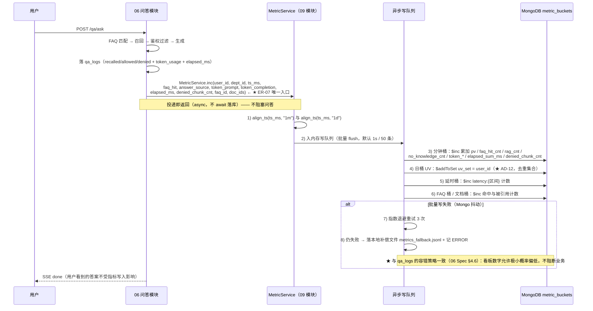
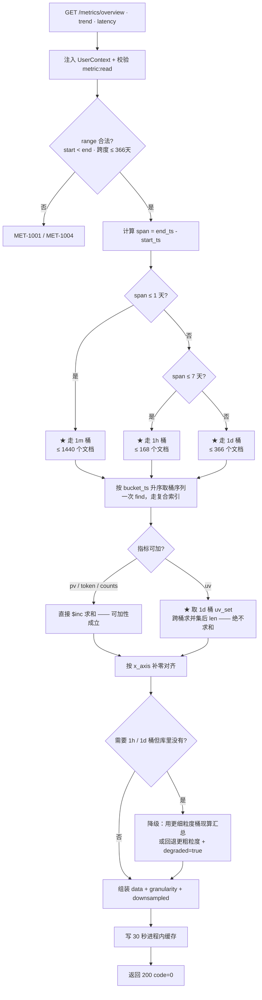

# 09 · 运营看板

> **文档编号**：04_模块Spec / 09
> **所属项目**：knowledge_manager（PRD 2.9）
> **上游依据**：`00_模块划分与边界.md` · `01_数据实体/数据实体设计.md`（E20 / E15，只读 E17 / E19 / E04）· `02_概要设计/概要设计.md`（**AD-07** / **AD-12** / §4.5 / §5 / §6）
> **对应原型**：`03_原型图/06_运营看板与数据大盘.pen`（含 5 条关键需求标注）
> **状态**：Step 4 产物 · 待评审
> **错误码前缀**：`MET`（见总纲 §3）
> **★ 本模块是「指标口径」的唯一权威**：全平台所有 PV / UV / Token / 延时 / 命中率 / 榜单数字都出自本模块的 `metric_buckets`，
> 因此**聚合口径必须只有一份实现**（AD-07），其他模块**只能通过 `MetricService.inc()` 投递**（ER-07）。

---

## 1. 模块职责与边界

### 1.1 做什么

| # | 职责 | 对应原型标注 | 对应 PRD |
|---|---|---|---|
| 1 | **指标桶写入**：接收 `MetricService.inc()` 投递，按 `{bucket_type}:{bucket_key}:{ts}` 增量落桶（E20 的**唯一写入者**） | 标注 5 | 2.9.8 |
| 2 | **核心指标摘要** `/metrics/overview`：访问量 PV、独立提问人数 UV、知识单元总数、FAQ 缓存命中率、平均问答延时 | — | 2.9.1 / 2.9.8 |
| 3 | **趋势图** `/metrics/trend`：访问量与提问量趋势（PV/UV 双轴）、Token 消耗趋势（prompt/completion 堆叠）、权限拦截切片数趋势 | 标注 1 / 2 / 4 | 2.9.1 |
| 4 | **响应延时分布** `/metrics/latency`：直方图分桶 + **P50 / P95** 分位（**G-08**，来源 `qa_logs.elapsed_ms`） | 标注 3 | 2.9.1 |
| 5 | **榜单** `/metrics/ranking`：常见高频问题 TOP10、高频引用知识 TOP10 | — | 2.9.1 |
| 6 | **降采样读取策略**：长跨度走 1h / 1d 桶，**绝不把 1440 个分钟桶拉出来相加** | 标注 5 | — |
| 7 | **TTL 生命周期管理**：1m 桶 30 天、1d 桶永久（实体设计 §7） | — | 2.9.8 |
| 8 | **看板数据导出** `/metrics/export`（`metric:export`） | — | 扩展项 |

### 1.2 不做什么（明确排除，避免与别的模块抢职责）

| 不做 | 归属 | 原因 |
|---|---|---|
| **写 `qa_logs`** | **06 AI 鉴权问答**（ER-06） | 本模块对 `qa_logs` **只读**，只用于延时明细回表与榜单聚合 |
| **写 `chat_sessions` / `chat_messages`** | **06** | 无写权限 |
| **写 `kb_documents` / `knowledge_gaps` / `faqs`** | 03 / 08 / 07 | 本模块只读（`kb_documents` 取标题、`knowledge_gaps` 取缺口计数） |
| **在查询时对 `qa_logs` 全表聚合算 PV/UV/Token** | — | **明确禁止**（**AD-07**）：这是 2.3 踩过的坑——看板一打开就打满库 |
| **数据权限（四维）判定** | **05 四维数据权限与鉴权引擎**（ER-03） | 看板是**聚合视角**，不回答"某个用户能不能读某篇文档" |
| **功能权限定义与分配** | 01 登录与功能权限 | 本模块只**消费** `metric:read` / `metric:export` 两个码 |
| **模型服务参数配置**（原型 `07` 的 `mdT` 区块） | 00 配置服务 + 01 的 `model:config` | 见 02 Spec §8 OQ-02-01 |
| **ECharts 图表组件本体** | 00 公共基础（`web/vendor/echarts.min.js`） | 本模块只产出**图表数据契约**，不做渲染实现 |

> ⚠️ **最容易混淆的一处**：运营看板的「知识单元总数」卡片（原型 `k3T`/`k3Num`/`k3H` = 128 个 / 已启用 121）
> **不是**从 `metric_buckets` 读的 —— 它是 `kb_documents` 的**实时计数**（`count(status=enabled)`）。
> 理由：知识单元数**不是时序指标**，当前值才是用户想看的；预聚合桶反而会给出过时数字。
> 该卡片由本模块**经 `DocService.count_by_status()`** 取数（E04 属 03，禁止直连写，读可以）。

### 1.3 归属实体

| 实体 | 集合 | 本模块权限 |
|---|---|---|
| **E20 运营指标桶** | `metric_buckets` | **唯一写入者**（ER-02 / **ER-07**） |
| E15 问答日志 | `qa_logs` | **只读**（写属 06，ER-06）——延时明细回表与榜单聚合 |
| E04 知识单元 | `kb_documents` | **只读**（榜单取 `title`；计数经 `DocService`） |
| E17 已发布 FAQ | `faqs` | **只读**（FAQ 维度桶的名称回填、命中数展示） |
| E19 知识缺口 | `knowledge_gaps` | **只读**（看板「无知识次数」的明细下钻） |
| E16 FAQ 候选 | `faq_candidates` | **只读**（高频问题榜的**兜底数据源**，见 §3.4 R-4） |
| E21 审计日志 | `audit_logs` | 只经 `AuditService`（ER-05）——看板导出留痕（可选） |

> **E20 是 11 个模块里唯一「零被依赖读」的实体**（总纲 §5 的「允许读取的模块」列为 `—`）。
> 原因：指标桶是**派生数据的终点**——它只被本模块自己的查询接口消费。
> 因此它的结构变更**不会波及其他模块**，但它的**写入口径会波及全平台展示**，这正是 ER-07 要守的东西。

### 1.4 依赖模块

| 方向 | 模块 | 用途 |
|---|---|---|
| 依赖 | 00 公共基础 | 配置、错误注册、统一响应、Mongo `AsyncMongoClient`、ECharts vendor |
| 依赖 | 01 登录与功能权限 | `UserContext`；`metric:read` / `metric:export` 权限码拦截 |
| 依赖 | **06 AI 鉴权问答** | **`MetricService.inc()` 的调用方**（问答结束后投递）；同时是 `qa_logs` 的写入者 |
| 依赖 | 03 知识单元与分类 | 经 `DocService` 取知识单元总数 / 已启用数；榜单取文档标题 |
| 被依赖 | 06 / 07 / 08 | 通过 `MetricService.inc()` 投递指标（**禁止直接写 `metric_buckets`**） |
| 通知 | 01 | 看板菜单与按钮的显隐由 `/auth/me` 的 `menus` 驱动 |

> **权限边界（必须写死）**：`metric:read` 只挂在 **`sys_admin`** 上；**`kb_admin` 没有**。
> 这是原型 `08` 权限矩阵里明确画了「—」的边界（01 Spec §1.2 与 OQ-01-04 已固化）。
> 违规后果：`kb_admin` 调任一 `/metrics/*` 必须返回 `MET-2003`，而不是返回空数据。

---

## 2. 数据契约

### 2.1 E20 · 运营指标桶 `metric_buckets`

| 字段 | 类型 | 必填 | 默认 | 说明 |
|---|---|:--:|---|---|
| `_id` | string | ✔ | — | **`{bucket_type}:{bucket_key}:{ts}`** —— 三段拼成，**天然唯一**，无需额外唯一索引 |
| `bucket_type` | enum | ✔ | — | `global` / `faq` / `latency` / `doc`（枚举组 `bucket_type`，ER-10：**按实体各自定义**，不复用别的枚举类） |
| `bucket_key` | string | ✔ | — | 维度值：FAQ ID / 延时区间标签 / 文档 ID；`global` 桶固定为 `all` 或 `uv` |
| `bucket_ts` | long | ✔ | — | 桶起始时间（**向下对齐**到粒度边界，见 §2.3） |
| `granularity` | enum | ✔ | — | `1m` / `1h` / `1d`（枚举组 `granularity`） |
| `metrics` | object | ✔ | 见 §2.2 | **全部为可累加计数字段**（`$inc` 语义） |
| `uv_set` | array\<string\> | | `[]` | **仅 `1d` 桶存在**：去重用户 ID 集合（`$addToSet` 语义）。**AD-12 的核心载体** |
| `created_at` | long | ✔ | — | 桶文档首次创建时间（`$setOnInsert`） |
| `updated_at` | long | ✔ | — | 最近一次增量时间（`$set`） |

**`_id` 组成示例**

| 场景 | `_id` |
|---|---|
| 2026-09-23 14:07 的全局分钟桶 | `global:all:1758617220` |
| 2026-09-23（整天）的全局 UV 日桶 | `global:uv:1758556800` |
| 2026-09-23 当天的 FAQ 桶 | `faq:FAQ000017:1758556800` |
| 延时 1000–2000ms 区间的小时桶 | `latency:1000-2000:1758616800` |
| 文档 `DOC20260923002` 的日桶 | `doc:DOC20260923002:1758556800` |

> **为什么把三段塞进 `_id` 而不是各自建字段 + 复合唯一索引**：
> ① 三段组合**本身就是业务主键**，Mongo 的 `_id` 唯一索引天然保证 upsert 不产生重复桶；
> ② 少建一个索引 = 写入路径少一次索引维护，而**写入是本模块最热的路径**（每轮问答都写）；
> ③ `_id` 已能支撑前缀查询（`^global:all:`），精确直查（按 `_id`）零成本。
> 交叉验证：概要设计 §4.5 的两段真实代码**正是按 `_id` 直接 upsert**，本 Spec 与之原样对齐。

### 2.2 `metrics` 结构（**只放可加指标，UV 不入内**）

```json
{
  "pv": 128,
  "faq_hit_cnt": 34,
  "rag_cnt": 88,
  "no_knowledge_cnt": 6,
  "token_prompt": 128000,
  "token_completion": 42000,
  "elapsed_sum_ms": 234240,
  "denied_chunk_cnt": 12,
  "question_cnt": 128
}
```

| 子字段 | 类型 | 累加方式 | 语义 | 口径出处 |
|---|---|---|:--:|---|
| `pv` | int | `$inc` | **访问量 PV**：每一次问答请求 +1（含 FAQ 命中、RAG、无知识三种分流） | 原型 `k1T`/`k1H`：「来源 metric_buckets.pv」 |
| `faq_hit_cnt` | int | `$inc` | FAQ 缓存**命中数**（`qa_logs.faq_hit == true` 时 +1） | 原型 `k4H`：「faq_hit_cnt / pv」 |
| `rag_cnt` | int | `$inc` | 走 RAG 检索生成的次数（`answer_source == rag`） | 实体设计 E20 `metrics` |
| `no_knowledge_cnt` | int | `$inc` | 无知识次数（`answer_source == no_knowledge`） | 实体设计 E20 `metrics` |
| `token_prompt` | long | `$inc` | 大模型 **prompt** token 累计 | **G-07：不含 embedding token** |
| `token_completion` | long | `$inc` | 大模型 **completion** token 累计 | 同上 |
| `elapsed_sum_ms` | long | `$inc` | 端到端耗时**累加**（求平均用：`elapsed_sum_ms / pv`） | 原型 `k5H`：「含检索 + 生成」 |
| `denied_chunk_cnt` | int | `$inc` | **被拦截切片数**累计（`len(qa_logs.denied_chunks)`） | 原型 `kbDeniedT`：「有多少内容因权限没被看到」 |
| `question_cnt` | int | `$inc` | 提问次数（当前与 `pv` 等价，**预留**用于将来"一次请求多问题"的场景） | 扩展 |

> ⚠️ **`uv` 与 `uv_set` 都不在 `metrics` 里**（与 `01_数据实体设计.md` E20 的 `metrics` 示例有一处**有意收敛**）：
> - 实体设计示例里的 `"uv": 23` 是**展示口径**（当日去重人数），不是可累加字段——它**不能** `$inc`；
> - 本 Spec 把它**落到根级 `uv_set`**（去重集合），查询时算 `len(uv_set)`；
> - 若把 `uv` 当成 `metrics` 里的累加字段，就正好踩进 **AD-12 明令禁止**的坑（同一用户多问几次被重复计数）。
> **这是本模块唯一一处对 Step 1 字段表的细化，已在 §8 OQ-09-04 登记，需评审确认。**

### 2.3 时间对齐规则（**桶键正确性的前提**）

| 粒度 | 对齐方式 | 示例（`2026-09-23 14:07:43`，Asia/Shanghai） | 对齐后 epoch 秒 |
|---|---|---|---|
| `1m` | 截断到**分钟** | `14:07:00` | `1758617220` |
| `1h` | 截断到**小时** | `14:00:00` | `1758616800` |
| `1d` | 截断到**自然日 00:00:00** | `00:00:00` | `1758556800` |

```python
# 统一的时间对齐工具（本模块提供，06/07/08 复用）
def align_ts(now_ms: int, granularity: str) -> int:
    """把毫秒时间戳向下对齐到粒度起点。★ 必须按 Asia/Shanghai 自然日切天。"""
    dt = datetime.fromtimestamp(now_ms / 1000, tz=ZoneInfo("Asia/Shanghai"))
    if granularity == "1m":
        dt = dt.replace(second=0, microsecond=0)
    elif granularity == "1h":
        dt = dt.replace(minute=0, second=0, microsecond=0)
    elif granularity == "1d":
        dt = dt.replace(hour=0, minute=0, second=0, microsecond=0)
    return int(dt.timestamp())
```

> **为什么必须显式写时区**：若用 UTC 切天，则东八区用户的「今天」= UTC 的 16:00 到次日 16:00，
> 看板上「近 7 天」的柱子会**整体错位 8 小时**，且每日 UV 会把跨零点的一次提问切成两天。
> 项目只服务国内使用场景，**统一按 Asia/Shanghai 切天**（PRD 未定义时区 → 本 Spec 定死，登记 OQ-09-03）。

### 2.4 索引设计

| 索引 | 类型 | 用途 | 必要性 |
|---|---|---|---|
| `_id` | 唯一（Mongo 内建） | **所有写入的 upsert 目标**；按精确键直查 | **必须** |
| `bucket_type + granularity + bucket_ts` | 复合 | 看板主查询：按类型 + 粒度 + 时间范围取桶序列（趋势图/概览/延时） | **必须** |
| `bucket_ts` | TTL（`expireAfterSeconds`，仅对 `granularity="1m"` 生效） | 分钟桶 **30 天**自动清理 | **必须** |
| `bucket_type + bucket_key` | 复合 | 单维度下钻（某 FAQ / 某文档的历史曲线） | 建议 |

**TTL 索引的正确写法（Mongo 的 TTL 是「整集合一个过期规则」，不能按字段值分支）**

```python
# ⚠️ TTL 索引只能基于一个日期字段，且不能写条件表达式 —— 所以用「双字段 + 部分索引」实现两种保留策略
# 1m / 1h 桶：写 expire_at = bucket_ts + 30天；1d 桶：expire_at = None（永不过期）
await db.metric_buckets.create_index(
    "expire_at", expireAfterSeconds=0,
    name="ttl_metric_buckets_short",
    partialFilterExpression={"granularity": {"$in": ["1m", "1h"]}})
await db.metric_buckets.create_index(
    [("bucket_type", 1), ("granularity", 1), ("bucket_ts", 1)],
    name="ix_metric_buckets_query")
```

| 保留策略 | 粒度 | 方式 | 出处 |
|---|---|---|---|
| **30 天** | `1m` + `1h` | TTL 部分索引（`expire_at`） | 实体设计 §7「`metric_buckets`（1m 粒度）30 天」 |
| **永久** | `1d` | 不写 `expire_at` + 不在部分索引范围内 | 实体设计 §7「`metric_buckets`（1d 粒度）永久」 |

> ⚠️ **`1h` 桶为什么跟着 30 天一起清**：`1h` 桶存在的唯一目的是**给 > 1 天的查询做降采样**（§4.2）。
> 而看板最长查询跨度按「近 30 天」设计，**超过 30 天的区间一律读 `1d` 桶**——
> 也就是说 `1h` 桶超过 30 天就再也不会被任何查询命中，留着只占空间。
> （若老师要求支持「近 90 天按小时看」，只需把部分索引改成 `["1m"]` 并另建 `1h` 的 90 天 TTL，见 OQ-09-04。）

### 2.5 枚举引用（ER-10：**按实体各自定义，禁止共用通用枚举**）

| 枚举组 | 取值 | 适用字段 | 定义位置 |
|---|---|---|---|
| `bucket_type` | `global` / `faq` / `latency` / `doc` | `E20.bucket_type` | 00 模块 `app/core/enums.py` → `MetricBucketType` |
| `granularity` | `1m` / `1h` / `1d` | `E20.granularity` | 00 模块 `app/core/enums.py` → `MetricGranularity` |

```python
# app/core/enums.py —— 与文档/任务/用户/FAQ/缺口各自的 status 枚举互不复用（ER-10）
class MetricBucketType(str, Enum):
    GLOBAL = "global"      # 全局维度：PV / 总量 / Token
    FAQ = "faq"            # FAQ 维度：单个 FAQ 的命中与提问
    LATENCY = "latency"    # 延时维度：延时区间直方图
    DOC = "doc"            # 文档维度：单篇文档被引用/被拦截

class MetricGranularity(str, Enum):
    M1 = "1m"              # 分钟桶：只放可加指标（AD-12）
    H1 = "1h"              # 小时桶：降采样中间层，由 1m 汇总
    D1 = "1d"              # 日桶：唯一允许存 uv_set 的粒度（AD-12）
```

**`bucket_key` 取值域（按 `bucket_type` 分支）**

| `bucket_type` | `bucket_key` 取值 | 举例 |
|---|---|---|
| `global` | 固定 `all`（可加指标）/ 固定 `uv`（UV 日桶） | `global:all:...`、`global:uv:...` |
| `faq` | E17 的 `_id` | `FAQ000017` |
| `latency` | **预定义区间标签**（见 §2.6） | `1000-2000` |
| `doc` | E04 的 `_id` | `DOC20260923002` |

### 2.6 延时区间定义（`bucket_type=latency`）

| `bucket_key` | 区间（ms） | 代表值（算分位用） |
|---|---|---|
| `0-500` | [0, 500) | 250 |
| `500-1000` | [500, 1000) | 750 |
| `1000-2000` | [1000, 2000) | 1500 |
| `2000-4000` | [2000, 4000) | 3000 |
| `4000-8000` | [4000, 8000) | 6000 |
| `8000-12000` | [8000, 12000) | 10000 |
| `12000+` | ≥ 12000 | 15000（保守估计，仅用于 `> P95` 的尾部） |

> **为什么用固定 7 个区间而不是自由分桶**：自由分桶会让 `bucket_key` 基数爆炸（每个不同耗时一个桶），
> 而原型 `kbLatencyPlotT` 要求的是**直方图 + P50/P95 标注**——7 个区间足够画图，
> 且 P50/P95 用**代表值加权插值**即可（原型展示 `1.83 秒` 这类一位小数，精度完全够）。
> 区间边界与原型 `k5Num = 1.83` 秒量级一致（1.83s 落在 `1000-2000` 桶）。
> **P50/P95 的更高精度备选**：查 `qa_logs` 做**精确分位**（§3.3 R-3 已给出降级与升级两条路径）。

---

## 3. 接口清单

> **统一约束**：全部接口在 `/api/v1/metrics/*` 分区下（总纲 §6.1）；全部要求 **JWT**（ER-08）；
> 全部要求功能权限码（**`metric:read`**，导出为 `metric:export`）；
> 响应遵循总纲 §6.2 契约（成功 `code:0`；失败 `code:"MET-xxxx"`）。

### 3.1 `GET /api/v1/metrics/overview` — 核心指标摘要

| 项 | 内容 |
|---|---|
| 功能权限 | `metric:read` |
| 用途 | 原型 `06` 顶部 5 张卡片（`k1`~`k5`） |
| 缓存 | 进程内 **30 秒 TTL**（同一秒内多次刷新不重复查库，见 §4.4） |

**入参**

| 参数 | 类型 | 必填 | 默认 | 说明 |
|---|---|:--:|---|---|
| `start_ts` | long | | 见 R-1 | 起始时间（毫秒） |
| `end_ts` | long | | 现在 | 结束时间（毫秒） |
| `days` | int | | `7` | 便捷参数：近 N 天（与 `start_ts`/`end_ts` **二选一**，同时传以显式区间为准） |

**出参**

```jsonc
{
  "code": 0, "message": "ok", "trace_id": "…",
  "data": {
    "range": { "start_ts": 1757952000000, "end_ts": 1758556800000, "days": 7 },
    "cards": {
      "pv":            { "value": 12847, "unit": "次", "label": "访问量 PV",
                         "source": "metric_buckets.pv（1m 桶求和）" },
      "uv":            { "value": 326,   "unit": "人", "label": "独立提问人数 UV",
                         "source": "metric_buckets.uv_set（1d 桶去重集合取 len）", "exact": true },
      "doc_total":     { "value": 128,   "unit": "个", "label": "知识单元总数",
                         "sub": "已启用 121", "source": "kb_documents 实时计数（非指标桶）" },
      "faq_hit_rate":  { "value": 38.6,  "unit": "%",  "label": "FAQ 缓存命中率",
                         "formula": "faq_hit_cnt / pv" },
      "avg_elapsed_s": { "value": 1.83,  "unit": "秒", "label": "平均问答延时",
                         "formula": "elapsed_sum_ms / pv / 1000", "note": "含检索 + 生成" }
    },
    "totals": {
      "faq_hit_cnt": 4959, "rag_cnt": 8836, "no_knowledge_cnt": 602,
      "token_prompt": 12840000, "token_completion": 4210000,
      "denied_chunk_cnt": 1204
    },
    "degraded": false
  }
}
```

**服务端规则表**

| 规则 | 说明 | 失败码 |
|---|---|---|
| **R-1** | 同时缺 `days` / `start_ts` / `end_ts` → 默认 `days=7`；`days` 与显式区间同时给出时**以显式区间为准** | `MET-1001`（`days` 与区间**都非法**时） |
| **R-2** | `days` ∈ [1, 365]；`start_ts < end_ts`；区间跨度 ≤ 366 天 | `MET-1001` |
| **R-3** | `end_ts` 晚于「当前时间 + 5 分钟」→ 视为非法（防未来区间刷出零值图） | `MET-1002` |
| **R-4** | **PV 走 `$inc` 求和**；**UV 走 1d 桶 `uv_set` 去重取 `len`**——两条路径**绝不混用**（AD-12） | — |
| **R-5** | 区间跨度 > 1 天 → 读 `1h`/`1d` 桶；≤ 1 天 → 读 `1m` 桶（§4.2 策略） | — |
| **R-6** | 计算 `faq_hit_rate` 时若 `pv == 0` → 返回 `0.0`，**不是** `null`、**不是**除零 500 | — |
| **R-7** | 计算 `avg_elapsed_s` 时若 `pv == 0` → 返回 `0.0`（同上，避免空看板报错） | — |
| **R-8** | `doc_total` 与 `sub`（已启用数）经 **`DocService.count_by_status()`**，**不查 `metric_buckets`**；该卡片**不参与降采样** | `MET-4004` |
| **R-9** | 无 `metric:read` → 直接拒绝；**`kb_admin` 必然命中此规则**（原型 `08` 矩阵的「—」） | `MET-2003` |
| **R-10** | Mongo 查询异常 → 返回**零值卡片 + `degraded:true`**，**不抛 500**（看板降级不阻断整页） | `MET-4001`（同时置 `degraded`） |
| **R-11** | 请求频率 > 60 次/分钟/用户 → 限流 | `MET-2004` |

### 3.2 `GET /api/v1/metrics/trend` — 访问量与提问量趋势

| 项 | 内容 |
|---|---|
| 功能权限 | `metric:read` |
| 用途 | 原型 `kbTrendT`（折线图·双轴：左轴 PV，右轴 UV）、`kbTokenT`（堆叠面积图）、`kbDeniedT`（折线图） |
| 数据源 | `metric_buckets(1d)`（**原型 `kbTrendPlotT` 明确标注**） |

**入参**

| 参数 | 类型 | 必填 | 默认 | 说明 |
|---|---|:--:|---|---|
| `start_ts` / `end_ts` | long | | 近 7 天 | 时间区间 |
| `days` | int | | `7` | 近 N 天便捷参数 |
| `metrics` | string | | `pv,uv` | **逗号分隔**，可选：`pv` / `uv` / `token` / `denied` / `rag` / `no_knowledge` / `faq_hit_cnt` |
| `granularity` | enum | | 自动 | `1h` / `1d`；不传则按跨度自动选择（≤ 7 天 `1h`，> 7 天 `1d`） |

**出参**

```jsonc
{
  "code": 0, "message": "ok",
  "data": {
    "granularity": "1d",
    "downsampled": true,
    "x_axis": ["2026-09-17", "2026-09-18", "…", "2026-09-23"],   // 长度 = series[].data 长度
    "series": [ … ],   // 见下表
    "notes": { "token_scope": "仅大模型 prompt + completion，不含 embedding（G-07）" },
    "degraded": false
  }
}
```

**`series` 元素契约（前端 ECharts 可直接渲染，无需补位逻辑）**

| `key` | `name` | `axis` | `type` | 单位 | 原型对应 |
|---|---|---|---|---|---|
| `pv` | 访问量 PV | `left` | `line` | 次 | `kbTrendT` 左轴 |
| `uv` | 独立提问人数 UV | `right` | `line` | 人 | `kbTrendT` 右轴（`exact:true`） |
| `token_prompt` | prompt Token | — | `area-stack` | — | `kbTokenT` 堆叠层 1 |
| `token_completion` | completion Token | — | `area-stack` | — | `kbTokenT` 堆叠层 2 |
| `denied_chunk_cnt` | 权限拦截切片数 | — | `line` | 个 | `kbDeniedT` |
| `rag_cnt` / `no_knowledge_cnt` / `faq_hit_cnt` | RAG 次数 / 无知识次数 / FAQ 命中数 | — | `line` | 次 | — |

**服务端规则表**

| 规则 | 说明 | 失败码 |
|---|---|---|
| **R-1** | `metrics` 含未支持的值 → 拒绝（**不静默忽略**，避免前端以为画出来了） | `MET-1003` |
| **R-2** | `granularity` 只接受 `1h` / `1d`；传 `1m` 且跨度 > 1 天 → 拒绝（防拉 1440+ 桶，**AD-12 的邻居规则**） | `MET-1005` |
| **R-3** | 自动选择粒度：跨度 ≤ 7 天 → `1h`；> 7 天 → `1d`。选择结果**必须回显** `granularity` 与 `downsampled` | — |
| **R-4** | Token 序列**必须拆成 `token_prompt` / `token_completion` 两条**（原型要求堆叠面积图）；**不得**只返回 `total` | `MET-1003` |
| **R-5** | Token 口径**不含 embedding**（**G-07 已确认**）；不得把 BGE-M3 的向量化耗时/Token 计入 | — |
| **R-6** | UV 序列**只能来自 `1d` 桶**（AD-12）。当 `granularity=1h` 时，UV 序列由「该小时内覆盖的日桶去重集合」**跨小时求并集后取 `len`**，**不得**把小时桶的计数相加 | — |
| **R-7** | `x_axis` 的时间标签按 **Asia/Shanghai** 格式化（`YYYY-MM-DD` 或 `YYYY-MM-DD HH:00`） | — |
| **R-8** | 区间内**无任何桶** → 返回**补零序列**（长度 = 区间内桶个数），不返回空数组（前端图表需要等长轴） | — |
| **R-9** | 跨度 > 366 天 → 拒绝 | `MET-1004` |
| **R-10** | Mongo 异常 → `MET-4001`（HTTP 500，趋势图是看板主体，降级为主要空图会误导） | `MET-4001` |

### 3.3 `GET /api/v1/metrics/latency` — 响应延时分布（P50 / P95）

| 项 | 内容 |
|---|---|
| 功能权限 | `metric:read` |
| 用途 | 原型 `kbLatencyT`（直方图·分桶·**标注 P50 与 P95**） |
| 数据源 | `metric_buckets(bucket_type=latency)` 主路径；`qa_logs.elapsed_ms` 为精确分位路径 |

**入参**

| 参数 | 类型 | 必填 | 默认 | 说明 |
|---|---|:--:|---|---|
| `start_ts` / `end_ts` / `days` | — | | 近 7 天 | 同 §3.2 |
| `mode` | enum | | `bucket` | `bucket`（读预聚合直方图，快）/ `exact`（查 `qa_logs` 精确分位，慢但准） |
| `group_by` | enum | | 无 | `source`（按 `answer_source` 分组）/ `stage`（返回 `retrieval_ms`/`rerank_ms`/`llm_ms` 分段） |

**出参**

```jsonc
{
  "code": 0, "message": "ok",
  "data": {
    "mode": "bucket", "precision": "approximate", "sample_size": 12847, "avg_ms": 2418,
    "bins": [   // 固定 7 个区间，计数为 0 的也要返回（R-5）
      { "label": "0-500ms",     "range": [0, 500],       "count": 1204 },
      { "label": "500-1000ms",  "range": [500, 1000],    "count": 2310 },
      { "label": "1000-2000ms", "range": [1000, 2000],   "count": 5122 },
      { "label": "2000-4000ms", "range": [2000, 4000],   "count": 2600 },
      { "label": "4000-8000ms", "range": [4000, 8000],   "count": 1100 },
      { "label": "8000-12000ms","range": [8000, 12000],  "count": 400 },
      { "label": "12000ms+",    "range": [12000, null],  "count": 111 }
    ],
    "percentiles": { "p50_ms": 1830, "p95_ms": 8340, "p50_s": 1.83, "p95_s": 8.34 },  // ★ G-08
    "by_stage": { "retrieval_ms": 820, "rerank_ms": 410, "llm_ms": 6900 },
    "degraded": false
  }
}
```

**服务端规则表**

| 规则 | 说明 | 失败码 |
|---|---|---|
| **R-1** | `mode=bucket`（默认）：从 `latency` 桶求和后**按代表值加权插值**算 P50/P95，并**必须回 `precision: "approximate"`** | — |
| **R-2** | `mode=exact`：查 `qa_logs({asked_at ∈ 区间}).elapsed_ms` 排序取分位，**回 `precision: "exact"`**；样本量上限 **50 万条**，超限改用 `bucket` 并回 `degraded:true` | `MET-3004`（区间过大且 `mode=exact` 时提示改区间） |
| **R-3** | **分位口径固定 P50 / P95 两个值**（**G-08 已确认**），**不提供** P90/P99 等自定义分位 | `MET-1006` |
| **R-4** | `mode=exact` 要求 `qa_logs` 索引 `asked_at` 存在且可用（06 模块建）；缺失则**降级为 `bucket`** 并标记 `degraded:true` | `MET-4005` |
| **R-5** | 直方图**必须返回全部 7 个区间**（计数为 0 的也要返回），否则前端柱宽不等 | — |
| **R-6** | `group_by=stage` 时，三个分段耗时任一缺失 → 该分段返回 `null` 且 `partial:true`；**不得**用 0 冒充 | — |
| **R-7** | 空区间（无样本）→ `percentiles` 全 `null` + `sample_size:0`，**不报错** | — |
| **R-8** | 跨度 > 366 天 → 拒绝；`mode=exact` 且跨度 > 31 天 → 拒绝（保护 `qa_logs`） | `MET-1004` / `MET-1007` |

> **为什么默认 `mode=bucket` 而不是直接查 `qa_logs`**：这正是 **AD-07** 的落地。
> `qa_logs` 有 180 天 TTL 且行数随问答量线性增长，一旦用 `mode=exact` 做默认，
> 看板首页就会变成一次**全区间排序**——2.3 的看板就是这么把库打满的。
> 预聚合直方图把「排序取分位」降级为「7 个数字加权」，是 **P95 < 500ms 目标（概要设计 §6）的关键**。

### 3.4 `GET /api/v1/metrics/ranking` — 高频问题榜 / 热门知识榜

| 项 | 内容 |
|---|---|
| 功能权限 | `metric:read` |
| 用途 | 原型 `rqT`（常见高频问题 TOP10）、`rdT`（高频引用知识 TOP10） |
| 数据源 | 高频问题 ← `qa_logs.question` 聚合（**兜底** `faq_candidates.frequency`）；热门知识 ← `qa_logs.allowed_chunks` 反查 `kb_documents.title` |

**入参**

| 参数 | 类型 | 必填 | 默认 | 说明 |
|---|---|:--:|---|---|
| `type` | enum | | `both` | `question` / `doc` / `both` |
| `start_ts` / `end_ts` / `days` | — | | 近 7 天 | 同 §3.2 |
| `limit` | int | | `10` | 榜单项数（**原型固定 TOP10**），上限 50 |

**出参**

```jsonc
{
  "code": 0, "message": "ok",
  "data": {
    "range": { "days": 7 },
    "top_questions": [
      { "rank": 1, "question": "生鲜食品破损如何申请退款", "count": 53,
        "source": "qa_logs", "faq_id": null },
      { "rank": 2, "question": "差旅住宿费报销上限是多少", "count": 47,
        "source": "qa_logs", "faq_id": "FAQ000017" },
      { "rank": 3, "question": "年假没休完能不能折现", "count": 24, "source": "qa_logs" }
    ],
    "top_docs": [
      { "rank": 1, "doc_id": "DOC20260801001", "title": "客服退换货处理规范",
        "cite_count": 128, "category_id": "CAT0003" },
      { "rank": 2, "doc_id": "DOC20260315007", "title": "差旅报销标准（2026版）",
        "cite_count": 96, "category_id": "CAT0002" }
    ],
    "degraded": false
  }
}
```

**服务端规则表**

| 规则 | 说明 | 失败码 |
|---|---|---|
| **R-1** | 高频问题的**主路径**是对 `qa_logs.question` 做**归一化聚合**（去标点/去空白后分组），避免"报销上限是多少？"与"报销上限是多少"被算成两条 | — |
| **R-2** | 归一化键与 08 模块的 `knowledge_gaps.normalized_key` **共用同一实现**（由 00 模块提供 `normalize_question()`），**禁止各写一份** | — |
| **R-3** | 榜单**排除权限受限导致的空答案**：`answer_source == no_knowledge` 的提问**仍计入**高频问题榜（它恰恰是"最该补知识"的信号），但**不计入**热门知识榜 | — |
| **R-4** | `qa_logs` 不可用或区间超出其 180 天 TTL 时，**降级**为读 `faq_candidates.frequency` / `faqs.hit_count` 并回 `degraded:true` + `source:"faq"` | `MET-4002`（同时置 `degraded`） |
| **R-5** | 热门知识榜从 `qa_logs.allowed_chunks[].doc_id` 去重计数，再**一次 `$in` 查 `kb_documents` 取 `title`**（**ER-13：禁止逐条查**） | — |
| **R-6** | 文档已软删除（`deleted_at` 非空）→ **仍展示**（历史引用事实不变），但带 `deleted:true` 标记（与 `audit_logs` 永久保留同理） | — |
| **R-7** | `limit` ∈ [1, 50]，超出 → 拒绝 | `MET-1008` |
| **R-8** | 榜单返回**必须含 `rank` 字段**（前端直接渲染排名列），且从 1 连续编号 | — |
| **R-9** | Mongo 聚合异常 → `MET-4001`；`kb_documents` 取标题失败 → 返回 `title:"（标题不可用）"` + `degraded:true`（**不阻断榜单**） | `MET-4003` |

### 3.5 `GET /api/v1/metrics/export` — 看板数据导出

| 项 | 内容 |
|---|---|
| 功能权限 | **`metric:export`**（与 `metric:read` 是**两个码**，`sys_admin` 两者都有） |
| 入参 | `metric`（`overview` / `trend` / `latency` / `ranking`）、`start_ts` / `end_ts` / `days`、`format`（固定 `csv`） |
| 出参 | `Content-Type: text/csv; charset=utf-8`，带 BOM（Excel 中文不乱码）；响应头 `Content-Disposition: attachment` |

**服务端规则表**

| 规则 | 说明 | 失败码 |
|---|---|---|
| **R-1** | 只有 `format=csv`；其他值拒绝 | `MET-1009` |
| **R-2** | 区间跨度 > 366 天 拒绝；导出上限 **10 万行**，超限拒绝并提示缩小范围 | `MET-1004` / `MET-3005` |
| **R-3** | CSV **必须带 UTF-8 BOM**（否则中文在 Excel 里乱码——这是最常见的"导出失败"投诉） | — |
| **R-4** | 导出为**同步流式响应**（不落文件、不建任务） | — |
| **R-5** | 可选：经 `AuditService.record(action="metric.export")` 留痕（**ER-05**）；审计失败**不阻断**导出 | — |

### 3.6 接口一览

| 方法 | 路径 | 功能权限 | 说明 | 原型对应 |
|---|---|---|---|---|
| GET | `/api/v1/metrics/overview` | `metric:read` | 核心指标摘要（5 张卡片） | `k1T`~`k5H` |
| GET | `/api/v1/metrics/trend` | `metric:read` | PV/UV 双轴 + Token 堆叠 + 拦截趋势 | `kbTrendT` / `kbTokenT` / `kbDeniedT` |
| GET | `/api/v1/metrics/latency` | `metric:read` | 延时直方图 + P50/P95 | `kbLatencyT` |
| GET | `/api/v1/metrics/ranking` | `metric:read` | 高频问题 TOP10 / 热门知识 TOP10 | `rqT` / `rdT` |
| GET | `/api/v1/metrics/export` | `metric:export` | CSV 导出 | — |

**内部服务接口（不对外暴露路由，供 06/07/08 调用 —— ER-07 的唯一入口）**

```python
class MetricService:
    @staticmethod
    async def inc(user_id: str, dept_id: str, *, ts_ms: int,
                  faq_hit: bool = False, answer_source: str = "rag",
                  token_prompt: int = 0, token_completion: int = 0,
                  elapsed_ms: int = 0, denied_chunk_cnt: int = 0,
                  faq_id: str | None = None, doc_ids: list[str] | None = None) -> None:
        """★ 全平台唯一的指标投递入口。异步、不抛异常、不阻塞调用方（AD-07）。

        调用方约束（ER-07）：06/07/08 **只能调本方法**，
        禁止直接 upsert / update metric_buckets —— 否则聚合口径立刻分叉。
        """
```

| 服务方法 | 调用方 | 时机 | 说明 |
|---|---|---|---|
| `MetricService.inc()` | **06 AI 鉴权问答** | 每轮问答 `done` 之后（与落 `qa_logs` 同一批次） | 一次调用写全 5 类桶（global / latency / faq / doc） |
| `MetricService.inc(faq_hit=True, ...)` | 06 | FAQ 缓存命中直出后 | 额外写 `bucket_type=faq` 桶 |
| `MetricService.inc(doc_ids=[...])` | 06 | RAG 分支 | 对每个被引用的 `doc_id` 写 `doc` 桶 |
| `MetricService.backfill_range()` | 运维脚本 | 需要重建指标（演示数据重建） | **唯一允许无调用方批量重建的入口**，内部走同一套汇总逻辑 |

---

## 4. 关键流程

### 4.1 流程 A：写入时增量聚合（**AD-07 的核心**）



**为什么要「写入时增量聚合」而不是「查询时全表聚合」（AD-07 的完整论证）**

| 维度 | A. 查询时聚合 `qa_logs`（**被否决**） | **B. 写入时增量聚合（采用）** |
|---|---|---|
| 看板打开耗时 | 与 `qa_logs` 行数**线性相关**；10 万行起就秒级~十秒级 | **与桶数量相关**（近 7 天 `1h` 桶 = 168 条；`1d` 桶 = 7 条），恒定毫秒级 |
| 数据库压力 | 每次刷新都做一次全区间扫描 + 分组，多人同时看看板直接打满 | 每次问答多 1 次 `update_one`（upsert 走 `_id`，< 1ms） |
| UV 口径 | 全表 `distinct(user_id)` 可算准，但每次刷新都重算 | **`$addToSet` 天然去重**，查询只取 `len` |
| 与 2.3 的对比 | 2.3 的看板就是这么写的，是本项目要**明确避开**的坑 | 与 **AD-07** 一致 |
| 代价 | — | **聚合代码与业务写入耦合**；需保证 06 一定调用（靠 ER-07 + AC-09-06 兜住） |
| 精度 | 精确 | 预聚合精度；`elapsed_ms` 分位为近似（可用 `mode=exact` 升级） |

**「谁会调 `MetricService.inc()`、什么时候调」一览表**

| 调用方 | 触发时机 | 投递内容 | 参考 |
|---|---|---|---|
| **06 AI 鉴权问答** | 每轮问答 `done` 事件之后（与落 `qa_logs` 同批异步任务） | `pv+1`、`token_prompt`、`token_completion`、`elapsed_ms`、`denied_chunk_cnt`、`answer_source`、`user_id` | 06 Spec §4.1 第 7 步 |
| 06（FAQ 命中分支） | 缓存直出后 | 额外 `faq_hit=True` + `faq_id` → 写 `faq` 桶 | 06 Spec AC-06-08 |
| 06（RAG 分支） | 生成完成后 | `doc_ids = allowed_chunks 去重后的 doc_id` → 写 `doc` 桶 | — |
| **07 FAQ 沉淀** | FAQ 发布 / 停用 | **不投递**（FAQ 命中由 06 的问答链路自然计入）；仅 `faqs.hit_count` 自增供榜单兜底 |
| **08 知识缺口** | 缺口识别 | **不投递**（缺口数量由看板按需读 E19 计数，不进指标桶） |
| 运维脚本 | 演示数据重建 | `MetricService.backfill_range()` | §8 OQ-09-05 |

> ⚠️ **为什么 07/08 不用投递指标**：`metric_buckets` 只装**问答链路产生的时序指标**。
> 缺口数、FAQ 候选数这类**存量状态**属于"当前值"而非"时序累计"，用实时计数更准（同 §1.2 的 `doc_total` 卡片）。
> 把它们塞进桶会导致「删掉一个缺口，看板还显示旧数字」的错位。

### 4.2 流程 B：看板查询的聚合与降采样



**降采样读取策略表（**这是 P95 < 500ms 的全部秘密**）**

| 查询跨度 | 读取粒度 | 最多读多少桶 | 为什么这样选 |
|---|---|---|---|
| **≤ 1 天** | `1m` | ≤ **1440** 条 | 需要分钟级细节（原型「今日实时」场景）；1440 条 `_id` 前缀 + 索引扫描仍 < 100ms |
| **1 天 ~ 7 天** | `1h` | ≤ **168** 条 | 7 天 × 24 = 168，比 7 × 1440 = **10080** 条少 60 倍 |
| **> 7 天** | `1d` | ≤ **366** 条 | 1 年 366 条；趋势图本来也画不出比这更细的刻度 |
| 任意跨度 | **绝不用 `1m` 算 > 1 天** | — | 30 天 = **43200** 条分钟桶，正是"把 1440 个分钟桶取出来加"的放大版 |

**步骤说明**

| 步 | 动作 | 为什么 |
|---|---|---|
| 1 | 校验 `metric:read`（**fail-closed**：异常即拒） | ER-04；看板数据是**全平台聚合视角**，泄漏面最大 |
| 2 | 计算 `span`，**只选一个覆盖整个区间的最细粒度** | 避免"每段各选粒度再拼接"带来的边界重复计数 |
| 3 | **一次 `find()`** 取全部桶（非逐个查询） | 与 ER-13 同理：168 个桶逐个查就是 168 次往返 |
| 4 | 可加指标直接求和；**UV 走集合求并取 `len`** | **AD-12**：这是本模块唯一不能"求和"的指标 |
| 5 | 按 `x_axis` **补零**对齐长度 | 前端 ECharts 要求等长数组；缺桶不等于缺天 |
| 6 | 结果写 **30 秒 TTL 进程内缓存** | 看板会被反复刷新（演示时尤其明显）；30 秒内数据变化肉眼无感 |
| 7 | 命中更细桶缺失（如 `1h` 还没汇总出来）→ **标注 `degraded:true`** | 让"数字不对"变成**可见的降级状态**，而不是静默错数 |

**`1h` / `1d` 桶由谁产生（降采样的写入侧）**

| 汇总任务 | 触发 | 输入 | 输出 |
|---|---|---|---|
| `1m → 1h` | 每小时第 5 分钟（APScheduler / 启动时的补算） | 上一小时的 `1m` 桶 | 该小时的 `1h` 桶（可加字段求和；`uv_set` 求并集） |
| `1h → 1d` | 每日 00:10 | 前一天的 `1h` 桶 | 该天的 `1d` 桶（`uv_set` 求并集） |
| 迟到补算 | 每次汇总任务启动时回看 **近 6 小时** | `1m` 桶 | 修正 `1h` 桶（幂等：**重算而非累加**，用 `$set` 覆盖） |

> ⚠️ **汇总必须幂等**：用 `$set` 覆盖目标桶（而不是再次 `$inc`），否则任务重跑会把数字翻倍。
> 这也是为什么 `1h` / `1d` 桶的 `_id` 必须与 `1m` 桶**同构**（`{bucket_type}:{bucket_key}:{ts}`）——
> 同构才能用同一套 `align_ts()` 与同一套查询代码（§4.2 的三条分支只差一个 `granularity` 参数）。

### 4.3 UV 与 PV 必须分开统计（**AD-12 / 实体设计 §6.4 裁定四 —— 本模块最重要的一节**）

**原样对齐概要设计 §4.5 的两段真实代码（标注 `# ★ 本 Spec 补齐` 的行是补齐的工程细节，其余行与概要设计一字不差）**

```python
# 分钟桶：只累加 PV 与 token，不做 UV
await metric.update_one(
    {"_id": f"global:all:{ts_1m}"},
    {"$inc": {"metrics.pv": 1,
              "metrics.faq_hit_cnt": int(faq_hit),
              "metrics.rag_cnt": int(answer_source == "rag"),              # ★ 本 Spec 补齐
              "metrics.no_knowledge_cnt": int(answer_source == "no_knowledge"),  # ★ 本 Spec 补齐
              "metrics.token_prompt": tok_p,
              "metrics.token_completion": tok_c,
              "metrics.elapsed_sum_ms": elapsed_ms,                        # ★ 本 Spec 补齐
              "metrics.denied_chunk_cnt": denied_cnt},                     # ★ 本 Spec 补齐
     "$setOnInsert": {"bucket_type": "global", "bucket_key": "all",        # bucket_key ★
                      "granularity": "1m", "bucket_ts": ts_1m,
                      "created_at": now_ms,                                # ★ 本 Spec 补齐
                      "expire_at": ts_1m + 30 * 86400},   # ★ TTL 只对 1m/1h 生效（§2.4）
     "$set": {"updated_at": now_ms}},                                      # ★ 本 Spec 补齐
    upsert=True)

# 日桶：用去重集合精确统计 UV（AD-12）
await metric.update_one(
    {"_id": f"global:uv:{day_ts}"},
    {"$addToSet": {"uv_set": user_id},                                     # ← 去重集合，重复提问不会变大
     "$setOnInsert": {"bucket_type": "global", "bucket_key": "uv",         # bucket_key ★
                      "granularity": "1d", "bucket_ts": day_ts,
                      "created_at": now_ms},                 # ★ 不写 expire_at = 永久
     "$set": {"updated_at": now_ms}},                                      # ★ 本 Spec 补齐
    upsert=True)
# 查 UV：len(doc["uv_set"]),而非把分钟桶相加
# ★ 区间 UV 必须跨天再求一次并集 —— 不能把各日 UV 相加（AC-09-02）
uv_docs = await metric.find({"_id": {"$in": [f"global:uv:{d}" for d in days]}}).to_list(None)
uv_range = len(set().union(*[set(d.get("uv_set", [])) for d in uv_docs]))
```

**PV 与 UV 的对照表（写足篇幅，因为这是运营看板最常见的口径错误）**

| 维度 | **PV（访问量）** | **UV（独立提问人数）** |
|---|---|---|
| 业务含义 | 一共发生了多少次问答 | 一共有多少个**不同的人**提过问 |
| 桶粒度 | **`1m` 分钟桶** | **`1d` 日桶**（唯一允许的粒度） |
| 写入算子 | `$inc: {"metrics.pv": 1}` | `$addToSet: {"uv_set": user_id}` |
| 存储形态 | 一个数字 | **一个集合（用户 ID 数组）** |
| 可加性 | ✅ **可加**：区间 PV = 各桶 PV 之和 | ❌ **不可加**：区间 UV ≠ 各日 UV 之和 |
| 区间查询 | `sum(metrics.pv)` | `len(union(uv_set))` —— **并集后取长度** |
| 去重时机 | 不需要（每次提问都是一次访问） | **写入时去重**（`$addToSet` 天然幂等） |
| 是否含 FAQ 命中 | ✅ 含（命中也是一次访问） | ✅ 含（提问的人就是独立用户） |
| 数据量代价 | 30 天 TTL 自动清 | **永久**保留（日桶只有 1 条/天，几乎不占空间） |
| 原型锚点 | `k1T` 访问量 PV = 12,847 次 / 近 7 天 | `k2T` 独立提问人数 UV = 326 人 / 近 7 天；`k2H` 「**日桶去重集合统计**」 |

**❌ 错误做法（必须明确禁止，并在 Code Review 中拦住）**

| 错误写法 | 后果 | 具体反例 |
|---|---|---|
| 把 UV 也 `$inc` 进分钟桶 | **同一用户 10 分钟内问 3 次 → 被记成 3 个 UV** | 一天下来 UV = 提问总次数，UV 曲线与 PV 完全重合，"独立人数"指标彻底失去意义 |
| 把 `1h` / `1d` 的 UV **数字相加**求区间 UV | 跨天重复的人**被重复计数** | 用户 A 周一和周二都提问 → 区间 UV 多算 1 人；一个月下来 UV 可虚高数倍 |
| 用 `count(*)` 近似 UV | 同上，且**口径与 PV 无法区分** | 汇报时"326 个独立用户"变成"12847 个独立用户"，业务方立刻发现数字不可信 |
| 在 `1m` 桶里也存 `uv_set` | 桶文档数 = 用户数，**分钟桶体积爆炸**；且 30 天 TTL 到点后仍无法保证跨天去重 | 1440 桶 × 数百用户 ID/桶，存储与写入放大 1000 倍 |
| 用 `$addToSet` + `$inc` **同一个操作**更新同一桶 | 日桶里同时出现集合与计数，**两个真相源** → 后续必然分叉 | — |

**✅ 正确性证明（AC-09-01 / AC-09-02 的判定依据）**

```
场景：用户 U000012 在 2026-09-23 14:05、14:07、14:12 各提问一次（10 分钟内 3 次）

写入：
  global:all:<14:05 桶>  $inc pv=1     → pv=1
  global:all:<14:07 桶>  $inc pv=1     → pv=1
  global:all:<14:12 桶>  $inc pv=1     → pv=1
  global:uv:<09-23 日桶> $addToSet uv_set U000012  → uv_set = ["U000012"]   ← 3 次操作，集合大小仍是 1

查询：
  当日 PV  = 1 + 1 + 1 = 3        ✔（三次访问都算）
  当日 UV  = len(["U000012"]) = 1 ✔（只有一个人）  ← 若按分钟桶累加会得到 3 ✘

再叠加：用户 U000013 在 14:06 提问一次
  global:uv:<09-23> → uv_set = ["U000012", "U000013"] → len = 2  ✔
```

> ⚠️ **UV 的唯一剩余误差来源（必须诚实写明）**：`uv_set` 存的是**用户 ID 集合**，
> 因此「同一人换账号提问」会被算成 2 个 UV——这是**账号级 UV**，不是人级 UV。
> 企业知识库以账号为唯一身份源（JWT 的 `sub`），这是可接受且应显式声明的口径（见 OQ-09-01）。
> **但 `uv_set` 绝不能为空**：若 `user_id` 取不到，宁可**跳过 UV 写入并记 WARN**，也不写 `null`/`""`
> （否则集合里会出现一个"匿名用户"把 UV 恒定为 ≥ 1，污染整个指标）。

### 4.4 看板缓存（**为什么必须有，以及它的边界**）

| 项 | 设计 |
|---|---|
| 载体 | 进程内 `dict`（`MetricCache`），key = `f"{path}|{granularity}|{start_ts}|{end_ts}|{metrics}"` |
| TTL | **30 秒** |
| 命中率预期 | 演示与汇报场景里，同一页 30 秒内被刷新多次 → 命中率 > 70% |
| 失效时机 | **不主动失效**；纯 TTL 过期。理由：指标是时序累加的，30 秒内的偏差对看板无业务意义 |
| 内存上限 | 最多 200 个 key，LRU 淘汰（防长时间运行下 key 无限增长） |

> **为什么不做主动失效**：若每次 `MetricService.inc()` 都去失效缓存，
> 则高频问答期间缓存**永远失效**（刚填上就被清），缓存反而变成纯开销。
> 时序指标用「时间窗容忍度」换性能，是这个场景下的正确取舍。

---

## 5. 错误码表（前缀 `MET`）

> **段位约定**（总纲 §3）：`1xxx` 参数/校验 · `2xxx` 鉴权/权限 · `3xxx` 资源/状态 · `4xxx` 依赖/外部服务 · `5xxx` 内部错误。
> **前缀唯一性**（ER-01）：`MET` 仅属本模块，不得与 `SYS`/`AUTH`/`ORG`/`DOC`/`IMP`/`PERM`/`QA`/`FAQ`/`GAP`/`AUD` 混用。

| 错误码 | HTTP | 消息 | 触发条件 |
|---|---|---|---|
| `MET-1001` | 400 | 时间范围不合法 | `start_ts >= end_ts` / `days` 不在 [1,365] / 区间跨度 > 366 天 / `days` 与显式区间**都缺失且非法** |
| `MET-1002` | 400 | 结束时间不能晚于当前时间 | `end_ts > now + 5 分钟`（防未来区间刷出零值图） |
| `MET-1003` | 400 | 指标名不合法 | `metrics` 含未支持的值；Token 请求未拆 `prompt`/`completion` |
| `MET-1004` | 400 | 查询跨度超出上限 | 跨度 > 366 天（趋势/延时/导出统一上限） |
| `MET-1005` | 400 | 该跨度不允许分钟级粒度 | `granularity=1m` 且跨度 > 1 天（**防拉 43200 个分钟桶**） |
| `MET-1006` | 400 | 不支持的分位口径 | 请求 P50/P95 之外的分位（**G-08** 已固定为 P50 + P95） |
| `MET-1007` | 400 | 精确分位模式的时间范围过大 | `mode=exact` 且跨度 > 31 天（保护 `qa_logs`） |
| `MET-1008` | 400 | 榜单条数超出上限 | `limit` 不在 [1, 50]（原型固定 TOP10） |
| `MET-1009` | 400 | 导出格式不支持 | `format != csv` |
| `MET-1010` | 400 | 粒度取值不合法 | `granularity` 不在 `1h`/`1d`（`trend` 接口） |
| `MET-2002` | 403 | 功能权限不足 | 无 `metric:read` 却调 `/metrics/overview|trend|latency|ranking` |
| `MET-2003` | 403 | 知识管理员无权访问运营看板 | **`kb_admin` 调任一 `/metrics/*`** —— 原型 `08` 矩阵画了「—」的边界，**必须显式拒绝，不得返回空数据** |
| `MET-2004` | 429 | 看板请求过于频繁 | > 60 次/分钟/用户（缓存未命中时尤其容易触发） |
| `MET-2005` | 403 | 无权导出看板数据 | 有 `metric:read` 但无 `metric:export` 时调 `/metrics/export` |
| `MET-3001` | 404 | 指标桶不存在 | 按精确 `_id` 查单桶（下钻接口）时无记录 |
| `MET-3002` | 409 | 该粒度桶尚未汇总 | 请求 `1h`/`1d` 桶但汇总任务未完成（`granularity` 已生成但区间未覆盖） |
| `MET-3003` | 410 | 指标数据已过期 | 请求区间超出 `1m` 桶 30 天 TTL 已清理的范围，且**无更粗粒度桶可回退** |
| `MET-3004` | 400 | 精确分位模式样本量超限 | `mode=exact` 且区间内 `qa_logs` 行数 > 50 万，提示改用 `bucket` 模式 |
| `MET-3005` | 413 | 导出数据量超限 | 导出预估行数 > 10 万行，提示缩小时间范围 |
| `MET-4001` | 500 | 指标桶读取失败 | `metric_buckets` 查询异常/超时；`overview` **降级返回零值 + `degraded:true`**，`trend`/`ranking` 直接失败 |
| `MET-4002` | 500 | 问答日志聚合失败 | 榜单聚合 `qa_logs` 失败 → **降级读 `faq_candidates.frequency`** + `degraded:true`（按 500 记录，前端按降级态渲染） |
| `MET-4003` | 500 | 文档标题查询失败 | 热门知识榜经 `DocService` 取 `title` 失败 → 榜单**仍返回**（`title` 占位 + `degraded:true`） |
| `MET-4004` | 500 | 知识单元计数失败 | `DocService.count_by_status()` 失败 → `doc_total` 卡片返回 `null` + `degraded:true`（**不阻断其余 4 张卡片**） |
| `MET-4005` | 500 | 延时明细不可用 | `mode=exact` 时 `qa_logs` 不可读或 `asked_at` 索引缺失 → **自动降级为 `mode=bucket`** + `degraded:true` |
| `MET-5001` | 500 | 指标写入失败 | `MetricService.inc()` 落库连续重试失败（**落补偿文件，不抛给调用方 06**） |
| `MET-5002` | 500 | 指标桶汇总任务失败 | `1m→1h` / `1h→1d` 汇总任务异常（**下一次运行会幂等重算修复**） |
| `MET-5003` | 500 | TTL 索引创建失败 | 启动时 `metric_buckets` TTL 索引创建异常（**记 ERROR 并继续启动**，仅影响空间回收） |

> ⚠️ **为什么本表没有 401 码**（ER-01 的落地细节）：JWT 校验由 **01 模块的中间件**统一实现（ER-08），
> 本模块**不自行解析 token**，因此**不定义也不抛出**任何 401 码。
> 未登录/令牌过期时，调用方收到的是 **01 模块的 `AUTH-2003`** —— 一个条件只对应一个错误码，
> 不允许两个模块各定义一份同义码（否则前端无法判断该找谁）。
> 本节先前的 `MET-2001` 已按此原则**删除**（见 OQ-09-08 的结论）。
>
> ⚠️ **`MET-4002` 为什么是 500 而不是 200+degraded**：榜单的主体数据源（`qa_logs`）真的不可用，
> 返回的降级结果（FAQ 候选频次）**语义与榜单不同**，必须让调用方知道"这不是真实榜单"。
> 而 `MET-4001`（overview）降到零值卡片时**语义不变**（就是"近期没有数据"），
> 因此走 `200 + degraded:true`。**两者的差别在"降级后语义是否等价"**。

---

## 6. 验收标准

> **AC-09-01 / AC-09-02 是本模块的主干验收**：对应原型 `06` 的关键标注 1（UV 必须用日粒度去重集合）。

| 编号 | 验收项 | 对应原型标注 | 判定方式 |
|---|---|---|---|
| **AC-09-01** | **★ UV 口径正确性专项**：同一用户 `U000012` 在 **10 分钟内连续提问 3 次**（例如 14:05 / 14:07 / 14:12），当日 UV **必须为 1**、当日 PV **必须为 3** | **标注 1** | 构造 3 次同用户提问 → 查 `metric_buckets` 的 `global:uv:{day}` 文档 → `len(uv_set) == 1`；调 `/metrics/overview` 断言 `uv == 1 && pv == 3` |
| **AC-09-02** | **★ 区间 UV 不可相加**：用户 A 在周一、周二各提问一次，用户 B 仅在周一提问；「近 7 天 UV」**必须为 2**（不是 3） | 标注 1 | 跨两天构造 → 调 `/metrics/trend?metrics=uv&days=7` → 断言区间 UV 汇总值 == 2，且等于两日桶 `uv_set` **并集**的大小 |
| **AC-09-03** | **PV 可加性**：任意区间的 PV == 该区间各桶 `metrics.pv` 之和（含 FAQ 命中与无知识分支） | — | 逐桶求和与接口返回值比对 |
| **AC-09-04** | **AD-07 落地**：看板 4 个查询接口的执行计划中**没有对 `qa_logs` 的集合扫描**（`ranking` 的榜单聚合除外，且必须命中 `asked_at` 索引） | **标注 5** | `explain("executionStats")` 检查 `COLLSCAN` 数量 == 0 |
| **AC-09-05** | **ER-07 单一入口**：全代码库搜索 `metric_buckets` 的写操作（`update_one`/`insert_one`/`bulk_write`）**只出现在 09 模块**；06/07/08 中零命中 | — | 静态扫描 + Code Review |
| **AC-09-06** | **投递链路连通**：完成一轮问答后 **1 秒内**，`metric_buckets` 中对应分钟桶的 `pv` 已 +1、日桶 `uv_set` 已含该 `user_id` | — | 问答后轮询查库计时 |
| **AC-09-07** | **Token 口径不含 embedding**（**G-07**）：`token_prompt + token_completion == sum(qa_logs.token_usage.total)` 且**不包含** BGE-M3 向量化产生的任何计数 | **标注 2** | 逐轮比对 `qa_logs.token_usage.total` 与桶内累计 |
| **AC-09-08** | **P50 / P95 双分位**（**G-08**）：`/metrics/latency` 返回 `p50_ms` 与 `p95_ms` 两个值，且 `p50_ms ≤ p95_ms`；直方图返回全部 7 个区间 | **标注 3** | 接口断言 + 与 `qa_logs.elapsed_ms` 精确分位对照（误差 < 10%） |
| **AC-09-09** | **权限拦截切片数趋势**：`denied_chunk_cnt` 序列 == 区间内 `sum(len(qa_logs.denied_chunks))` | **标注 4** | 构造受限场景 → 比对趋势值与日志 |
| **AC-09-10** | **高频问题榜来源**：榜单问题文本与 `qa_logs.question` 归一化后的聚合结果一致；TOP10 按 `count` 降序且 `rank` 从 1 连续 | — | 页面比对原型 `rqTblR*` |
| **AC-09-11** | **热门知识榜来源**：榜单标题来自 `kb_documents.title`（经 `allowed_chunks[].doc_id` 反查），且取标题**只有 1 次 `$in` 查询**（ER-13） | — | 慢日志计数 + 页面比对原型 `rdTblR*` |
| **AC-09-12** | **降采样生效（性能核心）**：查询 30 天趋势时，Mongo 只读 `1d` 桶（≤ 366 条），**不读任何 `1m` 桶** | — | 查询 profiler 计数 |
| **AC-09-13** | **看板接口 P95 < 500ms**：`overview` / `trend` / `latency` / `ranking` 在 **近 30 天**区间下各压测 100 次，P95 < 500ms | — | 压测脚本（对应概要设计 §6） |
| **AC-09-14** | **`kb_admin` 无权看板**：`kb_admin` 调任一 `/metrics/*` 返回 **403 `MET-2003`**（不是 200 空数据） | 原型 `08` 矩阵「—」 | 用 `kb_admin` 账号直调 4 个接口 |
| **AC-09-15** | **TTL 生效**：伪造一条 `bucket_ts` 为 31 天前的 `1m` 桶，**24 小时内**被 Mongo TTL 清理；而 31 天前的 `1d` 桶**仍在** | — | 插入伪造桶 → 等待 TTL 后台线程（或改 `expire_at` 观察） |
| **AC-09-16** | **汇总幂等**：手动重复执行 `1m→1h` 汇总任务 3 次，`1h` 桶数字**不变**（用 `$set` 覆盖而非 `$inc`） | — | 连续执行后比对桶值 |
| **AC-09-17** | **空区间不报错**：无任何数据的时间区间，4 个接口均返回 `200` + 补零序列（`uv`/`p50` 为 `0`/`null`），**不出现除零 500** | — | 选一个未来/远古区间请求 |
| **AC-09-18** | **降级可见**：停掉 Mongo → `overview` 返回 **零值卡片 + `degraded:true`**（HTTP 200），`trend` 返回 `MET-4001` | — | 分别停依赖并请求 |
| **AC-09-19** | **时区正确**：`2026-09-23 23:50` 与 `2026-09-24 00:10` 的两次提问落在**两个不同的日桶**（Asia/Shanghai 切天，非 UTC） | — | 构造跨零点提问 → 查 `_id` 中的 `day_ts` |
| **AC-09-20** | **缓存边界**：同一区间 30 秒内重复请求返回一致结果且**只打一次库**；31 秒后再请求会重新查库 | §4.4 | 计数 Mongo 查询次数 |
| **AC-09-21** | **导出**：`metric:export` 导出 CSV，**带 UTF-8 BOM**，Excel 打开中文不乱码；无 `metric:export` 的账号返回 `MET-2005` | — | 下载文件 + 用 Excel 打开 |
| **AC-09-22** | **知识单元总数卡片不来自指标桶**：删除一篇文档后，`doc_total` 卡片**立即**变化（不等待任何汇总周期） | — | 删文档 → 刷新看板 |
| **AC-09-23** | **图表数据契约完整**：4 个接口的 `x_axis` 与各 `series[].data` **等长**；含 `granularity` / `downsampled` 回显 | — | 前端（ECharts）能直接渲染，无需补位逻辑 |

---

## 7. 依赖与前置

### 7.1 依赖表

| 依赖 | 内容 | 缺失/异常时的降级 |
|---|---|---|
| 00 公共基础 | 配置、错误注册（`MET-*`）、统一响应、Mongo `AsyncMongoClient`、`normalize_question()`、`web/vendor/echarts.min.js` | **无法启动**（硬依赖） |
| 01 登录与功能权限 | `UserContext`、`metric:read` / `metric:export` 拦截、`/auth/me` 的 `menus` | **硬依赖**：取不到上下文 → 由 01 抛出 `AUTH-2003`；权限判定异常 → **fail-closed 拒绝**（ER-04） |
| **06 AI 鉴权问答** | **`MetricService.inc()` 的调用方**；`qa_logs`（延时明细、榜单聚合） | **最关键的一环**：06 不投递 → 看板恒为空（见 §7.2 第 1 项）。`qa_logs` 不可读 → 榜单降级读 FAQ（`MET-4002`）；`latency` 自动降级为 `bucket` 模式（`MET-4005`） |
| 03 知识单元与分类 | 经 `DocService.count_by_status()` 取知识单元总数/启用数；榜单取 `title` | `doc_total` 返回 `null` + `degraded:true`（`MET-4004`）；榜单 `title` 用占位符（`MET-4003`）。**两者都不阻断其余卡片** |
| 07 FAQ 沉淀 | `faqs.hit_count` / `faqs._id`（FAQ 维度桶的名称回填） | **降级**：FAQ 维度桶只展示 ID 不展示问法；`faq_hit_rate` 不受影响（它来自 `global` 桶） |
| 08 知识缺口 | `knowledge_gaps` 计数（看板"缺口数"下钻） | **降级**：下钻入口置灰，主看板不受影响 |
| MongoDB（`metric_buckets`） | 指标桶读写 | **硬依赖**：读失败 → `MET-4001`（`overview` 走零值降级）；**写失败 → 落补偿文件，绝不抛给 06**（`MET-5001` 只记日志） |
| `APScheduler`（或等价定时器） | `1m→1h` / `1h→1d` 汇总、迟到补算 | **降级**：汇总不可用 → 长跨度查询**回退读 `1m` 桶现算**并标 `degraded:true`（慢但正确）；**绝不允许**在无汇总时静默少算 |
| 10 审计日志 | 看板导出留痕（`metric.export`，可选） | **降级**：审计写失败只记 ERROR，**不阻断**导出（与 01 Spec 的降级策略一致） |

### 7.2 逐项降级行为（**看板必须"坏得看得见"**）

| # | 缺失项 | 降级行为 | 为什么这样降 |
|---|---|---|---|
| 1 | **06 未调用 `MetricService.inc()`**（集成断裂，最危险的失败模式） | **无自动降级** —— 看板会静默显示零值。因此必须靠 **AC-09-06** 拦住，并在启动自检时打一条 WARN：「近 24 小时 `metric_buckets` 无写入」 | 指标是**投递式**的，断裂时没有"备用真相源"；只能靠可观测性发现，不能靠降级掩盖 |
| 2 | Mongo `metric_buckets` 读失败 | `overview` → **200 + 全部卡片 0 + `degraded:true`**；`trend` / `latency` / `ranking` → `MET-4001`（HTTP 500） | 摘要是"看数字"，零值 + 降级标记已足够；趋势图零值会被误读成"业务停摆"，必须报错 |
| 3 | 未到汇总时间（`1h`/`1d` 桶缺失） | 自动回退读 `1m` 桶现算，并回 `degraded:true` + `granularity:"1m"` | **慢但正确**优于"快但少算"；且回显的 `granularity` 让前端能提示"数据正在汇总" |
| 4 | `qa_logs` 不可读（榜单） | 降级读 `faq_candidates.frequency` / `faqs.hit_count`，回 `source:"faq"` + `degraded:true`，HTTP 500 `MET-4002` | 降级数据源的**语义与榜单不同**（候选频次 ≠ 实际提问次数），必须让调用方知道 |
| 5 | `qa_logs` 不可读（精确分位） | 自动降级为 `mode=bucket` 直方图（近似分位），回 `precision:"approximate"` | 精度降级但**口径不变**（同一份 `elapsed_ms` 的分布桶），用户能接受 |
| 6 | `DocService` 不可用（`doc_total` 卡片） | `doc_total.value = null` + `degraded:true`；**其余 4 张卡片正常返回** | 单卡片降级，不影响整页；与 05 Spec 的 `PERM-4002`（摘要刷新失败不影响鉴权）同一设计哲学 |
| 7 | `kb_documents` 取标题失败（热门知识榜） | 榜单**照常返回**，`title:"（标题不可用）"` + `degraded:true` | 排名与次数（真正的运营信息）仍然可用 |
| 8 | APScheduler 不可用 | 同第 3 项；另外**启动时补算近 6 小时**，尽量自愈 | 幂等汇总（`$set` 覆盖）使补算安全 |
| 9 | ECharts vendor 缺失 | 前端渲染失败（00 模块的 `web/vendor/echarts.min.js` 是本地文件，不走 CDN） | **不引 CDN**（D-01 已定）：企业内网环境不可依赖公网 |
| 10 | 看板导出时磁盘/内存压力 | 导出为**流式响应**，不落临时文件 | 避免大区间导出打满磁盘 |

### 7.3 前置数据与前置能力

| 类型 | 内容 | 由谁产生 |
|---|---|---|
| **前置集合** | `metric_buckets` 集合 + `_id` 唯一（内建）+ 复合索引 + TTL 部分索引 | 本模块启动时的 `ensure_indexes()` |
| **前置数据** | **无**（空集合即可启动；看板显示零值 + `degraded:false`） | — |
| 前置能力 1 | `qa_logs` 已由 06 写入且 `asked_at` 索引存在（榜单 + 精确分位依赖） | 06 模块 |
| 前置能力 2 | `kb_documents` 有数据（`doc_total` 卡片与热门知识榜） | 03 / 04 模块 |
| 前置能力 3 | 内置角色 `sys_admin` 已绑定 `metric:read` + `metric:export`；`kb_admin` **不绑定** | `scripts/seed.py`（01 模块） |
| 前置能力 4 | 定时汇总任务已注册（每小时 / 每日） | 本模块启动钩子 |

**性能预算（对应概要设计 §6）**

| 接口 / 环节 | 目标 | 依据 |
|---|---|---|
| `GET /metrics/overview` | **P95 < 500ms** | 读预聚合桶（≤ 366 条）+ 30 秒缓存 |
| `GET /metrics/trend` | **P95 < 500ms** | 降采样后 ≤ 366 条 |
| `GET /metrics/latency`（`bucket` 模式） | **P95 < 500ms** | 7 个区间求和 + 加权插值 |
| `GET /metrics/latency`（`exact` 模式） | P95 < 3s | 走 `qa_logs.asked_at` 索引 + 排序；已限跨度 ≤ 31 天 |
| `GET /metrics/ranking` | P95 < 1s | `qa_logs` 聚合 + 1 次 `$in` 取标题 |
| `MetricService.inc()` 投递（不计入问答延迟） | **< 1ms** 返回 | 仅入内存队列（异步批量落库） |
| `1m→1h` 汇总 | < 5s（单小时 ≤ 1440 桶） | — |

---

## 8. 开放问题

| 编号 | 问题 | 现状 | 影响 |
|---|---|---|---|
| **OQ-09-01** | **UV 是账号级还是人级？** 同一人多账号会被算成多个 UV | 当前为**账号级**（`uv_set` 存 `user_id`，即 JWT 的 `sub`） | 若要求"人级 UV"需引入手机号/工号归并键 → 涉及隐私与组织架构改造，**不建议** |
| **OQ-09-02** | 榜单的**统计窗口与展现**：只支持固定「近 N 天」，还是允许任意区间 + 自定义维度？ | 当前支持任意区间，`limit` 固定 TOP10（上限 50） | 维度下钻（按部门/分类看榜单）不在本期 |
| **OQ-09-03** | **时区口径**：`1d` 桶按 Asia/Shanghai 还是 UTC 切天？ | 本 Spec **定死 Asia/Shanghai**（§2.3） | 若有海外用户，其"今日"会与本地日界错位；需改为可配置 |
| **OQ-09-04** | **TTL 与历史 UV 的冲突**：`1m` 桶 30 天被清理后，超过 30 天的小时级细节永久丢失 | 当前按实体设计 §7（`1m`/`1h` 30 天、`1d` 永久） | 「近 90 天按小时看」不可用；若需支持，改 TTL 配置即可（§2.4 已给方案） |
| **OQ-09-05** | **是否需要"指标重建"能力**？演示数据重建后，指标桶是否要一并 `backfill`？ | 已预留 `MetricService.backfill_range()`（唯一允许的批量入口） | 重建会**重算历史桶**，需保证与实时投递口径完全一致（同一份汇总代码） |
| **OQ-09-06** | **看板是否需要自动刷新（前端轮询/SSE 推送）**？ | 当前**手动刷新** + 后端 30 秒缓存；前端可选 60 秒定时拉取 | 自动刷新会显著提高请求量，需配合缓存 TTL 调优 |
| **OQ-09-07** | **`faq` / `doc` 维度桶是否本期就产出**？它们当前**不被任何看板接口读取**（榜单直接查 `qa_logs`） | 已定义结构但**查询侧未开放**；写入侧随 `inc()` 一起落桶（成本极低，为将来下钻预留） | 若确定不做下钻，可**暂不写**这两个维度以省写入（需改 §4.1 第 6 步） |
| ~~**OQ-09-08**~~ | ~~`MET-2001` 是否保留？~~ | ✅ **已裁定：删除**。跨模块的同一条件只能有一个错误码（ER-01）；JWT 失败统一由 01 抛 `AUTH-2003`，本模块不再定义 401 码 | — |
| **OQ-09-09** | 看板是否需要**知识缺口数 / FAQ 候选数**卡片（PRD 2.9.8「运营效能指标摘要」）？ | 原型 `06` **未画**这两张卡；数据可由 E19/E16 实时计数提供 | 属**补齐 PRD 2.9.8** 的加分项，实现成本低（各 1 个 `count`） |
| **OQ-09-10** | `1h` 桶的 `uv_set` 是否要存？（存了可支持"精确到小时的区间 UV"，代价是 168 个集合求并） | 当前 **`1h` 桶不存 `uv_set`**，区间 UV 一律走 `1d` 桶并集 | 若业务要求"今天上午 9-12 点的独立人数"，需开启（§4.2 的 `granularity=1h` 分支会变重） |

### 承接的上游悬空点

| 编号 | 内容 | 本模块处理 |
|---|---|---|
| **G-07** | Token 统计是否含 embedding 的 token | ✅ **已确认「不含」**：`metrics.token_prompt` / `token_completion` 只累加大模型 prompt + completion（§2.2、§3.2 R-5、AC-09-07）；`notes.token_scope` 在响应里**显式回显口径**，让前端文案与后端数字同源 |
| **G-08** | 「响应延时」的分位口径 | ✅ **已确认「展示 P50 / P95」**：`percentiles` 固定返回这两个值（§3.3 R-3、AC-09-08）；数据源为 `qa_logs.elapsed_ms`，预聚合直方图 + 精确模式双路径 |
| **G-12** | 历史问答数据是否跨用户可见 | ✅ **已确认「不可」**（06 保证）。**对看板的连带影响**：看板**只展示聚合数字**，**任何 `/metrics/*` 接口都不得返回单条提问原文**——`top_questions` 返回的是**归一化后的问题文本 + 次数**，不带 `user_id`/`session_id`/`dept_id` 明细（避免通过看板绕过 G-12） |
| **C-01 ~ C-06** | 存量冲突（切片集合、`chat_message` 无 `user_id`、导入任务内存态、电商查询入口、节点映射、Word/TXT） | **本模块不直接涉及**：看板完全新建，无存量代码可改造。唯一间接依赖是 **C-02**（`chat_messages` 无 `user_id`）→ 本模块的 UV **必须**取自 JWT 的 `user_id`（06 投递），**不得**从消息表反查用户 |
| **D-01** | 图表用本地 vendor ECharts | ✅ 本模块只产出图表数据契约（§3.2 的 `series`/`axis`/`type`），渲染由 00 模块的本地 vendor 承担，**不引 CDN** |
| **D-03** | Milvus 是否保留 `item_name` | 不影响本模块（看板不读 Milvus） |
| **D-04 / D-05** | 引用格式、权限缺失占位样式 | 不影响本模块（属 06 与前端视觉） |
| **D-06** | 是否保留 WebSearch 节点 | 间接影响：若开启联网检索，问答耗时与 Token 口径会变化；本模块按 **06 的实际 `qa_logs.token_usage`** 累加，**不假设来源**，因此口径自动跟随 |

### 待评审的三个重点（写给评审人）

1. **§2.2 对 Step 1 E20 `metrics` 示例的收敛**（`uv` 从 `metrics` 移到根级 `uv_set`）——
   这是**为了让 AD-12 在字段层面无法被违反**（可加字段与去重集合物理隔离）。若评审认为应与 Step 1 逐字一致，需在 Step 1 同步修订。
2. **§2.4 的 TTL 部分索引方案**（`expire_at` + `partialFilterExpression`）——
   标准 TTL 索引无法表达"按粒度分支"，这是最简洁的落地方式；替代方案是**两个集合**（`metric_buckets` + `metric_buckets_daily`），代价是查询要跨集合 union。
3. ~~**§5 `MET-2001` 的归属**~~（OQ-09-08）—— ✅ **已裁定**：模块 Spec **不得定义**自己不抛出的错误码；跨模块同一条件只能有一个码（真实抛出方是 01 的 `AUTH-2003`）。
