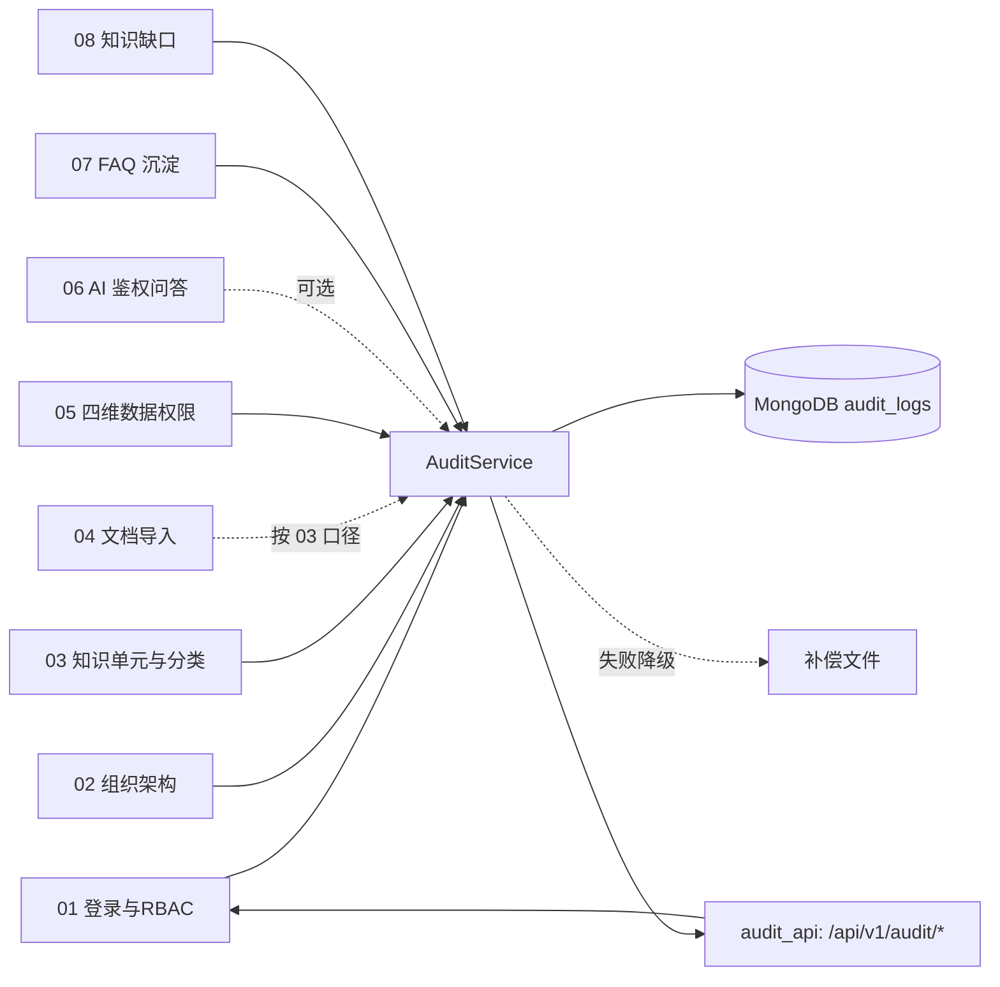
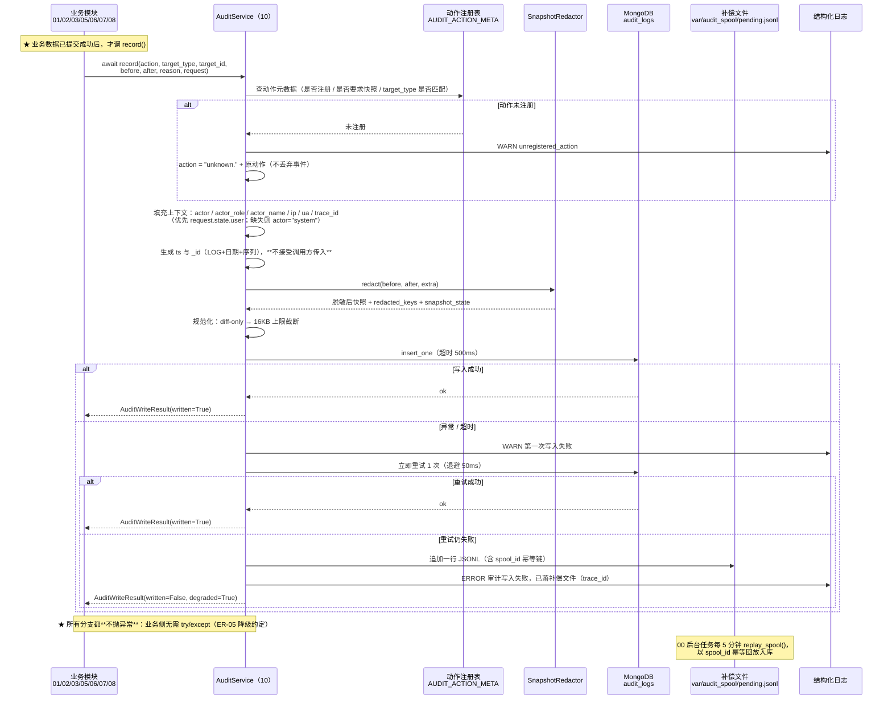
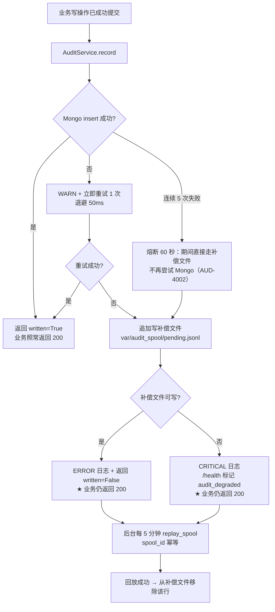

# 10 · 审计日志

> **文档编号**：04_模块Spec / 10
> **所属项目**：knowledge_manager（PRD 2.9）
> **上游依据**：`00_模块划分与边界.md` · `01_数据实体/数据实体设计.md`（E21，§7 保留策略，§10 **G-10**）
> **概要设计依据**：`02_概要设计/概要设计.md`（§2.2 架构图的 `AuditService` / §3.2 权限配置流程第 3 步 / §4.3 索引设计 / §5 路由 `/api/v1/audit/logs`）
> **对应原型**：`03_原型图/07_组织架构与系统配置页.pen`（`stNote4`：「保存模型参数需写审计（`config.update`，含 `before`/`after`）」；侧边栏「系统配置」）
> **状态**：Step 4 产物 · 待评审
> **错误码前缀**：`AUD`（见总纲 §3）
> **★ 本模块的两个特殊性**：
> ① 它是**全平台唯一被所有业务模块反向依赖**的模块（ER-05），接口契约必须先于调用方稳定；
> ② 它**只有读接口**（append-only），写入口是 Python 层的 `AuditService.record()`，不是 HTTP 接口。

---

## 1. 模块职责与边界

### 1.1 做什么

| # | 职责 | 对应 PRD | 对应上游 |
|---|---|---|---|
| 1 | **审计写入服务**：向 01/02/03/04/05/06/07/08 提供 `AuditService.record()`，统一落 E21 | 2.9.8 | ER-05 |
| 2 | **动作字典维护**：`action` 取值域的**唯一定义源**（中文名 / 触发时机 / 目标类型 / 是否必须带快照） | 2.9.8 | 实体设计 E21 |
| 3 | **快照脱敏**：`before` / `after` 的键名黑名单 + 值正则双保险，**绝不落密码与密钥** | 2.9.8 | E21 注 |
| 4 | **审计查询**：四维筛选（`action` / `actor` / `target_type`+`target_id` / 时间范围）+ 分页 | 2.9.8 | 概要设计 §5 |
| 5 | **审计导出**：CSV / JSON 流式导出，供等保与内部核查留档 | 2.9.8 | 本 Spec 扩展 |
| 6 | **写入失败降级**：重试 → 本地补偿文件 → ERROR 日志，**绝不阻断业务** | — | 01/02/05 三模块共同声明 |
| 7 | **append-only 保障**：接口层无写方法 + Mongo 层不给 `update`/`delete` 权限 | 2.9.8 | **G-10** |

### 1.2 不做什么（明确排除，避免与别的模块抢职责）

| 不做 | 归属 | 原因 |
|---|---|---|
| **单次问答的逐字段审计**（问题 / 答案 / 三列表 / token / 耗时） | **06 AI 鉴权问答** 的 `qa_logs`（E15） | PRD 2.9.8 的"单次问答审计"是**问答日志**，与"系统操作留痕"是两件事。E15 的唯一写入者是 06（ER-06） |
| 记录**知识内容正文 / 切片文本 / 答案全文** | — | 审计不是内容备份；正文入库会带来"审计库变成第二个知识库"的权限黑洞（§2.3 明确禁记） |
| **防篡改哈希链**（`prev_hash` / `hash`） | — | **G-10 已裁定 2.9 不做**（append-only 即可）；补齐方案见 §8 |
| **权限判定**（谁能读哪篇知识） | **05 四维数据权限与鉴权引擎** | ER-03：判定只有一份实现。本模块只记录"权限被改过"这一事实 |
| **功能权限的定义与拦截** | **01 登录与功能权限** | 本模块只声明自己需要的 `audit:read` / `audit:export` |
| **用户活动分析 / 用户行为看板** | **09 运营看板** | 看板读 `qa_logs` 与 `metric_buckets`，**不读** `audit_logs`（审计数据带 IP/UA，不做二次分析用途） |
| **审计日志的定时归档到冷存储** | 本步不做 | 保留策略是**永久**（§2.5），无归档需求 |
| 审计的**可视化图表** | 00 公共基础的前端壳 | 本模块只出接口；原型 `07` 未见独立审计页（见 §8 OQ-10-08） |

### 1.3 归属实体

| 实体 | 集合 | 本模块权限 | 允许读取的模块 |
|---|---|---|---|
| E21 审计日志 | `audit_logs` | **唯一写入者**（ER-02 / ER-05） | **—**（总纲 §5：其他模块**不直连读**，查询走本模块接口） |

**ER-05 的落地口径（本模块最重要的一条边界）**：

| 要求 | 落地方式 | 违反后果 |
|---|---|---|
| 其他模块**禁止** `insert_one` / `insert_many` 到 `audit_logs` | ① 只有 `AuditService` 持有该集合的写入仓储；② §6 AC-10-03 用静态检查 + 单测双重把关 | 审计字段缺失、动作名不统一（ER-05 的立规原因） |
| 其他模块也**不直连读** `audit_logs` | 一律经 `GET /api/v1/audit/logs` 或 `AuditService.query()` | 绕过 `audit:read` 功能权限 → 越权读审计 |

### 1.4 依赖模块

| 方向 | 模块 | 用途 |
|---|---|---|
| 依赖 | 00 公共基础 | 配置、错误注册（`AUD` 前缀）、统一响应与分页契约、Mongo 连接、`trace_id` 中间件、结构化日志、后台定时任务（补偿回放） |
| 依赖 | 01 登录与功能权限 | JWT 中间件与 `request.state.user`（`actor` / `actor_role` / `ip` / `ua` 的来源）；`audit:read` / `audit:export` 两个权限码 |
| 依赖 | 02 组织架构 | **只读**：查询时把 `actor` 的 username 解析为 `user_id`、回填 `actor_name` |
| **被依赖** | **01 / 02 / 03 / 05 / 07** | 全部写操作调 `AuditService.record()`（ER-05） |
| **被依赖** | **04 文档导入** | 导入建台账 / 导入完成回填状态时按 03 的口径调 `record()`（若 03 已在其 Service 内统一记录，则 04 不重复记） |
| **被依赖** | **06 AI 鉴权问答** | 鉴权拒绝（`auth.denied`）可选留痕 |
| **被依赖** | **08 知识缺口** | 缺口一键转建（`gap.convert`）留痕 |



> **方向说明**：本模块**不反向调用**任何业务模块的 Service（唯一例外是查询时只读 `sys_users` 做 username 解析）。
> 因此不存在环形依赖：业务模块单向依赖本模块的写入契约，本模块单向依赖 00/01/02 的基础能力。

---

## 2. 数据契约

### 2.1 E21 · 审计日志 `audit_logs`（Mongo，**新建**）

| 字段 | 类型 | 必填 | 说明 |
|---|---|:--:|---|
| `_id` | string | ✔ | 审计编号 `LOG{yyyyMMdd}{4位序列}`（如 `LOG202609230001`），**日期段与 `ts` 同源**便于按天定位 |
| `ts` | long | ✔ | 事件时间（UTC 毫秒）。**由 `AuditService` 在写入时生成一次**，不接受调用方传入（防伪造/防时钟错乱） |
| `actor` | string | ✔ | 操作人 `user_id`；系统动作（定时挖掘、启动重建、补偿回放）固定为 `system` |
| `actor_name` | string | | **Step 4 补充**。操作人姓名**快照**（冗余）。理由：`sys_users.real_name` 可被改名，审计需保留"当时是谁" |
| `actor_role` | string | ✔ | **操作时的角色 code 快照**（`asker` / `kb_admin` / `sys_admin`）；不随后续角色变更而变 |
| `action` | string | ✔ | 动作名，取值域见 §2.2；未注册动作写为 `unknown.{原动作}` |
| `target_type` | string | ✔ | 目标类型，取值域见 §2.2.3；`auth.*` 类固定为 `auth` |
| `target_id` | string | | 目标 ID；`auth.*` / `config.*` 等无单一目标时用 `-` 占位（**不用 `null`**，便于建索引与筛选） |
| `target_name` | string | | **Step 4 补充**。目标名称快照（如文档标题、用户名），**由调用方传入**，本模块不反查业务集合 |
| `before` | object | | 变更前快照（**diff-only，已脱敏**，见 §2.3） |
| `after` | object | | 变更后快照（**diff-only，已脱敏**） |
| `changed_fields` | array<string> | ✔ | **Step 4 补充**。顶层字段名差集（如 `["status","dept_id"]`）。列表页只展示它，避免拉取大对象 |
| `redacted_keys` | array<string> | | **Step 4 补充**。被脱敏的键名清单（如 `["password_hash","minio_secret_key"]`），用于事后证明"脱敏确实生效" |
| `snapshot_state` | enum | ✔ | **Step 4 补充**。快照处置状态（枚举组 snapshot_state）：`full` / `diff` / `redacted` / `truncated` / `dropped`，优先级 `dropped > truncated > redacted > diff > full` |
| `reason` | string | | **Step 4 补充**。变更原因。**G-11**：权限 / 角色 / 配置类动作必填（≥ 5 字） |
| `outcome` | enum | ✔ | **Step 4 补充**。操作结果（枚举组 outcome）：`success` / `failure` / `denied`，默认 `success` |
| `ip` | string | | 来源 IP；取值规则见 §3.5 参数表；取不到时 `"unknown"` |
| `ua` | string | | User-Agent，**截断至 256 字符** |
| `trace_id` | string | | **Step 4 补充**。00 中间件注入的链路 ID，**审计 ↔ 应用日志串联的唯一钥匙** |
| `extra` | object | | **Step 4 补充**。动作特有字段（如 `faq.mine` 的窗口与计数、`gap.convert` 的 `created_doc_id`、`auth.denied` 的 `denied_chunk_cnt`）。**不参与筛选**（避免为每个动作加字段） |

> ⚠️ **ER-17 合规声明（必须读）**：上表标注「**Step 4 补充**」的 **9 个字段**
> （`actor_name` / `target_name` / `changed_fields` / `redacted_keys` / `snapshot_state` / `reason` / `outcome` / `trace_id` / `extra`）
> 相对 Step 1 的 E21 字段表属于**追加字段**；此外本 Spec 还**新增 2 个枚举组**（`outcome` / `snapshot_state`，ER-10 按实体各自定义）
> 与 **2 条扩展索引**（`action + ts desc` / `extra.spool_id` 唯一稀疏）。
> 按 **ER-17**：以上一律「**需回填 Step 1**」——已在 §8 登记为 **OQ-10-11**，并已收录进 **Step 1 §11「Step 4 回填记录」**（E21 两行）与 **Step 1 的 E21 字段表**（含 2 个枚举组），**由 Step 1 统一更新后再落地**。
> 本 Spec **未改动 Step 1 既有字段的名称与类型**（`_id` / `ts` / `actor` / `actor_role` / `action` / `target_type` / `target_id` / `before` / `after` / `ip` / `ua` 均保持原义）。

> **为什么 `_id` 带日期段**：审计量随时间线性增长，带日期的 `_id` 让"某天的记录"落在相邻的 `_id` 区间，`_id` 天然近似时间有序，写入局部性好（`ts` 仍是唯一权威时间）。
>
> **为什么 `actor_role` 必须快照而不能 join 现算**：某人从 `kb_admin` 被降为 `asker` 后，历史记录若 join 现算会显示成"他以 asker 身份做了管理员操作"——**审计的可信度就毁了**。
>
> **为什么 `target_name` 由调用方传入而不反查**：① 反查会引入 N+1；② 文档软删除后仍要能显示"当时改的是哪篇"；③ 反查会让本模块反向依赖 03/02，破坏 §1.4 的单向依赖。

**append-only 的存储层强制（不止是接口约定）**：

| 层 | 措施 |
|---|---|
| 接口层 | `/api/v1/audit/*` **只有 GET**；任何写方法一律 `AUD-2003`（§3.6 R-01） |
| 服务层 | `AuditService` 只暴露 `insert_one` 与查询，**不提供 `update` / `delete` / `delete_many` 方法** |
| 存储层 | Mongo 侧为应用账号建**自定义角色**，对 `audit_logs` 只授予 `insert` + `find`，**不授予 `update` / `remove`** |
| 唯一例外 | 补偿文件回放（`replay_spool()`）也只用 `insert_many(ordered=false)` + `spool_id` 唯一索引做幂等，**不做 upsert 覆盖** |

> **为什么要在存储层也禁掉 update/delete**：只靠"没有接口"是**约定**，靠 Mongo 权限才是**能力边界**。
> 演示时最容易被问"你怎么保证不被改"，这一条是唯一有说服力的答案；同时成本几乎为零。

> ⚠️ **回放幂等键的存放**：`extra.spool_id`（**不新增顶层字段**，以免扩大与 Step 1 的字段差异），并建唯一稀疏索引；见 §2.4 扩展索引。

### 2.2 `action` 动作字典（**本模块是唯一定义源**）

#### 2.2.1 必备动作（23 个，01/02/03/05/07/08 已声明使用）

| action | 中文名 | 触发时机 | `target_type` | 快照要求 | 调用模块 |
|---|---|---|---|---|---|
| `doc.create` | 新建知识单元 | 台账插入成功后（含上传建台账 `status=disabled`、缺口转建的占位单元） | `doc` | 建议带 `after` | 03 / 04 / 08 |
| `doc.update` | 编辑知识单元 | 标题 / 分类 / 标签等**元数据**变更落库后（正文与切片未变） | `doc` | **必带** `before`/`after` | 03 |
| `doc.delete` | 软删除知识单元 | `deleted_at` 写入、且切片 `enabled=false` 之后 | `doc` | 带 `before` + `reason` | 03 |
| `doc.toggle` | 启用 / 停用知识单元 | `status` 在 `enabled` ↔ `disabled` 之间切换后 | `doc` | **必带** `before`/`after`（含 `status`、`chunk_count`） | 03 |
| `doc.permission_change` | 四维数据权限变更 | E07 upsert 且 `version+1` 之后 | `doc` | **必带** `before`/`after`（四维 + `version`）+ `reason` | 05 |
| `faq.publish` | FAQ 发布 | 候选审核通过、写入 E17 且缓存注入完成后 | `faq` | **必带** `before`（候选原文摘要）/ `after`（最终问法与答案摘要） | 07 |
| `faq.reject` | FAQ 驳回 | 候选被驳回后（可同时转缺口） | `faq` | 带 `after`（含 `review_note`） | 07 |
| `user.create` | 新增用户 | `sys_users` 插入且角色绑定完成后 | `user` | 带 `after`（**剔除** `password_hash`） | 02 |
| `user.update` | 编辑用户 | 姓名 / 部门 / 手机 / 邮箱变更后（**调岗即此类**，直接影响数据权限） | `user` | **必带** `before`/`after`（含 `dept_id`） | 02 |
| `user.disable` | 停用用户 | `status=disabled` 且权限缓存失效后 | `user` | **必带** `before`/`after` | 02 |
| `user.enable` | 启用用户 | `status=active` 后 | `user` | **必带** `before`/`after` | 02 |
| `user.role_change` | 用户角色变更 | `sys_user_roles` 差集落库后 | `user` | **必带** `before`/`after`（角色 ID 清单）+ `reason` | 02 |
| `user.reset_pwd` | 重置密码 | `password_hash` 更新后（**只记事实，不含任何密码信息**） | `user` | 无（`redacted_keys` 含 `password`） | 02 |
| `dept.create` | 新建部门 | 插入且 `path` / `path_ids` / `level` 计算完成后 | `dept` | 带 `after` | 02 |
| `dept.update` | 编辑部门 | 改名 / 移动 / 排序 / 负责人变更后（**含子孙级联重算完成**） | `dept` | **必带** `before`/`after` | 02 |
| `dept.delete` | 删除部门 | 三项前置校验通过并删除后 | `dept` | 带 `before` | 02 |
| `role.update` | 编辑角色 | `name` / `description` 变更后（`code` 不可改） | `role` | **必带** `before`/`after` | 02 |
| `role.delete` | 删除角色 | 角色及其 E13 绑定清理完成后 | `role` | 带 `before` | 02 |
| `role.grant` | 角色功能权限分配 | E13 差集落库后（01 的 §3.5） | `role` | **必带** `before`/`after`（权限码清单）+ `reason` | 01 |
| `gap.convert` | 知识缺口一键转建 | 缺口置 `converted` 且占位知识单元创建后 | `gap` | 带 `after`（含 `created_doc_id`） | 08 |
| `auth.login_fail` | 登录失败 | 账号不存在 / 密码错 / 账号已停用（**只记 username 与失败原因，绝不记密码**） | `auth` | 带 `after`（`{username, fail_reason}`） | 01 |
| `auth.denied` | 鉴权（数据权限）拒绝 | 问答链路 `denied` 非空时，**按一次问答请求聚合为一条** | `auth` | 带 `after`（`{denied_chunk_cnt, doc_ids}` 摘要） | 06 |
| `config.update` | 系统 / 模型参数修改 | 配置保存成功且内存热更新生效后（原型 `07` `stNote4` 明确要求） | `config` | **必带** `before`/`after` + `reason` | 00 / 02 |

> **`auth.login_fail` 的审计价值说明**：它是本模块里**唯一记录"失败"的登录类事件**，也是排障"用户说登不上"的第一手证据。
> 但它**绝不能记密码**——原型 `07` 的 `usTblC6T`（「编辑 / 停用 / 重置密码」）与 01 的 AC-01-12 都把这条写成了硬要求。

#### 2.2.2 上游模块已声明、一并接纳的扩展动作（15 个）

| action | 中文名 | 来源 | `target_type` | 备注 |
|---|---|---|---|---|
| `doc.enable` / `doc.disable` | 启用 / 停用（细分名） | 03 §3.x R-07 | `doc` | **`doc.toggle` 的别名**（见下方别名规则） |
| `doc.restore` | 恢复软删除文档 | 03 R-05 | `doc` | — |
| `category.create` / `category.update` / `category.delete` | 分类新建 / 编辑 / 删除 | 03 §3.x | `category` | `update` 必带 `before`/`after` |
| `category.recount` | 分类计数重算 | 03 R-03 | `category` | — |
| `faq.candidate.approve` | FAQ 候选审核通过 | 07 R-14 | `candidate` | **`faq.publish` 的别名** |
| `faq.candidate.reject` | FAQ 候选驳回 | 07 R-07 | `candidate` | **`faq.reject` 的别名** |
| `faq.mine` | 定时挖掘完成 | 07 R-08 | `candidate` | `extra` 记窗口 / 阈值 / 计数 |
| `faq.mine.empty` | 时间窗内无日志（告警态，HTTP 200） | 07 R-05 | `candidate` | `outcome=failure` 的"软告警" |
| `faq.update` | 已发布 FAQ 编辑 | 07 R-07 | `faq` | `before`/`after` **剔除 `embedding`** |
| `faq.toggle` | FAQ 启用 / 停用 | 07 R-06 | `faq` | — |
| `faq.delete` | FAQ 删除 | 07 R-04 | `faq` | `before` 为摘要（`question` + `hit_count`） |
| `faq.cache.rebuild` | FAQ 缓存重建 | 07 R-07 | `faq` | `extra` 记 `scope` / 条数 |
| `audit.export` | 审计日志导出 | 本模块 | `audit` | **审计的审计**：谁导出了全量操作流水 |
| `audit.spool_replay` | 补偿文件回放 | 本模块 | `audit` | `extra` 记成功 / 失败条数 |

**别名规则（本 Spec 的跨模块调和口径）**：

```python
# app/audit/actions.py
ALIAS = {
    "doc.enable": "doc.toggle", "doc.disable": "doc.toggle",
    "faq.candidate.approve": "faq.publish",
    "faq.candidate.reject": "faq.reject",
}
```

| 规则 | 说明 |
|---|---|
| 写入 | **原样落库**（不强制改写调用方传来的动作名），保证 03/07 的实现无需改动 |
| 查询 | `action=doc.toggle` 时按别名展开为 `{"$in": ["doc.toggle", "doc.enable", "doc.disable"]}`，**不遗漏** |
| 展示 | `action_name` 取统一名的中文名（列表里显示「启用 / 停用知识单元」） |
| 统一 | 建议 Step 5 收敛为必备字典名（见 §8 **OQ-10-01**） |

#### 2.2.3 `target_type` 取值域

| `target_type` | 对应实体 | `target_id` 形态 | 典型动作 |
|---|---|---|---|
| `doc` | E04 知识单元 | `DOC{...}` | `doc.*`、`doc.permission_change` |
| `category` | E05 知识分类 | `CAT{...}` | `category.*` |
| `user` | E09 用户 | `U{6位}` | `user.*` |
| `dept` | E08 部门 | `DEPT{4位}` | `dept.*` |
| `role` | E10 角色 | `ROLE{4位}` | `role.*` |
| `faq` | E17 已发布 FAQ | `FAQ{...}` | `faq.publish`、`faq.update`… |
| `candidate` | E16 FAQ 候选 | `CAND{...}` | `faq.candidate.*`、`faq.mine` |
| `gap` | E19 知识缺口 | `GAP{...}` | `gap.convert` |
| `config` | 00 的系统配置 | 配置键（如 `llm.temperature`） | `config.update` |
| `auth` | —（无实体） | `-` | `auth.login_fail`、`auth.denied` |
| `audit` | 本模块 | `-` 或 `LOG{...}` | `audit.export`、`audit.spool_replay` |
| `session` | E14 会话 | `SESS{...}` | **预留**（当前无动作使用） |

#### 2.2.4 动作命名规约（**约束新增动作，防 ER-05 的立规原因复发**）

| 规约 | 内容 | 反例 |
|---|---|---|
| 格式 | `{域}.{动作}`，全小写，点分，**域必须是名词单数** | `DocCreate`、`doc-create` |
| 域白名单 | `doc` / `category` / `user` / `dept` / `role` / `faq` / `gap` / `config` / `auth` / `audit` | `kb.doc.create`（多级域） |
| 动词白名单 | `create` / `update` / `delete` / `toggle` / `enable` / `disable` / `restore` / `grant` / `reject` / `publish` / `convert` / `permission_change` / `role_change` / `reset_pwd` / `login_fail` / `denied` / `recount` / `rebuild` / `replay` / `mine` | `doc.modify`（与 `update` 同义） |
| 新增流程 | 在 `app/audit/actions.py` 的 `AUDIT_ACTION_META` 注册（含中文名与是否要求快照）→ 才允许被调用 | 调用方自行拼一个未注册名 |
| 未注册动作 | **不丢弃**：以 `unknown.{原动作}` 落库 + 记 WARN，`snapshot_state=dropped` 之外的字段照常填充 | 静默丢弃（会导致审计空洞） |

> **为什么要"不丢弃但改名"**：审计的第一原则是**不能有洞**。宁可留下一条 `unknown.xxx` 让评审看到"这里有个未注册动作"，
> 也不能因为动作名写错就整条丢掉——丢掉的恰恰可能是最需要追责的那次操作。

### 2.3 `before` / `after` 快照规则与脱敏清单

#### 2.3.1 快照规则

| # | 规则 | 说明 |
|---|---|---|
| S-01 | **权限变更 / 角色授权 / 用户角色变更 / 配置修改必须带 `before`/`after`** | `doc.permission_change`（05）、`role.grant`（01）、`user.role_change`（02）、`config.update`（原型 `07` `stNote4`）、以及全部 `*.update` / `*_change` / `toggle` 类动作 |
| S-02 | **diff-only**：只记发生变化的字段，不落全量对象 | 避免把整篇文档元数据写进审计；`changed_fields` 即由此产生 |
| S-03 | **单条序列化上限 16 KB**（`before` + `after` 合计） | 超限 → 超限字段替换为 `{"__truncated__": true, "len": n, "sha256": "..."}`，`snapshot_state=truncated` |
| S-04 | **必带而缺失时不拒业务** | 记 ERROR 日志 + `snapshot_state=dropped`，**审计仍写入**（审计不能因为调用方写错就丢事件） |
| S-05 | **大文本一律不落** | `content` / `chunk_text` / `answer` / `prompt` / `embedding`（1024 维向量可反推文本）→ 只记**长度 + `sha256` 摘要** |
| S-06 | 序列化统一用 `json.dumps(..., ensure_ascii=False, default=str, sort_keys=True)` | `sort_keys` 保证同一变更两次序列化结果一致，便于比对与将来上哈希链 |

#### 2.3.2 统一脱敏清单（**所有动作、所有快照共用一张表**）

**A. 键名黑名单（递归匹配任意层级，命中即整值替换为 `"***"`）**

| 类别 | 键名 |
|---|---|
| 密码类 | `password` · `new_password` · `old_password` · `confirm_password` · `password_hash` · `pwd` · `passwd` |
| 令牌类 | `token` · `access_token` · `refresh_token` · `jwt` · `secret` · `app_secret` · `api_key` · `api_secret` · `private_key` · `sign_key` |
| 请求头类 | `authorization` · `cookie` · `set-cookie` · `x-api-key` |
| 基础设施凭据 | `mongo_uri` · `minio_access_key` · `minio_secret_key` · `milvus_token` · `llm_api_key` · `db_password` |
| 大对象类 | `embedding` · `dense_vector` · `sparse_vector` · `content` · `chunk_text` · `prompt` · `answer`（**先按 S-05 降级为长度+摘要，不进快照**） |

**B. 值正则兜底（键名没命中时按内容形态判断）**

| 正则形态 | 判定 | 处置 |
|---|---|---|
| `^Bearer\s+\S+` | 授权头值 | 整体替换为 `Bearer ***` |
| `^\$2[aby]\$\d{2}\$` | bcrypt 哈希 | 替换为 `***`（`passlib` 的固定前缀） |
| `^sk-[A-Za-z0-9]{16,}` | OpenAI 风格密钥 | 替换为 `***` |
| `^[0-9a-f]{32,64}$`（长度 32/40/64 的十六进制串） | 疑似哈希 / 密钥 / `file_hash` 之外的凭据 | 替换为 `***`，并在 `redacted_keys` 记 `value_regex:hex` |
| `://[^:/@]+:[^@]+@` | 连接串内嵌口令 | 口令段替换为 `***` |

**C. 脱敏执行与自证**

| 项 | 做法 |
|---|---|
| 执行点 | `SnapshotRedactor.redact(obj) -> (obj, redacted_keys, state)`，**在 `insert_one` 之前**、在 16 KB 截断之后 |
| 自证 | 命中键名写入 `redacted_keys`，任何人可在查询详情里看到"这条记录的哪些字段被脱敏了" |
| 脱敏失败 | 若脱敏器自身异常 → **丢弃整个快照**（只保留 `changed_fields` 的键名）并记 ERROR，返回内部码 `AUD-5001`，审计事件本身照写 |
| 单测红线 | AC-10-08：全库不得出现任何 bcrypt 串、明文口令、`sk-` 前缀密钥 |

> **为什么脱敏失败要"丢快照"而不是"照原样写"**：脱敏器的失败是**未知的失败**——
> 你无法保证它只是没替换，还是替换了一半。此时唯一安全的动作是**放弃这段数据**，而不是赌它没问题。
> 这条与 05 模块的 fail-closed 是同一个安全思路：宁可少记，不可错记。

### 2.4 索引设计

| 索引 | 用途 | 出处 |
|---|---|---|
| `ts desc` | 审计流水的**默认排序**（列表页与导出都按它） | 概要设计 §4.3（已定） |
| `actor + ts desc` | 四维筛选之「按操作人查他的全部操作」 | 概要设计 §4.3（已定） |
| `target_type + target_id` | 四维筛选之「某对象的完整变更轨迹」（如某文档被谁改过权限） | 概要设计 §4.3（已定） |
| `action + ts desc` | 四维筛选之「按动作看」（排障最常用：先筛权限变更） | **本 Spec 扩展**（见下） |
| `extra.spool_id`（唯一 + 稀疏） | 补偿文件回放的幂等键 | **本 Spec 扩展** |

> **为什么扩展 `action + ts desc`**：概要设计只列了 3 个索引，但四维筛选中的 `action` 是管理员排障的**第一入口**
>（"最近一周谁改过权限"）。若无该索引，10 万条量级下每次查询都要全表扫描 + 排序，
> 与 §7 性能预算（P95 < 200ms）冲突。**这是唯一一处对 Step 2 索引清单的增补**，其余严格一致。

**明确不建的索引**：

| 不建 | 理由 |
|---|---|
| `ts` 的 TTL 索引 | 保留策略是**永久**（§2.5） |
| `before` / `after` 的任意索引 | 快照是"读详情才看"的载荷，不参与筛选；索引它只会让写入变慢、库变大 |
| `target_name` / `reason` 文本索引 | 审计查询是**精确追溯**不是全文检索；需要模糊找关键词时走导出后的本地检索 |

### 2.5 保留策略：**永久，无 TTL**（**DEC-10-7**）

| 项 | 结论 | 依据 |
|---|---|---|
| 保留期 | **永久** | 数据实体设计 §7「数据保留策略」表中 `audit_logs` 一行为「永久 / —」 |
| 实现 | **不建 TTL 索引**，不写任何 `expireAfterSeconds` | — |
| 为什么与 `qa_logs` 不同 | `qa_logs` 是**业务分析数据**（180 天 TTL 足够支撑看板与挖掘）；`audit_logs` 是**责任凭证**，过期删除等于自毁证据链 |
| 体量评估 | 单条约 0.5~2 KB；按日均 500 条估算，年增约 180 MB——**完全可接受**，无需归档 |
| 若将来必须清理 | 只能走**显式人工脚本**（`scripts/purge_audit.py --before <日期>`），并**先写一条 `audit.export` 导出留档**再删；不做自动清理 |

---

## 3. 接口清单

> **统一说明**：
> ① 全部接口经 **01 的 JWT 中间件**（ER-08，仅 `/health` 与登录接口白名单）；
> ② 本模块**没有任何写接口**——写入走 Python 层的 `AuditService.record()`（§3.5）；
> ③ 所有接口**不返回 404 表示"无数据"**：查不到就是 `items: []`，只有 `log_id` 具体不存在才 404。

### 3.1 `GET /api/v1/audit/logs` — 审计流水（**四维筛选 + 分页**）

| 项 | 内容 |
|---|---|
| 功能权限 | `audit:read` |
| 入参 | 见下表（四维 + 分页） |
| 出参 | 分页 `{ "items": [ ... ], "total": 137, "page": 1, "page_size": 20, "degraded": false }` |
| 对应原型 | 原型 `07` 的「系统配置」页下的审计流水区块（筛选区 + 表格） |

**入参表（四维筛选对应 `action` / `actor` / `target_type`+`target_id` / 时间范围）**

| 参数 | 类型 | 默认 | 说明 |
|---|---|---|---|
| `action` | string | — | **维 1**：动作名，逗号分隔可多值；**必须是字典内动作**，别名自动展开（§2.2.2） |
| `actor` | string | — | **维 2**：`user_id`（精确）或 `username`（先经 02 解析为 `user_id`）；特殊值 `system` |
| `target_type` | string | — | **维 3a**：取值域见 §2.2.3 |
| `target_id` | string | — | **维 3b**：目标 ID |
| `start_ts` | long | 无下界 | **维 4**：起始时间（UTC 毫秒，含） |
| `end_ts` | long | 无上界 | **维 4**：结束时间（UTC 毫秒，含） |
| `outcome` | enum | — | 结果过滤：`success` / `failure` / `denied` |
| `actor_role` | string | — | 按"当时角色"过滤（追溯"上任管理员做过什么"） |
| `page` | int | 1 | 页码 |
| `page_size` | int | 20 | 每页条数，**上限 200**（总纲 §6.3） |
| `sort` | string | `ts desc` | **白名单**只允许 `ts desc` / `ts asc` |

**筛选组合语义**：所有筛选条件之间是 **AND**；同一维度用 `$in`（同为 OR）。

```javascript
// 组装后的 Mongo filter（示例：查「张伟」在 9 月改过的文档权限）
{ "action": { "$in": ["doc.permission_change"] },
  "actor":  { "$in": ["U000012"] },
  "target_type": "doc",
  "ts": { "$gte": 1790000000000, "$lte": 1790600000000 } }
```

**出参 items 的字段（列表级，**不含** `before`/`after` 全量）**

| 字段 | 说明 |
|---|---|
| `audit_id` | `_id` |
| `ts` | 事件时间；前端展示为 `09-23 10:20`（与原型 `07` 用户表的「最后登录」格式一致） |
| `actor` / `actor_name` / `actor_role` | 操作人三件套 |
| `action` / `action_name` | 动作名与中文名（`action_name` 由字典补齐，**前端不硬编码**） |
| `target_type` / `target_id` / `target_name` | 目标三件套 |
| `changed_fields` | 改了哪些字段（列表页直接展示，无需拉详情） |
| `reason` | 变更原因 |
| `outcome` | 结果 |
| `ip` | 来源 IP |
| `snapshot_state` | 快照状态（`dropped` / `truncated` 时前端标注「快照不完整」） |

### 3.2 `GET /api/v1/audit/logs/{log_id}` — 单条详情

| 项 | 内容 |
|---|---|
| 功能权限 | `audit:read` |
| 入参 | 路径参数 `log_id` |
| 出参 | 全字段（含 `before` / `after` / `redacted_keys` / `extra` / `trace_id` / `ua`） |
| 说明 | 前端"展开一行看变更前后"的抽屉数据源 |

**服务端规则**

| 规则 | 失败码 |
|---|---|
| `log_id` 不存在 | `AUD-3001`（404） |
| `log_id` 格式非法（非 `LOG+12位数字`） | `AUD-1003`（400）——**先校验格式**，避免无意义的库查询 |
| 该条 `snapshot_state=dropped` | 不是错误：返回 200，`before`/`after` 为 `null`，前端提示「该记录未保留快照」 |

### 3.3 `GET /api/v1/audit/logs/export` — 审计导出

| 项 | 内容 |
|---|---|
| 功能权限 | `audit:export` |
| 入参 | §3.1 的全部筛选参数 + `format`（`csv` 默认 / `json`） |
| 出参 | 流式文件：`Content-Disposition: attachment; filename=audit_logs_20260923_101500.csv`（`Content-Type: text/csv; charset=utf-8` 或 `application/json`） |
| 上限 | 命中 **> 50000** 条 → `AUD-1005`，提示缩小时间范围 |

**导出实现要点**

| 要点 | 做法 | 为什么 |
|---|---|---|
| **路由声明顺序** | `/logs/export` **必须声明在** `/logs/{log_id}` **之前** | 否则 `export` 会被当成 `log_id` 匹配（FastAPI 按声明顺序匹配），这个坑必须在实现时避开 |
| 流式输出 | 用 Mongo 游标逐批（`batch_size=500`）序列化并 `yield` | 50000 条一次性进内存会造成尖峰；流式让内存恒定 |
| CSV 编码 | **UTF-8 带 BOM**（`\ufeff`） | 否则 Excel 打开中文列名乱码——演示现场最容易被抓的细节 |
| CSV 列顺序 | `ts, actor, actor_name, actor_role, action, action_name, target_type, target_id, target_name, changed_fields, reason, outcome, ip`（**固定，不随筛选变化**） | 便于外部脚本按列索引解析 |
| `before`/`after` 在 CSV 中 | 序列化为单列 JSON 文本；`format=json` 时为嵌套对象 | CSV 是二维表，快照只能压成单元格 |
| **CSV 公式注入防护** | 单元格值若以 `=` `+` `-` `@` `\t` `\r` 开头，前置一个单引号 `'` | 审计内容来自用户可控的标题/原因；不转义会让导出的 CSV 在 Excel 里执行公式（CSV injection） |
| 导出留痕 | 流结束后调 `record("audit.export", target_type="audit", after={筛选条件, 条数, format, filename})`，**失败不阻断下载** | 谁导出了全量操作流水，本身是高敏操作，必须留痕 |

> **为什么导出不做成异步任务（生成任务 + 下载链接）**：上限 50000 条 + 流式输出，实测耗时在秒级，
> 同步流式足够；异步方案要引入任务表、临时文件与过期清理，**为一个低频接口增加三处状态**不划算（见 §8 OQ-10-02）。

### 3.4 `GET /api/v1/audit/actions` — 动作字典

| 项 | 内容 |
|---|---|
| 功能权限 | `audit:read` |
| 出参 | `{ "items": [ { "action", "name", "target_type", "requires_snapshot", "module", "alias_of" } ] }` |
| 用途 | 前端筛选下拉的数据源；**前端绝不硬编码动作名**（否则新增动作后筛选框缺项） |

**动作字典的存放位置（明确决策 · **DEC-10-3**）**：

| 方案 | 结论 | 理由 |
|---|---|---|
| 建 Mongo 集合存字典 | ❌ 不采用 | 会产生「库里有、代码不认」的分裂；且要多建一个集合，与"不加实体"的基调冲突 |
| **代码常量 + 接口暴露**（`app/audit/actions.py` 的 `AUDIT_ACTION_META`） | ✅ **采用** | 动作名由代码决定（`record()` 的调用点就在代码里），字典必须与代码同源、同版本 |

> 动作名与错误码同类：它们是**代码契约**而不是业务数据。`sys_permissions` 之所以入库，是因为它要被用户编辑；
> 而动作名不需要用户编辑，入库只会带来一致性维护成本。

### 3.5 对内接口：`AuditService.record()` —— **本模块最重要的契约** ★

> 01/02/03/04/05/06/07/08 都依赖它。**这份签名一旦发布就属于跨模块契约**，改动必须同步 4 份以上 Spec。

```python
# app/services/audit_service.py

@dataclass
class AuditWriteResult:
    written: bool                 # 是否成功落到 Mongo
    audit_id: str | None          # 成功时的 _id
    degraded: bool = False        # 是否走了降级（补偿文件 / 丢弃快照）
    spool_path: str | None = None # 降级时的补偿文件路径
    error_code: str | None = None # 内部诊断码（AUD-4001 等），仅用于日志排查
    snapshot_state: str = "full"  # full/diff/redacted/truncated/dropped

class AuditService:
    async def record(
        self,
        action: str,
        actor: str | None = None,
        target_type: str | None = None,
        target_id: str | None = None,
        before: Mapping[str, Any] | None = None,
        after: Mapping[str, Any] | None = None,
        reason: str | None = None,
        ip: str | None = None,
        ua: str | None = None,
        outcome: str = "success",
        *,
        actor_role: str | None = None,
        actor_name: str | None = None,
        target_name: str | None = None,
        extra: Mapping[str, Any] | None = None,
        request: "Request | None" = None,
    ) -> AuditWriteResult:
        """写一条审计。**契约保证：永不抛异常。**（见 §3.5 失败语义与 §7.2 降级实现）"""

    async def record_from_request(
        self, request: "Request", action: str, **kwargs
    ) -> AuditWriteResult:
        """便捷入口：从 request.state.user 自动填充
        actor / actor_role / actor_name / ip / ua / trace_id，其余参数透传。"""
```

**参数表**

| 参数 | 类型 | 必填 | 缺省行为 |
|---|---|---|---|
| `action` | string | ✔ | 未注册 → 落库为 `unknown.{action}` + WARN |
| `actor` | string \| null | | 为 `None` 且传了 `request` → 取 `request.state.user.user_id`；两者都无 → `"system"` 并在 `extra.actor_missing=true` |
| `target_type` | string | | `None` → 由动作元数据推断（如 `doc.update` → `doc`）；仍无 → `auth` |
| `target_id` | string | | `None` → `"-"`（**不写 `null`**，保证索引可用） |
| `before` / `after` | object | | `None` → 按动作元数据判断；**要求快照却为空 → 记 ERROR + `snapshot_state=dropped`，审计照写** |
| `reason` | string | | **G-11 类动作**（`doc.permission_change` / `role.grant` / `user.role_change` / `config.update` / `*.update`）必填 ≥ 5 字；缺失同样**不拒业务**，只记 ERROR |
| `ip` | string | | 传 `request` 时自动取：优先 `X-Forwarded-For` 首个**非私有**地址，否则 `request.client.host`；都取不到 → `"unknown"` |
| `ua` | string | | 传 `request` 时自动取 `User-Agent`，截断 256 字符 |
| `outcome` | enum | | `success`（默认） / `failure` / `denied`。`auth.denied` 固定 `denied`，`auth.login_fail` 固定 `failure` |
| `actor_role` | string | | 传 `request` 时取**当前**角色 code 快照 |
| `actor_name` | string | | 传 `request` 时取 `request.state.user.real_name` |
| `target_name` | string | | 由调用方传入（如文档标题）；本模块**不反查**（§2.1） |
| `extra` | object | | 动作特有字段；**与 `before`/`after` 一样走脱敏与 16 KB 截断** |
| `request` | `Request` \| null | | 可选。定时任务 / 启动回放等无请求场景传 `None` |

**返回值与失败语义（★ 这一段是与业务模块的核心约定）**

| 场景 | 返回 | 是否抛异常 |
|---|---|---|
| Mongo 写入成功 | `written=True, audit_id=...` | **不抛** |
| 第一次失败、重试成功 | `written=True, degraded=False` | **不抛** |
| 两次都失败、补偿文件写入成功 | `written=False, degraded=True, spool_path=...` | **不抛** |
| 补偿文件也写不进去 | `written=False, degraded=True, error_code="AUD-4003"` + CRITICAL 日志 | **不抛** |
| 脱敏失败 | `written=True, snapshot_state="dropped"` + ERROR 日志 | **不抛** |
| 入参本身非法（如 `action` 为 `None`） | `written=False, error_code="AUD-1003"` + ERROR 日志 | **不抛** |

> ### ★ 为什么 `record()` 永不抛异常（本模块最重要的一个决策 · **DEC-10-1**）
>
> | 若抛异常的后果 | 说明 |
> |---|---|
> | **业务被审计拖死** | 「重置了密码但接口报错」是荒谬的：密码已经改了，用户却看到失败，会重复操作 |
> | 事务语义被污染 | 审计是**事后凭证**，不该参与业务成败判定；允许它回滚业务等于把审计抬成业务前置条件 |
> | 与 01/02/05 的降级约定冲突 | 三份 Spec 的 §7 都写了「审计失败只记 ERROR，不阻断业务」——契约必须兑现 |
>
> **调用方的义务（写进本契约）**：调用方**不需要** `try/except`，也**必须不**用 `record()` 的返回值决定业务响应。
> 但**调用顺序必须是：业务数据提交成功之后**再 `await record(...)`——避免"审计写了、业务却回滚了"的幽灵记录。

**调用示例（给调用方的标准写法）**

```python
# 05 模块：四维权限保存成功后
await audit.record_from_request(
    request,
    action="doc.permission_change",
    target_type="doc", target_id=doc_id, target_name=doc["title"],
    before={"is_global": old.is_global, "departments": old.departments,
            "roles": old.roles, "users": old.users, "version": old.version},
    after={"is_global": new.is_global, "departments": new.departments,
           "roles": new.roles, "users": new.users, "version": new.version},
    reason=reason,                      # G-11 必填
)   # ← 无需 try/except；返回值不参与业务判定
```

**调用规约（强制，防签名演进破坏 8 个调用方）**

| # | 规约 |
|---|---|
| C-01 | **第一个位置参数只能是 `action`**；`actor` 之后的全部参数**必须用关键字传递** |
| C-02 | 03 模块 §3.7 表格里的简写 `record(action, target_type, target_id, before, after, reason?)` 即按 C-01 的关键字形式调用，**与本签名不冲突** |
| C-03 | 在 HTTP 请求内**优先用 `record_from_request()`**，避免各模块各写一遍 IP/UA 提取逻辑 |
| C-04 | 业务**批量**成功（如导入 50 个文件）时：**逐条记**（每条一个 `target_id`），不要合并成一条（合并后无法按文档追溯） |
| C-05 | `auth.denied` **必须按请求聚合**：同一 `trace_id` 内多次拒绝合并为一条，`extra.denied_chunk_cnt` 记次数——**否则一次问答会产生几十条审计** |

**本模块对其他模块暴露的内部接口一览**

| 方法 | 调用方 | 说明 |
|---|---|---|
| `record(...)` | 全部业务模块 | 写审计（核心，见上） |
| `record_from_request(request, ...)` | 全部业务模块 | 便捷入口，自动填上下文 |
| `query(filters, page, page_size) -> Page` | 本模块 API 层 | 四维筛选查询（返回 `Page`，失败抛 `AUD-4004`） |
| `export_stream(filters, fmt) -> AsyncIterator[bytes]` | 本模块 API 层 | 流式导出 |
| `list_actions() -> list[ActionMeta]` | 本模块 API 层 | 动作字典 |
| `replay_spool() -> ReplayResult` | 00 后台定时任务 / 启动钩子 | 回放补偿文件（`spool_id` 幂等） |

### 3.6 服务端规则表（规则 → 失败码）

| # | 规则 | 失败码 / 行为 |
|---|---|---|
| **R-01** | 审计记录**只读不可改**：`/api/v1/audit/*` 不提供任何写方法；对任何路径发 `PUT`/`PATCH`/`DELETE` 一律拒绝 | `AUD-2003`（403） |
| **R-02** | 查询需 `audit:read`，导出需 `audit:export`；路由注解由 01 中间件拦截，本模块做**服务层兜底**（防绕过中间件的内部直调） | `AUD-2001` / `AUD-2002`（403） |
| **R-03** | 时间范围：`start_ts ≤ end_ts`，跨度 ≤ 366 天，时间戳必须是毫秒整数 | `AUD-1001`（400） |
| **R-04** | 分页：`page ≥ 1`，`page_size ∈ [1,200]`，且 `page × page_size ≤ 10000`（防深分页拖垮 Mongo） | `AUD-1002`（400） |
| **R-05** | `action` 筛选值必须在字典内（含别名展开） | `AUD-1003`（400） |
| **R-06** | `target_type` / `outcome` / `actor_role` 必须在约定取值域内 | `AUD-1004`（400） |
| **R-07** | 导出 `format` 仅 `csv` / `json`；命中 ≤ 50000 条 | `AUD-1005`（400） |
| **R-08** | `record()` **永不抛异常**；内部失败只记日志并按三段式降级（§7.2） | 内部 `AUD-4001/4002/4003`，**对调用方静默** |
| **R-09** | 快照必须脱敏（键名黑名单 + 值正则），命中即替换并记 `redacted_keys` | `AUD-5001`（内部，脱敏失败则丢快照） |
| **R-10** | 快照序列化 ≤ 16 KB，超限截断为长度 + `sha256` | 不报错，`snapshot_state=truncated` |
| **R-11** | 权限 / 角色 / 配置类动作必须带 `before`/`after`；缺失**不拒业务**，记 ERROR 并置 `snapshot_state=dropped` | 不报错（审计仍写入） |
| **R-12** | 未注册动作以 `unknown.{原动作}` 落库 + WARN | 不报错 |
| **R-13** | 查询依赖失败**绝不允许返回空列表**充数 | `AUD-4004`（503） |
| **R-14** | 查询按 `ts desc` 排序；`sort` 参数走白名单 | `AUD-1004`（400） |
| **R-15** | 每次导出结束写一条 `audit.export`（含筛选条件与条数） | 失败不阻断下载 |

> **R-13 为什么必须单列**：返回空列表与"真的没有记录"在响应上**完全无法区分**。
> 管理员看到"最近一周没有权限变更"时，会得出"没有人动过权限"的结论——如果这其实是查询故障，审计就变成了误导。
> 这类"沉默的错误"比 500 危险得多，与 05 模块 fail-closed 的动机一致：**失败必须显式可见**。

### 3.7 接口一览

| 方法 | 路径 | 功能权限 | 说明 |
|---|---|---|---|
| GET | `/api/v1/audit/logs` | `audit:read` | 审计流水（四维筛选 + 分页） |
| GET | `/api/v1/audit/logs/export` | `audit:export` | 导出 CSV / JSON（**声明在 `{log_id}` 之前**） |
| GET | `/api/v1/audit/logs/{log_id}` | `audit:read` | 单条详情（含 `before`/`after`） |
| GET | `/api/v1/audit/actions` | `audit:read` | 动作字典（筛选下拉数据源） |

**内部接口（Python 层，不经 HTTP）**：`record()` / `record_from_request()` / `query()` / `export_stream()` / `list_actions()` / `replay_spool()`（见 §3.5 末表）。

> **路径分区**：全部落在 `/api/v1/audit/*`（总纲 §6.1），与概要设计 §5 的 `/api/v1/audit/logs` 行完全一致。

---

## 4. 关键流程

### 4.1 一次审计写入的时序（业务模块 → `AuditService` → Mongo）



**逐步说明**

| 步 | 动作 | 为什么这样做 |
|---|---|---|
| 1 | 业务提交成功**之后**才调用 | 避免"审计写了、业务回滚"的幽灵记录（§3.5 调用方义务） |
| 2 | 查动作注册表 | 动作名是代码契约；未注册不让它静默混入（R-12） |
| 3 | 落库前统一填 `ts` / `_id` | 防调用方伪造时间、防时钟不一致造成排序错乱 |
| 4 | **先脱敏再入库** | 脱敏只能在写入路径上做一次；事后清理意味着敏感值已经落过盘 |
| 5 | 500ms 超时 + 重试 1 次 | 单条 insert 正常 < 5 ms；500ms 足以覆盖抖动，又不至于让业务明显变慢 |
| 6 | 降级链：补偿文件 → ERROR | §7.2 的统一实现；**审计永不阻断业务** |
| 7 | 返回 `AuditWriteResult` 而不抛异常 | 契约的核心；也是 01/02/05 三份 Spec 的降级前提 |

### 4.2 写入失败的降级链（**01/02/05 共同声明的统一实现**）



**降级链的三段式定义（可直接照此实现）**

| 段 | 动作 | 记录什么 | 对业务的影响 |
|---|---|---|---|
| **第 1 段** | Mongo 写入失败 → **立即重试 1 次**（退避 50ms） | WARN 含 `trace_id` 与 `action` | 无（最多多花 50ms + 一次超时） |
| **第 2 段** | 仍失败 → 追加写**本地补偿文件**（JSONL，每行一条完整记录，含 `spool_id`） | ERROR 含 `trace_id` | **无**（业务继续成功返回） |
| **第 3 段** | 补偿文件也失败 → CRITICAL + `/health` 置 `audit_degraded` | CRITICAL | **无**（此时审计确实丢了，但业务绝不能因此失败） |
| 熔断 | 连续 5 次失败 → 熔断 60 秒，期间**直接走补偿文件** | `AUD-4002` | 无（省掉每次业务的 500ms 等待） |
| 回放 | 服务启动钩子 + 每 5 分钟 `replay_spool()`；`spool_id` 唯一稀疏索引做幂等 | 成功/失败条数写入 `audit.spool_replay` | 无 |

**为什么不做 fire-and-forget 异步写**

| 方案 | 结论 | 理由 |
|---|---|---|
| `asyncio.create_task(record(...))` 不 await | ❌ **不采用** | ① 请求结束后任务可能被取消 → **静默丢单**；② 进程重启（演示中很常见）→ 丢单；③ 无法在响应里体现"审计降级了" |
| **同步 await + 500ms 超时 + 不抛异常** | ✅ **采用** | 审计写延迟预算 < 5 ms，超时才走降级；业务最多多等 0.5s，且**永不因审计失败而失败** |

> **一句话记住这条设计**：审计**可以丢**（并有补偿与显式告警），但**绝不可以拦住业务**。
> 因为审计丢了的代价是"少一条证据"，而拦住业务的代价是"用户以为操作失败、反复重试"，后者在演示现场是致命的。

### 4.3 审计查询与导出流程（四维筛选 + 分页 + 导出）

```mermaid
flowchart TD
    A[GET /api/v1/audit/logs 或 /logs/export] --> B[01 中间件：JWT 校验]
    B --> C{audit:read / audit:export?}
    C -->|否| C1[01 按其自身错误码返回 403<br/>本模块不越权放行]
    C -->|是| D[参数校验：时间跨度 / 分页 / action 字典 / 枚举 / format]
    D -->|非法| D1[AUD-1001 / 1002 / 1003 / 1004 / 1005]
    D -->|合法| E[组装 Mongo filter：四维 AND<br/>action 按别名展开为 $in]
    E --> F[count_documents 取 total]
    F --> G{查询成功?}
    G -->|否| G1[AUD-4004 503<br/>★ 绝不返回空列表冒充"无记录"]
    G -->|是| H{是导出?}
    H -->|否| I[find sort ts desc, skip/limit]
    I --> J[补齐 action_name / target_name 展示字段]
    J --> K[200 分页响应 items+total+page+page_size]
    H -->|是| L{命中 > 50000?}
    L -->|是| L1[AUD-1005 提示缩小时间范围]
    L -->|否| M[游标 batch_size=500 流式生成]
    M --> N[CSV: UTF-8 BOM + 公式注入转义<br/>JSON: 嵌套对象直出]
    N --> O[record audit.export 留痕<br/>失败不阻断下载]
    O --> P[Content-Disposition 附件下载]
```

**步骤说明**

| 步 | 动作 | 为什么这样做 |
|---|---|---|
| 1 | 01 中间件校验 JWT 与功能权限 | ER-08：审计数据是高敏数据，必须先过登录态与功能权限 |
| 2 | 参数校验**先于**任何库操作 | `action` 拼错若不校验，会静默返回空列表 → 管理员误判"无此类操作"（R-05 的存在理由） |
| 3 | 四维条件以 **AND** 组装，同维用 `$in` | 与概要设计 §5 的"四维筛选"语义一致；`$in` 让多选动作一次查完，避免循环查询 |
| 4 | 先 `count` 再 `find` | 分页契约要求 `total`；同时让"深分页超限"（R-04）能在取数前拒掉 |
| 5 | 查询失败 → `AUD-4004`（R-13） | **绝不用空列表掩盖故障** |
| 6 | 列表不返回 `before`/`after` | 快照是详情载荷；列表页 20 行 × 2 KB 快照会让首屏变慢 |
| 7 | 导出走游标流式 | 内存恒定；50000 条不会导致 OOM |
| 8 | CSV 加 BOM + 公式转义 | Excel 中文不乱码 + 防 CSV 注入（审计内容含用户可控文本） |
| 9 | 导出后写 `audit.export` | 「谁导出了全量流水」本身需要留痕；写入失败不阻断下载 |

---

## 5. 错误码表（前缀 `AUD`）

| 错误码 | HTTP | 消息 | 触发条件 |
|---|---|---|---|
| `AUD-1001` | 400 | 时间范围参数不合法 | `start_ts > end_ts`、跨度 > 366 天、或不是毫秒时间戳（§3.6 R-03） |
| `AUD-1002` | 400 | 分页参数不合法或查询范围过深 | `page < 1`、`page_size ∉ [1,200]`、或 `page × page_size > 10000`（R-04） |
| `AUD-1003` | 400 | 动作名不在动作字典内 | `action` 筛选值未注册（R-05）；或 `log_id` 格式非法（§3.2） |
| `AUD-1004` | 400 | 筛选条件取值非法 | `target_type` / `outcome` / `actor_role` 不在约定取值域；`sort` 不在白名单（R-06 / R-14） |
| `AUD-1005` | 400 | 导出参数不合法或导出范围过大 | `format` 不是 `csv` / `json`；或命中条数 > 50000（R-07 / §3.3） |
| `AUD-2001` | 403 | 无权查看审计日志 | 无 `audit:read`。正常由 01 中间件拦截；本码是**服务层兜底**（防内部直调绕过中间件）（R-02） |
| `AUD-2002` | 403 | 无审计日志导出权限 | 无 `audit:export` 却调用导出接口（R-02） |
| `AUD-2003` | 403 | 审计记录只读，禁止修改或删除 | 对 `/api/v1/audit/*` 发 `PUT` / `PATCH` / `DELETE`（**append-only 的对外表达**，即使 `sys_admin` 也拒绝）（R-01） |
| `AUD-3001` | 404 | 审计记录不存在 | `log_id` 格式合法但库中无对应记录（§3.2） |
| `AUD-3002` | 409 | 已落库的审计记录不可修改或回填 | 试图对既有记录回填 `outcome` / `reason` / 快照等字段（与 R-01 的**存储层**语义对应） |
| `AUD-3003` | 409 | 补偿文件回放正在进行 | 并发触发 `replay_spool()`（启动钩子与定时任务撞车），拒绝后者以防重复入库 |
| `AUD-4001` | 500 | 审计写入失败 | Mongo `insert_one` 抛异常或超时（**内部码**：`record()` 不抛给调用方，只记 WARN/ERROR）（R-08） |
| `AUD-4002` | 503 | 审计写入已熔断 | 连续 5 次写入失败后进入 60 秒熔断，期间直接落补偿文件（R-08） |
| `AUD-4003` | 500 | 审计补偿文件不可写 | 本地磁盘满 / 目录无权限——**最后一道兜底也失效**，此时 `/health` 置 `audit_degraded`（§4.2 第 3 段） |
| `AUD-4004` | 503 | 审计查询失败 | 查询 Mongo 异常或超时。**必须显式失败，禁止返回空列表**（R-13） |
| `AUD-5001` | 500 | 快照脱敏失败 | 脱敏器自身异常 → 丢弃 `before`/`after` 与 `extra`，只保留 `changed_fields`，`snapshot_state=dropped`（R-09） |
| `AUD-5002` | 500 | 审计导出生成失败 | 游标中断、序列化异常或流式输出中断（`AUD-1005` 之外的服务端失败） |
| `AUD-5003` | 500 | 审计服务内部异常 | 兜底的未预期异常（如动作注册表加载失败），由 00 的统一异常处理包装 |

> **码段约定**（总纲 §3）：`1xxx` 参数 · `2xxx` 鉴权 · `3xxx` 资源/状态 · `4xxx` 依赖 · `5xxx` 内部。
> **本表全部为 `AUD-` 前缀**（ER-01）：审计模块与其他模块的错误码**零交集**。

---

## 6. 验收标准

| 编号 | 验收项 | 判定方式 |
|---|---|---|
| **AC-10-01** | **权限边界**：只有 `sys_admin` 能查审计；`kb_admin` 与 `asker` 调 `/api/v1/audit/logs` 均被拒（403，由 01 按其自身错误码返回），**未擅自给 `kb_admin` 加 `audit:read`** | 三角色分别请求 + 检查 `sys_role_permissions` 未新增绑定 |
| **AC-10-02** | **append-only（接口层）**：对 `/api/v1/audit/logs` 与 `/audit/logs/{id}` 发 `PUT` / `PATCH` / `DELETE` 一律 `AUD-2003` | 构造 4 种写方法请求 |
| **AC-10-03** | **append-only（存储层）**：应用账号对 `audit_logs` 执行 `update_one` / `delete_one` 被 Mongo 拒绝 | 直连库执行并断言报错 |
| **AC-10-04** | **ER-05 唯一写入者**：全代码库静态检查**不存在** `audit_logs` 的 `insert_one` / `insert_many` 调用点（`AuditService` 内部除外）；新增一处直连即被单测/检查脚本拦下 | 搜索 + 一条"违规写法"的负例测试 |
| **AC-10-05** | **审计失败不阻断业务**：让 `audit_logs` 写入持续抛异常，`role.grant` / `user.disable` / `doc.permission_change` 三个写接口**仍返回业务成功** | 注入故障后逐个调用 |
| **AC-10-06** | **`record()` 永不抛异常**：单测中分别注入 Mongo 异常、超时、序列化异常、脱敏异常，断言 `record()` 均正常返回且不抛 | 单元测试 |
| **AC-10-07** | **重试 1 次且不重复**：注入"第一次失败、第二次成功"，最终库中**恰好一条**记录 | 计数断言 |
| **AC-10-08** | **补偿文件与回放**：Mongo 不可用期间产生的记录全部落在补偿文件（JSONL）；恢复后 `replay_spool()` 全部导入且**不产生重复**（`spool_id` 幂等） | 停库 → 操作 → 恢复 → 回放 → 计数比对 |
| **AC-10-09** | **脱敏红线**：`user.create` 传 `password`、`config.update` 传 `minio_secret_key` 后，库中对应值均为 `***`，`redacted_keys` 含该键名；全库正则扫描**找不到 bcrypt 串与 `sk-` 前缀密钥** | 查库 + 正则扫描 |
| **AC-10-10** | **快照必填**：`doc.permission_change` / `role.grant` / `user.role_change` / `config.update` 四条记录均含 `before` 与 `after`，且 `reason` ≥ 5 字（**G-11**） | 查这四类记录 |
| **AC-10-11** | **四维筛选**：`action` / `actor` / `target_type`+`target_id` / 时间范围 各自单独筛选与两两组合筛选的结果集均正确（与直连库统计一致） | 4 组单维 + 3 组组合比对 |
| **AC-10-12** | **别名展开**：`action=doc.toggle` 能同时查出 `doc.enable` 与 `doc.disable` 的记录 | 查 03 产生的记录 |
| **AC-10-13** | **分页契约**：返回 `{items,total,page,page_size}`；`page_size=200` 可用、`201` 报 `AUD-1002`；`page × page_size = 10001` 报 `AUD-1002` | 边界值测试 |
| **AC-10-14** | **查询失败不伪装**：注入查询异常时返回 `AUD-4004`（503），**不得返回 200 空列表** | 注入故障 |
| **AC-10-15** | **导出可用**：`format=csv` 得到带 UTF-8 BOM 的 CSV（Excel 打开中文不乱码）、列顺序固定；`format=json` 为 JSON 数组；两者结果集与 `/audit/logs` 同筛选口径一致 | 下载后比对 |
| **AC-10-16** | **导出防护**：目标名以 `=` 开头的记录在 CSV 中被前置 `'`；命中 > 50000 条时报 `AUD-1005` | 构造数据 + 大范围导出 |
| **AC-10-17** | **导出留痕**：每次导出成功后新增一条 `audit.export`，含筛选条件、条数与 `format` | 查库 |
| **AC-10-18** | **无 TTL / 永久保留**：`audit_logs` 的索引清单中**不存在** `expireAfterSeconds`；插入一条 `ts` 为 2 年前的记录，服务重启后仍可查到（§2.5） | `getIndexes()` + 重启后查询 |
| **AC-10-19** | **索引齐备**：`getIndexes()` 含 `ts desc`、`actor + ts desc`、`target_type + target_id`、`action + ts desc`、`spool_id`（唯一稀疏） | 检查索引 |
| **AC-10-20** | **未注册动作不丢事件**：`record(action="doc.modify")` 后库中存在 `unknown.doc.modify` 记录且日志有 WARN；`/audit/logs?action=doc.modify` 返回 `AUD-1003` | 构造调用 |
| **AC-10-21** | **`auth.denied` 聚合**：同一次问答内 10 个切片被拒，只产生**1 条** `auth.denied`，`extra.denied_chunk_cnt=10` | 构造多拒绝场景 |
| **AC-10-22** | **动作字典接口**：`/audit/actions` 返回 ≥ 38 个动作（23 必备 + 15 扩展），每条含中文名与 `requires_snapshot`；前端筛选下拉不硬编码动作名 | 接口比对 + 前端检查 |
| **AC-10-23** | **无哈希链（G-10）**：记录中不含 `prev_hash` / `hash` 字段 | 检查文档字段 |
| **AC-10-24** | **性能预算**：`record()` P95 < 5ms；10 万条数据下 `/audit/logs` 四维筛选 P95 < 200ms；50000 条导出内存峰值 < 100MB | 压测脚本 |

---

## 7. 依赖与前置

### 7.1 依赖表

| 依赖 | 内容 | 缺失/异常时的降级 |
|---|---|---|
| 00 公共基础 | 配置、错误注册（`AUD` 前缀）、统一响应与分页契约、Mongo 连接、`trace_id` 中间件、结构化日志、后台定时任务 | 无法启动（硬依赖） |
| 01 登录与功能权限 | JWT 中间件、`request.state.user`（`actor`/`actor_role`/`ip`/`ua` 来源）、`audit:read` / `audit:export` 权限码 | **降级**：拿不到用户上下文 → `actor="system"`、`actor_role="unknown"`、`extra.actor_missing=true`，**审计照写**（宁可标注不完整，不可不写） |
| 01（权限码未入库时） | `sys_permissions` 中必须有 `audit:read` / `audit:export` 两行（ER-09） | **硬依赖**：缺了则矩阵页与真实拦截不一致；由 `scripts/seed.py` 保证 |
| 02 组织架构 | **只读**：`actor` 传 username 时解析为 `user_id`；回填 `actor_name` | **降级**：解析失败 → 仅支持按 `user_id` 精确筛选；`degraded=true` 出现在响应里（**不报 500**，不阻断查询） |
| Mongo `audit_logs` | 唯一存储（含自定义角色：仅 `insert` + `find`） | **三段式降级**（§7.2）；`/health` 暴露 `audit_degraded` |
| 本地磁盘（补偿目录 `var/audit_spool/`） | 补偿写入 | 不可写 → CRITICAL 日志 + `/health` 置 `audit_spool_unwritable`；**业务仍成功** |
| 03 / 05 / 07 的写操作 | `target_name` 由调用方传入 | 本模块**不依赖**它们（不反查），无降级问题 |

### 7.2 审计写入失败 **绝不能阻断业务** —— 统一实现（★ 三个模块共同声明的约定 · **DEC-10-1** / **DEC-10-4**）

01 / 02 / 05 的 §7 都写了同一条降级约定：**审计失败只记 ERROR，不阻断业务**。本节给出**唯一实现**，其他模块不得各自另写一套。

```python
# app/services/audit_service.py（实现骨架：三段式 + 熔断 + 幂等）

async def record(self, action, ..., request=None) -> AuditWriteResult:
    try:
        doc = self._build(action, ...)          # ① 填上下文 / 脱敏 / 截断 / 生成 _id 与 ts
        try:
            await self._repo.insert(doc, timeout_ms=500)          # 第 1 段
            return AuditWriteResult(written=True, audit_id=doc["_id"],
                                    snapshot_state=doc["snapshot_state"])
        except Exception as e1:
            log.warning("audit insert failed, retrying once", extra={"trace_id": doc["trace_id"], "err": str(e1)})
            await asyncio.sleep(0.05)
            try:
                await self._repo.insert(doc, timeout_ms=500)      # 第 1 段：重试 1 次
                return AuditWriteResult(written=True, audit_id=doc["_id"])
            except Exception as e2:
                self._breaker.on_failure()                        # 连续 5 次 → 熔断 60s（AUD-4002）
                try:
                    path = self._spool.append(doc)                # 第 2 段：补偿文件
                    log.error("audit degraded to spool file",
                              extra={"trace_id": doc["trace_id"], "spool": str(path)})
                    return AuditWriteResult(written=False, degraded=True,
                                            spool_path=str(path), error_code="AUD-4001")
                except Exception as e3:                           # 第 3 段：最后兜底
                    log.critical("audit spool unwritable, EVENT LOST",
                                 extra={"trace_id": doc["trace_id"], "err": str(e3)})
                    return AuditWriteResult(written=False, degraded=True, error_code="AUD-4003")
    except Exception as e:                                        # ★ 兜底：绝不向外抛
        log.critical("unexpected audit failure", exc_info=e)
        return AuditWriteResult(written=False, degraded=True, error_code="AUD-5003")
```

**四条必须遵守的约定（写进本契约，调用方按此实现）**

| # | 约定 | 违反后果 |
|---|---|---|
| D-01 | **调用方不得 `try/except` 包裹 `record()`**，也不得用其返回值决定业务响应 | 会把审计的失败传染成业务的失败，违反 §3.5 契约 |
| D-02 | **调用时机：业务数据提交成功之后** | 否则会出现"审计有、业务无"的幽灵记录 |
| D-03 | **审计失败不得触发业务回滚** | 与 D-01 同源；回滚会让用户看到"操作失败"而实际已生效 |
| D-04 | 补偿文件**只能由 `AuditService` 写**，其他模块不得直接写它 | 否则回放的幂等键（`spool_id`）无法保证，会出现重复记录 |

**补偿文件规格**

| 项 | 内容 |
|---|---|
| 路径 | 补偿目录 `var/audit_spool/`，文件名 `pending.jsonl`（当前）+ `replayed/`（回放成功后归档） |
| 格式 | **JSONL**，一行一条完整审计文档（与将要入库的文档**完全同构**），便于回放时零转换 |
| 幂等键 | `extra.spool_id = trace_id + action + ts`（或 `_id`），回放时以唯一稀疏索引去重 |
| 回放触发 | ① 服务启动钩子；② 00 的后台定时任务每 5 分钟一次；③ 可选的手工接口/脚本 |
| 回放与审计 | 每次回放写一条 `audit.spool_replay`（`extra` 含成功/失败条数），使"补录"这件事本身也被留痕 |
| 并发保护 | 回放用进程内锁；跨进程用 `AUD-3003` 表达冲突 |

> **为什么补偿文件是 JSONL 而不是"内存队列"**：内存队列在进程重启时归零——
> 而"审计写入失败"最常见的诱因恰恰是**服务重启 / Mongo 抖动**，此时内存队列必丢。落盘才是补偿。

### 7.3 前置数据

| 项 | 内容 |
|---|---|
| 集合 | `audit_logs`（**空集合**，无需种子数据）；索引由启动时的 `ensure_indexes()` 建立 |
| 动作字典 | **代码常量**（`app/audit/actions.py` 的 `AUDIT_ACTION_META`），**不入库、无需 seed**（理由见 §3.4） |
| 权限码 | `audit:read` / `audit:export` 由 `scripts/seed.py` 写入 `sys_permissions` 并绑定给 `sys_admin`（**ER-09：接口注解的权限码必须已入库**） |
| 账号 | 至少 1 个 `sys_admin` 账号用于演示与验收（02 模块的前置数据已含） |
| 目录 | 补偿目录 `var/audit_spool/` 需在启动时 `mkdir -p` 并校验可写；不可写时 `/health` 直接告警 |

### 7.4 性能预算

| 环节 | 目标 | 说明 |
|---|---|---|
| `record()` 单次 | **P95 < 5ms**（正常路径） | 1 次 insert + 内存脱敏；`ts desc` 索引与 `_id` 日期段让写入近似顺序追加 |
| `record()` 最坏 | **≤ 550ms**（超时 500ms + 退避 50ms） | 只发生在 Mongo 故障时，且**不影响业务成功语义** |
| `/audit/logs`（10 万条） | **P95 < 200ms** | 依赖 `ts desc` 与 `action + ts desc` 索引 |
| `/audit/actions` | < 5ms | 纯内存返回 |
| 导出 50000 条 | < 20s，内存峰值 < 100MB | 游标流式 + `batch_size=500` |

---

## 8. 开放问题

| 编号 | 问题 | 现状 | 影响 |
|---|---|---|---|
| **OQ-10-01** | **动作名统一**：必备字典用 `doc.toggle` / `faq.publish`，而 03 声明的是 `doc.enable`/`doc.disable`、07 声明的是 `faq.candidate.approve`/`faq.candidate.reject` —— 是否收敛为一套名字？ | 本步**同时接纳**：原样落库 + 查询别名展开（§2.2.2）。**建议 Step 5 收敛为必备字典名** | 不改 03/07 也能工作，但字典里会长期存在同义动作；若收敛，需同步改 03 §3.x 与 07 §3.x 的表述 |
| **OQ-10-02** | 导出是否需要**异步任务化**（后台生成 + 下载链接 + 过期清理）？ | 本步**同步流式**，上限 50000 条 | 超过上限时只能靠缩小时间范围；若要"一次导出全量"需引入任务表与临时文件 |
| **OQ-10-03** | 是否给 `kb_admin` 开放"只看自己操作过的记录"（如 `audit:read` 的范围化）？ | **不开**：`audit:read` 仅 `sys_admin`（原型 `08` 矩阵 `kb_admin` 为「—」），本模块**不擅自扩权** | 知识管理员无法自查"我上次改权限是什么时候"；若老师要求，需新增权限码或加"本人记录"过滤维度 |
| **OQ-10-04** | 是否需要**防篡改哈希链**？ | **不做**（**G-10** 已裁定）。补齐方案见下表 | 若老师要求"同等强度"，需接受并发写入串行化带来的吞吐下降 |
| **OQ-10-05** | 深度分页是否需要**游标**（`ts` + `_id` 复合游标）取代 `skip/limit`？ | 本步限制 `page × page_size ≤ 10000`（R-04） | 审计量到百万级后，早于第 10000 条的翻页会失效，只能靠收窄时间范围 |
| **OQ-10-06** | `auth.denied` 是否需要**采样**（如只记 10%）？ | 本步**按请求聚合**为一条（AC-10-21），未采样 | 高频问答下仍会持续增长；采样会让"漏记"成为常态，与审计原则冲突 |
| **OQ-10-07** | 审计日志含 IP / UA，是否属于个人数据、需要**定期脱敏或二次授权**？ | 本步**不做**额外处理（读取本身已受 `audit:read` 保护） | 合规场景下可能需要"导出时对 IP 打码"或"查看需二次确认" |
| **OQ-10-08** | 原型 `07` 只画了「系统配置」页（用户账号 / 角色 / 模型参数），**没有独立的审计日志页**——审计流水的界面放哪？ | 本模块只出接口；界面建议放在「系统配置」页下方新增一个「审计日志」区块，菜单入口沿用 `sys_admin` 的 `audit:read` | 若不补界面，验收时只能用接口/Swagger 展示，演示观感差 |
| **OQ-10-09** | `record()` 的 `before`/`after` 是否要支持**结构化 diff 格式**（如 `[{field, old, new}]`）以便前端直接渲染？ | 本步用"两个对象 + `changed_fields` 键名差集"，前端自行对比 | 前端要多写一点 diff 渲染逻辑；若改结构需同步 8 个调用方 |
| **OQ-10-10** | 单个 `record()` 调用是否需要**批量接口**（一次写多条，如导入 50 个文件）？ | 本步**只支持单条**；批量场景由调用方循环（C-04） | 大批量导入会产生 50 次 `await`；若成为瓶颈可加 `record_many()`（保持不抛异常语义） |
| **OQ-10-11** | **★ E21 需追加 9 个字段**（`actor_name` / `target_name` / `changed_fields` / `redacted_keys` / `snapshot_state` / `reason` / `outcome` / `trace_id` / `extra`），**并新增 2 个枚举组**（`outcome` / `snapshot_state`）与 **2 条扩展索引**（`action + ts desc` / `extra.spool_id` 唯一稀疏）—— **需回填 Step 1** | **已回填**：Step 1 的 E21 字段表与 §11「Step 4 回填记录」已收录上列字段与枚举组（由 Step 1 统一更新，本 Spec 未擅改 Step 1）；扩展索引随 §2.4 落地 | 该 OQ 保留为**追溯登记**（ER-17 要求"登记后再落地"）；后续若 Step 1 字段表再调整，本 Spec §2.1 需同步 |

**本模块内部决策（`DEC-10-x`，ER-16：模块内决策**不得**占用全局 `D-xx` 命名空间）**

| 编号 | 决策 | 备选方案 | 为什么选它 |
|---|---|---|---|
| **DEC-10-1** | `record()` **永不抛异常**；采用「同步 `await` + 500ms 超时」而非 fire-and-forget 异步写 | ① 抛异常让调用方处理；② `asyncio.create_task()` 不等待 | ① 抛异常会把审计失败传染成业务失败；② 不等待会在进程重启 / 请求结束时**静默丢单**，且无法在响应里体现降级（§3.5 / §4.2） |
| **DEC-10-2** | **不做哈希链**，用「接口层无写方法 + 服务层无 `update`/`delete` + Mongo 层无 `update`/`remove` 权限」三层落实 append-only | 做 `prev_hash` / `hash` 哈希链（2.3 的做法） | **G-10** 已裁定；哈希链的真实威胁是"库管理员篡改"，而哈希链同样防不住他（可重算整链），却要付出写入串行化的代价（见下方补齐方案与代价） |
| **DEC-10-3** | 动作字典放**代码常量**（`AUDIT_ACTION_META`），经 `/audit/actions` 暴露 | 建 Mongo 集合存字典 | 动作名由代码决定，入库会产生"库里有、代码不认"的分裂；它也不需要用户编辑（§3.4） |
| **DEC-10-4** | 补偿用**本地 JSONL 文件** | 内存队列 / 进程内重试队列 | 审计写失败最常见的诱因就是**进程重启与 Mongo 抖动**，此时内存队列必丢（§7.2） |
| **DEC-10-5** | 脱敏失败 → **丢弃整个快照**（`snapshot_state=dropped`），而非"照原样写" | 脱敏异常时降级为不脱敏写入 | 脱敏失败是**未知失败**，无法保证只是"没替换"还是"替换了一半"；安全优先（§2.3 C） |
| **DEC-10-6** | 导出**同步流式**，不任务化 | 后台任务 + 下载链接 + 临时文件清理 | 50000 条上限下耗时秒级；异步会为一个低频接口引入任务表 + 临时文件 + 过期清理三处状态（§3.3 / OQ-10-02） |
| **DEC-10-7** | `audit_logs` **不建 TTL，永久保留** | 与 `qa_logs` 一样设 180 天 TTL | 数据实体设计 §7 已定「永久」；`qa_logs` 是可再生的分析数据，审计是**责任凭证**，过期即自毁证据（§2.5） |
| **DEC-10-8** | 快照 **diff-only + 16 KB 上限 + 大文本只记长度与 `sha256`** | 落全量对象快照 | 防止把正文 / 向量写进审计库，避免"审计库变成第二个知识库"（权限黑洞）与库膨胀（§2.3 S-02 / S-03 / S-05） |

> 以上 8 条均为**模块内部**决策，编号用 `DEC-10-x`（**ER-16**）：`D-01`~`D-06` 是 Step 2 的全局决策命名空间，模块内新增决策不得占用。

**补齐哈希链的字段方案（仅在 OQ-10-04 被要求"做"时启用）**

| 字段 | 类型 | 说明 |
|---|---|---|
| `prev_hash` | string | 上一条记录的 `hash`；**首条**为 64 个 `0` |
| `hash` | string | `SHA256(prev_hash + 规范化 JSON)`，规范化 JSON 覆盖 `_id` / `ts` / `actor` / `action` / `target_type` / `target_id` / `before` / `after` / `outcome`（`sort_keys=True`，与 §2.3 S-06 的序列化口径一致） |
| 校验接口 | — | 需新增校验入口：按时间序逐条重算 `hash`，定位**首个断链位置**并返回其前后各一条记录 |
| 代价 | — | ① 并发写入必须**串行化**（`prev_hash` 竞争），单写者/队列化后写吞吐下降约一个数量级；② `audit_logs` 的 Mongo 授权需保持"只 insert + find"不变（哈希链保护的是**事后篡改**，防不了管理员直连改库）；③ 与 §7.2 的补偿文件回放冲突——回放必须**按原顺序**插入，否则 `prev_hash` 断链，需要额外的顺序保证 |

> **为什么 G-10 裁定"不做"是合理的**：哈希链的**真实威胁模型**是"有人拿到库的写权限后篡改历史"。
> 本项目已用 **Mongo 自定义角色（无 update/remove）+ 无写接口**封住了应用侧；能绕过这两层的是**拥有数据库管理员权限的人**，
> 而哈希链同样防不住他（他可以重算整条链）。**哈希链的价值主要在"外部可验证"，本项目没有这个场景**（见 §8 OQ-10-04）。

**承接的上游悬空点**

| 编号 | 内容 | 本模块处理 |
|---|---|---|
| **G-10** | 审计是否需要防篡改（哈希链） | ✅ **不做，append-only**：① §1.1 / §2.1 用「接口层无写方法 + 服务层无 update/delete + Mongo 层无 update/remove 权限」三层落实；② §6 AC-10-02 / AC-10-03 / AC-10-23 可判定；③ 补齐 `prev_hash` / `hash` 的方案与代价在 OQ-10-04 给出，**不做但已备好图纸** |
| **G-11** | 四维权限变更是否需强制填写原因 | ✅ **承接并扩展到同类动作**：`record()` 的 `reason` 参数对 `doc.permission_change` / `role.grant` / `user.role_change` / `config.update` / 全部 `*.update` 类动作必填（≥ 5 字）；缺失**不拒业务**但记 ERROR + `snapshot_state=dropped`（§3.5 / §3.6 R-11 / AC-10-10） |
| **C-02** | 存量 `chat_message` 无 `user_id`，无法做鉴权回溯 | **不受影响**：本模块的 `audit_logs` 是新建集合，`actor` **必填**，不存在存量数据缺字段的问题 |
| **AD-02** | 权限过滤在应用层，权限变更即时生效 | **不冲突**：本模块只记录"权限被改过"这一**事实**，不参与 allow/deny 判定（ER-03 的判定仍在 05）。也因此审计写入**绝不能**放在鉴权链路上，否则会给"即时生效"增加一次写库延迟 |
| **D-01** | 图表用本地 vendor ECharts | 与本模块无关（审计流水是表格，不是图表） |
| **D-05** | 前端是否需要"权限缺失占位卡片"的独立视觉样式 | 与本模块无关；但**注意区分**：`snapshot_state=dropped/truncated` 的提示是"审计快照不完整"，不是权限缺失提示 |
", "value": ""}